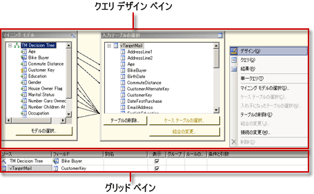
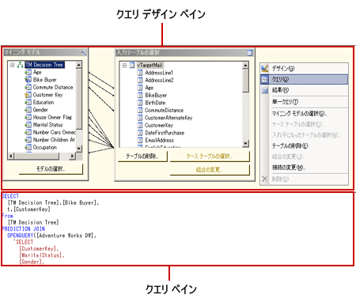
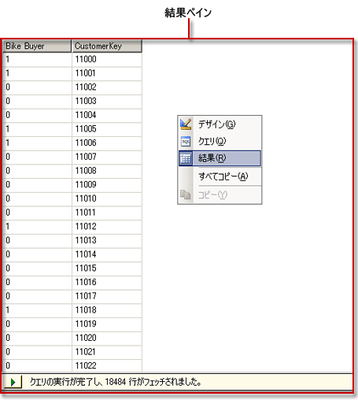

# Analysis Services の DMX クエリ デザイナーのユーザー インターフェイス
  [!INCLUDE[ssRSnoversion](../../includes/ssrsnoversion-md.md)] にはグラフィカル クエリ デザイナーが用意されており、 [!INCLUDE[ssASnoversion](../../includes/ssasnoversion-md.md)] データ ソースに対するデータ マイニング式 (DMX) クエリおよび多次元式 (MDX) クエリの作成に使用できます。 このトピックでは、DMX クエリ デザイナーについて説明します。 MDX クエリ デザイナーの詳細については、「 [Analysis Services の MDX クエリ デザイナーのユーザー インターフェイス](../../reporting-services/report-data/analysis-services-mdx-query-designer-user-interface.md)」を参照してください。  
  
 DMX のグラフィカル クエリ デザイナーには、デザイン モード、クエリ モード、結果モードという 3 つのモードがあります。 モードを切り替えるには、クエリ デザイン ペインで右クリックして、モードを選択します。 すべてのモードにはメタデータ ペインが表示され、選択したキューブからメンバーをドラッグすることによって DMX クエリを作成できます。レポートの処理時には、このクエリに基づいてデータが取得され、データセットに格納されます。  
  
## グラフィカル DMX クエリ デザイナーのツール バー  
 クエリ デザイナーのツール バーにある各種のボタンを使用すると、グラフィカル インターフェイスを使用した DMX クエリをデザインできます。 次の表は、これらのボタンとその機能を示しています。  
  
|ボタン|[説明]|  
|------------|-----------------|  
|**[テキストとして編集]**|この種類のデータ ソースでは無効です。|  
|**[インポート]**|ファイル システムのレポート定義 (.rdl) ファイルから既存のクエリをインポートします。 詳細については、「 [レポート埋め込みデータセットと共有データセット &#40;レポート ビルダーおよび SSRS&#41;](../../reporting-services/report-data/report-embedded-datasets-and-shared-datasets-report-builder-and-ssrs.md)と呼ばれます。|  
||MDX クエリ デザイナーのモードに切り替えます。|  
||DMX クエリ デザイナーのモードに切り替えます。|  
||データ ソースからメタデータを更新します。|  
|![[削除]](../../reporting-services/report-data/media/rsqdicon-delete.gif "[削除]")|データ ペインで選択した列をクエリから削除します。|  
|![[クエリ パラメーター] ダイアログ ボックスのアイコン](../../reporting-services/report-data/media/iconqueryparameter.gif "[クエリ パラメーター] ダイアログ ボックスのアイコン")|**[クエリ パラメーター]** ダイアログ ボックスを表示します。 変数に既定値を割り当てた場合、レポート デザイナーで [レイアウト] ビューに切り替えたときに、対応するレポート パラメーターが作成されます。|  
||クエリを準備します。|  
||デザイン モードとクエリ モードを切り替えます。 結果ビューに切り替えるには、デザイン ペインを右クリックして **[結果]** を選択します。|  
  
## グラフィカル DMX クエリ デザイナー (デザイン モード)  
 有効なキューブはないが、有効なマイニング モデルはある [!INCLUDE[ssASnoversion](../../includes/ssasnoversion-md.md)] データ ソースを使用するデータセットを編集する場合、グラフィカル クエリ デザイナーはデザイン モードで開きます。 次の図は、デザイン モードで表示される各ペインの名称を示しています。  
  
   
  
 次の表に各ペインの機能を示します。  
  
|ペイン|機能|  
|----------|--------------|  
|クエリ デザイン ペイン|DMX クエリを作成するには、 **[マイニング モデル]** ダイアログ ボックスおよび **[入力テーブルの選択]** ダイアログ ボックスを使用します。|  
|グリッド ペイン|グリッドの各行について、 **[ソース]** ボックスの一覧から関数または式を選択し、DMX クエリで使用するフィールド、グループ、条件 (または引数) などを選択します。 選択した情報に基づいて生成された DMX クエリ テキストを表示するには、ツール バーの **[デザイン モード]** ボタンをクリックします。|  
  
 DMX クエリを実行して、結果ペインに結果を表示するには、クエリ デザイン ペインを右クリックし、 **[結果]** をクリックします。  
  
## グラフィカル DMX クエリ デザイナー (クエリ モード)  
 グラフィカル クエリ デザイナーをクエリ モードに切り替えるには、ツール バーの **[デザイン モード]** ボタンをクリックするか、クエリ デザイン画面を右クリックして、ショートカット メニューで **[クエリ]** をクリックします。 このモードを使用すると、DMX テキストを直接クエリ ペインに入力できます。  
  
 次の図は、クエリ モードで表示される各ペインの名称を示しています。  
  
   
  
 次の表に各ペインの機能を示します。  
  
|ペイン|機能|  
|----------|--------------|  
|クエリ デザイン ペイン|DMX クエリを作成するには、 **[マイニング モデル]** ダイアログ ボックスおよび **[入力テーブルの選択]** ダイアログ ボックスを使用します。|  
|クエリ ペイン|DMX クエリ テキストをペイン内で直接表示または編集します。 **デザイン** モードに戻ると、DMX クエリ テキストに対して行った変更は失われます。|  
  
 DMX クエリを実行して、結果ペインに結果を表示するには、クエリ デザイン ペインを右クリックし、 **[結果]** をクリックします。  
  
## グラフィカル DMX クエリ デザイナー (結果モード)  
 結果モードを表示するには、クエリ デザイン画面を右クリックし、ショートカット メニューで **[結果]** をクリックします。 結果モードに切り替えると、DMX クエリが自動的に実行されます。  
  
 次の図は、結果モードのクエリ デザイナーを示しています。  
  
   
  
 デザイン モードまたはクエリ モードに戻るには、結果ペインを右クリックし、 **[デザイン]** または **[クエリ]** をクリックします。  
  
## 参照  
 [Analysis Services の MDX クエリ デザイナーでのパラメーターの定義 &#40;レポート ビルダーおよび SSRS&#41;](../../reporting-services/report-data/define-parameters-in-the-mdx-query-designer-for-analysis-services.md)   
 [共有データセットまたは埋め込みデータセットの作成 &#40;レポート ビルダーおよび SSRS&#41;](../../reporting-services/report-data/create-a-shared-dataset-or-embedded-dataset-report-builder-and-ssrs.md)   
 [DMX のための Analysis Services の接続の種類 (SSRS)](../../reporting-services/report-data/analysis-services-connection-type-for-dmx-ssrs.md)   
 [データ マイニング モデル (DMX) からデータを取得する (SSRS)](../../reporting-services/report-data/retrieve-data-from-a-data-mining-model-dmx-ssrs.md)   
 [RSReportDesigner 構成ファイル](../../reporting-services/report-server/rsreportdesigner-configuration-file.md)   
 [MDX のための Analysis Services の接続の種類 (SSRS)](../../reporting-services/report-data/analysis-services-connection-type-for-mdx-ssrs.md)   
 [DMX のための Analysis Services の接続の種類 (SSRS)](../../reporting-services/report-data/analysis-services-connection-type-for-dmx-ssrs.md)  
  
  
