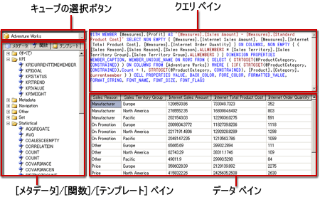

# Analysis Services の MDX クエリ デザイナーのユーザー インターフェイス
  [!INCLUDE[ssRSnoversion](../../includes/ssrsnoversion-md.md)] には、 [!INCLUDE[ssASnoversion](../../includes/ssasnoversion-md.md)] データ ソースに対する多次元式 (MDX) クエリやデータ マイニング式 (DMX) クエリを作成するためのグラフィカル クエリ デザイナーが用意されています。 このトピックでは、MDX クエリ デザイナーについて説明します。 DMX クエリ デザイナーの詳細については、「 [DMX のための Analysis Services の接続の種類 &#40;SSRS&#41;](../../reporting-services/report-data/analysis-services-connection-type-for-dmx-ssrs.md)」をご覧ください。  
  
 MDX のグラフィカル クエリ デザイナーには、デザイン モードとクエリ モードという 2 つのモードがあります。 どちらのモードにもメタデータ ペインが表示され、選択したキューブからメンバーをドラッグすることによって MDX クエリを作成できます。レポートの処理時には、このクエリに基づいてデータが取得されます。  
  
> [!IMPORTANT]  
>  ユーザーは、クエリを作成して実行する際にデータ ソースにアクセスします。 したがって、データ ソースに対する最小限の権限 (読み取り専用権限など) を付与する必要があります。  
  
> [!NOTE]  
>  ファイルからの .mdx クエリのインポートはサポートされていません。  
  
## グラフィカル MDX クエリ デザイナー (デザイン モード)  
 レポート データセットの MDX クエリを編集する場合、グラフィカル MDX クエリ デザイナーがデザイン モードで開きます。  
  
 次の図は、デザイン モードで表示される各ペインの名称を示しています。  
  
   
  
 このモードのペインの一覧を次の表に示します。  
  
|ペイン|関数|  
|----------|--------------|  
|キューブの選択ボタン (**[...]**)|現在選択されているキューブを表示します。|  
|メタデータ ペイン|選択されたキューブで定義されているメジャー、主要業績評価指標 (KPI)、およびディメンションの階層リストを表示します。|  
|計算されるメンバー ペイン|現在定義されている、クエリに使用することのできる計算されるメンバーを表示します。|  
|フィルター ペイン|ディメンションおよび関連する階層を選択することにより、ソースのデータをフィルター処理し、レポートに返されるデータを制限できます。|  
|データ ペイン|メタデータ ペインや計算されるメンバー ペインからアイテムをドラッグすると、結果セットの列見出しが表示されます。 **[自動実行]** ボタンが選択されている場合、結果セットは自動的に更新されます。 」をご覧ください。|  
  
 データ ペインには、メタデータ ペインからディメンション、メジャー、KPI をドラッグしたり、計算されるメンバー ペインから計算されるメンバーをドラッグしたりできます。 フィルター ペインでは、ディメンションや関連する階層を選択し、フィルター式を設定することによって、クエリに利用可能なデータを制限できます。 場合、**自動**()、ツールバー上のトグル ボタンが選択されている場合、クエリ デザイナーが、データ ペインにメタデータ オブジェクトをドロップするたびにクエリを実行します。 クエリを使用して、手動で実行できる、**実行**() ツールバーのボタンをクリックします。  
  
 このモードで MDX クエリを作成すると、次のような追加のプロパティがクエリに自動的に追加されます。  
  
 **[メンバーのプロパティ]** MEMBER_CAPTION、MEMBER_UNIQUE_NAME  
  
 **[セルのプロパティ]** VALUE、BACK_COLOR、FORE_COLOR、FORMATTED_VALUE、FORMAT_STRING、FONT_NAME、FONT_SIZE、FONT_FLAGS  
  
 独自の追加プロパティを指定するには、クエリ モードで MDX クエリを手動で編集する必要があります。  
  
### グラフィカル MDX クエリ デザイナーのツール バー (デザイン モード)  
 クエリ デザイナーのツール バーにある各種のボタンを使用すると、グラフィカル インターフェイスを使用して MDX クエリをデザインできます。 これらのボタンとその機能を次の表に示します。  
  
|ボタン|Description|  
|------------|-----------------|  
|**[テキストとして編集]**|このデータ ソースの種類では使用できません。|  
|**[インポート]**|ファイル システムのレポート定義 (.rdl) ファイルから既存のクエリをインポートします。 詳細については、「[レポート埋め込みデータセットと共有データセット &#40;レポート ビルダーおよび SSRS&#41;](../../reporting-services/report-data/report-embedded-datasets-and-shared-datasets-report-builder-and-ssrs.md)」を参照してください。|  
||コマンドの種類を MDX に切り替えます。|  
||コマンドの種類を DMX に切り替えます。|  
||データ ソースからメタデータを更新します。|  
||**[計算されるメンバー ビルダー]** ダイアログ ボックスを表示します。|  
||データ ペインに空のセルを表示するかどうかを切り替えます。 これは、MDX で NON EMPTY 句を使用することに相当します。|  
||クエリを自動的に実行し、変更が生じるたびに結果を表示します。 結果はデータ ペインに表示されます。|  
||集計をデータ ペインに表示します。|  
|![[削除]](../../reporting-services/report-data/media/rsqdicon-delete.gif "[削除]")|データ ペインで選択した列をクエリから削除します。|  
||**[クエリ パラメーター]** ダイアログ ボックスを表示します。 クエリ パラメーターの値を指定する場合、同じ名前のレポート パラメーターが自動的に作成されます。 クエリ パラメーターの値は、このレポート パラメーターを参照する式に設定されます。|  
||クエリを準備します。|  
||クエリを実行し、結果をデータ ペインに表示します。|  
||クエリを取り消します。|  
||デザイン モードとクエリ モードを切り替えます。|  
  
## グラフィカル MDX クエリ デザイナー (クエリ モード)  
 グラフィカル クエリ デザイナーを **クエリ** モードに変更するには、ツール バーの **[デザイン モード]** ボタンをクリックします。  
  
 次の図は、クエリ モードで表示される各ペインの名称を示しています。  
  
   
  
 このモードのペインの一覧を次の表に示します。  
  
|ペイン|関数|  
|----------|--------------|  
|キューブの選択ボタン (**[...]**)|現在選択されているキューブを表示します。|  
|メタデータ/関数/テンプレート ペイン|選択されたキューブで定義されているメジャー、KPI、およびディメンションの階層リストを表示します。|  
|クエリ ペイン|クエリ テキストを表示します。|  
|結果ペイン|クエリの実行結果を表示します。|  
  
 メタデータ ペインには、 **[メタデータ]**、 **[関数]**、 **[テンプレート]**の各タブが表示されます。 **[メタデータ]** タブからは、ディメンション、階層、KPI、およびメジャーを MDX クエリ ペインにドラッグできます。 **[関数]** タブからは、関数を MDX クエリ ペインにドラッグできます。 **[テンプレート]** タブからは、MDX テンプレートを MDX クエリ ペインに追加できます。 クエリを実行すると、結果ペインに MDX クエリの結果が表示されます。  
  
 デザイン モードで生成された既定の MDX クエリを拡張し、その他のメンバー プロパティおよびセル プロパティを追加できます。 このクエリを実行すると、その値は結果セットに表示されません。 ただし、値が [!INCLUDE[ssRSnoversion](../../includes/ssrsnoversion-md.md)] に戻され、これらの値をレポートで使用できます。 詳細については、「[Analysis Services データベースに対する拡張フィールド プロパティ (SSRS)](../../reporting-services/report-data/extended-field-properties-for-an-analysis-services-database-ssrs.md)」を参照してください。  
  
### グラフィカル クエリ デザイナーのツール バー (クエリ モード)  
 クエリ デザイナーのツール バーにある各種のボタンを使用すると、グラフィカル インターフェイスを使用して MDX クエリをデザインできます。  
  
 デザイン モードでもクエリ モードでも、表示されるツール バー ボタンは同じです。ただし、クエリ モードでは、次のボタンが無効になります。  
  
-   **[テキストとして編集]**  
  
-   **[計算されるメンバーの追加]** ()  
  
-   **空のセルを表示する**()  
  
-   **自動**()  
  
-   **集計の表示**()  
  
## 参照  
 [Analysis Services &#40; MDX クエリ デザイナーでパラメーターを定義します。レポート ビルダーおよび SSRS &#41;](../../reporting-services/report-data/define-parameters-in-the-mdx-query-designer-for-analysis-services.md)   
 [共有データセットまたは埋め込みデータセット &#40; を作成します。レポート ビルダーおよび SSRS &#41;](../../reporting-services/report-data/create-a-shared-dataset-or-embedded-dataset-report-builder-and-ssrs.md)   
 [DMX &#40; analysis Services 接続の種類SSRS &#41;](../../reporting-services/report-data/analysis-services-connection-type-for-dmx-ssrs.md)   
 [RSReportDesigner 構成ファイル](../../reporting-services/report-server/rsreportdesigner-configuration-file.md)   
 [MDX &#40; analysis Services 接続の種類SSRS &#41;](../../reporting-services/report-data/analysis-services-connection-type-for-mdx-ssrs.md)  
  
  
