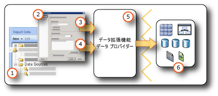

# <a name="data-connections-data-sources-and-connection-strings-report-builder-and-ssrs"></a>データ接続、データ ソース、および接続文字列 (レポート ビルダーおよび SSRS)

[!INCLUDE [ssrs-appliesto](../../includes/ssrs-appliesto.md)] [!INCLUDE [ssrs-appliesto-2016-and-later](../../includes/ssrs-appliesto-2016-and-later.md)] [!INCLUDE[ssrs-appliesto-pbirsi](../../includes/ssrs-appliesto-pbirs.md)] [!INCLUDE[ssrs-appliesto-sharepoint-2013-2016i](../../includes/ssrs-appliesto-sharepoint-2013-2016.md)]

[!INCLUDE [ssrs-previous-versions](../../includes/ssrs-previous-versions.md)]

  [!INCLUDE[ssRBnoversion](../../includes/ssrbnoversion.md)] および  [!INCLUDE[ssRSnoversion](../../includes/ssrsnoversion-md.md)] の改ページ調整されたレポートにデータを含めるには、最初に *データ ソース* および *データセット*を作成する必要があります。 このトピックでは、データ ソースの種類、データ ソースの作成方法、およびデータ ソースの資格情報に関連する重要な情報について説明します。 データ ソースには、データ ソースの種類、接続情報、および使用する資格情報の種類が含まれています。 データ ソースには、埋め込みと共有の 2 種類があります。 埋め込みデータ ソースは、レポート内で定義され、そのレポートでのみ使用されます。 共有データ ソースは、レポートとは別のアイテムとして定義され、複数のレポートで使用できます。 詳細については、「[埋め込みデータセットと共有データセット &#40;レポート ビルダーおよび SSRS&#41;](../../reporting-services/report-data/embedded-and-shared-datasets-report-builder-and-ssrs.md)」を参照してください。  

## <a name="data-in-includessrbnoversionincludesssrbnoversionmd"></a>[!INCLUDE[ssRBnoversion](../../includes/ssrbnoversion.md)] のデータ  
   
  
1.  **レポート データ ペインのデータ ソース** 埋め込みデータ ソースを作成するか、共有データ ソースを追加すると、レポート データ ペインにデータ ソースが表示されます。  
  
2.  **[接続] ダイアログ ボックス** 接続文字列を作成したり、接続文字列を貼り付けたりするには、[接続] ダイアログ ボックスを使用します。  
  
3.  **データ接続情報** 接続文字列は、データ拡張機能に渡されます。  
  
4.  **資格情報** 資格情報は、接続文字列とは別個に管理されます。  
  
5.  **データ拡張機能/データ プロバイダー** データへの接続は、複数のデータ アクセス レイヤーを通じて行われる場合があります。  
  
6.  **外部データ ソース** リレーショナル データベース、多次元データベース、SharePoint リスト、Web サービス、またはレポート モデルからデータを取得します。  

##  <a name="bkmk_data_sources"></a> 埋め込みデータ ソースおよび共有データ ソース  
 共有データ ソースは、よく使用するデータ ソースがある場合に役立ちます。 可能な限り共有データ ソースを使用することをお勧めします。 レポートやレポートへのアクセスが管理しやすくなり、レポートやレポートからアクセスするデータ ソースの安全性を高めることができます。 共有データ ソースが必要な場合は、システム管理者に依頼して作成してもらってください。  
  
 埋め込みデータ ソースは、レポート定義に保存されるデータ接続です。 埋め込まれたデータ ソースの接続情報は、その情報が埋め込まれたレポートでのみ使用できます。 埋め込みデータ ソースを定義および管理するには、 **[データ ソースのプロパティ]** ダイアログ ボックスを使用します。  
  
 埋め込みデータ ソースと共有データ ソースとでは、作成、格納、および管理の方法が異なります。  
  
-   レポート デザイナーで、 [!INCLUDE[ssBIDevStudioFull](../../includes/ssbidevstudiofull-md.md)] プロジェクトの一部として、埋め込みデータ ソースまたは共有データ ソースを作成します。 プレビュー用にローカルで使用するか、プロジェクトの一部としてレポート サーバーまたは SharePoint サイトに配置するかを制御することができます。 自分のコンピューターおよびレポート サーバー、さらにレポートの配置先の SharePoint サイトにインストールされているカスタム データ拡張機能を使用できます。  
  
     システム管理者は、別のデータ処理拡張機能および .NET Framework データ プロバイダーをインストールおよび設定できます。 詳細については、「[データ処理拡張機能と .NET Framework データ プロバイダー (SSRS)](../../reporting-services/report-data/data-processing-extensions-and-net-framework-data-providers-ssrs.md)」を参照してください。  
  
     <xref:Microsoft.ReportingServices.DataProcessing> API を使ってデータ処理拡張機能を作成すると、その他の種類のデータ ソースもサポートできます。  
  
-   [!INCLUDE[ssRBnoversion](../../includes/ssrbnoversion.md)]で、レポート サーバーまたは SharePoint サイト上の保存先を参照して共有データ ソースを選択するか、または、レポートに埋め込みデータ ソースを作成します。 共有データ ソースは、 [!INCLUDE[ssRBnoversion](../../includes/ssrbnoversion.md)]で作成することはできません。 [!INCLUDE[ssRBnoversion](../../includes/ssrbnoversion.md)]でカスタム データ拡張機能を使用することはできません。  
  
 次の表は、埋め込みデータ ソースと共有データ ソースの違いをまとめたものです。  
  
|[説明]|埋め込み<br /><br /> Data Source|共有<br /><br /> Data Source|  
|-----------------|------------------------------|----------------------------|  
|データ接続がレポート定義に埋め込まれる|||  
|レポート サーバー上のデータ接続へのポインターがレポート定義に埋め込まれる|||  
|レポート サーバー上で管理|||  
|共有データセットに必要|||  
|コンポーネントに必要|||  
  
##  <a name="bkmk_DataConnections"></a> 組み込みデータ拡張機能  
 [!INCLUDE[ssRSnoversion](../../includes/ssrsnoversion-md.md)] の既定のデータ拡張機能には、次の種類のデータ接続が含まれます。  
  
-   Microsoft SQL Server と Microsoft Azure SQL Database
  
-   Microsoft SQL Server Analysis Services  
  
-   Microsoft SharePoint リスト  
  
-   [!INCLUDE[ssSDSFull](../../includes/sssdsfull-md.md)]  
  
-   Microsoft SQL Server 並列データ ウェアハウス  
  
-   OLE DB (OLE DB)  
  
-   Oracle  
  
-   SAP NetWeaver BI  
  
-   Hyperion Essbase  
  
-   Teradata  
  
-   XML  
  
-   ODBC  

 [!INCLUDE[ssRSnoversion](../../includes/ssrsnoversion-md.md)] でサポートされるデータ ソースおよびバージョンの一覧については、「[Reporting Services でサポートされるデータ ソース (SSRS)](../../reporting-services/report-data/data-sources-supported-by-reporting-services-ssrs.md)」を参照してください。  
  
##  <a name="bkmk_connection_examples"></a> 一般的な接続文字列の例  
 接続文字列は、データ プロバイダーの接続プロパティのテキスト表現です。 次の表に、さまざまなデータ接続に使用される接続文字列の例を示します。  
 
 > [!NOTE]  
>  [Connectionstrings.com](https://www.connectionstrings.com/) では、接続文字列の別の例を見ることができます。 
  
|**Data source**|**例**|**[説明]**|  
|---------------------|-----------------|---------------------|  
|ローカル サーバーの SQL Server データベース|`data source="(local)";initial catalog=AdventureWorks`|データ ソースの種類を **Microsoft SQL Server**に設定します。 詳細については、「[SQL Server の接続の種類 (SSRS)](../../reporting-services/report-data/sql-server-connection-type-ssrs.md)」を参照してください。|  
|SQL Server インスタンス<br /><br /> [データベース]|`Data Source=localhost\MSSQL13.<InstanceName>; Initial Catalog=AdventureWorks`|データ ソースの種類を **Microsoft SQL Server**に設定します。|  
|Azure SQL データベース|`Data Source=<host>;Initial Catalog=AdventureWorks; Encrypt=True`|データ ソースの種類を **Microsoft Azure SQL Database** に設定します。 詳細については、「[SQL Azure の接続の種類 (SSRS)](../../reporting-services/report-data/sql-azure-connection-type-ssrs.md)」を参照してください。|  
|SQL Server 並列データ ウェアハウス|`HOST=<IP address>;database= AdventureWorks; port=<port>`|データ ソースの種類を **Microsoft SQL Server Parallel Data Warehouse**に設定します。 詳細については、「[SQL Server 並列データ ウェアハウスの接続の種類 &#40;SSRS&#41;](../../reporting-services/report-data/sql-server-parallel-data-warehouse-connection-type-ssrs.md)」を参照してください。|  
|ローカル サーバーの Analysis Services データベース|`data source=localhost;initial catalog=Adventure Works DW`|データ ソースの種類を **Microsoft SQL Server Analysis Services**に設定します。 詳細については、「[MDX のための Analysis Services の接続の種類 &#40;SSRS&#41;](../../reporting-services/report-data/analysis-services-connection-type-for-mdx-ssrs.md)」または「[DMX のための Analysis Services の接続の種類 &#40;SSRS&#41;](../../reporting-services/report-data/analysis-services-connection-type-for-dmx-ssrs.md)」を参照してください。|  
|Sales パースペクティブを持つ Analysis Services テーブル モデル データベース|`Data source=<servername>;initial catalog= Adventure Works DW;cube='Sales'`|データ ソースの種類を **Microsoft SQL Server Analysis Services**に設定します。 cube= 設定にパースペクティブの名前を指定します。 詳しくは、「 [パースペクティブ &#40;SSAS テーブル&#41;](https://docs.microsoft.com/analysis-services/tabular-models/perspectives-ssas-tabular)」をご覧ください。|  
|Oracle サーバー|`data source=myserver`|データ ソースの種類を **Oracle**に設定します。 レポート デザイナーがインストールされているコンピューターとレポート サーバーに、Oracle クライアント ツールがインストールされている必要があります。 詳細については、「[Oracle の接続の種類 &#40;SSRS&#41;](../../reporting-services/report-data/oracle-connection-type-ssrs.md)」を参照してください。|  
|SAP NetWeaver BI データ ソース|`DataSource=https://mySAPNetWeaverBIServer:8000/sap/bw/xml/soap/xmla`|データ ソースの種類を **SAP NetWeaver BI**に設定します。 詳細については、「[SAP NetWeaver BI の接続の種類 &#40;SSRS&#41;](../../reporting-services/report-data/sap-netweaver-bi-connection-type-ssrs.md)」を参照してください。|  
|Hyperion Essbase データ ソース|`Data Source=https://localhost:13080/aps/XMLA; Initial Catalog=Sample`|データ ソースの種類を **Hyperion Essbase**に設定します。 詳細については、「[Hyperion Essbase の接続の種類 &#40;SSRS&#41;](../../reporting-services/report-data/hyperion-essbase-connection-type-ssrs.md)」を参照してください。|  
|Teradata データ ソース|`data source=`\<NNN>.\<NNN>.\<NNN>.\<NNN>`;`|データ ソースの種類を **Teradata**に設定します。 接続文字列は、各フィールドが 1 ～ 3 桁の 4 つのフィールドで構成されるインターネット プロトコル (IP) アドレスです。 詳細については、「[Teradata の接続の種類 &#40;SSRS&#41;](../../reporting-services/report-data/teradata-connection-type-ssrs.md)」を参照してください。|  
|Teradata データ ソース|`Database=` *\<データベース名>* `; data source=` *\<NN*N *>.\<NNN>.\<NNN>.\<N*NN *>* `;Use X Views=False;Restrict to Default Database=True`|前の例と同様に、データ ソースの種類を **Teradata**に設定します。 Database タグで指定した既定のデータベースのみを使用して、データ間の関係を自動的に検出しないようにしてください。|  
|XML データ ソース、Web サービス|`data source=https://adventure-works.com/results.aspx`|データ ソースの種類を **XML**に設定します。 接続文字列は、Web サービス記述言語 (WSDL) をサポートする Web サービスの URL です。 詳細については、「[XML の接続の種類 &#40;SSRS&#41;](../../reporting-services/report-data/xml-connection-type-ssrs.md)」を参照してください。|  
|XML データ ソース、XML ドキュメント|`https://localhost/XML/Customers.xml`|データ ソースの種類を **XML**に設定します。 接続文字列は XML ドキュメントへの URL です。 
|XML データ ソース、埋め込み XML ドキュメント|*空*|データ ソースの種類を **XML**に設定します。 XML データはレポート定義に埋め込まれています。|  
|SharePoint リスト|`data source=https://MySharePointWeb/MySharePointSite/`|データ ソースの種類を **SharePoint List**に設定します。|  
| Power BI Premium データセット (Reporting Services 2019 以降) | Server = powerbi://api.powerbi.com/v1.0/myorg/<workspacename>; initial catalog = <YourDatasetName> | データ ソースの種類を **Microsoft SQL Server Analysis Services**に設定します。 |

  
 **localhost**を使用してレポート サーバーに接続できない場合は、TCP/IP プロトコルのネットワーク プロトコルが有効になっていることを確認します。 詳細については、「 [Configure Client Protocols](../../database-engine/configure-windows/configure-client-protocols.md)」を参照してください。  
  
 これらの種類のデータ ソースへの接続に必要な設定の詳細については、「[外部データ ソースのデータを追加する (SSRS)](../../reporting-services/report-data/add-data-from-external-data-sources-ssrs.md)」または「[Reporting Services でサポートされるデータ ソース (SSRS)](../../reporting-services/report-data/data-sources-supported-by-reporting-services-ssrs.md)」で、目的のデータ接続のトピックを参照してください。  
  
##  <a name="bkmk_special_password_characters"></a> パスワードの特殊文字  
 パスワードを要求したり、接続文字列にパスワードを含めるように ODBC データ ソースや SQL データ ソースを構成し、ユーザーが句読点のような特殊文字を使用してパスワードを入力した場合、基になるデータ ソースのドライバーによってはその特殊文字を検証することができません。 レポートを処理する際に、この問題によって、"パスワードが無効です" というメッセージが表示される場合があります。 パスワードを変更できない場合は、データベース管理者と連携して、適切な資格情報をシステム ODBC データ ソース名 (DSN) の一部としてサーバーに格納することができます。 詳細については、 [!INCLUDE[dnprdnshort](../../includes/dnprdnshort-md.md)] SDK ドキュメントの「OdbcConnection.ConnectionString」を参照してください。  
  
##  <a name="bkmk_Expressions_in_connection_strings"></a> 式に基づく接続文字列  
 式に基づく接続文字列は実行時に評価されます。 たとえば、データ ソースをパラメーターとして指定し、接続文字列にパラメーター参照を含めて、ユーザーがレポートのデータ ソースを選択できるようにすることができます。 たとえば、多国籍企業がいくつもの国にデータ サーバーを持っていると仮定します。 式ベースの接続文字列を使用すると、販売レポートを実行するユーザーは、レポートの実行前に特定の国のデータ ソースを選択することができます。  
  
 次の例では、 [!INCLUDE[ssNoVersion](../../includes/ssnoversion-md.md)] の接続文字列でデータ ソースの式を使用する方法を示します。 この例では、 `ServerName`というレポート パラメーターが作成されているものとします。  
  
```  
="data source=" & Parameters!ServerName.Value & ";initial catalog=AdventureWorks"  
```  
  
 データ ソースの式は、実行時またはレポートのプレビュー時に処理されます。 式は、 [!INCLUDE[vbprvb](../../includes/vbprvb-md.md)]で記述する必要があります。 データ ソースの式を定義する際には、次のガイドラインに従います。  
  
-   静的な接続文字列を使用してレポートをデザインする。 静的な接続文字列とは、式を使わずに設定した接続文字列です (たとえば、レポート固有のデータ ソースまたは共有データ ソースの作成手順に従うと、静的な接続文字列を定義することになります)。 静的な接続文字列を使用することで、レポート デザイナーでデータ ソースに接続し、レポートの作成に必要なクエリ結果を取得することができます。  
  
-   データ ソースの接続を定義する際には、共有データ ソースを使用しない。 共有データ ソース内では、データ ソースの式を使用できません。 レポートの埋め込みデータ ソースを定義する必要があります。  
  
-   資格情報は接続文字列とは別に指定する。 保存された資格情報、要求された資格情報、または統合セキュリティを使用することができます。  
  
-   レポート パラメーターを追加してデータ ソースを指定する。 パラメーター値には、使用可能な値の静的な一覧を指定するか (この場合、使用可能な値には、レポートで使用できるデータ ソースを指定する必要があります)、実行時にデータ ソースの一覧を取得するクエリを定義します。  
  
-   データ ソースの一覧が同じデータベース スキーマを共有するようにする。 すべてのレポートのデザインは、スキーマ情報から始まります。 レポートの定義で使用されているスキーマと、実行時にレポートが使用する実際のスキーマが一致しないと、レポートが実行されない場合があります。  
  
-   レポートをパブリッシュする前に、静的な接続文字列を式で置き換える。 レポートのデザインが完了するまでは、静的な接続文字列を式で置き換えません。 式を使用すると、レポート デザイナー内でクエリを実行できなくなります。 さらに、レポート データ ペイン内のフィールド一覧と、[パラメーター] の一覧が、自動的に更新されなくなります。  

## <a name="next-steps"></a>次の手順

[共有データ ソースを作成、変更、および削除する](../../reporting-services/report-data/create-modify-and-delete-shared-data-sources-ssrs.md)   
[埋め込みデータ ソースを作成および変更する](../../reporting-services/report-data/create-and-modify-embedded-data-sources.md)   
[配置プロパティを設定する](../../reporting-services/tools/set-deployment-properties-reporting-services.md)   
[レポート データ ソースに関する資格情報と接続情報を指定する](../../reporting-services/report-data/specify-credential-and-connection-information-for-report-data-sources.md)  

その他の質問 [Reporting Services のフォーラムに質問してみてください](https://go.microsoft.com/fwlink/?LinkId=620231)
