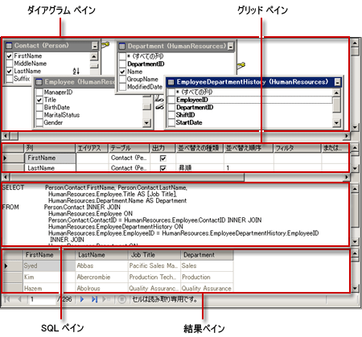

# <a name="graphical-query-designer-user-interface"></a>グラフィカル クエリ デザイナーのユーザー インターフェイス
  [!INCLUDE[ssRSnoversion](../../includes/ssrsnoversion-md.md)] にはグラフィカル クエリ デザイナーとテキスト ベースのクエリ デザイナーが用意されており、レポート デザイナーでレポート データセットのリレーショナル データベースからデータを取得するクエリの作成に使用できます。 [!INCLUDE[ssNoVersion](../../includes/ssnoversion-md.md)]、Oracle、OLE DB、ODBC の各データ ソースの種類に対して、対話形式でクエリを作成して結果を表示するには、グラフィカル クエリ デザイナーを使用します。 テキスト ベースのクエリ デザイナーは、複数の [!INCLUDE[tsql](../../includes/tsql-md.md)] ステートメント、複雑なクエリやコマンド構文、式ベースのクエリを指定する場合に使用します。 詳細については、「 [テキストベースのクエリ デザイナーのユーザー インターフェイス](https://msdn.microsoft.com/library/44b7c664-03aa-494e-a484-052b318e810c)」を参照してください。 特定の種類のデータ ソースで作業する方法の詳細については、「 [レポート データセット (SSRS)](../../reporting-services/report-data/report-datasets-ssrs.md)」を参照してください。  
  
 。  
  
## <a name="graphical-query-designer"></a>グラフィカル クエリ デザイナー  
 グラフィカル クエリ デザイナーでサポートされているクエリ コマンドの種類は、 **Text**、 **StoredProcedure**、および **TableDirect**の 3 つです。 データセットに対するクエリを作成する前に、 [[データセットのプロパティ]](https://msdn.microsoft.com/library/1fa34a4b-7de0-4e92-99fa-bc28a206773f) ダイアログ ボックスの [クエリ] ページにあるコマンドの種類のオプションを選択する必要があります。  
  
 クエリの種類には、次のオプションがあります。  
  
-   **Text** [!INCLUDE[msCoName](../../includes/msconame-md.md)] [!INCLUDE[ssNoVersion](../../includes/ssnoversion-md.md)] および Oracle のデータ処理拡張機能を含め、リレーショナル データベース データ ソースの標準の [!INCLUDE[tsql](../../includes/tsql-md.md)] クエリ テキストをサポートします。  
  
-   **[TableDirect]** 指定したテーブルのすべての列を選択します。 たとえば、Customers という名前のテーブルの場合、これは [!INCLUDE[tsql](../../includes/tsql-md.md)] という `SELECT * FROM Customers`ステートメントと同じです。  
  
-   **[StoredProcedure]** データ ソースでのストアド プロシージャの呼び出しをサポートします。 このオプションを使用するには、データ ソースのデータベース管理者によってストアド プロシージャに対する実行権限が与えられている必要があります。  
  
 既定のコマンドの種類は **[Text]** です。  
  
> [!NOTE]  
>  サポートされるコマンドの種類は、データ処理拡張機能によって異なります。 このオプションを利用するには、基になるデータ プロバイダーでコマンドの種類がサポートされている必要があります。  
  
### <a name="command-type-text"></a>コマンドの種類 (Text)  
 コマンドの種類が **[Text]** の場合、グラフィカル クエリ デザイナーに 4 つの領域 (ペイン) が表示されます。 [!INCLUDE[tsql](../../includes/tsql-md.md)] クエリに対して、列、別名、並べ替えの値、およびフィルター値を指定できます。 選択に基づいて生成されたクエリ テキストを確認し、クエリを実行して、結果セットを表示できます。 次の図に 4 つのペインを示します。  
  
   
  
 次の表に各ペインの機能を示します。  
  
|ペイン|機能|  
|----------|--------------|  
|ダイアグラム|クエリのテーブルをグラフィカルに表示します。 フィールドを選択し、テーブル間のリレーションシップを定義する際に、このペインを使用します。|  
|グリッド|クエリにより返されるフィールドの一覧を表示します。 別名、並べ替え順、フィルター、グループ、パラメーターを定義するには、このペインを使用します。|  
|SQL|ダイアグラム ペインおよびグリッド ペインで表現された [!INCLUDE[tsql](../../includes/tsql-md.md)] クエリを表示します。 [!INCLUDE[tsql](../../includes/tsql-md.md)]を使用してクエリを記述または更新するには、このペインを使用します。|  
|結果|クエリの結果を表示します。 クエリを実行するには、任意のペインで右クリックして、 **[実行]** をクリックするか、ツール バーの **[実行]** ボタンをクリックします。|  
  
 最初の 3 つのペインのいずれかで情報を変更すると、変更内容が他のペインに反映されます。 たとえば、ダイアグラム ペインでテーブルを追加すると、そのテーブルは SQL ペインの [!INCLUDE[tsql](../../includes/tsql-md.md)] クエリに自動的に追加されます。 また、SQL ペインでクエリにフィールドを追加すると、そのフィールドはグリッド ペインの一覧に自動的に追加され、ダイアグラム ペインのテーブルも更新されます。  
  
 詳細については、「[クエリおよびビュー デザイナー ツール &#40;Visual Database Tools&#41;](https://msdn.microsoft.com/library/12e4b5a5-b793-4b6c-a0e5-c450c49bf26f)」を参照してください。  
  
#### <a name="toolbar-for-the-graphical-query-designer"></a>グラフィカル クエリ デザイナーのツール バー  
 グラフィカル クエリ デザイナーのツール バーにあるボタンを使用すると、グラフィカル インターフェイスを使用して [!INCLUDE[tsql](../../includes/tsql-md.md)] クエリをデザインできます。  
  
|ボタン|[説明]|  
|------------|-----------------|  
|**[テキストとして編集]**|テキスト ベースのクエリ デザイナーと、グラフィカル クエリ デザイナー間で切り替えます。|  
|**[インポート]**|ファイルまたはレポートから既存のクエリをインポートします。 サポートされているファイルの種類は sql と rdl だけです。 詳細については、「 [レポート埋め込みデータセットと共有データセット &#40;レポート ビルダーおよび SSRS&#41;](../../reporting-services/report-data/report-embedded-datasets-and-shared-datasets-report-builder-and-ssrs.md)と呼ばれます。|  
|![[ダイアグラム ペインの表示/非表示] 切り替えボタン](../../reporting-services/report-data/media/rsqdicon-showhidediagram.gif "[ダイアグラム ペインの表示/非表示] 切り替えボタン")|ダイアグラム ペインの表示と非表示を切り替えます。|  
||グリッド ペインの表示と非表示を切り替えます。|  
||SQL ペインの表示と非表示を切り替えます。|  
||結果ペインの表示と非表示を切り替えます。|  
||クエリを実行します。|  
||クエリ テキストの構文が正しいかどうかを確認します。|  
||ダイアグラム ペインで選択した列の並べ替え順序を **[昇順で並べ替え]** に設定します。|  
||ダイアグラム ペインで選択した列の並べ替え順序を **[降順で並べ替え]** に設定します。|  
||ダイアグラム ペインで選択された列のフィルター () を解除します|  
||グリッド ペインの **[グループ化]** 列の表示と非表示を切り替えます。 **[グループ化]** が有効になっている場合、グリッド ペインに **[グループ化]** という列が追加で表示されます。このとき、クエリで選択されている各列の既定値は **[グループ化]** になります。つまり、選択列が SQL テキストの Group By 句に追加されます。 [グループ化] ボタンは、GROUP BY 句を自動的に追加し、そこに、SELECT 句のすべての列を含める場合に使用します。 SELECT 句に集計関数の呼び出し (SUM(ColumnName) など) が含まれるとき、それを結果セットに表示する場合は、それぞれの非集計列を GROUP BY 句に追加します。<br /><br /> 結果ペインに表示するには、その値の計算に使用する集計関数をクエリの各列に対して定義するか、SQL クエリの GROUP BY 句でクエリの列を指定する必要があります。|  
||データ ソースからダイアグラム ペインに新しいテーブルを追加します。<br /><br /> **注** 新しいテーブルを追加する場合、クエリ デザイナーは、データ ソースに対する外部キー リレーションシップの検出を試みます。 テーブルを追加した後、テーブル間のリンクによって表される外部キー リレーションシップが正しいことを確認してください。|  
  
#### <a name="example"></a>例  
 次のクエリは、 [!INCLUDE[ssSampleDBobject](../../includes/sssampledbobject-md.md)] データベースの **Person** テーブルから姓の一覧を取得します。  
  
```  
SELECT LastName FROM Person.Person;  
```  
  
 SQL ペインからストアド プロシージャを実行することもできます。 次のクエリでは、 **データベースのストアド プロシージャ** uspGetEmployeeManagers [!INCLUDE[ssSampleDBobject](../../includes/sssampledbobject-md.md)] を実行しています。  
  
```  
EXEC uspGetEmployeeManagers '1';  
```  
  
### <a name="command-type-tabledirect"></a>コマンドの種類 (TableDirect)  
 コマンドの種類が **[TableDirect]** の場合、グラフィカル クエリ デザイナーには、データ ソースで利用可能なテーブルを一覧にしたドロップダウン リストと結果ペインが表示されます。 特定のテーブルを選択して、 **[実行]** をクリックすると、そのテーブルのすべての列が返されます。  
  
> [!NOTE]  
>  TableDirect 機能をサポートしているデータ ソースの種類は、 **OLE DB** と **ODBC** だけです。  
  
 次の表に各ペインの機能を示します。  
  
|ペイン|機能|  
|----------|--------------|  
|[テーブル] ドロップダウン リスト|データ ソースで利用可能なすべてのテーブルが一覧表示されます。 いずれかを一覧から選択するとアクティブになります。|  
|結果|選択したテーブルのすべての列が表示されます。 テーブル クエリを実行するには、ツール バーの **[実行]** をクリックします。|  
  
#### <a name="toolbar-buttons-for-the-command-type-tabledirect"></a>ツール バー ボタン (コマンドの種類が TableDirect の場合)  
 グラフィカル クエリ デザイナーのツール バーに、データ ソースで利用可能なテーブルが、ドロップダウン リストで一覧表示されます。 次の表は、各ボタンとその機能を示しています。  
  
|ボタン|[説明]|  
|------------|-----------------|  
|**[テキストとして編集]**|テキスト ベースのクエリ デザイナーと、グラフィカル クエリ デザイナー間で切り替えます。|  
|**[インポート]**|ファイルまたはレポートから既存のクエリをインポートします。 サポートされているファイルの種類は sql と rdl だけです。 詳細については、「 [レポート埋め込みデータセットと共有データセット &#40;レポート ビルダーおよび SSRS&#41;](../../reporting-services/report-data/report-embedded-datasets-and-shared-datasets-report-builder-and-ssrs.md)と呼ばれます。|  
||クエリ テキスト ビューまたはストアド プロシージャ ビューを維持したまま、汎用クエリ デザイナーとグラフィカル クエリ デザイナーを切り替えます。|  
||選択したテーブルのすべての列が選択されます。|  
  
### <a name="command-type-storedprocedure"></a>コマンドの種類 (StoredProcedure)  
 コマンドの種類が **[StoredProcedure]** の場合、グラフィカル クエリ デザイナーには、データ ソースで利用可能なストアド プロシージャを一覧にしたドロップダウン リストと結果ペインが表示されます。 次の表に各ペインの機能を示します。  
  
|ペイン|機能|  
|----------|--------------|  
|[ストアド プロシージャ] ドロップダウン リスト|データ ソースで利用可能なすべてのストアド プロシージャが一覧表示されます。 いずれかを一覧から選択するとアクティブになります。|  
|結果|ストアド プロシージャの実行結果が表示されます。 選択したストアド プロシージャを実行するには、ツール バーの **[実行]** をクリックします。|  
  
#### <a name="toolbar-buttons-for-command-type-storedprocedure"></a>ツール バー ボタン (コマンドの種類が StoredProcedure の場合)  
 グラフィカル クエリ デザイナーのツール バーに、データ ソースで利用可能なストアド プロシージャが、ドロップダウン リストで一覧表示されます。 次の表は、各ボタンとその機能を示しています。  
  
|ボタン|[説明]|  
|------------|-----------------|  
|**[テキストとして編集]**|テキスト ベースのクエリ デザイナーと、グラフィカル クエリ デザイナー間で切り替えます。|  
|**[インポート]**|ファイルまたはレポートから既存のクエリをインポートします。 サポートされているファイルの種類は sql と rdl だけです。 詳細については、「 [レポート埋め込みデータセットと共有データセット (レポート ビルダーおよび SSRS)](../../reporting-services/report-data/report-embedded-datasets-and-shared-datasets-report-builder-and-ssrs.md)と呼ばれます。|  
||選択されたストアド プロシージャを実行します。|  
|[ストアド プロシージャ] ドロップダウン リスト|下矢印をクリックすると、データ ソースで利用可能なストアド プロシージャが一覧表示されます。 この一覧から目的のストアド プロシージャをクリックして選択します。|  
  
#### <a name="example"></a>例  
 次のストアド プロシージャでは、 [!INCLUDE[ssSampleDBobject](../../includes/sssampledbobject-md.md)] データベースから、マネージャーの指揮系統リストを呼び出しています。 このストアド プロシージャは、パラメーターとして *BusinessEntityID* を受け取ります。 任意の短整数値を入力できます。  
  
 `uspGetEmployeeManagers '1';`  
  
## <a name="see-also"></a>参照  
 [クエリ デザイン ツール (SSRS)](../../reporting-services/report-data/query-design-tools-ssrs.md)   
 [レポート データセット (SSRS)](../../reporting-services/report-data/report-datasets-ssrs.md)   
 [SQL Server の接続の種類 &#40;SSRS&#41;](../../reporting-services/report-data/sql-server-connection-type-ssrs.md)   
 [OLE DB の接続の種類 &#40;SSRS&#41;](../../reporting-services/report-data/ole-db-connection-type-ssrs.md)   
 [レポート データセット (SSRS)](../../reporting-services/report-data/report-datasets-ssrs.md)   
 [Oracle の接続の種類 &#40;SSRS&#41;](../../reporting-services/report-data/oracle-connection-type-ssrs.md)   
 [RSReportDesigner 構成ファイル](../../reporting-services/report-server/rsreportdesigner-configuration-file.md)   
 [クエリおよびビューのデザインの操作方法に関するトピック (Visual Database Tools)](https://msdn.microsoft.com/library/200903f4-1208-4563-9dca-26aabaacfa20)  
  
  
