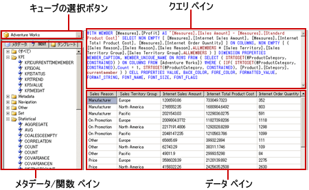

# Hyperion Essbase クエリ デザイナーのユーザー インターフェイス
  [!INCLUDE[ssRSnoversion](../../includes/ssrsnoversion-md.md)] には、 [!INCLUDE[extEssbase](../../includes/extessbase-md.md)] データ ソースに対する多次元式 (MDX) クエリを作成するためのグラフィカル クエリ デザイナーが用意されています。 MDX のグラフィカル クエリ デザイナーには、デザイン モードとクエリ モードという 2 つのモードがあります。 いずれのモードにもメタデータ ペインが表示されます。ここから、データ ソースで定義されているキューブのメンバーをドラッグすることによって、MDX クエリを作成できます。レポートの処理時には、このクエリに基づいてデータが取得されます。  
  
> [!IMPORTANT]  
>  ユーザーは、クエリを作成して実行する際にデータ ソースにアクセスします。 したがって、データ ソースに対する最小限の権限 (読み取り専用権限など) を付与する必要があります。  
  
 [!INCLUDE[extEssbase](../../includes/extessbase-md.md)]多次元データ ソースを使用する方法の詳細については、「[Hyperion Essbase の接続の種類 &#40;SSRS&#41;](../../reporting-services/report-data/hyperion-essbase-connection-type-ssrs.md)」を参照してください。  
  
 ここでは、グラフィカル クエリ デザイナーの各モードの、ツール バーのボタンとクエリ デザイナーのペインについて説明します。  
  
## グラフィカル クエリ デザイナー (デザイン モード)  
 [!INCLUDE[extEssbase](../../includes/extessbase-md.md)] データ ソースを使用するデータセット用の MDX クエリを編集する場合、グラフィカル クエリ デザイナーはデザイン モードで開きます。  
  
 次の図は、デザイン モードで表示される各ペインの名称を示しています。  
  
   
  
 このモードのペインの一覧を次の表に示します。  
  
|ペイン|機能|  
|----------|--------------|  
|キューブの選択ボタン|現在選択されているキューブを表示します。|  
|メタデータ ペイン|キューブの階層リストを表示します。|  
|計算されるメンバー ペイン|現在定義されている、クエリに使用することのできる計算されるメンバーを表示します。|  
|フィルター ペイン|クエリで適用するフィルターを表示します。|  
|データ ペイン|クエリの実行結果を表示します。|  
  
 データ ペインには、メタデータ ペインからディメンションやメジャーをドラッグしたり、計算されるメンバー ペインから計算されるメンバーをドラッグしたりできます。 **[自動実行]** 切り替えボタンがオンになっている場合、データ ペインにオブジェクトをドロップするたびにクエリが自動的に実行されます。 **[自動実行]** がオフの場合、データ ペインに変更を加えてもクエリは自動実行されません。 クエリを手動で実行するには、ツール バーの **[実行]** ボタンを使用します。  
  
 フィルター ペインでは、データ ソースから抽出するデータを制限するためにディメンション値を選択できます。 デザイン モードでフィルターに定義した値は、クエリ モードで MDX の WHERE 句に表示されます。  
  
### グラフィカル クエリ デザイナーのツール バー (デザイン モード)  
 クエリ デザイナーのツール バーにある各種のボタンを使用すると、グラフィカル インターフェイスを使用して MDX クエリをデザインできます。 これらのボタンと機能の対応関係を次の表に示します。  
  
|ボタン|[説明]|  
|------------|-----------------|  
|**[テキストとして編集]**|テキスト ベースのクエリ デザイナーと、グラフィカル クエリ デザイナー間で切り替えます。 このデータ ソースの種類では使用できません。|  
|**[インポート]**|ファイル システムのレポート定義 (.rdl) ファイルから既存のクエリをインポートします。 詳細については、「 [レポート埋め込みデータセットと共有データセット &#40;レポート ビルダーおよび SSRS&#41;](../../reporting-services/report-data/report-embedded-datasets-and-shared-datasets-report-builder-and-ssrs.md)と呼ばれます。|  
||データ ソースからメタデータを更新します。|  
||**[計算されるメンバー ビルダー]** ダイアログ ボックスを表示します。 このダイアログ ボックスでは、計算されるメンバーの式を作成または編集します。 **解決順序** プロパティなどを設定できます。|  
||データ ペインに空のセルを表示するかどうかを切り替えます。 これは、MDX で NON EMPTY 句を使用することに相当します。|  
||データ ペインで列を削除するなど、変更のたびに自動的にクエリを実行して結果を表示します。 結果はデータ ペインに表示されます。|  
|![[削除]](../../reporting-services/report-data/media/rsqdicon-delete.gif "[削除]")|選択されているアイテムをクエリから削除します。 このボタンを使用すると、フィルター ペインで選択された行を削除できます。|  
||クエリを実行し、結果をデータ ペインに表示します。|  
||クエリを取り消します。|  
||デザイン モードとクエリ モードを切り替えます。|  
  
## グラフィカル クエリ デザイナー (クエリ モード)  
 グラフィカル クエリ デザイナーをクエリ モードに変更するには、ツール バーの **[デザイン モード]** 切り替えボタンをクリックします。 次の図は、クエリ デザイナーをクエリ モードにしたときに表示される各領域を示しています。  
  
   
  
 次の表に各ペインの機能を示します。  
  
|ペイン|機能|  
|----------|--------------|  
|キューブの選択ボタン|現在選択されているキューブを表示します。|  
|メタデータ/関数ペイン|クエリ テキストの作成に使用できるメタデータや関数がタブ付きウィンドウに一覧表示されます。|  
|クエリ ペイン|現在のクエリ テキストを表示します。|  
|結果ペイン|クエリの結果を表示します。|  
  
 メタデータ ペインからは、メジャーおよびディメンションを **[メタデータ]** タブから MDX クエリ ペインにドラッグできます。 また、 **[関数]** タブに表示されている関数を MDX クエリ ペインにドラッグできます。 クエリを実行すると、結果ペインに現在の MDX クエリの結果が表示されます。  
  
### グラフィカル クエリ デザイナーのツール バー (クエリ モード)  
 クエリ デザイナーのツール バーにある各種のボタンを使用すると、グラフィカル インターフェイスを使用して MDX クエリをデザインできます。 デザイン モードでもクエリ モードでも、表示されるツール バー ボタンは同じです。ただし、クエリ モードでは、次のボタンが無効になります。  
  
-   **[テキストとして編集]**  
  
-   **[計算されるメンバーの追加]** ()  
  
-   **空のセルを表示する** ()  
  
-   **自動実行** ()  
  
## 参照  
 [共有データセットまたは埋め込みデータセットの作成 &#40;レポート ビルダーおよび SSRS&#41;](../../reporting-services/report-data/create-a-shared-dataset-or-embedded-dataset-report-builder-and-ssrs.md)   
 [RSReportDesigner 構成ファイル](../../reporting-services/report-server/rsreportdesigner-configuration-file.md)  
  
  
