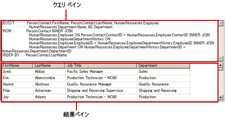
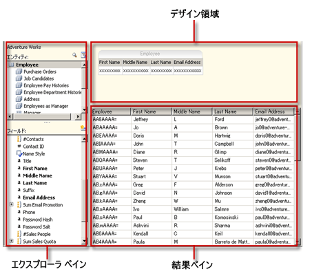
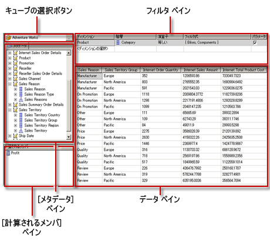
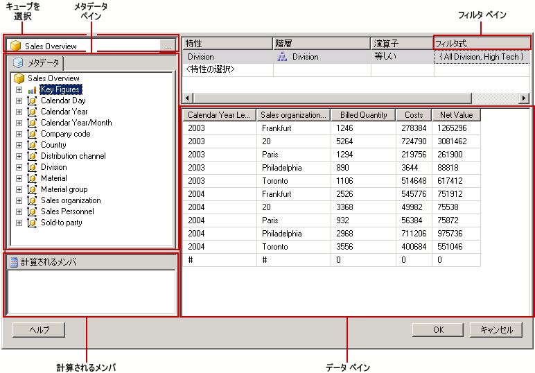
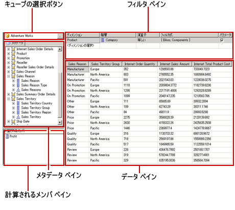

# クエリ デザイン ツール (SSRS)
  [!INCLUDE[ssRSnoversion](../../includes/ssrsnoversion-md.md)] には、レポート デザイナーのデータセット クエリを作成するために使用できる、さまざまなクエリ デザイン ツールが用意されています。 ビジュアル モードで作業するか、クエリ言語で直接作業するかを選択できるモードがあるクエリ デザイナーもあります。 このトピックでは、各ツールを紹介し、それぞれがサポートするデータ ソースの種類を説明します。 ここでは、次のツールについて説明します。  
  
-   [テキストベースのクエリ デザイナー](#Textbased)  
  
-   [グラフィカル クエリ デザイナー](#Graphical)  
  
-   [レポート モデル クエリ デザイナー](#Model)  
  
-   [MDX クエリ デザイナー](#MDX)  
  
-   [DMX クエリ デザイナー](#DMX)  
  
-   [SapNetWeaver BI クエリ デザイナー](#SAPBW)  
  
-   [Hyperion Essbase クエリ デザイナー](#Hyperion)  
  
 レポート サーバー プロジェクト テンプレートまたはレポート サーバー ウィザード プロジェクト テンプレートを使用する場合、クエリ デザイン ツールはすべて [!INCLUDE[ssBIDevStudioFull](../../includes/ssbidevstudiofull-md.md)] のデータ デザイン環境で実行されます。 クエリ デザイナーを使った作業の詳細については、「 [Reporting Services クエリ デザイナー](https://msdn.microsoft.com/library/07efd3f1-804f-45f7-b62a-3e727a3d9835)」を参照してください。  
  
 処理するデータ ソースの種類によって、特定のクエリ デザイナーが使用できるかどうかが決まります。  
  
 レポートで使用できるデータ ソースの種類は、クライアントまたはレポート サーバーにインストールされている [!INCLUDE[ssRSnoversion](../../includes/ssrsnoversion-md.md)] データ拡張機能によって決まります。 詳細については、「 [RSReportDesigner 構成ファイル](../../reporting-services/report-server/rsreportdesigner-configuration-file.md) 」および「 [RsReportServer.config 構成ファイル](../../reporting-services/report-server/rsreportserver-config-configuration-file.md)」を参照してください。  
  
 データ処理拡張機能および関連するクエリ デザイナーは、次のようにデータ ソースのサポートにおいて異なる場合があります。  
  
-   **クエリ デザイナーの種類。** たとえば、 [!INCLUDE[ssNoVersion](../../includes/ssnoversion-md.md)] データ ソースでは、グラフィカルとテキスト ベースの両方のクエリ デザイナーがサポートされます。  
  
-   **クエリ言語のバリエーション。** たとえば、 [!INCLUDE[tsql](../../includes/tsql-md.md)] などのクエリ言語は、データ ソースの種類によって構文が異なることがあります。 [!INCLUDE[msCoName](../../includes/msconame-md.md)] [!INCLUDE[tsql](../../includes/tsql-md.md)] 言語および Oracle SQL 言語には、クエリ コマンドの構文で若干のバリエーションがあります。  
  
-   **データベース オブジェクト名のスキーマの部分に対するサポート。** データ ソースでデータベース オブジェクト識別子の一部としてスキーマが使用されている場合、既定のスキーマを使用しない名前については、クエリにスキーマ名を指定する必要があります。 たとえば、`SELECT FirstName, LastName FROM [Person].[Person]` のようになります。  
  
-   **クエリ パラメーターのサポート。** パラメーターのサポートは、データ プロバイダーによって異なります。 一部のデータ プロバイダーでは、 `SELECT Col1, Col2 FROM Table WHERE <parameter identifier><parameter name> = <value>`のような名前付きパラメーターがサポートされます。 また別のデータ プロバイダーでは、 `SELECT Col1, Col2 FROM Table WHERE <column name> = ?`のような無名パラメーターがサポートされます。 パラメーター識別子はデータ プロバイダーごとに異なります。たとえば、 [!INCLUDE[ssNoVersion](../../includes/ssnoversion-md.md)] では "アット" (@) 記号を使用し、Oracle ではコロン (:) を使用します。 パラメーターがサポートされないデータ プロバイダーもあります。  
  
-   **クエリをインポートする機能。** たとえば、 [!INCLUDE[ssNoVersion](../../includes/ssnoversion-md.md)] データ ソースの場合は、レポート定義ファイル (.rdl) または .sql ファイルからクエリをインポートできます。  
  
##   テキストベースのクエリ デザイナー  
 テキスト ベースのクエリ デザイナーは、サポートされているほとんどのリレーショナル データ ソース ( [!INCLUDE[msCoName](../../includes/msconame-md.md)] [!INCLUDE[ssNoVersion](../../includes/ssnoversion-md.md)]、Oracle、Teradata、OLE DB、XML、ODBC など) に対して、既定のクエリ作成ツールです。 グラフィカル クエリ デザイナーとは異なり、このクエリ デザイン ツールはクエリ作成時にはクエリ構文を検証しません。 次の図は、テキスト ベースのクエリ デザイナーを示しています。  
  
   
  
 複雑なクエリの作成、ストアド プロシージャの使用、XML データのクエリ、および動的クエリの記述には、テキスト ベースのクエリ デザイナーを使用することをお勧めします。 データ ソースに応じて、ツール バーの **[テキストとして編集]** ボタンを切り替えることにより、グラフィカル クエリ デザイナーとテキスト ベースのクエリ デザイナーとを切り替えることができます。 詳細については、「 [テキストベースのクエリ デザイナーのユーザー インターフェイス](https://msdn.microsoft.com/library/44b7c664-03aa-494e-a484-052b318e810c)」を参照してください。  
  
##   グラフィカル クエリ デザイナー  
 グラフィカル クエリ デザイナーは、リレーショナル データベースに対して実行される [!INCLUDE[tsql](../../includes/tsql-md.md)] クエリを作成または修正する場合に使用します。 このクエリ デザイン ツールは、いくつかの [!INCLUDE[msCoName](../../includes/msconame-md.md)] 製品と、他の [!INCLUDE[ssNoVersion](../../includes/ssnoversion-md.md)] コンポーネントで使用されています。 データ ソースの種類に応じて、Text モード、StoredProcedure モード、および TableDirect モードがサポートされます。 次の図は、グラフィカル クエリ デザイナーを示しています。  
  
   
  
 ツール バーの **[テキストとして編集]** ボタンをクリックして、グラフィカル クエリ デザイナーとテキスト ベースのクエリ デザイナーとを切り替えることができます。 詳細については、「 [グラフィカル クエリ デザイナーのユーザー インターフェイス](../../reporting-services/report-data/graphical-query-designer-user-interface.md)」を参照してください。  
  
##   レポート モデル クエリ デザイナー  
 レポート モデル クエリ デザイナーは、レポート サーバーにパブリッシュされた SMDL レポート モデルに対して実行されるクエリを作成または変更するために使用します。 モデルに対して実行されるレポートは、クリックスルー データ探索をサポートしています。 クエリは実行時にデータ探索のパスを決定します。 次の図は、レポート モデル クエリ デザイナーを示しています。  
  
   
  
 レポート モデル クエリ デザイナーを使用するには、パブリッシュされたモデルを指すデータ ソースを定義する必要があります。 データ ソースのデータセットを定義する際、レポート モデル クエリ デザイナーでデータセット クエリを開くことができます。 レポート モデル クエリ デザイナーは、グラフィカル モードまたはテキスト ベース モードで使用できます。 ツール バーの **[テキストとして編集]** ボタンをクリックして、グラフィカル クエリ デザイナーとテキスト ベースのクエリ デザイナーとを切り替えることができます。 詳細については、「 [レポート モデル クエリ デザイナーのユーザー インターフェイス](../../reporting-services/report-data/report-model-query-designer-user-interface.md)」を参照してください。  
  
##   MDX クエリ デザイナー  
 Multidimensional Expression (MDX) クエリ デザイナーは、多次元キューブを持った [!INCLUDE[ssASnoversion](../../includes/ssasnoversion-md.md)] データ ソースに対して実行されるクエリを作成または修正する場合に使用します。 次の図は、クエリおよびフィルターを定義した後の MDX クエリ デザイナーを示しています。  
  
   
  
 MDX クエリ デザイナーを使用するには、有効かつ処理済みの利用可能な Analysis Services キューブを持ったデータ ソースを定義する必要があります。 データ ソースのデータセットを定義する際、MDX クエリ デザイナーでクエリを開くことができます。 必要に応じて、ツール バーの MDX ボタンと DMX ボタンを使用し、MDX モードと DMX モードとを切り替えることができます。 詳細については、「 [Analysis Services の MDX クエリ デザイナーのユーザー インターフェイス](../../reporting-services/report-data/analysis-services-mdx-query-designer-user-interface.md)」を参照してください。  
  
##   DMX クエリ デザイナー  
 データ マイニング予測式 (DMX) クエリ デザイナーは、マイニング モデルを持つ [!INCLUDE[ssASnoversion](../../includes/ssasnoversion-md.md)] データ ソースに対して実行されるクエリを作成または修正する場合に使用します。 次の図は、モデルおよび入力テーブルを選択した後の DMX クエリ デザイナーを示しています。  
  
   
  
 DMX クエリ デザイナーを使用するには、データ マイニング モデルを利用できる有効なデータ ソースを定義する必要があります。 データ ソースのデータセットを定義する際、DMX クエリ デザイナーでクエリを開くことができます。 必要に応じて、ツール バーの MDX ボタンと DMX ボタンを使用し、MDX モードと DMX モードとを切り替えることができます。 モデルを選択した後、レポートにデータを提供するデータ マイニング予測クエリを作成できます。 詳細については、「 [Analysis Services の DMX クエリ デザイナーのユーザー インターフェイス](../../reporting-services/report-data/analysis-services-dmx-query-designer-user-interface.md)」を参照してください。  
  
##   Sap NetWeaver BI クエリ デザイナー  
 [!INCLUDE[SAP_DPE_BW_1](../../includes/sap-dpe-bw-1-md.md)] クエリ デザイナーは、 [!INCLUDE[SAP_DPE_BW_1](../../includes/sap-dpe-bw-1-md.md)] データベースからデータを取得する場合に使用します。 このクエリ デザイナーを使用するには、少なくとも 1 つの InfoCube、MultiProvider、または Web 対応クエリが定義されている [!INCLUDE[SAP_DPE_BW_1](../../includes/sap-dpe-bw-1-md.md)] データ ソースが必要です。 次の図は、 [!INCLUDE[SAP_DPE_BW_1](../../includes/sap-dpe-bw-1-md.md)] クエリ デザイナーを示しています。 詳細については、「 [SAP NetWeaver BI Query Designer のユーザー インターフェイス](../../reporting-services/report-data/sap-netweaver-bi-query-designer-user-interface.md)」を参照してください。  
  
   
  
##   Hyperion Essbase クエリ デザイナー  
 [!INCLUDE[extEssbase](../../includes/extessbase-md.md)] クエリ デザイナーは、 [!INCLUDE[extEssbase](../../includes/extessbase-md.md)] データベースおよびアプリケーションからデータを取得する場合に使用します。 次の図は、 [!INCLUDE[extEssbase](../../includes/extessbase-md.md)] クエリ デザイナーを示しています。  
  
   
  
 このクエリ デザイナーを使用するには、少なくとも 1 つのデータベースを持つ [!INCLUDE[extEssbase](../../includes/extessbase-md.md)] データ ソースが必要です。  
  
 詳細については、「 [Hyperion Essbase クエリ デザイナーのユーザー インターフェイス](../../reporting-services/report-data/hyperion-essbase-query-designer-user-interface.md)」を参照してください。  
  
## 参照  
 [Reporting Services ツール](../../reporting-services/tools/reporting-services-tools.md)   
 [レポート データセット (SSRS)](../../reporting-services/report-data/report-datasets-ssrs.md)   
 [データ接続、データ ソース、および接続文字列 &#40;レポート ビルダーおよび SSRS&#41;](../../reporting-services/report-data/data-connections-data-sources-and-connection-strings-report-builder-and-ssrs.md)   
 [Reporting Services チュートリアル (SSRS)](../../reporting-services/reporting-services-tutorials-ssrs.md)   
 [Reporting Services でサポートされるデータ ソース (SSRS)](../../reporting-services/report-data/data-sources-supported-by-reporting-services-ssrs.md)   
 [埋め込みデータ ソースまたは共有データ ソースを作成する (SSRS)](https://msdn.microsoft.com/library/b111a8d0-a60d-4c8b-b00a-51644b19c34b)  
  
  
