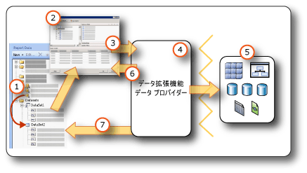

# <a name="report-embedded-datasets-and-shared-datasets-report-builder-and-ssrs"></a>レポート埋め込みデータセットと共有データセット (レポート ビルダーおよび SSRS)
  データセットは、データ接続から使用するデータを指定します。 データセットは、埋め込みデータ ソースまたはレポート サーバーの共有データ ソースへの参照としてレポートに保存されているデータ接続に基づいています。 データセットには、一連のフィールドを指定するクエリが含まれています。 これらのフィールドをデザイン画面にドラッグすると、レポートの実行時に実際のデータを評価する式を作成できます。  
  
 データセットには次の 2 種類があります。  
  
-   **共有データセット :** 共有データセットはレポート サーバーで定義されます。 サーバーを参照して、共有データセットを作成したり、レポートに追加する事前定義済みのデータセットを選択したりすることができます。 共有データセットは、複数のレポートで使用できるクエリを作成するために使用します。 共有データセットはレポート サーバー上に格納され、レポートまたは共有データ ソースとは別に管理されます。 たとえば、レポート サーバー管理者は、パフォーマンスの高いインデックス作成や他のクエリのパフォーマンスの最適化を実施するために、クエリを更新することができます。  
  
-   **埋め込みデータセット :** 埋め込みデータセットは、そのデータセットが埋め込まれたレポートでのみ定義され、そのレポートでのみ使用されます。 埋め込みデータセットは、1 つのレポートのみに使用するデータを外部データ ソースから取得する場合に使用します。 埋め込みデータセットは、その他の依存関係がなく、複数のレポートに使用する必要のないクエリを作成する場合に役立ちます。  
  
 データセットには、パラメーター、フィルター、文字の区別 (大文字と小文字、ひらがなとカタカナ、全角と半角、アクセント、照合順序の情報を含む) などを指定するデータ オプションも含まれています。  
  
   
  
1.  **レポート データ ペインのデータセット** 埋め込みデータセットを作成するか、共有データセットを追加すると、レポート データ ペインにデータセットが表示されます。 データセットはデータ ソースに基づきます。  
  
2.  **クエリ デザイナー** データセット クエリの設計時に、データ ソースの種類に関連付けられているクエリ デザイナーが開きます。  
  
3.  **クエリ コマンド** クエリ デザイナーでは、クエリ コマンドを作成できます。 コマンド構文は、データ プロバイダーによって決まります。  
  
4.  **データ拡張機能/データ プロバイダー** データへの接続は、複数のデータ アクセス レイヤーを通じて行われる場合があります。  
  
5.  **外部データ ソース** リレーショナル データベース、多次元データベース、SharePoint リスト、Web サービス、またはレポート モデルからデータを取得します。  
  
6.  **クエリ結果** クエリを実行して、結果セットの例を表示できます。 クエリを実行するには、デザイン時の資格情報が必要です。  
  
7.  **スキーマのメタデータ** データ プロバイダーで、クエリとは別にスキーマのクエリ コマンドを実行し、データセット フィールド コレクションのメタデータを取得します。 たとえば、 [!INCLUDE[tsql](../../includes/tsql-md.md)] **SELECT** statement returns the column names for a database table. データセット フィールド コレクションを表示するには、レポート データ ペインを使用してデータセットを展開します。  
  
 事前定義済みの共有データセットとレポート パーツを使用して、データをレポートに含めることもできます。 これらのアイテムには、必要な接続情報は既に存在します。 詳細については、「[レポートへのデータの追加 &#40;レポート ビルダーおよび SSRS&#41;](../../reporting-services/report-data/report-datasets-ssrs.md)」および「[レポート パラメーター &#40;レポート ビルダーおよびレポート デザイナー&#41;](../../reporting-services/report-design/report-parts-report-builder-and-ssrs.md)」を参照してください。  
  
 ビルトイン データ ソースの種類およびデータ拡張機能の詳細については、「[外部データ ソースのデータを追加する &#40;SSRS&#41;](../../reporting-services/report-data/add-data-from-external-data-sources-ssrs.md)」を参照してください。  
  
> [!NOTE]  
>  [!INCLUDE[ssRBRDDup](../../includes/ssrbrddup-md.md)]  
  
##  <a name="Overview"></a> レポート データセットとクエリについて  
 レポート データセットには、外部データ ソースに対して実行されるクエリ コマンドが含まれており、取得するデータを指定します。 クエリ コマンドを構築するには、外部データ ソースのデータ拡張機能に関連付けられているクエリ デザイナーを使用します。 クエリ デザイナーで、クエリ コマンドを実行して結果セットを表示できます。 結果セットは、列名と行を持つ四角形の行セットで、各行の値の数は同じです。 *不規則階層*とも呼ばれる階層データはサポートされていません。 列名は、データセット フィールドの一覧としてレポート定義に保存されます。  
  
 レポートにデータセットを追加すると、レポート データ ペインのフィールド コレクションから、テーブル、グラフ、およびレポート レイアウトのデザインに使用するその他のレポート アイテムにフィールドをドラッグできます。 フィールドの操作の詳細については、「 [データセット フィールド コレクション &#40;レポート ビルダーおよび SSRS&#41;](../../reporting-services/report-data/dataset-fields-collection-report-builder-and-ssrs.md)」を参照してください。  
  
### <a name="understanding-data-from-a-report-dataset"></a>レポート データセットのデータについて  
 データ拡張機能に応じて、レポート データセットは次の種類のデータで構成されています。  
  
-   データベース コマンド、ストアド プロシージャ、またはユーザー定義関数を実行することによって生成されるリレーショナル データベースの結果セット。 1 つのクエリから複数の結果セットが取得された場合は、最初の結果セットだけが処理され、他の結果セットはすべて無視されます。 たとえば、テキストベースのクエリ デザイナーで次のクエリを実行すると、 `Production.Product` の結果セットだけが結果ペインに表示されます。  
  
    ```  
    SELECT ProductID FROM Production.Product  
    GO  
    SELECT ContactID FROM Person.Contact  
    ```  
  
-   XML for Analysis (XMLA) プロトコルを使用する多次元データ ソースのフラットな行セット。 データ プロバイダーによっては、結果セットには表示されなくてもレポートで使用可能な追加のセルやディメンションのプロパティがデータ ソースから提供されることがあります。  
  
-   XML 要素、属性、および子要素を含む XML データ ソースのフラットな結果セット。  
  
-   登録および構成されている [!INCLUDE[dnprdnshort](../../includes/dnprdnshort-md.md)] データ プロバイダーの結果セット。  
  
-   定義済みエンティティ、エンティティ関係、およびフィールドを持つ特定のデータ ソースに指定されたレポート モデルのデータ。 詳細については、 [Reporting Services のドキュメント](../../reporting-services/create-deploy-and-manage-mobile-and-paginated-reports.md)の「レポートデータセット」を参照してください。  
  
 実行時にレポートを処理した場合、クエリで返される実際の結果セットに 0 個以上の行があることがあります。 また、クエリで定義された列がデータ ソースに見つからない可能性もあります。 データ ソースの Null 値は、 [!INCLUDE[dnprdnshort](../../includes/dnprdnshort-md.md)] 値の **System.DBNull.Value**にマップされます。  
  
 データセット フィールドの詳細については、「 [データセット フィールド コレクション &#40;レポート ビルダーおよび SSRS&#41;](../../reporting-services/report-data/dataset-fields-collection-report-builder-and-ssrs.md)」を参照してください。  
  
### <a name="dataset-query"></a>データセット クエリ  
 デザイン時にクエリ デザイナーでデータセット クエリを実行すると、サンプル データを示すデータ ソースの行セットが表示されます。 実行時にユーザーがレポートを表示すると、データ ソースのデータが変更されたためにデータセット クエリで別の値が生成されることがあります。 レポートを処理するたびに、新しいデータが表示される可能性があります。  
  
 各データセットを定義すると、レポート ビルダーでは、データ ソースの種類に対応するクエリ デザイナーが開かれ、それを使用してクエリを作成できます。 たとえば、SQL Server リレーショナル データベースのデータに対するクエリを定義するには、テーブル/マトリックス ウィザード、グラフ ウィザード、マップ ウィザードの簡単なグラフィカル インターフェイスを使用します。データセットに必要なフィールドを選択するだけでクエリを作成できます。  
  
 クエリ デザイナーでは、以下の操作を実行できます。  
  
-   グラフィカルなクエリ ビューとテキスト ベースのクエリ ビューを切り替える。 グラフィカルなクエリ ビューは、データ ソースでスキーマ、テーブル、ビュー、ストアド プロシージャを参照するときに使用します。 テキスト ベースのビューは、既存のクエリの入力、貼り付け、表示を行うときに使用します。通常、グラフィカル クエリ デザイナーでは表示できない複雑なクエリに使用します。 たとえば、 [!INCLUDE[tsql](../../includes/tsql-md.md)] (.sql) ファイルからクエリをインポートしたり、レポート サーバー上の別のレポートをインポートしたり、ファイル共有からレポート定義 (.rdl) ファイルをインポートしたりできます。  
  
-   クエリを実行してデータを表示する。 クエリを実行すると、結果セットが返されます。 結果セットの列がデータセットのフィールドのコレクションになり、 結果の行がデータセットのデータになります。 クエリを操作して必要な列を取得することができます。  
  
-   レポートに必要なデータだけを取得できるようにクエリ パラメーターを追加する。 クエリ パラメーターを指定すると、対応するレポート パラメーターが自動的に生成されます。 レポート モデル データ ソースの場合、指定したフィルターによって、対応するレポート パラメーターが自動的に生成されます。 ユーザーはレポート パラメーターを使用して、レポートの実行時に表示するレポート データを指定できます。 たとえば、必要なデータの製品カテゴリを選択すると、レポートの実行時に、その製品カテゴリのデータのみがレポートに表示されます。  
  
-   別のレポートから既存のクエリをインポートする。  
  
 クエリ デザイナーは、データ ソースの種類に応じてグラフィカル モードまたはテキスト モードにすることができます。 テキスト モードを選択した場合は、データ ソースの適切なクエリ構文を使用する必要があります。  
  
 レポート データセットを定義する際は、クエリのデータ プロパティを設定することも、データ プロバイダーにより設定された既定値を使用することもできます。 データ型は次のいずれかの方法で変更できます。  
  
-   データセット クエリを書き直し、フィールドを別のデータ型に指定して変換します。  
  
-   データセットのフィールドを編集し、カスタム書式を指定します。  
  
-   データベース フィールドに基づいて新しいカスタム フィールドを作成し、カスタム書式を指定します。  
  
 詳細については、「 [データセット フィールド コレクション &#40;レポート ビルダーおよび SSRS&#41;](../../reporting-services/report-data/dataset-fields-collection-report-builder-and-ssrs.md)」を参照してください。  
  
### <a name="importing-existing-queries-for-a-dataset"></a>データセットの既存のクエリのインポート  
 データセットを作成する場合、新しいクエリを作成するか、ファイルまたは別のレポートから既存のクエリをインポートすることができます。 別のレポートからクエリをインポートする場合は、レポートのデータセットの一覧からインポートするクエリを選択できます。  
  
 サポートされているファイルの種類は .sql と .rdl だけです。 多次元式 (MDX) クエリ、データ マイニング予測 (DMX) クエリ、およびモデル クエリ (SMQL) は、関連付けられているクエリ デザイナーでのみ生成できます。  
  
##  <a name="Compare"></a> 共有データセットと埋め込みデータセットの比較および作成  
 埋め込みデータセットは、レポートまたはパブリッシュされたレポート パーツで定義されます。 埋め込みデータセットに加えられた変更は、そのレポートまたはそのレポート パーツにのみ影響を与えます。  
  
 共有データセットは、レポート サーバーまたは SharePoint サイトで定義され、共有データ ソースに基づいており、複数のレポートおよびレポート パーツで使用できます。 共有データセット定義に加えられた変更は、そのデータセット定義を使用するすべてのレポートとすべてのレポート パーツに影響を与えます。  
  
 共有データセットをレポートに追加すると、データセット フィールド コレクションはレポート サーバーの現在の定義に更新されます。 レポート サーバーに変更が加えられても、更新通知は受け取りません。 レポート サーバー上の共有データセット定義に加えられた変更と、フィールド コレクションのローカル コピーを同期するには、ローカル フィールド コレクションを更新する必要があります。 詳細については、「[レポート データ ペインでのフィールドの追加、編集、更新 &#40;レポート ビルダーおよび SSRS&#41;](../../reporting-services/report-data/add-edit-refresh-fields-in-the-report-data-pane-report-builder-and-ssrs.md)」を参照してください。  
  
 パブリッシュされたレポート アイテムには、そのアイテムが依存する埋め込みデータセットおよび共有データセットが含まれています。 詳細については、「 [レポート ビルダーのレポート パーツおよびデータセット](../../reporting-services/report-data/report-parts-and-datasets-in-report-builder.md)」を参照してください。  
  
 埋め込みデータ ソースと共有データ ソースとでは、作成、格納、および管理の方法が異なります。 次の表は、埋め込みデータ ソースと共有データ ソースの違いをまとめたものです。  
  
|[説明]|埋め込み<br /><br /> Data Source|共有<br /><br /> Data Source|  
|-----------------|------------------------------|----------------------------|  
|データ接続がレポート定義に埋め込まれる|||  
|レポート サーバー上のデータ接続へのポインターがレポート定義に埋め込まれる|||  
|レポート サーバー上で管理|||  
|共有データセットに必要|||  
|コンポーネントに必要|||  
  
 レポート デザイナーでは、レポート プロジェクトの一部として共有データセットを作成し、レポート サーバーに配置するかどうかを制御できます。 レポート サーバー上の保存先を参照して共有データセットを選択し、レポートに追加することはできません。  
  
 レポート ビルダーでは、次の操作を実行できます。  
  
-   共有データセットを作成するには、共有データセットのデザイン ビューを使用します。 それをレポート サーバーまたは SharePoint サイトに保存することによって、他のレポートと共有することができます。 レポート サーバー上の保存先を参照して既存のデータセットを選択し、編集することもできます。 このビューでは、クエリを作成してすべてのデータセット オプションを設定できます。 詳細については、「[共有データセット デザイン ビュー &#40;レポート ビルダー&#41;](../../reporting-services/report-builder/shared-dataset-design-view-report-builder.md)」を参照してください。  
  
-   レポートに共有データセットを追加するには、レポート デザイン ビューでレポート ビルダーを開きます。 ウィザードかレポート データ ペインから、レポート サーバーを参照し、共有データセットを選択してレポートに追加します。 このビューでは、フィールドを追加する以外に、クエリは変更できません。 他のデータ オプションをオーバーライドし、フィルターを追加することはできます。 フィルターは削除できません。  
  
 次の表には、レポート サーバー上の共有データセットの定義とレポート定義内の共有データセットのインスタンスで構成できるプロパティを比較しています。  
  
|プロパティ|定義の構成に関する注意事項|インスタンスの構成に関する注意事項|  
|--------------|--------------------------------------------|------------------------------------------|  
|クエリ テキスト|クエリを構成する (クエリを式として定義するなど)|クエリの変更は不可|  
|クエリ パラメーター|レポート パラメーターの参照は不可<br /><br /> 既定値を含む<br /><br /> 読み取り専用フラグを含む|定義で読み取り専用とマークされていないパラメーターを構成する|  
|フィルター|フィルターの定義|定義の一部を構成するデータセット フィルターの表示または変更は不可<br /><br /> 追加フィルターの作成は可能|  
|Data Source|共有データ ソースである必要がある|データ ソースの変更は不可|  
|フィールド|クエリ コマンドのフィールド<br /><br /> データセット定義の一部を構成しない計算フィールド|フィールドの表示 (変更は不可)<br /><br /> フィールド コレクションは静的で、共有データセットをレポートに追加したときのクエリに基づきます。 更新するには、 **[データセットのプロパティ]** ダイアログ ボックスの **[フィールドの更新]** をクリックします。 定義内の現在のクエリから返されるコレクションが、実際のフィールド コレクションです。<br /><br /> 計算フィールドの追加|  
|データセット|大文字と小文字の区別などのデータ オプション|インスタンスのデータ オプションのオーバーライド|  
  
 データセットの作成の詳細については、[Reporting Services ドキュメント](../../reporting-services/create-deploy-and-manage-mobile-and-paginated-reports.md)の「[共有データセットまたは埋め込みデータセットの作成 &#40;レポート ビルダーおよび SSRS&#41;](../../reporting-services/report-data/create-a-shared-dataset-or-embedded-dataset-report-builder-and-ssrs.md)」と「[Reporting Services ツール](../../reporting-services/tools/reporting-services-tools.md)」を参照してください。  
  
##  <a name="SortGroupFilter"></a> データセット内のデータのフィルター処理、並べ替え、グループ化  
 データセット内のデータは、外部データ ソースに対してクエリ コマンドを実行することによって取得されたものです。 データ拡張機能のクエリ コマンド構文によって、データを並べ替えできるか、グループ化できるかどうかが決まります。 並べ替えとグループ化は、レポートのデータが取得される前にクエリで実行されます。 フィルター処理は、レポートのデータを取得した後に実行されます。  
  
 詳細については、「 [データのフィルター、グループ化、および並べ替え (レポート ビルダーおよび SSRS)](../../reporting-services/report-design/filter-group-and-sort-data-report-builder-and-ssrs.md)」を参照してください。  
  
### <a name="filtering-data-in-a-dataset"></a>データセット内のデータのフィルター処理  
 フィルターは、レポートのデータセット定義の一部です。 データセット フィルターを使用して、データセットのどのデータをレポートに含めるかを指定します。 データセットでフィルターを指定すると、そのデータセットに基づくすべてのデータ領域には、データセット フィルターを通過したデータのみが表示されます。  
  
 フィルターは、共有データセット定義の一部です。 共有データセット フィルターは、共有データセットを含むすべてのレポートに影響を与えます。 レポートに共有データセットを追加した後、または依存する共有データセットを持つコンポーネントを追加した後、追加のデータセット フィルターを作成できます。 作成したフィルターは、自分のレポート内でのみ使用され、レポート サーバーの共有データセット定義の一部にはなりません。  
  
 追加のフィルターは、データ領域またはデータ領域グループに対して設定できます。 また、パラメーターとフィルターの組み合わせを使用して、レポートに表示するデータを選択できます。 詳細については、「 [レポート パラメーター (レポート ビルダーおよびレポート デザイナー)](../../reporting-services/report-design/report-parameters-report-builder-and-report-designer.md)にあります。  
  
### <a name="sorting-data-in-a-dataset"></a>データセットのデータの並べ替え  
 データセットでのデータの順序は、外部データ ソースから取得された順序と同じです。 この順序は、クエリ デザイナーでクエリを実行するときに表示される順序とも同じです。 クエリ コマンド構文が並べ替えをサポートしている場合は、レポート データとしてデータが返される前にクエリを編集してソースでデータを並べ替えることができます。 たとえば、 [!INCLUDE[tsql](../../includes/tsql-md.md)] クエリの場合、ORDER BY ステートメントが並べ替え順序を制御します。  
  
 レポートに返された後にデータを並べ替えるには、データ領域とデータ領域グループで並べ替え式を定義します。 詳細については、データ領域の特定の型についてのトピック (たとえば、「[テーブル、マトリックス、および一覧 &#40;レポート ビルダーおよび SSRS&#41;](../../reporting-services/report-design/tables-matrices-and-lists-report-builder-and-ssrs.md)」) を参照してください。  
  
 また、パラメーターと並べ替え式の組み合わせを使用して、レポートでのデータの並べ替え順序を選択できます。 詳細については、「 [レポート パラメーター (レポート ビルダーおよびレポート デザイナー)](../../reporting-services/report-design/report-parameters-report-builder-and-report-designer.md)にあります。  
  
### <a name="grouping-data-in-a-dataset"></a>データセットのデータのグループ化  
 データセットのデータはグループ化できません。 データセットのデータを集計するには、データがレポート用に取得される前に、クエリ コマンドを編集して集計を計算します。 これらは、 *サーバー集計*と呼ばれます。 式では、事前に計算された集計としてこれらの値を識別するため、Aggregate 関数を使用します。 詳細については、「[集計関数 &#40;レポート ビルダーおよび SSRS&#41;](../../reporting-services/report-design/report-builder-functions-aggregate-function.md)」を参照してください。  
  
##  <a name="Parameters"></a> パラメーターとデータセットの使用  
 埋め込みデータセット クエリにクエリ変数が含まれている場合、クエリ パラメーターと対応するレポート パラメーターが自動的に作成されます。 レポートを実行すると、レポート パラメーターの値は、このデータセット クエリ パラメーターにリンクされます。 その結果、外部データ ソースで実行されるクエリ コマンドには、レポート パラメーターで指定された値が含まれます。 ユーザーはレポート パラメーターを使用して、レポートに表示するデータを選択できます。 クエリ パラメーターとレポート パラメーターがどのようにリンクされているかは、「[パラメーター] ([データセットのプロパティ] ダイアログ ボックス)」ページで確認できます。  
  
 共有データセットの場合、クエリ パラメーターは、レポートとは独立してレポート サーバーで管理できる共有データセット定義の一部です。 次の一覧では、クエリ パラメーター値のサポートについて説明します。  
  
-   式に基づいて指定できます。  
  
-   既定値を含めることができます。  
  
-   読み取り専用に設定できます。 読み取り専用パラメーターは、レポート内の共有データセットのインスタンスで変更することはできません。  
  
-   レポート パラメーターを表す、組み込みコレクション パラメーターへの参照を含めることはできません。  
  
 データセット デザイン モードで共有データセット用のクエリ パラメーター値を構成するには、レポート サーバーから共有データセットを参照して開き、「[パラメーター] ([データセットのプロパティ] ダイアログ ボックス)」ページにあるオプションを設定します。 詳細については、「 [共有データセットまたは埋め込みデータセットの作成 (レポート ビルダーおよび SSRS)](../../reporting-services/report-data/create-a-shared-dataset-or-embedded-dataset-report-builder-and-ssrs.md)」を参照してください。  
  
 [!INCLUDE[ssASnoversion](../../includes/ssasnoversion-md.md)]などの多次元データ ソースによっては、グラフィカル クエリ デザイナーによって、クエリ フィルターを指定し、対応するクエリ パラメーターを作成するオプションを選択できます。 パラメーター オプションを選択すると、データ拡張機能では、別のレポート データセットが自動的に作成され、そのパラメーターのボックスの一覧で使用可能な値を提供します。 既定では、これらの非表示のデータセットはレポート データ ペインに表示されません。  
  
 クエリ パラメーターとリンクしているレポート パラメーターにより、外部データ ソースからデータが返される前に、データをフィルター処理できます。 レポート定義の一部であるフィルターを作成することによって、レポート内のデータをフィルター処理することもできます。 詳細については、「 [データのフィルター、グループ化、および並べ替え (レポート ビルダーおよび SSRS)](../../reporting-services/report-design/filter-group-and-sort-data-report-builder-and-ssrs.md)」を参照してください。  
  
### <a name="displaying-hidden-datasets"></a>非表示のデータセットの表示  
 多次元データ ソースに対するパラメーター化クエリを作成すると、パラメーターに有効な値を提供するデータセットが自動的に作成されます。 一部のクエリ デザイナーでは、フィルターを指定して、パラメーターを作成するオプションを選択することによって、データセットを作成できます。 既定では、これらのデータセットはレポート データ ペインに表示されませんが、表示することも可能です。 詳細については、「[多次元データのパラメーター値の非表示データセットの表示 &#40;レポート ビルダーおよび SSRS&#41;](../../reporting-services/report-data/show-hidden-datasets-for-parameter-values-multidimensional-data.md)」を参照してください。  
  
##  <a name="Maps"></a> マップとデータセットの使用  
 レポートにマップを含める場合は、空間データを指定する必要があります。 空間データは、レポート データセットから、マップ ギャラリーのマップから、または ESRI シェープファイルから取得できます。 レポートまたは ESRI シェープファイルから取得した空間データは、レポート データ ペインにデータセットとして表示されません。 詳細については、「[マップ &#40;レポート ビルダーおよび SSRS&#41;](../../reporting-services/report-design/maps-report-builder-and-ssrs.md)」を参照してください。  
  
##  <a name="Multiple"></a> 複数のデータセットからのデータの表示  
 レポートには通常、複数のデータセットがあります。 次の一覧では、レポートにおけるデータセットの使用方法について説明します。  
  
-   独立したデータ領域を使用して、各データセットのデータを表示します。 詳細については、「[データ領域とマップ &#40;レポート ビルダーおよび SSRS&#41;](../../reporting-services/report-design/data-regions-and-maps-report-builder-and-ssrs.md)」を参照してください。  
  
-   複数のデータ領域をデータセットにリンクすることで、同じデータを複数の形式で表示することができます。 詳細については、「 [同じデータセットへの複数のデータ領域のリンク (レポート ビルダーおよび SSRS)](../../reporting-services/report-design/linking-multiple-data-regions-to-the-same-dataset-report-builder-and-ssrs.md)」を参照してください。  
  
-   データセットを使用して、使用可能な値のドロップダウン リスト、またはレポート パラメーターの既定値を表示します。 詳細については、「 [レポート パラメーター (レポート ビルダーおよびレポート デザイナー)](../../reporting-services/report-design/report-parameters-report-builder-and-report-designer.md)にあります。  
  
-   詳細レポートまたはサブレポートのパラメーターを使用して、複数のデータセットの関連データをリンクできます。 たとえば、売上レポートに全店舗の要約データを表示し、ドリルスルー リンクを使用して、指定の店舗の個々の売上高を取得するデータセット クエリが含まれたレポートに、パラメーターとして店舗 ID を指定することができます。 詳細については、「[ドリルスルー、ドリルダウン、サブレポート、および入れ子になったデータ領域 &#40;レポート ビルダーおよび SSRS&#41;](../../reporting-services/report-design/drillthrough-drilldown-subreports-and-nested-data-regions.md)」と「[サブレポート &#40;レポート ビルダーおよび SSRS&#41;](../../reporting-services/report-design/subreports-report-builder-and-ssrs.md)」を参照してください。  
  
-   1 つのデータ領域で複数のデータセットの詳細データを表示することはできません。 ただし、データ領域内で複数のデータセットの集計関数値または組み込み関数値を表示することは可能です。 詳細については、「 [集計関数リファレンス (レポート ビルダーおよび SSRS)](../../reporting-services/report-design/report-builder-functions-aggregate-functions-reference.md)」を参照してください。 複数のデータセットの詳細データを 1 つのデータ領域に組み合わせるには、データを 1 つのデータセットとして取得するようにクエリを書き直す必要があります。  
  
##  <a name="NoRows"></a> 行データが使用できない場合のメッセージの表示  
 レポート処理中、データセットのクエリを実行しても、結果のセットに行が含まれていないことがあります。 表示レポートでは、空のデータセットにリンクされているデータ領域は空のデータ領域として表示されます。 表示レポートの空のデータ領域部分に表示するテキストを指定できます。 また、すべてのデータセットのクエリを実行しても実行時にデータが生成されない場合にサブレポートに表示するメッセージも指定できます。 詳細については、「[データ領域にデータがないことを示すメッセージの設定 &#40;レポート ビルダーおよび SSRS&#41;](../../reporting-services/report-data/set-a-no-data-message-for-a-data-region-report-builder-and-ssrs.md)」を参照してください。  
  
##  <a name="Options"></a> データセット オプションの設定  
 各種言語データをサポートするデータ ソースの場合、並べ替え順、各種言語文字プロパティ、および大文字と小文字の区別に影響を与えるデータセットのプロパティを調整しなければならないことがあります。 これらのプロパティには、大文字小文字、かな、文字幅、アクセント、照合順序が含まれます。 これらのプロパティの設定方法については、「[[オプション] ([データセットのプロパティ] ダイアログ ボックス) &#40;レポート ビルダー&#41;](../../reporting-services/report-data/dataset-properties-dialog-box-options-report-builder.md)」を参照してください。  
  
## <a name="see-also"></a>参照  
 [データセット フィールド コレクション &#40;レポート ビルダーおよび SSRS&#41;](../../reporting-services/report-data/dataset-fields-collection-report-builder-and-ssrs.md)   
 [レポート ビルダーでのデータ接続、データ ソース、および接続文字列](data-connections-data-sources-and-connection-strings-report-builder-and-ssrs.md)   
 [レポート データセット (SSRS)](../../reporting-services/report-data/report-datasets-ssrs.md)  
  
  
