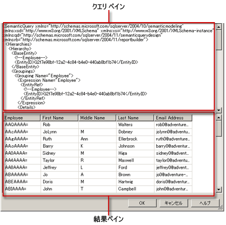

# レポート モデル クエリ デザイナーのユーザー インターフェイス
  レポート デザイナーには、レポートに必要なデータを指定して、Report Server Model データ ソースから抽出するためのクエリ デザイナーが 2 つ用意されています。 モデルのエンティティやエンティティのフィールドを参照したり選択したりする場合は、グラフィカル クエリ デザイナーを使用します。 XML 形式の SMDL (セマンティック モデル定義言語) 仕様を直接操作するには、テキストベースのクエリ デザイナーを使用します。  
  
> [!IMPORTANT]  
>  ユーザーは、クエリを作成して実行する際にデータ ソースにアクセスします。 したがって、データ ソースに対する最小限の権限 (読み取り専用権限など) を付与する必要があります。  
  
## グラフィカル クエリ デザイナー  
 レポート デザイナーには、SMDL のクエリをデザインしたり、実行したりするために使用できるグラフィカル クエリ デザイナーが提供されています。レポートの処理時には、作成したクエリに基づいて、レポート データセットのフィールド コレクションが設定されます。 グラフィカル クエリ デザイナーは、3 つの領域 (ペイン) に分割されています。  
  
 次の図に各ペインの名称を示します。  
  
   
  
 次の表に各ペインの機能を示します。  
  
|ペイン|関数|  
|----------|--------------|  
|エクスプローラー ペイン|モデル内のエンティティやエンティティ フィールドをグラフィカルに表示します。 このペインは、エンティティや、そのエンティティに関連したエンティティ、フィールドを参照するときに使用します。|  
|デザイン領域|モデルからフィールドが一覧表示されます。 このペインは、選択したフィールドのレイアウトを調整するときに使用します。|  
|Results pane|クエリの結果を表示します。 クエリを実行するには、任意のペインで右クリックして、**[実行]** をクリックするか、ツール バーの **[実行]** () ボタンをクリックします。|  
  
 エクスプローラー ペインまたはデザイン領域ペインの情報を変更した場合、**[実行]** をクリックしたときに、変更内容が結果ペインに反映されます。  
  
 デザイン領域から列を削除するなど、特定のペインで操作を実行するには、列を右クリックして表示されるメニューから目的のコマンドをクリックします。  
  
### グラフィカル クエリ デザイナーのツール バー  
 ツール バーのボタンを使用してクエリをデザインすることもできます。 次の表は、ツール バーのボタンと、各ボタンの用途を一覧にしたものです。  
  
|ボタン|Description|  
|------------|-----------------|  
|**[テキストとして編集]**|テキスト ベースのクエリ デザイナーと、グラフィカル クエリ デザイナー間で切り替えます。 レポート サーバー モデル データ ソースのクエリは、XML 形式の SMQL (セマンティック モデル クエリ言語) 仕様です。|  
|**[インポート]**|ファイル システムのレポート定義 (.rdl) ファイルから既存のクエリをインポートします。 詳細については、「[レポート埋め込みデータセットと共有データセット &#40;レポート ビルダーおよび SSRS&#41;](../../reporting-services/report-data/report-embedded-datasets-and-shared-datasets-report-builder-and-ssrs.md)」をご覧ください。|  
||最後の操作を元に戻します。|  
||最後の操作を再実行します。|  
||クエリを実行し、その結果として得られた行を結果ペインに表示します。|  
||**[データのフィルター選択]** ダイアログ ボックスを開きます。このダイアログ ボックスでは、フィルターを適用するデータを選択できます。 フィルターは、デザイン領域に現在表示されているデータとは無関係に指定できます。|  
  
## テキストベースのクエリ デザイナー  
 Report Server Model データセット クエリを作成する場合、グラフィカル クエリ デザイナーが既定のデザイナーとなります。 テキスト ベースのクエリ デザイナーに切り替えるには、ツール バーの **[テキストとして編集]** 切り替えボタンをクリックします。  
  
 テキストベースのクエリ デザイナーは、SMQL クエリ ペインと結果ペインという 2 つのペインで構成されます。 このクエリ デザイナー ビューは主に、SMQL クエリ仕様を他のソースから入手でき、それをクエリ ペインに貼り付ける場合に使用します。 グラフィカル クエリ デザイナーと異なり、テキストベースのクエリ デザイナーでは、クエリ構文のチェックやクエリの再構成は行われません。 ツール バーの **[実行]** をクリックすると、データ ソースに対するクエリが実行され、その結果が結果ペインに表示されます。  
  
 次の図に各ペインの名称を示します。  
  
   
  
 次の表に各ペインの機能を示します。  
  
|ペイン|関数|  
|----------|--------------|  
|クエリ ペイン|SMQL 仕様テキストを表示します。|  
|結果ペイン|クエリの結果を表示します。 クエリを実行するには、任意のペインで右クリックして、**[実行]** をクリックするか、ツール バーの **[実行]** ボタンをクリックします。|  
  
### テキスト ベースのクエリ デザイナーのツール バー  
 ツール バーのボタンを使用してクエリをデザインすることもできます。 次の表は、ツール バーのボタンと、各ボタンの用途を一覧にしたものです。  
  
|ボタン|Description|  
|------------|-----------------|  
|**[テキストとして編集]**|テキスト ベースのクエリ デザイナーと、グラフィカル クエリ デザイナー間で切り替えます。|  
|**[インポート]**|既存のレポートからクエリをインポートします。|  
||クエリ テキストを実行し、その結果として得られた行セットを結果ペインに表示します。|  
  
## 参照  
 [クエリ デザイン ツール &#40;SSRS&#41;](../../reporting-services/report-data/query-design-tools-ssrs.md)   
 [外部データ ソースのデータを追加する &#40;SSRS&#41;](../../reporting-services/report-data/add-data-from-external-data-sources-ssrs.md)   
 [レポート モデルの接続 &#40;SSRS&#41;](../../reporting-services/report-data/report-model-connection-ssrs.md)   
 [RSReportDesigner 構成ファイル](../../reporting-services/report-server/rsreportdesigner-configuration-file.md)  
  
  