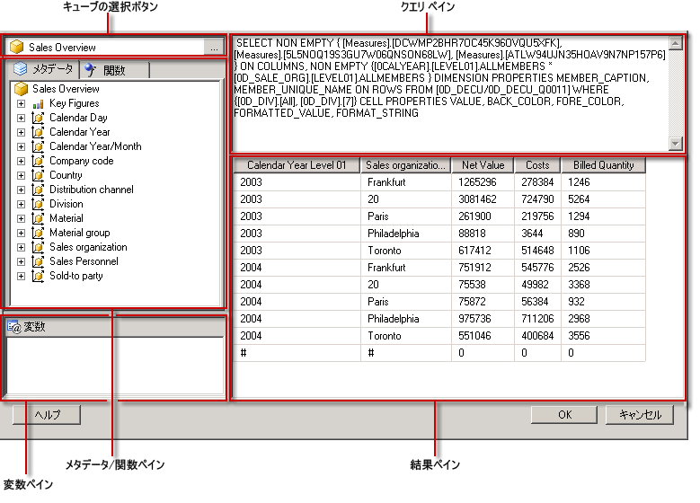

# SAP NetWeaver BI Query Designer のユーザー インターフェイス
  [!INCLUDE[ssRSnoversion](../../includes/ssrsnoversion-md.md)] には、SAP NetWeaver® Business Intelligence データ ソースに対する多次元式 (MDX) クエリを作成するためのグラフィカル クエリ デザイナーが用意されています。 MDX のグラフィカル クエリ デザイナーには、デザイン モードとクエリ モードという 2 つのモードがあります。 どちらのモードでもメタデータ ペインが表示されます。このペインを使用して、データ ソースで定義されている InfoCube、MultiProvider、または Web 対応クエリからメンバーをドラッグすることによって MDX クエリを作成できます。レポートの処理時には、このクエリに基づいてデータが取得されます。  
  
> [!IMPORTANT]  
>  ユーザーは、クエリを作成して実行する際にデータ ソースにアクセスします。 したがって、データ ソースに対する最小限の権限 (読み取り専用権限など) を付与する必要があります。  
  
 SAP の多次元データ ソースを使用する方法の詳細については、「[SAP NetWeaver BI の接続の種類 (SSRS)](../../reporting-services/report-data/sap-netweaver-bi-connection-type-ssrs.md)」を参照してください。  
  
 ここでは、グラフィカル クエリ デザイナーの各モードの、ツール バーのボタンとクエリ デザイナーのペインについて説明します。  
  
## グラフィカル クエリ デザイナー (デザイン モード)  
 [!INCLUDE[SAP_DPE_BW_1](../../includes/sap-dpe-bw-1-md.md)] データ ソースを使用するデータセット クエリを編集する場合、グラフィカル クエリ デザイナーはデザイン モードで開きます。 次の図は、デザイン モードで表示される各ペインの名称を示しています。  
  
   
  
 このモードのペインの一覧を次の表に示します。  
  
|ペイン|関数|  
|----------|--------------|  
|キューブの選択ボタン|現在選択されている InfoCube、MultiProvider、または Web 対応クエリを表示します。|  
|メタデータ ペイン|InfoCubes、MultiProviders、およびクエリの階層リストを表示します。 データ ソースで作成されたクエリが、対応するキューブの下に表示される場合があります。|  
|計算されるメンバー ペイン|現在定義されている、クエリに使用することのできる計算されるメンバーを表示します。|  
|データ ペイン|クエリの実行結果を表示します。|  
  
 データ ペインには、メタデータ ペインからディメンションや主要データをドラッグしたり、計算されるメンバー ペインから計算されるメンバーをドラッグしたりできます。 **[自動実行]** 切り替えボタンがオンになっている場合、データ ペインにオブジェクトをドロップするたびにクエリが自動的に実行されます。 **[自動実行]** がオフの場合、データ ペインに変更を加えてもクエリは自動実行されません。 クエリを手動で実行するには、ツール バーの **[実行]** ボタンを使用します。  
  
### グラフィカル クエリ デザイナーのツール バー (デザイン モード)  
 クエリ デザイナーのツール バーにある各種のボタンを使用すると、グラフィカル インターフェイスを使用して MDX クエリをデザインできます。 次の表は、これらのボタンとその機能を示しています。  
  
|ボタン|Description|  
|------------|-----------------|  
|**[テキストとして編集]**|テキスト ベースのクエリ デザイナーと、グラフィカル クエリ デザイナー間で切り替えます。 このデータ ソースの種類では使用できません。|  
|**[インポート]**|ファイル システムのレポート定義 (.rdl) ファイルから既存のクエリをインポートします。 詳細については、「[レポート埋め込みデータセットと共有データセット &#40;レポート ビルダーおよび SSRS&#41;](../../reporting-services/report-data/report-embedded-datasets-and-shared-datasets-report-builder-and-ssrs.md)」を参照してください。|  
||データ ソースからメタデータを更新します。|  
||**[計算されるメンバー ビルダー]** ダイアログ ボックスを表示します。|  
||データ ペインに空のセルを表示するかどうかを切り替えます。 これは、MDX で NON EMPTY 句を使用することに相当します。|  
||データ ペインで列を削除するなど、変更のたびに自動的にクエリを実行して結果を表示します。 結果はデータ ペインに表示されます。|  
|![[削除]](../../reporting-services/report-data/media/rsqdicon-delete.gif "[削除]")|データ ペインで選択した列をクエリから削除します。|  
||**[変数]** ダイアログ ボックスを表示します。 このボタンは、クエリ キューブが選択されている場合にのみ有効になります (変数はクエリ キューブでのみサポートされるため)。 変数に既定値を割り当てた場合、対応するレポート パラメーターが作成されます。|  
||クエリを実行し、結果をデータ ペインに表示します。|  
||クエリを取り消します。|  
||デザイン モードとクエリ モードを切り替えます。|  
  
## グラフィカル クエリ デザイナー (クエリ モード)  
 グラフィカル クエリ デザイナーをクエリ モードに変更するには、ツール バーの **[デザイン モード]** 切り替えボタンをクリックします。  
  
 次の図は、クエリ デザイナーをクエリ モードにしたときに表示される各領域を示しています。  
  
   
  
 次の表に各ペインの機能を示します。  
  
|ペイン|関数|  
|----------|--------------|  
|キューブの選択ボタン|現在選択されている InfoCube、MultiProvider、またはその他のキューブを表示します。|  
|メタデータ/関数ペイン|クエリ テキストの作成に使用できるメタデータや関数がタブ付きウィンドウに一覧表示されます。|  
|変数ペイン|現在定義されている、クエリに使用することのできる変数を表示します。|  
|クエリ ペイン|現在のクエリ テキストを表示します。|  
|結果ペイン|クエリの結果を表示します。|  
  
 メタデータ ペインの **[メタデータ]** タブに表示されている主要データやディメンションを MDX クエリ ペインにドラッグすると、メタデータの技術名がカーソル位置に挿入されます。 また、 **[関数]** タブに表示されている関数を MDX クエリ ペインにドラッグできます。 クエリを実行すると、結果ペインに現在の MDX クエリの結果が表示されます。  
  
 選択したキューブが Web 対応クエリの場合、既存の変数に対して静的な既定値を設定するように求められます。 その後、変数を MDX クエリ ペインにドラッグできます。  
  
 メタデータ ペインと変数ペインには、表示名が表示されます。 対応するオブジェクトを MDX クエリ ペインにドラッグすると、MDX クエリに入力したデータ ソースで必要な技術名が表示されます。  
  
### グラフィカル クエリ デザイナーのツール バー (クエリ モード)  
 クエリ デザイナーのツール バーにある各種のボタンを使用すると、グラフィカル インターフェイスを使用して MDX クエリをデザインできます。 デザイン モードでもクエリ モードでも、表示されるツール バー ボタンは同じです。ただし、クエリ モードでは、次のボタンが無効になります。  
  
-   **[テキストとして編集]**  
  
-   **[計算されるメンバーの追加]** ()  
  
-   **空のセルを表示する**()  
  
-   **自動**()  
  
-   **[削除]** (![[削除]](../../reporting-services/report-data/media/rsqdicon-delete.gif "[削除]"))  
  
## 「  
 [共有データセットまたは埋め込みデータセット &#40; を作成します。レポート ビルダーおよび SSRS &#41;](../../reporting-services/report-data/create-a-shared-dataset-or-embedded-dataset-report-builder-and-ssrs.md)   
 [RSReportDesigner 構成ファイル](../../reporting-services/report-server/rsreportdesigner-configuration-file.md)  
  
  
