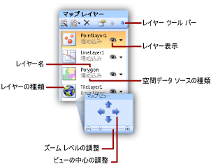

# マップまたはマップ レイヤーの追加、変更、または削除 (レポート ビルダーおよび SSRS)
  マップは、レイヤーのコレクションです。 マップを [!INCLUDE[ssRSnoversion_md](../../includes/ssrsnoversion-md.md)] の改ページ調整されたレポートに追加する場合は、先にレイヤーを定義します。 追加のレイヤーを作成するには、マップ レイヤー ウィザードを実行します。  
  
 レイヤーの追加/削除、またはレイヤーのオプションを変更する一番簡単な方法は、マップ レイヤー ウィザードを使用する方法です。 マップ ペインから手動でオプションを変更することもできます。 **マップ** ペインを表示するには、レポート デザイン画面のマップ内をクリックします。 次の図に、このペインの一部を示します。  
  
   
  
 マップ レイヤーは、マップ ペインに表示されるとおりに、背面から前面の順に描画されます。 上の図では、タイル レイヤーが最初に描画され、多角形レイヤーが最後に描画されます。 先に描画されたレイヤー上のマップ要素は、後から描画されるレイヤーによって隠されてしまう場合があります。 マップ ペインのツール バーにある方向キーを使用すると、レイヤーの順序を変更できます。 レイヤーの表示/非表示を切り替えるには、表示アイコンをクリックします。 レイヤーの透明度を変更するには、 **[レイヤー データのプロパティ]** ダイアログ ボックスの **[表示]** ページを使用します。  
  
 次の表では、 **マップ** ペインのツール バー アイコンについて説明します。  
  
|記号|[説明]|使用する場合|  
|------------|-----------------|-----------------|  
||マップ レイヤー ウィザード|ウィザードを使用してレイヤーを追加するには、 **[レイヤーの新規作成ウィザード]** をクリックします。|  
||レイヤーの追加|レイヤーを手動で追加するには、 **[レイヤーの追加]** をクリックし、追加するマップ レイヤーの種類をクリックします。|  
||多角形レイヤー|多角形座標のセットに基づく領域または形状を表示するマップ レイヤーを追加します。|  
||線レイヤー|線座標のセットに基づくパスまたはルートを表示するマップ レイヤーを追加します。|  
||ポイント レイヤー|ポイント座標のセットに基づく場所を表示するマップ レイヤーを追加します。|  
||タイル レイヤー|ビューポートによって定義された現在のマップ ビュー領域に対応する Bing のマップ タイルを表示するマップ レイヤーを追加します。|  
  
 マップ ペインの一番下にはマップ ビュー領域があります。 マップの中心またはズーム オプションを変更するには、方向キーを使用してビューの中心を調整し、スライダーを使用してズーム レベルを調整します。  
  
 レイヤーの詳細については、「 [マップ (レポート ビルダーおよび SSRS)](../../reporting-services/report-design/maps-report-builder-and-ssrs.md)をクリックします。  
  
> [!NOTE]  
>  [!INCLUDE[ssRBRDDup](../../includes/ssrbrddup-md.md)]  
  
##   マップ レイヤー ウィザードを使用してレイヤーを追加するには  
  
-   リボンで **[挿入]** メニューの **[マップ]** をクリックしてから、 **[マップ] Wizard.** をクリックします。 このウィザードを使用すると、既存のマップにレイヤーを追加できます。 マップ ウィザードとマップ レイヤー ウィザードに含まれるページはほとんど同じです。  
  
     詳細については、「 [マップ ウィザードおよびマップ レイヤー ウィザードのページ &#40;レポート ビルダーおよび SSRS&#41;](../../reporting-services/report-design/map-wizard-and-map-layer-wizard-report-builder-and-ssrs.md)」を参照してください。  
  
##   マップ レイヤー ウィザードを使用してレイヤーのオプションを変更するには  
  
-   マップ レイヤー ウィザードを実行します。 このウィザードを使用すると、マップ レイヤー ウィザードを使用して作成したレイヤーのオプションを変更できます。 マップ ペインでレイヤーを右クリックし、ツール バーの [レイヤー ウィザード] ボタンをクリックします ()。  
  
     詳細については、「 [マップ ウィザードおよびマップ レイヤー ウィザードのページ &#40;レポート ビルダーおよび SSRS&#41;](../../reporting-services/report-design/map-wizard-and-map-layer-wizard-report-builder-and-ssrs.md)」を参照してください。  
  
##   マップ ペインのツール バーを使用してポイント レイヤー、線レイヤー、または多角形レイヤーを追加するには  
  
1.  マップ ペインが表示されるまでマップをクリックします。  
  
2.  ツール バーの **[レイヤーの追加]** をクリックし、ドロップダウン リストで、追加するレイヤーの種類 ( **[ポイント]** 、 **[線]** 、または **[多角形]** ) をクリックします。  
  
    > [!NOTE]  
    >  マップ レイヤーを追加してから手動で構成することもできますが、新規レイヤーの追加にはマップ レイヤー ウィザードを使用することをお勧めします。 マップ ペインのツール バーからこのウィザードを起動するには、[レイヤー ウィザード] ボタンをクリックします ()。  
  
3.  レイヤーを右クリックし、 **[レイヤー データ]** をクリックします。  
  
4.  **[空間データのソース]** で、空間データのソースを選択します。 オプションは、選択した内容によって異なります。  
  
     レポートの分析データをこのレイヤー上に視覚化するには、次の操作を行います。  
  
    1.  **[分析データ]** をクリックします。  
  
    2.  **[分析データセット]** で、分析データと空間データの間にリレーションシップを構築するための分析データと対応フィールドを含んでいるデータセットの名前をクリックします。  
  
    3.  **[追加]** をクリックします。  
  
    4.  空間データセットの対応フィールドの名前を入力します。  
  
    5.  分析データセットの対応フィールドの名前を入力します。  
  
     空間データと分析データをリンクする方法の詳細については、「[マップまたはマップ レイヤーのデータと表示のカスタマイズ (レポート ビルダーおよび SSRS)](../../reporting-services/report-design/customize-the-data-and-display-of-a-map-or-map-layer-report-builder-and-ssrs.md)」を参照してください。  
  
5.  [!INCLUDE[clickOK](../../includes/clickok-md.md)]  
  
##   レイヤーの分析データをフィルター処理するには  
  
1.  マップ ペインが表示されるまでマップをクリックします。  
  
2.  マップ ペインでレイヤーを右クリックして、  **[レイヤー データ]** をクリックします。  
  
3.  **[フィルター]** をクリックします。  
  
4.  マップ表示で使用される分析データを制限するフィルター式を定義します。 詳細については、「[フィルター式の例 &#40;レポート ビルダーおよび SSRS&#41;](../../reporting-services/report-design/filter-equation-examples-report-builder-and-ssrs.md)」を参照してください。  
  
##   ポイント レイヤーまたは多角形の中心点のポイント プロパティを制御するには  
  
1.  **[マップ ポイントのプロパティ]** ダイアログ ボックスの **[全般]** を選択すると、次のマップ要素のラベル、ツールヒント、およびマーカーの種類に関するオプションを変更できます。  
  
    -   ポイント レイヤー上のすべての動的ポイントまたは埋め込みポイント。 ポイントの色ルール、サイズ ルール、およびマーカーの種類ルールは、これらのオプションをオーバーライドします。 特定の埋め込みポイントのオプションをオーバーライドするには、「 [[マーカー] ([マップの埋め込みポイントのプロパティ] ダイアログ ボックス)](https://msdn.microsoft.com/library/3c5eb1c5-d40a-424f-aa7c-43b112f42dec) 」ページを使用します。  
  
    -   多角形レイヤー上のすべての動的多角形または埋め込み多角形の中心点。 中心点の色ルール、サイズ ルール、およびマーカーの種類ルールは、これらのオプションをオーバーライドします。 特定の中心点のオプションをオーバーライドするには、「 [[マーカー] ([マップの埋め込みポイントのプロパティ] ダイアログ ボックス)](https://msdn.microsoft.com/library/3c5eb1c5-d40a-424f-aa7c-43b112f42dec) 」ページを使用します。  
  
##   空間データのソースとして埋め込みデータを指定するには  
  
1.  マップ ペインが表示されるまでマップをクリックします。  
  
2.  レイヤーを右クリックし、 **[レイヤー データ]** をクリックします。  
  
3.  **[空間データのソース]** で、 **[レポートに埋め込まれたデータ]** を選択します。  
  
4.  マップ要素を既存のレポートから読み込む場合、または ESRI ファイルに基づいてマップ要素を作成する場合は、 **[参照]** をクリックし、ファイルをポイントして、 **[開く]** をクリックします。 マップ要素が現在のレポート定義に埋め込まれます。 ポイントする空間データは、レイヤーの種類に対応する必要があります。 たとえば、ポイント レイヤーの場合は、ポイント座標のセットを指定する空間データをポイントする必要があります。  
  
5.  **[空間フィールド]** で、空間データが格納されているフィールドの名前を入力します。 場合によっては、空間データのソースに対してこの名前を参照する必要があります。  
  
    > [!NOTE]  
    >  フィールドの名前がわからず ESRI シェープファイルを参照した場合は、このオプションの代わりに **[ESRI シェープファイルにリンク]** オプションを使用します。  
  
6.  [!INCLUDE[clickOK](../../includes/clickok-md.md)]  
  
##   空間データのソースとして ESRI シェープファイルを指定するには  
  
1.  マップ ペインが表示されるまでマップをクリックします。  
  
2.  レイヤーを右クリックし、 **[レイヤー データ]** をクリックします。  
  
3.  **[空間データのソース]** で、 **[ESRI シェープファイルにリンク]** を選択します。  
  
4.  **[ファイル名]** に ESRI シェープファイルの場所を入力するか、 **[参照]** をクリックし、ESRI シェープファイルを選択します。  
  
    > [!NOTE]  
    >  シェープファイルがローカル コンピューター上に格納されている場合、空間データはレポート定義に埋め込まれます。 レポートの処理時にデータが動的に取得されるようにするには、ESRI .shp ファイルとその .dbf サポート ファイルをレポート サーバーにアップロードする必要があります。 詳細については、[ファイルまたはレポートのアップロード](../reports/upload-a-file-or-report-report-manager.md)に関するページを参照してください。  
  
5.  [!INCLUDE[clickOK](../../includes/clickok-md.md)]  
  
##   空間データのソースとしてレポート データセット フィールドを指定するには  
  
1.  マップ ペインが表示されるまでマップをクリックします。  
  
2.  レイヤーを右クリックし、 **[レイヤー データ]** をクリックします。  
  
3.  **[空間データのソース]** で、 **[データセットの空間フィールド]** を選択します。  
  
4.  **[データセット名]** で、目的の空間データが格納されているレポート内のデータセットの名前をクリックします。  
  
5.  **[空間フィールド名]** で、空間データが格納されているデータセット内のフィールドの名前をクリックします。  
  
6.  [!INCLUDE[clickOK](../../includes/clickok-md.md)]  
  
##   タイル レイヤーを追加するには  
  
1.  マップ ペインが表示されるまでマップをクリックします。  
  
2.  ツール バーの **[レイヤーの追加]** ボタンをクリックし、ドロップダウン リストで **[タイル レイヤー]** をクリックします。  
  
    > [!NOTE]  
    >  レポート内での Bing のマップ タイルの使用については、「 [追加使用条件](https://go.microsoft.com/fwlink/?LinkId=151371)」を参照してください。  
  
3.  マップ ペイン内でタイル レイヤーを右クリックし、 **[タイルのプロパティ]** をクリックします。  
  
4.  **[タイルのオプション]** で、タイル スタイルを選択します。 Bing のマップ タイルが使用可能である場合は、選択したスタイルでデザイン画面上のレイヤーが更新されます。  
  
    > [!NOTE]  
    >  マップまたはマップ レイヤー ウィザード内で多角形レイヤー、線レイヤー、またはポイント レイヤーを追加するときに、タイル レイヤーを追加することもできます。 **[空間データとマップ ビューのオプションを選択]** ページで、 **[このマップ ビューに Bing Maps の背景を追加する]** オプションを選択します。  
  
##   レイヤーの描画順を変更するには  
  
1.  マップ ペインが表示されるまでマップをクリックします。  
  
2.  マップ ペイン内のレイヤーをクリックして選択します。  
  
3.  マップ ペインのツール バーの上矢印または下矢印をクリックし、各レイヤーの描画順を変更します。  
  
##   多角形レイヤー、線レイヤー、またはポイント レイヤーの透明度を変更するには  
  
1.  マップ ペインが表示されるまでマップをクリックします。  
  
2.  レイヤーを右クリックし、 **[レイヤー データ]** をクリックします。  
  
3.  **[表示]** をクリックします。  
  
4.  **[透明度オプション]** で、透明度を表す値 (たとえば、「 **40**」) を入力します。 透明度が 0% の場合、レイヤーは不透明になります。 透明度が 100% の場合、レポート内にレイヤーは表示されません。  
  
5.  [!INCLUDE[clickOK](../../includes/clickok-md.md)]  
  
##   タイル レイヤーの透明度を変更するには  
  
1.  マップ ペインが表示されるまでマップをクリックします。  
  
2.  レイヤーを右クリックし、 **[タイルのプロパティ]** をクリックします。  
  
3.  **[表示]** をクリックします。  
  
4.  **[透明度オプション]** で、透明度を表す値 (たとえば、「 **40**」) を入力します。  
  
5.  [!INCLUDE[clickOK](../../includes/clickok-md.md)]  
  
##   タイル レイヤーにセキュリティで保護された接続を指定するには  
  
1.  マップ ペインが表示されるまでマップをクリックします。  
  
2.  マップ ペイン内のタイル レイヤーをクリックして選択します。 プロパティ ペインにタイル レイヤーのプロパティが表示されます。  
  
3.  プロパティ ペインで、UseSecureConnection を **True**に設定します。  
  
 Bing Maps Web サービスの接続は、HTTP SSL (Secure Sockets Layer) サービスを使用してこのレイヤーの Bing マップ タイルを取得します。  
  
##   タイル ラベルの言語を指定するには  
  
1.  既定では、ラベルを表示するタイル スタイルには、レポート ビルダー用に既定ロケールとして指定されている言語が使用されます。 次の方法でタイル ラベルの言語設定をカスタマイズできます。  
  
    -   ビューポートの外でマップをクリックして選択します。 プロパティ ペインで、TileLanguage プロパティに対してドロップダウン リストからカルチャ値を選択します。  
  
    -   レポートの背景をクリックしてそのレポートを選択します。 プロパティ ペインで、Language プロパティに対してドロップダウン リストからカルチャ値を選択します。  
  
     タイル ラベルの言語設定の優先順位は、レポート プロパティ Language、レポート ビルダーの既定ロケール、マップ プロパティ TileLanguage の順です。  
  
##   ビューポートのズーム レベルに基づいてレイヤーを条件付きで非表示にするには  
  
1.  **[表示]** オプションを設定すると、マップ レイヤーの表示を制御できます。  
  
    -   マップ レイヤー ペインで、レイヤーを右クリックして選択し、[マップ レイヤー] ツール バーの [プロパティ] をクリックして **[マップ レイヤーのプロパティ]** を開きます。  
  
    -   **[表示]** をクリックします。  
  
    -   [レイヤーの表示] で、 **[ズーム値を基に表示/非表示を切り替える]** を選択します。  
  
    -   レイヤーを表示するときのズームの最小値と最大値を入力します。  
  
    -   省略可。 透明度の値を入力します。  
  
     条件付きでレイヤーを非表示にすることもできます。 詳細については、「[アイテムを非表示にする (レポート ビルダーおよび SSRS)](../../reporting-services/report-builder/hide-an-item-report-builder-and-ssrs.md)」を参照してください。  
  
## 参照  
 [マップ (レポート ビルダーおよび SSRS)](../../reporting-services/report-design/maps-report-builder-and-ssrs.md)   
 [レポートのトラブルシューティング: マップ レポート &#40;レポート ビルダーおよび SSRS&#41;](../../reporting-services/report-design/troubleshoot-reports-map-reports-report-builder-and-ssrs.md)  
  
  
