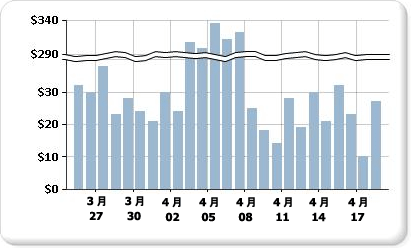

# グラフへのスケール区切りの追加 (レポート ビルダーおよび SSRS)

  スケール区切りは、グラフのプロット エリアに描画される線であり、値軸 (通常は縦軸、つまり Y 軸) 上の最高値と最低値の間の区切りを示します。 スケール区切りを使用すると、同じグラフ領域内で 2 つの異なる範囲を表示できます。  
  
   
  
> [!NOTE]  
>  グラフ上でスケール区切りを配置する場所を指定することはできません。 グラフでは、データセット内の値に基づいた独自の計算で、実行時に値軸 (Y 軸) 上にスケール区切りを描画するためにデータ範囲の間が十分に離れているかどうかが判断されます。  
  
 スケール区切り付きのグラフについては、サンプル レポートに例が含まれています。 このサンプル レポートおよびその他のサンプル レポートをダウンロードする方法の詳細については、 [レポート ビルダーおよびレポート デザイナーのサンプル レポート](https://go.microsoft.com/fwlink/?LinkId=198283)に関するページを参照してください。  
  
> [!NOTE]  
>  [!INCLUDE[ssRBRDDup](../../includes/ssrbrddup-md.md)]  
  
### グラフ上のスケール区切りを有効にするには  
  
1.  縦軸を右クリックし、 **[軸のプロパティ]** をクリックします。 **[縦軸のプロパティ]** ダイアログ ボックスが表示されます。  
  
2.  **[スケールの区切り線を有効にする]** チェック ボックスをオンにします。  
  
### スケール区切りのスタイルを変更するには  
  
1.  プロパティ ペインを開きます。  
  
2.  デザイン画面で、グラフの Y 軸を右クリックします。 Y 軸オブジェクト (既定の名前は "グラフ軸") のプロパティが [プロパティ] ペインに表示されます。  
  
3.  **[スケール]** セクションで、ScaleBreakStyle プロパティを展開します。  
  
4.  BreakLineType や Spacing など、ScaleBreakStyle のプロパティの値を変更します。 スケール区切りプロパティの詳細については、「[グラフ上で複数のデータ範囲を持つ系列の表示 &#40;レポート ビルダーおよび SSRS&#41;](../../reporting-services/report-design/displaying-a-series-with-multiple-data-ranges-on-a-chart.md)」を参照してください。  

## 次の手順

[グラフ](../../reporting-services/report-design/charts-report-builder-and-ssrs.md)   
[グラフの書式設定](../../reporting-services/report-design/formatting-a-chart-report-builder-and-ssrs.md)   
[[軸のプロパティ] ダイアログ ボックス、[軸のオプション]](https://msdn.microsoft.com/library/b276e210-7a12-48ae-971b-7dabae51df11)  

その他の質問 [Reporting Services のフォーラムに質問してみてください](https://go.microsoft.com/fwlink/?LinkId=620231)
