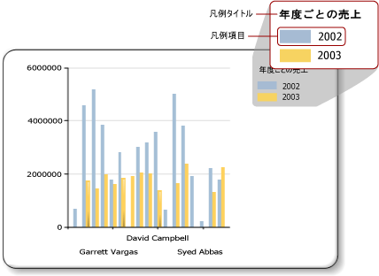

# グラフの凡例 - 書式設定 (レポート ビルダー)
  グラフの凡例には、グラフ内の各カテゴリの説明が含まれています。 凡例には常に 1 つ以上の凡例アイテムが含まれています。次の図に示すように、それぞれの凡例アイテムは、系列を表現する色つきのボックス、および系列を説明するテキスト文字列で構成されています。  
  
   
  
 凡例アイテムは、グラフ上の個々の系列に接続されています。図形グラフの場合は例外で、凡例は個々のデータ ポイントに接続されています。 グラフでは、データから生成された系列に基づいてアイテムが凡例に自動的に追加されます。  
  
 凡例の書式を設定するには、 **[凡例のプロパティ]** ダイアログ ボックスを使用するか、[プロパティ] ペインを使用します。 凡例を右クリックし、 **[凡例のプロパティ]** をクリックして凡例テキスト、背景色、罫線、および 3D 効果の値を変更します。 凡例のタイトルの値を変更するには、凡例を選択し、凡例のタイトルを右クリックして **[凡例のタイトルのプロパティ]** をクリックします。  
  
 画像、列、またはその他の補足アイテムを凡例に追加することはできません。  
  
> [!NOTE]  
>  [!INCLUDE[ssRBRDDup](../../includes/ssrbrddup-md.md)]  
  
## 凡例の凡例アイテムの並べ替え  
 系列は、 [!INCLUDE[ssRSnoversion](../../includes/ssrsnoversion-md.md)] 処理エンジンによって処理された順序に従って凡例に表示されます。 この順序は、データ フィールド ドロップ ゾーンのフィールドの順序を変えることによって、変更することができます。 系列グループを使用している場合、系列データは処理が行われるまで不明なので、これらのアイテムを並べ替える方法はありません。 変更は [プレビュー] で確認できます。 系列グループの詳細については、「 [グラフ &#40;レポート ビルダーおよび SSRS&#41;](../../reporting-services/report-design/charts-report-builder-and-ssrs.md)をクリックします。  
  
 凡例に表示されている任意の系列を非表示にすることができます。 系列グループを使用している場合、データ フィールドに関連付けられているすべての系列は非表示になります。 詳細については、「 [グラフの凡例項目を非表示にする &#40;レポート ビルダーおよび SSRS&#41;](../../reporting-services/report-design/chart-legend-hide-items-report-builder.md)をクリックします。  
  
## 凡例内の凡例アイテムのテキストまたは色の変更  
 グラフのデータ フィールドのドロップ ゾーンにフィールドを配置すると、このフィールドの名前を含む凡例アイテムが自動的に生成されます。 既定では、各凡例アイテムのテキストはデータ フィールドの名前から取得されます。 すべての凡例アイテムは、グラフ上の個々の系列に接続されています。ただし図形グラフの場合は例外で、凡例は個々の系列ではなく個々のデータ ポイントに接続されています。 図形グラフ上でカテゴリ グループを定義すると、各凡例アイテムのテキストは、カテゴリ グループの文字列表現から取得されます。 円グラフ、ドーナツ グラフ、およびじょうごグラフにカスタム ラベル テキストを指定して、凡例の個々のデータ ポイントに関連するカテゴリ グループ ラベル以外の情報を表示することができます。 そのためには、凡例を選択し、 **[系列のプロパティ]** ダイアログ ボックスまたは [プロパティ] ペインの **LegendText** プロパティに凡例テキストを指定します。 詳細については、「 [凡例アイテムのテキストの変更 &#40;レポート ビルダーおよび SSRS&#41;](../../reporting-services/report-design/chart-legend-change-item-text-report-builder.md)をクリックします。  
  
 **LegendText** プロパティまたは **[系列のプロパティ]** ダイアログ ボックスで頻繁に参照される属性に対して、大文字と小文字が区別される、グラフに固有のキーワードを指定できます。 これらのキーワードは、グラフ コントロールによって実行時にデータ表現に置き換えられます。 特定のデータ ポイントに関連する情報を表示することができるので、この方法は図形グラフで便利です。 詳細については、「 [グラフでのデータ ポイントの書式設定 (レポート ビルダーおよび SSRS)](../../reporting-services/report-design/formatting-data-points-on-a-chart-report-builder-and-ssrs.md)をクリックします。  
  
 各凡例アイテムに表示される色付きボックスは、対応する系列の塗りつぶしの色を継承します。 凡例アイテムに表示される色を変更するには、対応する系列の色を変更する必要があります。 詳細については、「 [グラフの系列の色の書式設定 &#40;レポート ビルダーおよび SSRS&#41;](../../reporting-services/report-design/formatting-series-colors-on-a-chart-report-builder-and-ssrs.md)をクリックします。  
  
## 凡例からの余分な凡例アイテムの削除  
 凡例は常に系列に接続されます。 凡例アイテムが凡例に表示されていても対応する系列がグラフに表示されていない場合、系列に値が含まれていない可能性があります。 凡例から凡例アイテムを削除するために、この系列を削除する必要があります。 グラフから系列を削除するには、対象となる系列を右クリックして [系列の削除] オプションを選択します。  
  
## 凡例の位置の変更  
 グラフ領域は、軸ラベルおよびプロット エリアを含む四角形の領域です。 凡例がグラフ領域の外側にある場合、12 の異なる位置のいずれかに凡例をドラッグできます。 既定では、凡例はグラフ領域の外側に表示されます。 位置は、 **[凡例のプロパティ]** ダイアログ ボックスでも設定できます。  
  
 凡例をグラフ領域の内側または外側にドラッグすることはできません。 凡例をグラフ領域の内側に移動する場合、 **[凡例のプロパティ]** ダイアログ ボックスの **[ドッキング]** でボックスの一覧から **[既定]** を選択し、 **[グラフ領域の外に凡例を表示する]** オプションをオフにします。 凡例をグラフ領域内に配置することにより、グラフのデータ ポイントの領域を最大化することができます。 しかし、データセットによっては、凡例がグラフ領域上の一部のデータ ポイントに重なって表示され、グラフが読みにくくなることがあります。  
  
## 凡例アイテムの水平表示  
 既定では、凡例は、各行に 1 つの凡例アイテムを含む行のリストとして書式設定されます。 凡例の領域は、凡例アイテムの数に合わせて拡張します。 凡例が拡張できない場合は、省略記号 ( […] ) が表示されます。 指定した凡例スタイルに応じて、凡例は垂直または水平に拡張できます。 **[凡例のプロパティ]** ダイアログ ボックスでレイアウト スタイルを変更するか、すべての凡例アイテムを表示するために割り当てられている領域を変更できます。  
  
 凡例を水平に表示するには、凡例をグラフの上部または下部にドッキングします。 これにより、凡例が水平方向に拡張します。 Layout プロパティを **[行]** または **[表 (横)]** に設定することもできます。 凡例がグラフ領域の上部または下部にドッキングしたときに割り当てられた垂直領域を制御するには、[プロパティ] ペインの MaxAutoSize プロパティを設定します。  
  
## 凡例テキストの書式設定  
 凡例テキストのフォント、サイズ、スタイル、および色は、 **[凡例のプロパティ]** ダイアログ ボックスの **[フォント]** ページで変更できます。  
  
 既定では、凡例テキストは、凡例領域に合わせて最適化されません。 割り当てられた領域に合わせて凡例テキストを表示するには、AutoFitTextDisabled プロパティを **False** に設定し、MinFontSize プロパティの最小フォント サイズを変更して、表示可能で凡例が最適化されると思われる最小のフォント サイズに設定します。  
  
## 参照  
 [[全般] ([凡例のプロパティ] ダイアログ ボックス) &#40;レポート ビルダーおよび SSRS&#41;](https://msdn.microsoft.com/library/db718f8f-f185-422f-871c-96f0749e5893)   
 [凡例アイテムのテキストの変更 &#40;レポート ビルダーおよび SSRS&#41;](../../reporting-services/report-design/chart-legend-change-item-text-report-builder.md)   
 [グラフの書式設定 (レポート ビルダーおよび SSRS)](../../reporting-services/report-design/formatting-a-chart-report-builder-and-ssrs.md)   
 [グラフの系列の色の書式設定 &#40;レポート ビルダーおよび SSRS&#41;](../../reporting-services/report-design/formatting-series-colors-on-a-chart-report-builder-and-ssrs.md)   
 [グラフ &#40;レポート ビルダーおよび SSRS&#41;](../../reporting-services/report-design/charts-report-builder-and-ssrs.md)   
 [グラフの凡例項目を非表示にする &#40;レポート ビルダーおよび SSRS&#41;](../../reporting-services/report-design/chart-legend-hide-items-report-builder.md)   
 [パレットを使用したグラフの色の定義 &#40;レポート ビルダーおよび SSRS&#41;](../../reporting-services/report-design/define-colors-on-a-chart-using-a-palette-report-builder-and-ssrs.md)  
  
  
