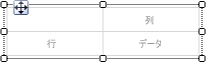
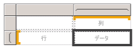
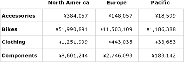
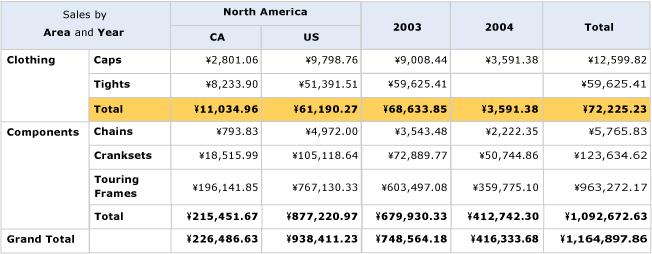
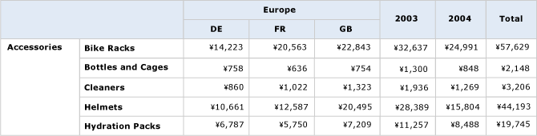

# マトリックスの作成 (レポート ビルダーおよび SSRS)
  グループ化されたデータと概要情報を表示するには、マトリックスを使用します。 データは、複数のフィールドまたは式によって、行グループと列グループにグループ化できます。 マトリックスには、クロスタブやピボット テーブルと同様の機能があります。 実行時にレポート データとデータ領域が組み合わされると、マトリックスはページ上で縦横に拡大します。 マトリックス セルには、そのセルが所属する行グループと列グループの交差部分にスコープを設定した集計値が表示されます。 行と列の書式を設定すると、強調するデータをハイライトできます。 ドリルダウン トグルを含めて、最初は詳細データを非表示にすることもできます。ユーザーは、トグルをクリックすることにより、表示するデータの量を調整できます。  
  
 初期デザインが完了したら、ユーザーにとっての表示機能を向上させるためのマトリックスの作成に進むことができます。 詳細については、「 [レポート ページでの Tablix データ領域の表示の制御 &#40;レポート ビルダーおよび SSRS&#41;](../../reporting-services/report-design/controlling-the-tablix-data-region-display-on-a-report-page.md)」を参照してください。  
  
 マトリックスの利用をすぐに開始するには、「[チュートリアル: マトリックス レポートの作成 (レポート ビルダー)](../../reporting-services/tutorial-creating-a-matrix-report-report-builder.md)」を参照してください。  
  
> [!NOTE]  
>  一覧は、レポート パーツとしてレポートとは別にパブリッシュできます。 レポート パーツ (レポート ビルダーおよび SSRS) の詳細は [ここ](../../reporting-services/report-design/report-parts-report-builder-and-ssrs.md)にあります。  
  
##   レポートへのマトリックスの追加  
 リボンの [挿入] タブからデザイン画面にマトリックスを追加します。 マトリックスを追加するには、テーブル ウィザードまたはマトリックス ウィザードを使用して、データ ソース接続とデータセットを作成し、そのマトリックスを構成するか、マトリックス テンプレートに基づいてマトリックスを追加します。  
  
> [!NOTE]  
>  このウィザードは、 [!INCLUDE[ssRBDenali](../../includes/ssrbdenali-md.md)]でのみ使用できます。  
  
 このトピックでは、テーブルの構成方法について詳しく説明するために、マトリックス テンプレートを使用します。  次の図に示すように、初期状態のマトリックスには、行グループ、列グループ、隅のセル、およびデータ セルが含まれています。  
  
   
  
 デザイン画面でマトリックスを選択すると、次の図に示すように、行ハンドルと列ハンドルが表示されます。  
  
   
  
 グループ化ペインの [行グループ] 領域と [列グループ] 領域にデータセット フィールドをドラッグして、グループを追加します。 最初にあった空の既定グループは、[行グループ] 領域または [列グループ] 領域に最初にドラッグしたフィールドで置き換えられます。 その後で、セルのデータの種類に応じて、各セルに書式を適用できます。  
  
   
  
 プレビュー モードでは、マトリックスが展開され、行グループと列グループの値が表示されます。 セルには、次の図に示すように、集約値が表示されます。  
  
   
  
 作業を開始したマトリックスは、Tablix データ領域に基づいたテンプレートです。 入れ子になった行グループや列グループ、隣接した行グループや列グループを追加したり、詳細行を追加したりすることによって、マトリックスの開発を継続することもできます。 詳細については、「[Tablix データ領域の柔軟性について &#40;レポート ビルダーおよび SSRS&#41;](../../reporting-services/report-design/exploring-the-flexibility-of-a-tablix-data-region-report-builder-and-ssrs.md)」を参照してください。  
  
  
##   親グループまたは子グループのマトリックスへの追加  
 単一のデータセット フィールドに基づくグループを追加するには、そのフィールドをレポート データ ペインからグループ化ペインの適切な [行グループ] 領域または [列グループ] 領域にドラッグします。 フィールドをグループ階層にドロップして、既存のグループに対するリレーションシップを設定します。 親グループを作成する場合は、既存のグループの上にドロップし、子グループを作成する場合は、既存のグループの下にドロップします。  
  
 フィールドを **グループ化** ペインにドロップすると、次の結果が得られます。  
  
-   フィールド名に基づく一意の名前を持つ新しいグループが自動的に作成されます。 グループ式は、 `[Category]`などの単純なフィールド名参照に設定されます。  
  
-   新しい行または列が、それに対応する行グループ領域または列グループ領域に表示されます。  
  
-   新しい列に、レポート データセットからの既定のデータ行を示す行グループ セルが 1 つ表示されます。 この行の Tablix 本体に含まれているセルは、この行グループのメンバーになります。 列グループが定義されている場合、列に含まれているセルは、それらの列グループのメンバーになります。 各セルのグループ メンバーシップは、グループ インジケーターによって視覚的に判断できます。  
  
 グループを作成した後でカスタマイズするには、 **[Tablix のグループ]** ダイアログ ボックスを使用します。 グループ名を変更したり、式を編集したり、式をグループ定義に追加したりできます。 テーブルに行を追加する/テーブルから行を削除する方法については、「[行の挿入または削除 (レポート ビルダーおよび SSRS)](../../reporting-services/report-design/insert-or-delete-a-row-report-builder-and-ssrs.md)」を参照してください。  
  
 動的な列ヘッダーは、レポートの実行時に一意のグループ値と同じ数の列数だけ右方向 (マトリックスの Direction プロパティが RTL に設定されている場合は左方向) に拡張されます。 動的な行は、ページの下方向に拡張されます。 Tablix 本体セルに表示されるデータは、次の図に示すとおり、行グループおよび列グループの交差部分に基づいた集計です。  
  
   
  
 プレビュー モードでは、レポートが次の図のように表示されます。  
  
   
  
 既定のスコープ以外のスコープを指定する式を作成するには、データセット、データ領域、またはグループの名前を集計関数 all で指定する必要があります。 Clothing カテゴリ グループ値に対して各サブカテゴリが占める割合を計算するには、Total 列の横の Category グループ内に列を 1 つ追加して、パーセンテージを示すようにテキスト ボックスを書式設定します。その後で、次のコード例に示すように、分子に既定のスコープを使用し、分母に Category グループのスコープを使用する式を追加します。  
  
 `=SUM(Fields!Linetotal.Value)/SUM(Fields! Linetotal.Value,"Category")`  
  
 詳細については、「 [合計、集計、および組み込みコレクションの式のスコープ (レポート ビルダーおよび SSRS)](../../reporting-services/report-design/expression-scope-for-totals-aggregates-and-built-in-collections.md)を表しています。  
  
  
##   隣接するグループのマトリックスへの追加  
 単一のデータセット フィールドに基づく隣接したグループを追加するには、グループ化ペインのショートカット メニューを使用します。 詳細については、「 [データ領域でのグループの追加または削除 &#40;レポート ビルダーおよび SSRS&#41;](../../reporting-services/report-design/add-or-delete-a-group-in-a-data-region-report-builder-and-ssrs.md)」を参照してください。 次の図に、地理データに基づくグループと、それに隣接し、年データに基づくグループを示します。  
  
   
  
 この例では、ヨーロッパに関するデータ値と 2003 年および 2004 年に関するデータ値しか含まないように、データ値がクエリによってフィルター選択されています。 ただし、フィルターの設定は、グループごとに個別に行うことができます。 プレビュー モードでは、レポートが次の図のように表示されます。  
  
   
  
 隣接する列グループの合計列を追加するには、列グループ定義のセル内をクリックして、 **[合計の追加]** コマンドを使用します。 新しい静的列が列グループの横に追加され、既存の行に含まれているすべての数値フィールドの既定の合計が表示されます。 式を変更するには、たとえば `Avg([Sales])`のように、既定の集計を手動で編集します。 詳細については、「[グループまたは Tablix データ領域への合計の追加 (レポート ビルダーおよび SSRS)](../../reporting-services/report-design/add-a-total-to-a-group-or-tablix-data-region-report-builder-and-ssrs.md)」を参照してください。  
  
  
## 参照  
 [集計関数リファレンス &#40;レポート ビルダーおよび SSRS&#41;](../../reporting-services/report-design/report-builder-functions-aggregate-functions-reference.md)   
 [式の例 &#40;レポート ビルダーおよび SSRS&#41;](../../reporting-services/report-design/expression-examples-report-builder-and-ssrs.md)  
  
  
