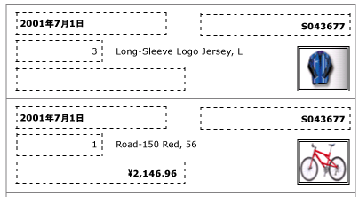
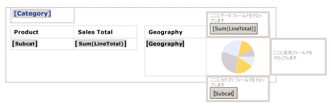
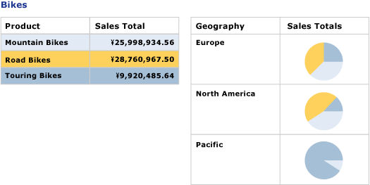

# 一覧がある請求書とフォームを作成する (レポート ビルダーおよび SSRS)
  一覧データ領域は、 [!INCLUDE[ssRSnoversion](../../includes/ssrsnoversion-md.md)] のページ分割されたレポート データセットのグループまたは行ごとに繰り返されます。 一覧は、他のデータ領域と関連付けて自由形式レポートや、請求書などのフォームを作成するために使用できます。 任意の数のレポート アイテムを含んでいる一覧を定義できます。 一覧は、入れ子にすることができます  
  
 一覧の利用をすぐに開始するには、「[チュートリアル: 自由形式のレポートの作成 &#40;レポート ビルダー&#41;](../../reporting-services/tutorial-creating-a-free-form-report-report-builder.md)」を参照してください。  
  
> [!NOTE]  
>  一覧は、レポート パーツとしてレポートとは別にパブリッシュできます。 詳細については、「 [レポート パーツ (レポート ビルダーおよび SSRS)](../../reporting-services/report-design/report-parts-report-builder-and-ssrs.md)」を参照してください。  
  
##   レポートへの一覧の追加  
 リボンの [挿入] タブからデザイン画面に一覧を追加します。 既定では、一覧にはまず詳細グループに関連付けられた行に 1 つのセルがあります。  
  
 ![デザイン画面上の [新しい一覧] レポート アイテム](../../reporting-services/report-design/media/rs-listtemplatenew.gif "デザイン画面上の [新しい一覧] レポート アイテム")  
  
 デザイン画面で一覧を選択すると、次の図に示すように、行および列のハンドルが表示されます。  
  
   
  
 一覧を追加する際には、まず Tablix データ領域に基づくテンプレートを使用します。 一覧の追加後、フィルター、並べ替え、グループ式を指定することにより一覧のコンテンツや外観を変更したり、レポート ページ全体での一覧の表示を変更することによりデザインの拡張を継続できます。 詳細については、「 [レポート ページでの Tablix データ領域の表示の制御 &#40;レポート ビルダーおよび SSRS&#41;](../../reporting-services/report-design/controlling-the-tablix-data-region-display-on-a-report-page.md)」を参照してください。 一覧は 1 つの列と行が基本ですが、入れ子、隣接する行グループや列グループ、または詳細行を追加することにより、一覧のデザイン展開を継続できます。 詳細については、「[Tablix データ領域の柔軟性について &#40;レポート ビルダーおよび SSRS&#41;](../../reporting-services/report-design/exploring-the-flexibility-of-a-tablix-data-region-report-builder-and-ssrs.md)」を参照してください。  
  
  
##   自由形式のレイアウトでのデータの表示  
 グリッドではなく自由形式のレイアウトでレポート データを編成するには、一覧をデザイン画面に追加します。 レポート データ ペインからセルにフィールドをドラッグします。 既定では、セルにはコンテナーとして機能する四角形が含まれています。 コンテナーで各フィールドを移動させ、目的のデザインを取得します。 四角形のコンテナーにテキスト ボックスをドラッグする際に表示されるスナップラインを使用して、垂直および水平方向の端を合わせます。 セルのサイズを調整して、不要な空白を削除します。 詳細については、「[行の高さまたは列の幅の変更 &#40;レポート ビルダーおよび SSRS&#41;](../../reporting-services/report-design/change-row-height-or-column-width-report-builder-and-ssrs.md)」を参照してください。  
  
 次の図には、注文情報を表示する一覧を示します。一覧には、Date、Order、Qty、Product、LineTotal のフィールドおよび画像が含まれます。  
  
   
  
 プレビューでは、一覧は次の図で示されるとおり、自由形式でフィールド データを表示します。  
  
   
  
> [!NOTE]  
>  これらの図に表示される点線は、各フィールド値の自由形式レイアウトを示すために含まれます。 通常、運用レポートでは点線は使用されません。  
  
  
##   単一グループ化レベルでのデータの表示  
 一覧は自動的にコンテナーを提供するため、一覧を使用してグループ化されたデータを複数のビューで表示できます。 グループを指定するように既定の一覧を変更するには、詳細グループを編集し、新しい名前を指定し、グループ式を指定します。  
  
 たとえば、同じデータの異なるビューを示すテーブルやグラフを埋め込むことができます。 一覧にグループを追加して、入れ子レポート アイテムが各グループ値につき 1 回繰り返されるようにすることができます。 次の図には、製品カテゴリでグループ化された一覧が表示されます。 詳細行がないことに注意してください。 2 つのテーブルは、一覧で並列の入れ子になっています。 最初のテーブルには、サブカテゴリが売上合計と共に表示されます。 2 番目のテーブルには、地域によってグループ化されたカテゴリが、サブカテゴリの分布を示すグラフと共に表示されます。  
  
   
  
 プレビューでは、テーブルに自転車のすべてのサブカテゴリの売上合計が表示され、その横のテーブルには、地域ごとの売上の内訳が示されます。 テーブルおよびグラフのカスタム パレットの背景色を指定する式を使用すると、最初のテーブルにグラフの色の凡例が示されます。  
  
   
  
  
## 参照  
 [集計関数リファレンス &#40;レポート ビルダーおよび SSRS&#41;](../../reporting-services/report-design/report-builder-functions-aggregate-functions-reference.md)   
 [式の例 &#40;レポート ビルダーおよび SSRS&#41;](../../reporting-services/report-design/expression-examples-report-builder-and-ssrs.md)  
  
  
