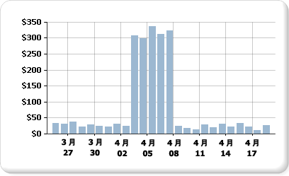

# グラフ上で複数のデータ範囲を持つ系列の表示 (レポート ビルダーおよび SSRS)
  グラフでは、軸のスケールを計算するために、系列の最小値と最大値が使用されます。 グラフ上の系列に複数のデータ範囲が含まれていると、データ ポイントが重なり合って、少数のデータ ポイントしかグラフ上ではっきりと見えない場合があります。 たとえば、毎日の売上合計を 30 日分表示するレポートがあるとします。  
  
   
  
 この月のほとんどの日の売上は 10 ～ 40 です。 しかし、1 週間実施されたセールス マーケティング キャンペーンのおかげで、売上は 4 月の初めに急増しました。 売上データがこのように変化したため、データ ポイントの分布が不均一になり、グラフが全般的に読みにくくなっています。  
  
 グラフの読みやすさは、以下のいずれかの方法で向上させることができます。  
  
-   **スケールの区切り線を有効にする**: データが 2 つ以上のデータ範囲を形成している場合は、スケール区切りを使用して、範囲間のすきまを削除します。 スケール区切りは、プロット エリアに描画される線であり、系列の高値と低値の間の区切りを示します。  
  
-   **不要な値を除外する**: グラフ上に表示する必要のある重要なデータ範囲を覆っているデータ ポイントがある場合は、レポート フィルターを使用して、不要なポイントを削除します。 [!INCLUDE[ssRSnoversion](../../includes/ssrsnoversion-md.md)] のグラフにフィルターを追加する方法の詳細については、｢[データセット フィルター、データ領域フィルター、およびグループ フィルターの追加 (レポート ビルダーおよび SSRS](../../reporting-services/report-design/add dataset filters, data region filters, and group filters.md)」を参照してください。  
  
-   **各データ範囲を複数の系列を比較するための別々の系列としてプロットする**: データ範囲が 3 つ以上ある場合は、各データ範囲を別々の系列に分離すると効果的です。 詳細については、「[グラフ上の複数の系列 (レポート ビルダーおよび SSRS)](../../reporting-services/report-design/multiple-series-on-a-chart-report-builder-and-ssrs.md)」を参照してください。  
  
> [!NOTE]  
>  [!INCLUDE[ssRBRDDup](../../includes/ssrbrddup-md.md)]  
  
## スケール区切りを使用した複数のデータ範囲の表示  
 スケール区切りを有効にすると、グラフ内のどこに区切り線を描画するかが自動的に計算されます。 データ範囲間の距離がスケール区切りを描画するのに十分であることが必要です。 既定では、スケール区切りを追加できるのは、データ範囲間の距離がグラフ全体の 25% 以上である場合のみです。  
  
   
  
> [!NOTE]  
>  グラフ上でスケール区切りを配置する場所を指定することはできません。 ただし、このトピックで後述するように、スケール区切りの計算方法は変更できます。  
  
 スケール区切りを有効にし、データ範囲間の距離が十分であるにもかかわらず、スケール区切りが表示されない場合は、CollapsibleSpaceThreshold プロパティを 25 未満の値に設定します。 CollapsibleSpaceThreshold には、データ範囲間に必要な縮小可能領域の割合を指定します。 詳細については、「[空のポイントのグラフへの追加 (レポート ビルダーおよび SSRS)](../../reporting-services/report-design/add-scale-breaks-to-a-chart-report-builder-and-ssrs.md)」を参照してください。  
  
 グラフ 1 つあたり最大 5 個のスケール区切りがサポートされています。ただし、複数のスケール区切りを表示すると、グラフが読みにくくなる場合があります。 データ範囲が 3 つ以上ある場合は、別の方法でデータを表示することを検討してください。 詳細については、「[グラフ上の複数の系列 (レポート ビルダーおよび SSRS)](../../reporting-services/report-design/multiple-series-on-a-chart-report-builder-and-ssrs.md)」を参照してください。  
  
## サポートされていないスケール区切りのシナリオ  
 以下の場合はスケール区切りを使用できません。  
  
-   グラフで 3-D が有効になっている場合  
  
-   軸の値として対数が指定されている場合  
  
-   値軸の最大値または最小値が明示的に設定されている場合  
  
-   グラフの種類が極座標グラフ、レーダー グラフ、円グラフ、ドーナツ グラフ、じょうごグラフ、ピラミッド グラフ、または積み上げグラフである場合  
  
 スケール区切り付きのグラフについては、サンプル レポートに例が含まれています。 このサンプル レポートおよびその他のサンプル レポートをダウンロードする方法の詳細については、[!INCLUDE[ssCurrent](../../includes/sscurrent-md.md)][ のレポート ビルダーおよびレポート デザイナーのサンプル レポートに関するページ](http://go.microsoft.com/fwlink/?LinkId=198283)を参照してください。  
  
## 参照  
 [グラフ上の複数の系列 (レポート ビルダーおよび SSRS)](../../reporting-services/report-design/multiple-series-on-a-chart-report-builder-and-ssrs.md)   
 [グラフの書式設定 (レポート ビルダーおよび SSRS)](../../reporting-services/report-design/formatting-a-chart-report-builder-and-ssrs.md)   
 [グラフに対する 3D、傾斜、およびその他の効果 (レポート ビルダーおよび SSRS)](../../reporting-services/report-design/3d-bevel-and-other-effects-in-a-chart-report-builder-and-ssrs.md)   
 [グラフ (レポート ビルダーおよび SSRS)](../../reporting-services/report-design/charts-report-builder-and-ssrs.md)   
 [[軸のオプション] ([軸のプロパティ] ダイアログ ボックス) (レポート ビルダーおよび SSRS)](../Topic/Axis%20Properties%20Dialog%20Box,%20Axis%20Options%20\(Report%20Builder%20and%20SSRS\).md)   
 [円グラフの小さいスライスをまとめる (レポート ビルダーおよび SSRS)](../../reporting-services/report-design/collect-small-slices-on-a-pie-chart-report-builder-and-ssrs.md)  
  
  