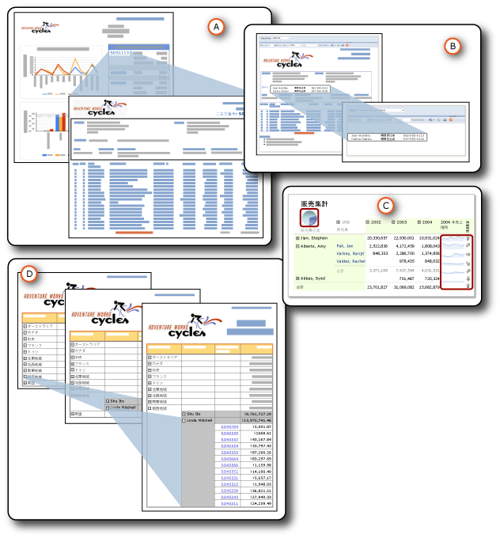

# ドリルスルー、ドリルダウン、サブレポート、および入れ子になったデータ領域
  データをさまざまな方法で整理して、概要と詳細の関係を示すことができます。  たとえば、すべてのデータをレポートに含めておき、最初は詳細データは非表示で、ユーザーがクリックすると表示するようにできます。この動作を *ドリルダウン* アクションといいます。 テーブルやグラフなどのデータ領域をテーブルやマトリックスなどの別のデータ領域内に *入れ子* にして、その入れ子になったデータ領域にデータを表示できます。 メイン レポート内に完全に含まれている *サブレポート* にデータを表示できます。 また、ユーザーがリンクをクリックすると表示される個別のレポートである *詳細* レポートに詳細データを含めることもできます。  
  
   
  
 A. 詳細レポート  
  
 B. サブレポート  
  
 C. 入れ子になったデータ領域  
  
 D. ドリルダウン アクション  
  
 これらの方法には共通点がありますが、用途も機能もそれぞれ異なります。 詳細レポートとサブレポートは、実際には別個のレポートです。 入れ子とは、特定のデータ領域を別のデータ領域内に配置する方法です。 ドリルダウンは、任意のレポート アイテムに適用して他のレポート アイテムの非表示と表示を切り替えることができるアクションです。 これらの方法はすべて、ユーザーにとってレポートが理解しやすくなるようにデータを整理して表示するためのものです。  
  
> [!NOTE]  
>  [!INCLUDE[ssRBRDDup](../../includes/ssrbrddup-md.md)]  
  
##   特性の概要  
 次の表は、各方法のさまざまな特性についてまとめたものです。 詳細については、このトピックの後半で説明します。 ドリルダウンによる表示と非表示はどのレポート アイテムにも適用できるので、この表の比較にはドリルダウンは含まれていません。  
  
|特性 (trait)|サブレポート|詳細|入れ子|  
|-----------|---------------|------------------|------------|  
|使用するデータセットがメイン レポートと同じかどうか|同じまたは別|同じまたは別|同じ|  
|データの取得方法|メイン レポートと同時にデータを取得|詳細レポートごとにデータを取得|メイン レポートと同時にすべてのデータを取得|  
|処理と表示のタイミング|メイン レポートと同時|リンクがクリックされたとき|メイン レポートと同時|  
|パフォーマンス|低速 (メイン レポートと同時にすべてのデータを取得)|高速 (メイン レポートとは別にデータを取得)|高速 (メイン レポートと同時にすべてのデータを取得)|  
|パラメーターを使用するかどうか|はい|はい|いいえ|  
|再利用できるかどうか|レポート、または他のレポートのサブレポートか詳細レポートとして再利用可|レポート、または他のレポートのサブレポートか詳細レポートとして再利用可|再利用不可|  
|置かれる場所|メイン レポートの外部、同じまたは別のレポート サーバー|メイン レポートの外部、同じレポート サーバー|メイン レポートの内部|  
|表示される場所|メイン レポート内|別のレポート内|メイン レポート内|  
  
  
##   特性の詳細  
  
###   使用するデータセット  
 サブレポートと詳細レポートでは、メイン レポートと同じデータセットを使用することも、メイン レポートとは別のデータセットを使用することもできます。 入れ子になったデータ領域では同じデータセットを使用します。  
  
###   データの取得  
 サブレポートと入れ子になったデータ領域では、メイン レポートと同時にデータを取得します。 詳細レポートでは個別に取得します。 各詳細レポートでは、ユーザーがそれぞれのリンクをクリックしたときにデータが取得されます。 メイン レポートとその下位レポートのデータを同時に取得する必要がある場合は、この違いが重要になります。  
  
###   処理と表示  
 サブレポートは、メイン レポートの一部として処理されます。 たとえば、注文明細情報を表示するサブレポートが詳細行のテーブル セルに追加された場合、サブレポートはテーブルの行ごとに一度処理され、メイン レポートの一部として表示されます。 詳細レポートは、ユーザーがメインの要約レポート内のドリルスルー リンクをクリックしたときにだけ処理および表示されます。  
  
###   パフォーマンス  
 どの方法を使用するかを決定する際は、サブレポートの代わりにデータ領域の使用を検討してください。ただし、サブレポートを複数のレポートで使用する場合はこの限りではありません。 サブレポートは、それぞれのインスタンスが個別のレポートとして処理されるので、レポート サーバーのパフォーマンスに影響することがあります。 データ領域はサブレポートと同じ機能の多くが提供され、柔軟性も同等ですが、パフォーマンスの点で優れています。 詳細レポートについても、メイン レポートとは別にデータを取得するので、サブレポートよりもパフォーマンスが優れています。  
  
###   パラメーターの使用  
 詳細レポートとサブレポートには、通常、表示するレポート データを指定するレポート パラメーターがあります。 たとえば、メイン レポートの販売注文番号をクリックすると、詳細レポートが開き、販売注文番号がパラメーターとして受け取られ、その販売注文のすべてのデータが表示されます。 メイン レポートにリンクを作成する場合は、詳細レポートにパラメーターとして渡す値を指定します。  
  
 詳細レポートまたはサブレポートを作成するには、まず対象の詳細レポートまたはサブレポートをデザインする必要があり、その後にメイン レポートに対してドリルスルー アクションを作成したり、参照を追加したりします。  
  
###   再利用性  
 サブレポートと詳細レポートは別個のレポートです。 したがって、これらのレポートは多数のレポートで使用することも、スタンドアロンのレポートとして表示することもできます。 入れ子になったデータ領域は再利用できません。 このデータ領域は別のデータ領域内に入れ子になっているので、レポート パーツとして保存することはできません。 入れ子になったデータ領域を格納しているデータ領域はレポート パーツとして保存できますが、入れ子になったデータ領域は保存できません。  
  
###   場所  
 サブレポートと詳細レポートはどちらも別個のレポートであるため、メイン レポートの外部に保存されます。 サブレポートは同じレポート サーバーと別のレポート サーバーのどちらにあってもかまいませんが、詳細レポートは同じレポート サーバー上にある必要があります。 入れ子になったデータ領域はメイン レポートの一部です。  
  
###   表示  
 サブレポートと入れ子になったデータ領域は、メイン レポート内に表示されます。 詳細レポートは個別に表示されます。  
  
  
##   トピックの内容  
 [詳細レポート (レポート ビルダーおよび SSRS)](../../reporting-services/report-design/drillthrough-reports-report-builder-and-ssrs.md)  
 ユーザーがメイン レポート内のリンクをクリックすると開くレポートについて説明します。  
  
 [サブレポート (レポート ビルダーおよび SSRS)](../../reporting-services/report-design/subreports-report-builder-and-ssrs.md)  
 メイン レポートの本文内に表示されるレポートについて説明します。  
  
 [入れ子になったデータ領域 (レポート ビルダーおよび SSRS)](../../reporting-services/report-design/nested-data-regions-report-builder-and-ssrs.md)  
 マトリックス内に入れ子になっているグラフなど、データ領域を別のデータ領域に入れ子にする方法について説明します。  
  
 [ドリルダウン アクション (レポート ビルダーおよび SSRS)](../../reporting-services/report-design/drilldown-action-report-builder-and-ssrs.md)  
 ドリルダウン アクションによるレポート アイテムの表示と非表示の切り替えについて説明します。  
  
 [外部アイテムへのパスの指定 (レポート ビルダーおよび SSRS)](../../reporting-services/report-design/specifying-paths-to-external-items-report-builder-and-ssrs.md)  
 レポート定義ファイルの外部にあるアイテムを参照する方法について説明します。  
  
## 参照  
 [レポート パラメーター (レポート ビルダーおよびレポート デザイナー)](../../reporting-services/report-design/report-parameters-report-builder-and-report-designer.md)  
  
  
