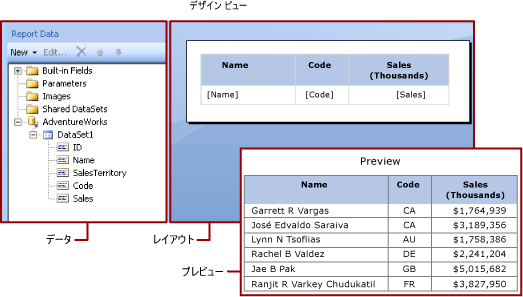
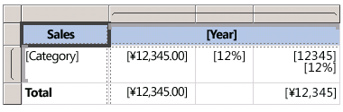

# 式 (レポート ビルダーおよび SSRS)
  式は [!INCLUDE[ssRSnoversion_md](../../includes/ssrsnoversion-md.md)] のページ分割されたレポート全体にわたって、データの取得、計算、表示、グループ化、並べ替え、フィルター処理、パラメーター化、書式設定などのために広く使用されます。 
  
  レポート アイテムのプロパティの多くには、式を設定できます。 式を使用すると、レポートの内容、デザイン、対話性を制御できます。 式は [!INCLUDE[msCoName](../../includes/msconame-md.md)] [!INCLUDE[vbprvb](../../includes/vbprvb-md.md)]で作成され、レポート定義に保存され、レポートの実行時にレポート プロセッサによって評価されます。  
  
 ワークシート内で直接データを操作する [!INCLUDE[msCoName](../../includes/msconame-md.md)] Office Excel などのアプリケーションとは異なり、レポートではデータのプレースホルダーとなる式を操作します。 評価された式の値から実際のデータを確認するには、レポートをプレビューする必要があります。 レポートの実行時に、レポート プロセッサーはテーブルやグラフなどのレポート データ要素とレポート レイアウト要素を組み合わせて、それぞれの式を評価します。  
  
 レポートをデザインする場合、レポート アイテムの式の多くは、自動的に設定されます。 たとえば、データ ペインからレポート デザイン画面のテーブル セルにフィールドをドラッグすると、そのフィールドのテキスト ボックスの値には単純式が設定されます。 次の図では、レポート データ ペインに、データセット フィールドの ID、Name、SalesTerritory、Code、および Sales が表示されています。 テーブルに [Name]、[Code]、[Sales] の 3 つのフィールドが追加されています。 デザイン画面上の [Name] の表記は基になる式 `=Fields!Name.Value`を表しています。  
  
   
  
 レポートをプレビューすると、レポート プロセッサーによってテーブル データ領域がデータ接続からの実際のデータと結合され、結果セット内の各行に対してテーブル内に行が表示されます。  
  
 式を手動で入力するには、デザイン画面でアイテムを選択し、ショートカット メニューおよびダイアログ ボックスを使用して、アイテムのプロパティを設定します。 ***[fx]*** ボタンが表示されている場合、またはドロップダウン リストに値 `<Expression>` が表示されている場合、式のプロパティを設定できます。 詳細については、「 [式の追加 (レポート ビルダーおよび SSRS)](../../reporting-services/report-design/add-an-expression-report-builder-and-ssrs.md)を表しています。  
  
 複合式、またはカスタム コードやカスタム アセンブリを使った式を作成するには、 [!INCLUDE[ssBIDevStudioFull](../../includes/ssbidevstudiofull-md.md)]でレポート デザイナーを使用することをお勧めします。 詳細については、「 [レポート デザイナーでカスタム コードやアセンブリを式から参照する (SSRS)](../../reporting-services/report-design/custom-code-and-assembly-references-in-expressions-in-report-designer-ssrs.md)を表しています。  
  
> [!NOTE]  
>  [!INCLUDE[ssRBRDDup](../../includes/ssrbrddup-md.md)]  
  
##   単純式と複合式について  
 式は等号 (=) で始まり、 [!INCLUDE[msCoName](../../includes/msconame-md.md)] [!INCLUDE[vbprvb](../../includes/vbprvb-md.md)]に書き込まれます。 式には、定数、演算子、および組み込みの値 (フィールド、コレクション、および関数) への参照、拡張またはカスタム コードへの参照の組み合わせを含むことができます。  
  
 式を使用すると、多くのレポート アイテム プロパティの値を指定できます。 最も一般的なプロパティは、テキスト ボックスとプレースホルダーのテキストの値です。 通常、テキスト ボックスに 1 つの式しか含まれていない場合、その式がテキスト ボックス プロパティの値となります。 テキスト ボックスに複数の式が含まれている場合は、各式がテキスト ボックス内のプレースホルダー テキストの値となります。  
  
 既定では、式はレポートのデザイン画面に *単純式* または *複合式*として表示されます。  
  
-   **単純** 組み込みコレクション (データセット フィールド、パラメーター、または組み込みフィールドなど) 内の 1 つのアイテムへの参照を含む単純式です。 デザイン画面では、単純式は角かっこ内に表示されます。 たとえば、 `[FieldName]` は基となる式 `=Fields!FieldName.Value`に対応します。 単純式は、レポート レイアウトを作成し、[レポート データ] ペインからデザイン画面にアイテムをドラッグする際に自動的に作成されます。 さまざまな組み込みコレクションを表す記号の詳細については、「 [単純式でのプレフィックス記号について](#DisplayText)」を参照してください。  
  
-   **複合** 複合式には、複数の組み込み参照、演算子、および関数呼び出しへの参照が含まれます。 式の値に単純な参照が複数含まれる場合、複合式は <\<Expr>> として表示されます。 式を表示するには、その上にカーソルを合わせ、ツールヒントを使用します。 式を編集するには、 **[式]** ダイアログ ボックスでそれを開きます。  
  
 次の図は、テキスト ボックスおよびプレースホルダー テキストの両方の典型的な単純式と複合式を示しています。  
  
   
  
 式のテキストではなくサンプル値を表示するには、テキスト ボックスまたはプレースホルダー テキストに書式を適用します。 次の図は、サンプル値に切り替えられたレポートのデザイン画面を示しています。  
  
   
  
 詳細については、「 [テキストとプレースホルダーの書式設定 &#40;レポート ビルダーおよび SSRS&#41;](../../reporting-services/report-design/formatting-text-and-placeholders-report-builder-and-ssrs.md)」を参照してください。  
  
##  単純式でのプレフィックス記号について  

単純式では、記号を使用して、参照先 (フィールド、パラメーター、組み込みコレクション、または ReportItems コレクション) を示します。 表示テキストおよび式のテキストの例を次の表に示します。  
  
|アイテム|表示テキストの例|式のテキストの例|  
|----------|--------------------------|-----------------------------|  
|データセット フィールド|`[Sales]`   `[SUM(Sales)]`   `[FIRST(Store)]`|`=Fields!Sales.Value`   `=Sum(Fields!Sales.Value)`   `=First(Fields!Store.Value)`|  
|レポート パラメーター|`[@Param]`   `[@Param.Label]`|`=Parameters!Param.Value`   `=Parameters!Param.Label`|  
|組み込みフィールド|`[&ReportName]`|`=Globals!ReportName.Value`|  
|表示テキストに使用されるリテラル文字|`\[Sales\]`|`[Sales]`|  
  
##   複合式の作成  
 式には、関数、演算子、定数、フィールド、パラメーター、組み込みコレクションのアイテム、および埋め込みのカスタム コードまたはカスタム アセンブリへの参照を含めることができます。  
  
> [!NOTE]
>  複合式、またはカスタム コードやカスタム アセンブリを使った式を作成するには、 [!INCLUDE[ssNoVersion](../../includes/ssnoversion-md.md)][!INCLUDE[ssBIDevStudioFull](../../includes/ssbidevstudiofull-md.md)]でレポート デザイナーを使用することをお勧めします。 詳細については、「 [レポート デザイナーでカスタム コードやアセンブリを式から参照する (SSRS)](../../reporting-services/report-design/custom-code-and-assembly-references-in-expressions-in-report-designer-ssrs.md)を表しています。  
  
 次の表に、式に含めることのできる参照の種類の一覧を示します。  
  
|References|[説明]|例|  
|----------------|-----------------|-------------|  
|[定数](../../reporting-services/report-design/constants-in-expressions-report-builder-and-ssrs.md)|定数値を必要とするプロパティ (フォントの色など) に対話的にアクセスできる定数について説明します。|`="Blue"`|  
|[演算子](../../reporting-services/report-design/operators-in-expressions-report-builder-and-ssrs.md)|式の中で参照を組み合わせる際に使用できる演算子について説明します。 たとえば、 **&** 演算子は、文字列を連結する場合に使用されます。|`="The report ran at: " & Globals!ExecutionTime & "."`|  
|[組み込みコレクション](../../reporting-services/report-design/built-in-collections-in-expressions-report-builder.md)|式に含めることができる組み込みコレクション ( `Fields`、 `Parameters`、 `Variables`など) について説明します。|`=Fields!Sales.Value`   `=Parameters!Store.Value`   `=Variables!MyCalculation.Value`|  
|[組み込みのレポート関数と集計関数](../../reporting-services/report-design/report-builder-functions-aggregate-functions-reference.md)|式からアクセスできる、 `Sum` や `Previous`などの組み込み関数について説明します。|`=Previous(Sum(Fields!Sales.Value))`|  
|[レポート デザイナーでカスタム コードやアセンブリを式から参照する (SSRS)](../../reporting-services/report-design/custom-code-and-assembly-references-in-expressions-in-report-designer-ssrs.md)|組み込みの CLR クラス <xref:System.Math> と <xref:System.Convert>、その他の CLR クラス、 [!INCLUDE[vbprvb](../../includes/vbprvb-md.md)] ランタイム ライブラリ関数、または外部アセンブリのメソッドにアクセスする方法について説明します。   レポート内に埋め込まれているカスタム コード、またはレポート クライアントとレポート サーバーの両方でカスタム アセンブリとしてコンパイルしてインストールするカスタム コードへのアクセス方法について説明します。|`=Sum(Fields!Sales.Value)`   `=CDate(Fields!SalesDate.Value)`   `=DateAdd("d",3,Fields!BirthDate.Value)`   `=Code.ToUSD(Fields!StandardCost.Value)`|  
   
##   式の検証  
 特定のレポート アイテム プロパティの式を作成する場合、式に含めることのできる参照は、レポート アイテム プロパティで受け入れられる値と、プロパティの評価のスコープによって異なります。 例:  
  
-   既定では、式 [Sum] は式の評価時のスコープ内のデータの合計を計算します。 テーブル セルの場合、スコープは行と列のグループ メンバーシップによって異なります。 詳細については、「 [合計、集計、および組み込みコレクションの式のスコープ (レポート ビルダーおよび SSRS)](../../reporting-services/report-design/expression-scope-for-totals-aggregates-and-built-in-collections.md)を表しています。  
  
-   Font プロパティの値については、値はフォント名に評価される必要があります。  
  
-   式の構文はデザイン時に検証されます。 式のスコープの検証は、レポートのパブリッシュ時に行われます。 実際のデータに依存する検証の場合、エラーは実行時にしか検出されません。 これらの式の一部では、レンダリングされたレポートでエラー メッセージとして #Error が生成されます。 この種類のエラーの問題を特定するためには、 [!INCLUDE[ssBIDevStudioFull](../../includes/ssbidevstudiofull-md.md)]でレポート デザイナーを使用する必要があります。 レポート デザイナーの出力ウィンドウには、これらのエラーの詳細が示されます。  
  
 詳細については、「 [式のリファレンス (レポート ビルダーおよび SSRS)](../../reporting-services/report-design/expression-reference-report-builder-and-ssrs.md)を表しています。  
  
##   トピックの内容  
 [式の追加 (レポート ビルダーおよび SSRS)](../../reporting-services/report-design/add-an-expression-report-builder-and-ssrs.md)  
  
 [レポートでの式の使用 (レポート ビルダーおよび SSRS)](../../reporting-services/report-design/expression-uses-in-reports-report-builder-and-ssrs.md)  
  
 [合計、集計、および組み込みコレクションの式のスコープ (レポート ビルダーおよび SSRS)](../../reporting-services/report-design/expression-scope-for-totals-aggregates-and-built-in-collections.md)  
  
 [式のリファレンス (レポート ビルダーおよび SSRS)](../../reporting-services/report-design/expression-reference-report-builder-and-ssrs.md)  

## 参照
 詳細と例については、次のトピックを参照してください。  
  
-   [レポートでの式の使用 (レポート ビルダーおよび SSRS)](../../reporting-services/report-design/expression-uses-in-reports-report-builder-and-ssrs.md)  
-   [式の例 (レポート ビルダーおよび SSRS)](../../reporting-services/report-design/expression-examples-report-builder-and-ssrs.md)  
-   [フィルター式の例 (レポート ビルダーおよび SSRS)](../../reporting-services/report-design/filter-equation-examples-report-builder-and-ssrs.md)  
-   [グループ式の例 &#40;レポート ビルダーおよび SSRS&#41;](../../reporting-services/report-design/group-expression-examples-report-builder-and-ssrs.md)  
-   [チュートリアル: 式の概要](Tutorial:%20Introducing%20Expressions.md)
-   [レポート サンプル (レポート ビルダーおよび SSRS)](https://go.microsoft.com/fwlink/?LinkId=198283)  
  
