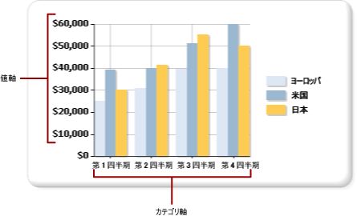

# グラフの軸ラベルの書式設定 (レポート ビルダーおよび SSRS)
  座標ベースのグラフ (縦棒グラフ、横棒グラフ、面グラフ、散布図、線グラフ、および範囲グラフ) では、2 本の軸を使用してデータ間の関係を分類および表示します。 それぞれの軸には、異なる書式が適用されます。  
  
 軸の書式設定を行うには、 **[軸のプロパティ]** ダイアログ ボックスを使用するか、[プロパティ] ペインを使用します。 書式を設定する軸を右クリックして、 **[軸のプロパティ]** をクリックし、軸のテキスト、数値と日付の形式、目盛りと補助目盛り、ラベルの自動調整、および軸線の幅、色、スタイルに関する値を変更します。 軸のタイトルの値を変更するには、軸のタイトルを右クリックして、 **[軸のタイトルのプロパティ]** をクリックします。  
  
 軸ラベルによって、グラフのグリッド線の間隔が指定されます。 既定では、テキストが重ならないようラベルを軸上で適切に配置する方法を決定するためのアルゴリズムが使用されます。  
  
> [!NOTE]  
>  [!INCLUDE[ssRBRDDup](../../includes/ssrbrddup-md.md)]  
  
## 軸の種類  
 グラフには、値軸とカテゴリ軸という 2 本の主軸があります。  
  
   
  
 データセットのフィールドをグラフ上にドラッグすると、グラフでは、そのフィールドがカテゴリ軸と値軸のどちらに属するかが決定されます。  
  
 値軸は、通常、グラフの縦軸 (Y 軸) です。 これは、グラフ化される数値データの値を表示するために使用されます。 データ フィールドの領域にドラッグされたフィールドは、値軸にプロットされます。 カテゴリ軸は、通常、グラフの横軸 (X 軸) です。 横棒グラフの場合、これらの軸は逆になります。 横棒グラフでは、カテゴリ軸が縦軸、値軸が横軸になります。 詳細については、「 [横棒グラフ &#40;レポート ビルダーおよび SSRS&#41;](../../reporting-services/report-design/bar-charts-report-builder-and-ssrs.md)」を参照してください。  
  
## グラフで軸ラベルの間隔を計算する方法  
 軸ラベルの書式を設定する前に、グラフで軸ラベルの間隔がどのように計算されるかを理解する必要があります。 これにより、目的とする軸のラベル付け動作を実現するのに必要なプロパティを設定できます。  
  
 軸のスケールは、軸上に表示するデータ範囲を定義するための最小値と最大値によって決定されます。 グラフでは、結果セットの値に基づいて各軸の最小値と最大値が計算されます。 値軸では、スケールは常に値フィールドの最大値と最小値によって決まります。 カテゴリ軸では、最小値と最大値の型がカテゴリ フィールドの型に応じて決まります。 データセット内のすべてのフィールドは、カテゴリ フィールドの 3 つの型のいずれかに分類できます。 次の表では、カテゴリ フィールドの 3 つの型を説明しています。  
  
|カテゴリ フィールドの型|[説明]|例|  
|-------------------------|-----------------|-------------|  
|数値|カテゴリは、X 軸に数値順にプロットされます。|従業員の ID 番号別の売上レポートでは、従業員の ID 番号が X 軸に表示されます。|  
|日付/時刻|カテゴリは、X 軸に日時順にプロットされます。|月別の売上レポートでは、書式設定された日付が X 軸に表示されます。|  
|文字列|カテゴリは、データ ソースで最初に出現した順序で X 軸にプロットされます。|地域別の売上レポートでは、地域名が X 軸に表示されます。|  
  
 2 本の軸を使用するすべての種類のグラフは、カテゴリの数が多すぎて収まらない場合に、一部の軸ラベルを非表示にするようにデザインされています。これにより、グラフ内の画像が見やすくなり、ラベルの重なりが回避されます。  
  
 アプリケーションでは、次の手順に従って、軸上のラベルの位置が計算されます。  
  
1.  結果セットの値に基づいて、最小値と最大値が指定されます。  
  
2.  指定された最小値と最大値に基づいて、等間隔に設定された、軸の間隔の数 (通常 4 ～ 6) が計算されます。  
  
3.  軸ラベルのプロパティに基づいて、ラベルがその間隔で表示されます。 ラベルの配置に影響するプロパティには、フォント サイズ、ラベルが表示される角度、およびテキストの折り返しのプロパティなどがあります。 このような軸ラベル自動調整オプションは変更できます。  
  
### グラフの軸ラベルの計算方法の例  
 次の表には、縦棒グラフにプロットされる売上データのサンプルが含まれています。 Name フィールドは [カテゴリ グループ] 領域に追加され、Quantity フィールドは [値] 領域に追加されます。  
  
|[オブジェクト名]|Quantity|  
|----------|--------------|  
|Michael Blythe|229|  
|Jae Pak|112|  
|Ranjit Varkey Chudukatil|494|  
|Jillian Carson|247|  
|Linda Mitchell|339|  
|Rachel Valdez|194|  
  
 Quantity フィールドは値軸にプロットされます。 最小値は 112、最大値は 494 になります。 この場合、スケールは 0 から始まり 500 で終わるように計算されます。 また、等間隔に設定された 5 つの間隔が 100 と計算され、0、100、200、300、400、および 500 にラベルが作成されます。  
  
 Name フィールドはカテゴリ軸にプロットされます。 グラフでは、4 ～ 6 個のラベルが計算され、ラベルが重ならないようにカテゴリ軸でラベルを調整する方法を決定する自動調整設定が計算されます。 その結果、一部のカテゴリ ラベルは省略される場合があります。 各軸の自動調整オプションを個別にオーバーライドすることができます。  
  
## カテゴリ軸のすべてのラベルの表示  
 値軸では、軸の間隔により、グラフ上のデータ ポイントに一貫性のある基準が提供されます。 ただしカテゴリ軸では、この機能により、軸ラベルなしでカテゴリが表示されることがあります。 ところが、カテゴリにはすべてラベルを付けるのが普通です。 間隔数を 1 に設定すると、すべてのカテゴリを表示できます。  詳細については、「 [軸の間隔の指定 &#40;レポート ビルダーおよび SSRS&#41;](../../reporting-services/report-design/specify-an-axis-interval-report-builder-and-ssrs.md)をクリックします。  
  
> [!NOTE]  
>  ラベルの自動調整機能を使用せずに手動で軸の間隔を設定した場合、これに応じてグラフでは、他のすべての要素をサイズ変更する必要が生じます。 その結果、ラベルのサイズと配置、またはグラフ上の他の要素のサイズに関して、予期しない結果が生じる可能性があります。  
  
## 軸の可変間隔  
 グラフでは、グラフのサイズに関係なく、約 5 個の軸ラベルの間隔が計算されます。 幅の広いグラフや高さのあるグラフでは、軸上にラベルが 5 個しかない場合、各ラベル間の空白部分が大きくなる場合があります。 このような場合、軸に対して各データ ポイントの値を特定することが難しくなります。 幅の広いグラフや高さのあるグラフでこの状況を回避するには、軸の可変間隔を設定できます。 グラフでは、対応する軸に応じ、グラフの幅または高さに基づいて、軸に表示されるラベルの最適な数が計算されます。 詳細については、「 [軸の間隔の指定 &#40;レポート ビルダーおよび SSRS&#41;](../../reporting-services/report-design/specify-an-axis-interval-report-builder-and-ssrs.md)をクリックします。  
  
## 軸の値の並べ替え  
 カテゴリは、結果セットに出現する順序で X 軸に表示されます。 グループの順序を変更するには、SORT コマンドをクエリに追加するか、式を使用してデータセットを並べ替えます。 グラフ データ領域は、その他のすべてのデータ領域と同じように並べ替えることができます。 データを並べ替える方法の詳細については、「[データ領域内のデータの並べ替え &#40;レポート ビルダーおよび SSRS&#41;](../../reporting-services/report-design/sort-data-in-a-data-region-report-builder-and-ssrs.md)」をご覧ください。  
  
## カテゴリ軸でのスカラー値の指定  
 既定では、グラフに表示されるのは、有効な値が含まれているデータセット内のデータ ポイントに対する軸ラベルだけです。 たとえば、カテゴリ軸に 1、2、6 という値を設定した場合、グラフには 1、2、6 というカテゴリのみが表示されます。 カテゴリ値のスケールを保つために、グラフでスカラー軸が使用されるように指定できます。 この場合は、データセットに 3 ～ 5 の値が含まれていなくても、グラフの X 軸に 1 ～ 6 のラベルが表示されます。  
  
 スカラー軸を設定するには、次の 2 つの方法があります。  
  
-   **[軸のプロパティ]** ダイアログ ボックスの **[スカラー軸]** チェック ボックスをオンにします。 これにより軸上で、データをグループ化する値が存在しない箇所に、数値または日付/時刻値が追加されます。 詳細については、「[[軸のプロパティ] ダイアログ ボックス、[軸のオプション] &#40;レポート ビルダーおよび SSRS&#41;](https://msdn.microsoft.com/library/b276e210-7a12-48ae-971b-7dabae51df11)」をご覧ください。  
  
-   **[系列のプロパティ]** ダイアログ ボックスの **[カテゴリ フィールド]** オプションで、フィールドを選択するか、式を入力します。 グラフでは、指定したカテゴリ フィールドのすべての値に対して軸の間隔が追加されます。  
  
## カテゴリ軸の横余白の追加または削除  
 横棒グラフ、縦棒グラフ、および散布図では、横余白が X 軸の両端に自動的に追加されます。 余白のサイズは変更できません。 その他すべての種類のグラフでは、横余白は追加されません。 詳細については、「 [グラフの余白の追加または削除 &#40;レポート ビルダーおよび SSRS&#41;](../../reporting-services/report-design/add-or-remove-margins-from-a-chart-report-builder-and-ssrs.md)をクリックします。  
  
## このセクションの内容  
 [日付または通貨として軸ラベルを書式設定する &#40;レポート ビルダーおよび SSRS&#41;](../../reporting-services/report-design/format-axis-labels-as-dates-or-currencies-report-builder-and-ssrs.md)  
  
 [グラフへのラベルの配置 &#40;レポート ビルダーおよび SSRS&#41;](../../reporting-services/report-design/position-labels-in-a-chart-report-builder-and-ssrs.md)  
  
 [軸の間隔の指定 &#40;レポート ビルダーおよび SSRS&#41;](../../reporting-services/report-design/specify-an-axis-interval-report-builder-and-ssrs.md)  
  
 [グラフの余白の追加または削除 &#40;レポート ビルダーおよび SSRS&#41;](../../reporting-services/report-design/add-or-remove-margins-from-a-chart-report-builder-and-ssrs.md)  
  
 [対数スケールの指定 &#40;レポート ビルダーおよび SSRS&#41;](../../reporting-services/report-design/specify-a-logarithmic-scale-report-builder-and-ssrs.md)  
  
## 参照  
 [グラフの書式設定 (レポート ビルダーおよび SSRS)](../../reporting-services/report-design/formatting-a-chart-report-builder-and-ssrs.md)   
 [グラフ &#40;レポート ビルダーおよび SSRS&#41;](../../reporting-services/report-design/charts-report-builder-and-ssrs.md)   
 [グラフでのデータ ポイントの書式設定 &#40;レポート ビルダーおよび SSRS&#41;](../../reporting-services/report-design/formatting-data-points-on-a-chart-report-builder-and-ssrs.md)  
  
  
