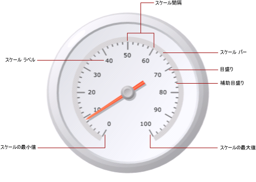
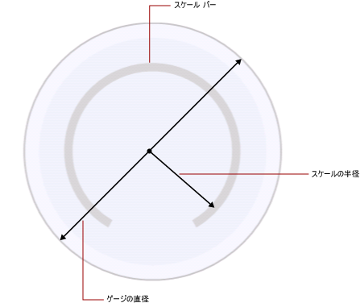

# ゲージのスケールの書式設定 (レポート ビルダーおよび SSRS)
  [!INCLUDE[ssRSnoversion_md](../../includes/ssrsnoversion-md.md)] の改ページ調整されたレポートでは、ゲージのスケールは、最小値と最大値で決められた範囲の数値であり、ゲージ上に表示されます。 通常、ゲージのスケールにはゲージ ラベルと目盛りがあり、ゲージ ポインターによって示された値を正確に読み取れるようになっています。 1 つのゲージ スケールに 1 つまたは複数のゲージ ポインターが関連付けられているのが普通です。 同じゲージに複数のスケールを指定できます。  
  
   
  
 複数のグループが定義されるグラフとは異なり、ゲージには 1 つの値しか表示されません。 スケールの最小値と最大値を定義する必要があります。 間隔の数は、最小値と最大値として指定された値に基づいて自動的に計算されます。  
  
 既に 1 つのスケールがあるゲージに 2 番目のスケールを追加すると、最初のスケールの外観プロパティが 2 番目のスケールに複製されます。  
  
 スケールのプロパティを設定するには、スケールのラベルまたは目盛りを右クリックし、 **[放射状スケールのプロパティ]** または **[線形スケールのプロパティ]** を選択します。 それぞれの種類のゲージには、同じプロパティ セットを持つスケールが少なくとも 1 つ含まれます。 また、それぞれの種類のゲージに固有のプロパティもあります。  
  
-   放射状ゲージでは、放射状スケールの半径、開始角度、および掃引角度を指定できます。  
  
-   線形ゲージでは、線形ゲージ上のエンドポイントを基準とする開始余白および終了余白の幅を指定できます。  
  
 スケールの書式設定をすぐに使用する場合は、「[ゲージへの最小値または最大値の設定 (レポート ビルダーおよび SSRS)](../../reporting-services/report-design/set-a-minimum-or-maximum-on-a-gauge-report-builder-and-ssrs.md)」を参照してください。  
  
##   スケールの最小値、最大値、間隔の定義  
 ゲージは 0 ～ 100 のパーセンテージで計測される KPI の表示に使用されることが多く、ゲージの最小値と最大値のプロパティの既定値にはこれらの値が指定されています。 ただし、これらの値は、表示しようとする値のスケールを表していないことがあります。 KPI データ フィールドによって示される値を判断するロジックは組み込まれていないので、ゲージでは最小値および最大値が自動的に計算されません。 KPI データ フィールドの値が 0 ～ 100 の範囲でない場合は、ゲージに表示される 1 つの値にコンテキストを指定するために最小値および最大値のプロパティの値を明示的に設定する必要があります。  
  
 スケールには、目盛りと補助目盛りがあります。 また、目盛りにはラベルが付けられているのが普通です。 たとえば、スケールには 0、20、40、60、80、および 100 の目盛りがあります。 ラベルはそれらの目盛りに対応している必要があります。 ラベルの値の差をスケール間隔と言います。 この例では、スケール間隔は 20 に設定されます。 間隔のプロパティは、 **[放射状スケールのプロパティ]** ダイアログ ボックスまたは **[線形スケールのプロパティ]** ダイアログ ボックスで設定できます。  
  
 アプリケーションでは、次の手順に従ってスケール間隔を計算します。  
  
1.  最小値と最大値を指定します。 これらの値はデータ セットに基づいて自動的に計算されないので、ゲージの **[プロパティ]** ダイアログ ボックスで値を指定する必要があります。  
  
2.  間隔の値を指定しない場合、既定値は Auto です。この場合、最初の手順で指定された最小値と最大値に基づいて、等間隔の数値がアプリケーションによって計算されます。 間隔の値を指定した場合は、ゲージで最大値と最小値の差が計算され、その数が間隔のプロパティに指定された値で除算されます。  
  
 ラベルおよび目盛りの間隔を定義するプロパティもあります。 これらのプロパティの値を指定すると、スケール間隔のプロパティとして指定された値はオーバーライドされます。 たとえば、スケール間隔が Auto で、ラベルの間隔に 4 を指定した場合、ラベルは 0、4、8 などと表示されますが、目盛りはゲージ固有の計算に基づいて算出されます。 これによって、ラベルと目盛りが同期しないという状況が生じます。 ラベルの間隔を設定する場合は、目盛りを非表示にすることを考慮してください。  
  
 最初のラベルが表示される前に、スキップされる単位の数が間隔のオフセットによって決まります。 スケールに表示される後続の目盛りおよびラベルはすべて、指定された間隔を使用します。 ラベルまたは目盛りの間隔を 0 にした場合は、間隔を Auto にリセットした場合と同じです。  
  
##   乗数によるラベルの重なりの解消  
 値の桁数が多い場合は、ゲージが読みにくくなることがあります。 スケールの乗数を使用することで、値のスケールを大きくしたり小さくしたりできます。 スケールの乗数を指定した場合、スケールの元の値はスケールに表示される前に乗数によって乗算されます。 値のスケールを小さくするには、小数を指定する必要があります。 たとえば、スケールが 0 ～ 10000 のときにゲージに 0 ～ 10 と表示する場合、0.001 の乗数を使用します。  
  
> [!NOTE]  
>  乗数を使用しても、ゲージで使用される集計フィールドの実際の値は乗算されません。 乗数は、最小値、最大値、および間隔が定義された後に、ゲージに表示されるラベルの値にのみ乗算されます。 乗数を使用する場合、間隔の計算は自動のままにしてください。  
  
##   放射状スケールのスケール バーの幅、半径、および角度の指定  
 **[放射状スケールのプロパティ]** ダイアログ ボックスの **[レイアウト]** ページを使用すると、スケール バーの幅、スケールの半径、スケールの開始角度および掃引角度を設定できます。 これらのプロパティを使用して、スケールのサイズおよび書式をカスタマイズできます。 たとえば、スケールの外側にスケール ラベルを配置する場合、ゲージの内側にラベルが収まるようにスケールの半径のサイズを変更する必要があります。  
  
> [!NOTE]  
>  ゲージのスケールをクリックすると、点線のアウトラインがスケールの周囲に表示されます。 このアウトラインはスケール バーではなく、ゲージ上で計測値を計算するときには使用されません。 アウトラインはデザイン時にのみ使用でき、スケールのプロパティにアクセスするためにスケールを強調表示できます。  
  
 すべての測定値は、スケール バーを基準にしています。 ゲージを選択すると、スケール バーの幅は表示されません。 スケール バーの値を指定すると、スケールを基準にした他のすべての測定値にも効果があります。 スケール バーを表示するには、 **[放射状スケールのプロパティ]** ダイアログ ボックスの **[レイアウト]** ページで、 **[スケール バーの幅]** プロパティを 0 より大きな値に設定します。 放射状ゲージでは、スケール バーはゲージの直径に対する比率として計測されます。 線形ゲージでは、スケール バーはゲージの幅または高さのいずれか小さい方に対する比率として計測されます。  
  
 スケールの半径は、ゲージの中心からスケール バーの中央までの距離です。 スケールの半径の値は、ゲージの直径に対する比率として計測されます。 スケールの半径は、35 より小さな値にすることをお勧めします。 35 よりも大きな値を指定した場合は、スケールがゲージの境界の外側に表示される場合があります。 次の図は、スケールの半径がスケール バー上でゲージの直径を基準にしてどのように計測されるかを示しています。  
  
   
  
 開始角度は、スケールが開始される回転角度で、0 ～ 360 の間です。 ゼロ (0) の位置はゲージの一番下で、開始角度は時計回りに回転した角度です。 たとえば、開始角度が 90 度であれば、スケールは 9 時の位置から始まります。  
  
 掃引角度は、スケールが円弧を描く角度で、0 ～ 360 の間です。 掃引角度が 360 度の場合、スケールは完全な円になります。 これは、時計のようなゲージをデザインする場合に便利です。  
  
##   線形スケールまたは放射状スケールへのラベルの配置  
 ラベルの位置を決定する 2 つのプロパティがあります。 ラベル配置のプロパティでは、ラベルをスケール バーの内側や外側に表示するか、またはスケール バーと交差するように表示するかを指定します。 距離のプロパティでは、スケール バーを起点にして、スケールからラベルまでの距離を設定します。 スケール バーの内側にラベルを配置するには、負の数を指定します。 たとえば、ラベルがスケールの外側にあり、スケールからの距離を 10 に設定している場合、ラベルは通常の場所の 10 単位外側に表示されます。このとき、1 単位は次のいずれかの値になります。  
  
-   放射状ゲージのゲージの直径の 1%。  
  
-   線形ゲージのゲージの高さまたは幅の最小値の 1%。  
  
## 参照  
 [ゲージの範囲の書式設定 (レポート ビルダーおよび SSRS)](../../reporting-services/report-design/formatting-ranges-on-a-gauge-report-builder-and-ssrs.md)   
 [ゲージのポインターの書式設定 (レポート ビルダーおよび SSRS)](../../reporting-services/report-design/formatting-pointers-on-a-gauge-report-builder-and-ssrs.md)   
 [日付または通貨として軸ラベルを書式設定する &#40;レポート ビルダーおよび SSRS&#41;](../../reporting-services/report-design/format-axis-labels-as-dates-or-currencies-report-builder-and-ssrs.md)   
 [グラフの軸ラベルの書式設定 (レポート ビルダーおよび SSRS)](../../reporting-services/report-design/formatting-axis-labels-on-a-chart-report-builder-and-ssrs.md)   
 [ゲージ (レポート ビルダーおよび SSRS)](../../reporting-services/report-design/gauges-report-builder-and-ssrs.md)  
  
  
