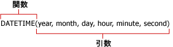

# レポート モデル クエリの数式 (レポート ビルダーおよび SSRS)
  レポート モデルをデータ ソースとして使用するレポートでは、式の計算が値に対して実行されます。 レポート モデル データ ソースのクエリを定義する際に、レポート モデル クエリ デザイナーの **[式の定義]** ダイアログ ボックスで式を定義します。 式には、関数、演算子、定数、フィールドまたはエンティティの参照を含めることができます。 式を使用すると、数値データとテキスト データの結合、集計、フィルター、および評価を行うことができます。 式を作成して新しいフィールドとして保存することも、既存のフィールドの式を変更することもできます。  
  
 RDL の式とは異なり、先頭に等号 (=) は付きません。 RDL の式については、「[式 &#40;レポート ビルダーおよび SSRS&#41;](../../reporting-services/report-design/expressions-report-builder-and-ssrs.md)」を参照してください。  
  
 式には次のようなものがあります。  
  
-   **Sum Line Total**  
  
-   6+12  
  
-   **SUM**(**IF**(**Finished Goods Flag**, "Finished", "Unfinished"))  
  
> [!NOTE]  
>  [!INCLUDE[ssRBRDDup](../../includes/ssrbrddup-md.md)]  
  
## References  
 参照はフィールド名です。 エンティティ内の既存のフィールド名か、作成して [フィールド] ボックスの一覧に追加した計算フィールド名を指定できます。 参照を指定すると、式内で使用する値 (データ) の検索場所がレポート ビルダーに指示されます。 コンテキスト エンティティ内のフィールドや、1 つの式内にある他のエンティティのフィールドを参照することも、複数の式で 1 つのフィールドからの値を使用することもできます。  
  
 参照を使用した場合、フィールドに格納されている各値に対して式が実行されます。 たとえば、フィールドに過去 5 年間の年間売上合計が含まれているとします。 このフィールドには 5 つの値があり、それぞれの値が各年の売上合計額を表しています。 式にこのフィールドへの参照が含まれている場合、個々の値を使用して新しい値が算定されます。  
  
## 演算子  
 演算子では、式の値で実行する演算の種類を指定します。 計算演算子には、算術演算子、比較演算子、テキスト演算子の 3 種類があります。 プラス記号 (+) などの記号を使用して演算子を示します。  
  
 **算術演算子 :** 算術演算子では、加算、減算、乗算などの基本的な算術演算を実行し、数値を組み合わせ、数値結果を生成します。  
  
 **比較演算子 :** 2 つの値を比較するには比較演算子を使用します。 これらの演算子を使用して 2 つの値を比較すると、結果は TRUE または FALSE のいずれかの論理値になります。  
  
 **テキスト連結演算子 :** 1 つ以上のテキスト文字列を連結して 1 つのテキストを生成するには、アンパサンド (&) を使用します。  
  
##   定数  
 定数は計算されない値、つまり変更されない値です。 レポート ビルダーでは、 **True**、 **False**、および **Empty**という定数を使用します。 これらの定数は、ブール型フィールドを評価するために使用します。 たとえば、IsDiscontinued というフィールドがあるとします。 このフィールドの有効な値は、True、False、または Empty (" ") だけです。  
  
##   関数  
 関数は、 *引数*と呼ばれる特定の値を特定の順序で使用して計算を実行する定義済みの式です。 引数には、リテラル値またはフィールド、あるいはその両方の組み合わせを指定できます。 式にフィールドが使用されている場合、フィールド名はそのフィールドの各インスタンスを表します。 引数がリテラル値の場合、特殊な文字を使用して、引数がリテラル値であることを指定しなければならない場合があります。  
  
 関数は、単純な計算または複雑な計算を実行するために使用できます。 関数の構造は、関数名で始まり、開きかっこ、コンマで区切られた関数の引数、および閉じかっこが続きます。  
  
   
  
 引数には、フィールド参照、数値、テキスト、または **TRUE** や **FALSE**などの論理値を指定できます。 また、定数、式、または他の関数を指定することもできます。 入力する引数は、その引数に対応する有効な値を生成しなければなりません。 たとえば、式で 2 つの整数を乗算する場合、結果がテキスト文字列であってはなりません。  
  
 レポート ビルダーには、よく使用される 9 つのカテゴリの関数が用意されています。これらのカテゴリを次に示します。  
  
|||  
|-|-|  
|集計関数|**AVG**、 **COUNT**、 **COUNTDISTINCT**、 **MAX**、 **MIN**、 **STDEV**、 **STDEVP**、 **SUM**、 **VAR**、 **VARP**|  
|条件関数|**IF**、 **IN**、 **SWITCH**|  
|変換関数|**INT**、 **DECIMAL**、 **FLOAT**、 **TEXT**|  
|日付と時刻の関数|**DATE**、 **DATEADD**、 **DATEDIFF**、 **DATETIME**、 **DATEONLY**、 **DAY**、 **DAYOFWEEK**、 **DAYOFYEAR**、 **HOUR**、 **MINUTE**、 **MONTH**、 **NOW**、 **QUARTER**、 **SECOND**、 **TIMEONLY**、 **TODAY**、 **WEEK**、 **YEAR**|  
|情報関数|**GETUSERCULTURE**、 **GETUSERID**|  
|論理関数|**AND**、 **NOT**、 **OR**|  
|算術関数|**MOD**、 **ROUND**、 **TRUNC**|  
|演算子|加算 (+)、除算 (/)、等しい (=)、累乗 (^)、より大きい (>)、以上 (>=)、より小さい (<)、以下 (<=)、乗算 (*)、負数化 (-)、等しくない (<>)、減算 (-)|  
|文字列関数|**CONCAT**、 **FIND**、 **LEFT**、 **LENGTH**、 **LOWER**、 **LTRIM**、 **REPLACE**、 **RIGHT**、 **RTRIM**、 **SUBSTRING**、 **UPPER**|  
  
  
