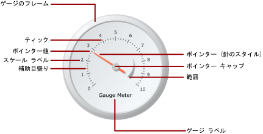

# ゲージ (レポート ビルダーおよび SSRS)
  [!INCLUDE[ssRSnoversion_md](../../includes/ssrsnoversion-md.md)] の改ページ調整されたレポートのゲージ データ領域には、データセットの単一の値が表示されます。 各ゲージは常に、ゲージ パネル内に配置されます。ゲージ パネルでは、子ゲージまたは隣接ゲージを追加できます。 1 つのゲージ パネル内に、フィルター選択、グループ化、並べ替えなどの共通機能を使用する複数のゲージを作成できます。  
  
 ゲージでは、レポートで次のような多数のタスクを実行できます。  
  
-   主要業績評価指標 (KPI) を 1 つの放射状ゲージまたは線形ゲージに表示する。  
  
-   テーブルまたはマトリックス内にゲージを配置して、各セル内の値を示す。  
  
-   1 つのゲージ パネル内で複数のゲージを使用して、フィールド間のデータを比較する。  
  
 ゲージの種類は、線形と放射状の 2 種類です。 次の図は、ゲージ パネルの 1 つの放射状ゲージの基本要素を示しています。  
  
   
  
 ゲージを KPI として使用する方法の詳細については、「[チュートリアル: レポートへの KPI の追加 (レポート ビルダー)](../../reporting-services/tutorial-adding-a-kpi-to-your-report-report-builder.md)」を参照してください。  
  
> [!NOTE]  
>  ゲージは、レポート パーツとしてレポートとは別にパブリッシュできます。 [レポート パーツ](../../reporting-services/report-design/report-parts-report-builder-and-ssrs.md)の詳細を参照してください。  
  
##   ゲージの種類  
 [!INCLUDE[ssRSnoversion](../../includes/ssrsnoversion-md.md)] では、線形と放射状の 2 種類のゲージが用意されています。 放射状ゲージは通常、データを速度として表す場合に使用します。 線形ゲージは、データを温度またはスケール値として表す場合に使用します。  
  
 この 2 種類のゲージの大きな違いは、ゲージの全体的な形状と使用可能なゲージ ポインターです。 放射状ゲージは、円形または円形状で、速度計に似ています。 ゲージ ポインターには、針を使用する場合が多いですが、マーカーまたはバーも使用できます。  
  
 線形ゲージは、横方向または縦方向の長方形で、ルーラーに似ています。 ゲージ ポインターには、温度計を使用する場合が多いですが、マーカーまたはバーも使用できます。 線形ゲージは、その形状から、テーブルまたはマトリックスのデータ領域と統合して進行状況データを表示する際に役立ちます。  
  
 この 2 種類のゲージは、上記の違いを除けば、交換して使用できます。 ただし、レポートで単純なゲージを使用する必要がある場合、ゲージの代わりにインジケーターを使用することも検討する必要があります。 詳細については、「[インジケーター (レポート ビルダーおよび SSRS)](../../reporting-services/report-design/indicators-report-builder-and-ssrs.md)」を参照してください。  
  
 次の図に放射状ゲージと線形ゲージを示します。 放射状ゲージは円形で、針ポインターを使用します。 線形ゲージは横方向で、温度計ポインターを使用します。  
  
 **放射状ゲージ**  
  
   
  
 放射状ゲージのオプション : 放射状、ミニゲージ付きで放射状、2 つのスケール、右上 90°、左上 90°、左下 90°、右下 90°、上 180°、下 180°、左 180°、右 180°、メーター  
  
 **線形ゲージ**  
  
   
  
 線形ゲージのオプション : 横、縦、複数バー ポインター、2 つのスケール、3 色の範囲、対数、温度計、温度計 (華氏/摂氏)、ブレット グラフ  
  
##   ゲージへのデータの追加  
 ゲージをデザイン画面に追加したら、データセット フィールドをゲージ データ ペインにドラッグします。 既定では、ゲージはフィールド値を集計して単一の値として表示します。 この値は、Value プロパティを使用してポインターに関連付けられます。 フィールドのデータ型に応じて、ゲージは SUM または COUNT 集計を使用します。 追加する値が数値データの場合、ゲージでは SUM 関数が使用されます。 数値データ以外の場合は、COUNT 集計が使用されます。 ポインターの値には、別の集計を使用することも、集計を使用しないことも可能です。  
  
 個々のグループまたは個々の行をゲージに表示するには、ゲージにグループ化を追加します。 グループ化やフィルター処理を適用すると、ゲージはポインターの値を使用して、返されたデータセットの最後のグループまたは行を表示します。  
  
 別のポインターを追加することによって、個々のゲージに複数の値を追加できます。 このポインターを同じスケールに関連付けたり、別のスケールを追加して、そのスケールにポインターを関連付けることができます。  
  
 **[グラフの種類を選択]** ダイアログ ボックスで使用できるグラフの種類とは異なり、 **[ゲージの種類の選択]** ダイアログ ボックスで使用できるゲージの種類は、ゲージ プロパティの組み合わせを使用して作成されます。 そのため、グラフの種類を変更する場合と同じ方法でゲージの種類を変更することはできません。 ゲージの種類を変更するには、一度ゲージを削除してからデザイン画面に再度追加する必要があります。 ゲージには少なくとも 1 つのスケールと 1 つのポインターがあります。 ゲージを右クリックして **[スケールの追加]** をクリックすると、複数のスケールを設定できます。 既定では、これにより最初のスケールの内側に、より小さいスケールが作成されます。 スケールには、ラベルと目盛りが表示されます。 目盛りには、補助目盛りと目盛りの 2 種類があります。  
  
 ゲージを右クリックして **[ポインターの追加]** をクリックすると、複数のポインターを設定できます。 これにより、同じスケールに別のポインターが作成されますが、複数のスケールを設定した場合は、ポインターをゲージ上の任意のスケールに関連付けることができます。  
  
### データをゲージに追加するときの注意点  
 他のすべてのデータ領域と同様に、ゲージ データ領域は 1 つのデータセットのみにバインドされます。 複数のデータセットがある場合、JOIN または UNION を使用して 1 つのデータセットを作成するか、データセットごとに別のゲージを使用することを検討します。  
  
 数値データ型は、SUM 関数を使用して集計します。 非数値データ型は COUNT 関数を使用して集計され、データセットまたはグループ内の特定の値またはフィールドのインスタンス数がカウントされます。  
  
 データの追加後、ポインターを右クリックすると、オプションとして [ポインター値のクリア] と [ポインターの削除] が表示されます。 [ポインター値のクリア] をクリックすると、ゲージに関連付けられたフィールドは削除されますが、ポインターはゲージに表示されています。 [ポインターの削除] をクリックすると、ゲージからフィールドが削除され、ビューからポインターが削除されます。 フィールドをゲージに再度追加すると、既定のポインターが再表示されます。 フィールドをゲージに追加したら、ゲージの値にコンテキストを与えるために、対応するスケールに最大値と最小値を設定する必要があります。 また、範囲の最小値と最大値を設定して、スケールの重要な領域を表示することもできます。 ゲージでは、値を認識する方法を決められないため、スケールまたは範囲の最小値または最大値は自動的に設定されません。  
  
### ゲージにデータを追加する方法  
 レポートのデータセットを定義すると、次のいずれかの方法でゲージにデータ フィールドを追加できます。  
  
-   データセットからデータ ペインへフィールドをドラッグします。 ゲージをクリックして、このゲージにフィールドをドラッグします。 データ ペインを開くには、ゲージをクリックするか、フィールドをゲージにドラッグします。 ポインターがまだゲージに存在していない場合、ポインターがゲージに追加され、追加したフィールドにバインドされます。  
  
-   データ ペインを表示し、フィールドのプレースホルダーをポイントします。 フィールドのプレースホルダーの隣にある下矢印をクリックして、使用するフィールドを選択します。 フィールドが既に選択されている場合は、下矢印をクリックし、別のフィールドを選択します。  
  
    > [!NOTE]  
    >  ゲージにポインターが存在しない場合、またはレポートに複数のデータセットが含まれていてゲージ パネルがデータセットに関連付けられていない場合は、この方法を使用できません。  
  
-   ゲージ ポインターを右クリックし、 **[ポインターのプロパティ]** を選択します。 **[値]** の場合、ドロップダウン リストからフィールドを選択するか、 **式** ( *[fx]* ) ボタンをクリックしてフィールド式を定義できます。  
  
### 単一の値へのフィールドの集計  
 ゲージにフィールドが追加されると、 [!INCLUDE[ssRSnoversion](../../includes/ssrsnoversion-md.md)] は既定でフィールドの集計を行います。 数値データ型は、SUM 関数を使用して集計します。 非数値データ型は COUNT 関数を使用して集計され、データセットまたはグループ内の特定の値またはフィールドのインスタンス数がカウントされます。 値フィールドのデータ型が String の場合、フィールドに数字が入っていても、ゲージでは数値を表示できません。 代わりに、ゲージでは COUNT 関数を使用して文字列フィールドを集計します。 この動作を回避するには、使用するフィールドに、書式設定された数値を格納した文字列ではなく、数値データ型を設定してください。 Visual Basic の式で CDbl または CInt 定数を使用して、文字列値を数値データ型に変換できます。 たとえば、[MyField] という名前の文字列フィールドを数値に変換するには、次の式を作成します。  
  
 `=Sum(CDbl(Fields!MyField.Value))`  
  
 集計式の詳細については、「[集計関数リファレンス &#40;レポート ビルダーおよび SSRS&#41;](../../reporting-services/report-design/report-builder-functions-aggregate-functions-reference.md)」を参照してください。  
  
### ゲージでのグループの定義  
 フィールドをゲージに追加すると、1 つのデータ グループを追加できます。 ゲージは、 [!INCLUDE[ssRSnoversion](../../includes/ssrsnoversion-md.md)]にある他のすべてのデータ領域とは異なり、1 つのデータ領域に複数のグループを表示できます。 ゲージでグループ式を定義してグループを追加するときの操作は、Tablix データ領域で行グループを追加する場合と同じです。 ただし、グループを追加した場合、最後のグループの値のみがポインター値としてゲージに表示されます。 たとえば、年度に関するグループ化式を追加した場合、データセット内の昨年の売上集計値を表す値がポインターによって指し示されます。 グループの詳細については、「 [グループについて (レポート ビルダーおよび SSRS)](../../reporting-services/report-design/understanding-groups-report-builder-and-ssrs.md)」を参照してください。  
  
 表またはリスト内に複数のゲージを表示したり、グループ別に集計したデータを表示する場合に、グループをゲージに追加できます。 詳細については、「 [データ領域でのグループの追加または削除 &#40;レポート ビルダーおよび SSRS&#41;](../../reporting-services/report-design/add-or-delete-a-group-in-a-data-region-report-builder-and-ssrs.md)」を参照してください。  
  
##   ゲージでの要素の配置  
 ゲージ パネルは、1 つ以上のゲージを格納するトップレベルのコンテナーです。 このゲージのすぐ外側をクリックすると、 **[ゲージ パネルのプロパティ]** ダイアログ ボックスが表示されます。 各ゲージには、ゲージ スケール、ゲージ範囲、およびゲージ ポインターなどの複数のゲージ要素が含まれます。 ゲージを使用する際は、これらの要素のサイズと位置を変更するために、ゲージ パネルでの要素の測定方法を理解しておく必要があります。  
  
### サイズおよび位置の測定について  
 ゲージでのサイズおよび位置の測定はすべて、その親要素の割合として計算されます。 親要素の幅と高さの値が異なる場合、ゲージ要素のサイズはこの 2 つの値の小さい方の値の割合として計算されます。 たとえば、線形ゲージでは、すべてのポインターの測定は、線形ゲージの幅または高さのいずれか小さい方の割合として計算されます。  
  
 また、位置の測定も、座標系を使用して、位置の親要素の割合として計算されます。 この座標系の原点は、左上隅にあり、X 軸は右方向を指し、Y 軸は下方向を指します。 座標の値は、範囲が 0 ～ 100 で、すべての測定はパーセンテージで表されます。 たとえば、線形ゲージの X 位置と Y 位置がそれぞれ 50 に設定されている場合、線形ゲージはゲージ パネルの中央に位置していることになります。  
  
### ゲージ パネル内の複数のゲージの配置  
 既にゲージが存在するゲージ パネルに新しいゲージを追加するには、2 つの方法があります。 1 つは、最初のゲージの子として新しいゲージを追加する方法で、もう 1 つは、最初のゲージに隣接して別のゲージを追加する方法です。  
  
 ゲージ パネルに新しいゲージが追加されると、ゲージ パネル内の他のすべてのゲージと均等な割合でサイズと位置が変更されます。 たとえば、既に 1 つの放射状ゲージが存在するゲージ パネルに 1 つの放射状ゲージを追加すると、それぞれがパネルの半分のサイズに適合するように 2 つのパネルのサイズが自動的に変更されます。  
  
 既にゲージが存在するゲージ パネルに新しいゲージを追加することができます。 これを行うには、ゲージ パネル上の任意の場所で右クリックし、 **[新規ゲージの追加]** にカーソルを合わせ、 **[子]** を選択します。 **[ゲージの種類の選択]** ダイアログ ボックスが表示されます。 新しいゲージが子として追加されるとき、次の 2 つの方法のいずれかで追加されます。 放射状ゲージでは、子ゲージは既に存在するゲージの左上隅に配置されます。 線形ゲージでは、子ゲージは既に存在するゲージの中央に配置されます。 位置プロパティを使用して、親ゲージを基準に子ゲージを配置します。 その他のすべての要素と同様に、位置の測定は親要素の割合として計算されます。  
  
### ゲージのスケール ラベルとゲージ範囲の配置  
 ゲージ スケールには、ラベルの位置を決定する 2 つのプロパティがあります。 ラベルをスケール バーの内側、外側、またはスケール バーと交差するように表示するかどうかを指定するには、ゲージ スケールの **[位置]** プロパティを設定します。 また、 **[スケールからの距離]** プロパティで数値を指定することもできます。このプロパティでは、ラベルの位置を決定する際に位置を示す値から加算または減算する単位数を指定します。 たとえば、 **[位置]** が **[外側]** に設定され、 **[スケールからの距離]** を 10 に設定した場合、ラベルはゲージ スケールの外縁から 10 単位の場所に配置されます。このとき、1 単位は次の値のいずれかになります。  
  
-   放射状ゲージのゲージの直径の 1%。  
  
-   線形ゲージのゲージの高さまたは幅の最小値の 1%。  
  
 **[位置]** プロパティおよび **[スケールからの距離]** プロパティもゲージ範囲に適用されます。  
  
### 線形ゲージの縦横比の維持  
 放射状ゲージでは、円形のフォームを前提とするため、通常、このゲージの種類では幅と高さで同じ値が維持されます。 一方、線形ゲージでは、四角形のフォームを前提とするため、通常、幅と高さの比率が均一ではありません。 ゲージの縦横比によって、ゲージのサイズが変更されたときに維持する必要がある幅と高さの比率が決定します。 たとえば、この値が 2 に設定されると、ゲージのサイズをどのように変更した場合でも、ゲージの幅が高さの 2 倍になります。 縦横比を設定するには、 **[線形ゲージのプロパティ]** ダイアログ ボックスの AspectRatio プロパティを設定します。  
  
##   操作方法に関するトピック  
 レポートでゲージを扱う際の方法、ゲージでデータを効果的に表示する方法、およびゲージとその要素を追加および構成する方法の詳細な手順を紹介しているトピックの一覧を次に示します。  
  
-   [レポートへのゲージの追加 (レポート ビルダーおよび SSRS)](../../reporting-services/report-design/add-a-gauge-to-a-report-report-builder-and-ssrs.md)  
  
-   [ゲージへの最小値または最大値の設定 (レポート ビルダーおよび SSRS)](../../reporting-services/report-design/set-a-minimum-or-maximum-on-a-gauge-report-builder-and-ssrs.md)  
  
-   [ゲージへのスナップ間隔の設定 (レポート ビルダーおよび SSRS)](https://msdn.microsoft.com/0ece7297-6e2f-47fb-835d-b9e9cce53fe2)  
  
-   [画像をゲージのポインターとして指定する (レポート ビルダーおよび SSRS)](https://msdn.microsoft.com/9d73b3c3-a068-4868-a2be-0cd261b6e92b)  
  
##   トピックの内容  
 次の各トピックでは、ゲージの使用に関する追加情報について説明します。  
  
|||  
|-|-|  
|項目|定義|  
|[ゲージのスケールの書式設定 (レポート ビルダーおよび SSRS)](../../reporting-services/report-design/formatting-scales-on-a-gauge-report-builder-and-ssrs.md)|ゲージのスケールの書式設定に関する一般情報と、放射状および線形ゲージのスケールの書式設定オプションに関する詳細情報について説明します。|  
|[ゲージのポインターの書式設定 (レポート ビルダーおよび SSRS)](../../reporting-services/report-design/formatting-pointers-on-a-gauge-report-builder-and-ssrs.md)|ゲージのポインターの書式設定に関する一般情報と、放射状および線形ゲージで使用可能なポインター スタイルの書式設定オプションに関する詳細情報について説明します。|  
|[ゲージの範囲の書式設定 (レポート ビルダーおよび SSRS)](../../reporting-services/report-design/formatting-ranges-on-a-gauge-report-builder-and-ssrs.md)|ゲージ上の値の重要なサブセクションを示したり、ポインター値が特定の値範囲に入る時期を視覚的に示したりするゲージ上の範囲の書式設定に関する情報について説明します。|  
  
## 参照  
 [式 &#40;レポート ビルダーおよび SSRS&#41;](../../reporting-services/report-design/expressions-report-builder-and-ssrs.md)   
 [データのフィルター、グループ化、および並べ替え (レポート ビルダーおよび SSRS)](../../reporting-services/report-design/filter-group-and-sort-data-report-builder-and-ssrs.md)   
 [レポート パラメーター (レポート ビルダーおよびレポート デザイナー)](../../reporting-services/report-design/report-parameters-report-builder-and-report-designer.md)   
 [グラフ &#40;レポート ビルダーおよび SSRS&#41;](../../reporting-services/report-design/charts-report-builder-and-ssrs.md)   
 [テーブル、マトリックス、および一覧 (レポート ビルダーおよび SSRS)](../../reporting-services/report-design/tables-matrices-and-lists-report-builder-and-ssrs.md)  
  
  
