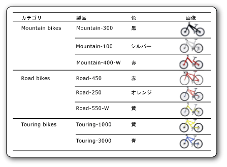

# 画像 (レポート ビルダーおよび SSRS)
  画像は、レポート内に埋め込まれている画像、データベースに格納されている画像、レポート サーバー上に格納されている画像、または Web 上の他の場所に格納されている画像への参照を保持するレポート アイテムです。 画像は、行データとして繰り返し使用されるピクチャである場合もあります。 画像は、任意のレポート アイテムの背景としても使用できます。  
  
 サーバーにロゴを保存すると、多くのレポートで同じロゴを使用できるので効果的です。  
  
> [!NOTE]  
>  [!INCLUDE[ssRBRDDup](../../includes/ssrbrddup-md.md)]  
  
##   外部の画像、埋め込み画像、およびデータバインド画像の比較  
 サーバーベースの画像やその他の外部の画像をレポートで使用している場合は、この画像アイテムにはレポート サーバー上または Web 上の任意の場所にある画像を指すパスが含まれます。 ただし、埋め込み画像を使用する場合は、画像データをレポート定義内に格納し、別ファイルとしては保持しません。  
  
 サーバーベースの画像は、複数のレポートや Web ページで共有されるロゴや静的ピクチャに適しています。 埋め込み画像を使用した場合は、常に確実に画像がレポートで利用できるようになりますが、共有はできません。 外部の画像を使用しているレポート定義の方が、埋め込み画像を使用しているレポート定義よりもサイズが小さくなります。  
  
 また、データバインド画像は、データベースに格納されているバイナリ データからも表示できます。 たとえば、製品一覧で製品名と合わせて表示されるピクチャはデータベース画像です。 次の図では、自転車の画像はデータベースに保存され、各製品を図示するためにレポートで取得されます。  
  
   
  
  
##   レポート パーツとしての画像  
 画像は、レポート パーツとしてレポートとは別に保存できます。 [!INCLUDE[ssRBrptparts](../../includes/ssrbrptparts-md.md)]  
  
  
##   埋め込み画像  
 レポートに画像を埋め込み、すべての画像データがレポート定義内に格納されるようにすることができます。 画像を埋め込む場合は、画像が MIME でエンコードされ、テキストとしてレポート定義に格納されます。 埋め込み画像を使用すると、常に確実に画像がレポートで利用できるようになりますが、レポート定義のサイズが大きくなります。  
  
 画像の埋め込みの詳細については、「 [レポートへの画像の埋め込み &#40;レポート ビルダーおよび SSRS&#41;](../../reporting-services/report-design/embed-an-image-in-a-report-report-builder-and-ssrs.md)」を参照してください。  
  
  
##   外部の画像  
 画像に URL を指定することにより、レポートに格納された画像を含めることができます。 レポートで外部の画像を使用する場合、画像ソースは **[外部]** に設定され、この画像の値は画像の URL アドレスまたはパスになります。  
  
 詳細については、「[外部アイテムへのパスの指定 &#40;レポート ビルダーおよび SSRS&#41;](../../reporting-services/report-design/specifying-paths-to-external-items-report-builder-and-ssrs.md)」を参照してください。  
  
 レポート ビルダーまたはレポート デザイナーでレポートを実行すると、ユーザーの資格情報を使用して画像が表示されます。 レポート サーバーでレポートを実行する場合、画像にアクセスするための十分なサーバー資格情報がないとレポートの画像を表示することはできません。 その場合は、システム管理者に問い合わせてください。  
  
 外部の画像をレポートに追加する方法について詳しくは、「 [外部の画像の追加 &#40;レポート ビルダーおよび SSRS&#41;](../../reporting-services/report-design/add-an-external-image-report-builder-and-ssrs.md)」を参照してください。  
  
  
##   背景画像  
 画像は、レポート本文や四角形、テキスト ボックス、一覧、マトリックス、テーブルの背景画像としても使用できます。 背景画像と画像には、同じようなプロパティがあります。 アイテムの背景を埋めるために、画像を繰り返す方法も指定できます。  
  
> [!NOTE]  
>  HTML 表示拡張機能などのいくつかの表示拡張機能では、レポート本文用の背景画像が本文、ページ ヘッダー、ページ フッター内に表示されます。 ページ ヘッダーおよびページ フッター用にそれぞれ別の背景画像を定義できますが、画像を定義しない場合は、本文の背景画像が使用されます。 画像表示拡張機能などの他の表示拡張機能では、ページ ヘッダーおよびページ フッターに本文の背景画像は表示されません。  
  
 背景画像を追加する方法について詳しくは、「 [背景画像の追加 &#40;レポート ビルダーおよび SSRS&#41;](../../reporting-services/report-design/add-a-background-image-report-builder-and-ssrs.md)」を参照してください。  
  
  
##   データバインド画像  
 データベースに格納されている画像をレポートに追加することができます。 静的画像に使用したものと同じ画像レポート アイテムを使用しますが、画像がデータベースに格納されていることを示すプロパティ セットと共に使用します。 データバインド画像の処理については、「 [データバインド画像の追加 &#40;レポート ビルダーおよび SSRS&#41;](../../reporting-services/report-design/add-a-data-bound-image-report-builder-and-ssrs.md)」を参照してください。  
  
  
##   操作方法に関するトピック  
 [外部の画像の追加 &#40;レポート ビルダーおよび SSRS&#41;](../../reporting-services/report-design/add-an-external-image-report-builder-and-ssrs.md)  
  
 [レポートへの画像の埋め込み &#40;レポート ビルダーおよび SSRS&#41;](../../reporting-services/report-design/embed-an-image-in-a-report-report-builder-and-ssrs.md)  
  
 [背景画像の追加 &#40;レポート ビルダーおよび SSRS&#41;](../../reporting-services/report-design/add-a-background-image-report-builder-and-ssrs.md)  
  
 [データバインド画像の追加 &#40;レポート ビルダーおよび SSRS&#41;](../../reporting-services/report-design/add-a-data-bound-image-report-builder-and-ssrs.md)  
  
  
## 参照  
 [画像ファイルへのエクスポート &#40;レポート ビルダーおよび SSRS&#41;](../../reporting-services/report-builder/exporting-to-an-image-file-report-builder-and-ssrs.md)   
 [レンダリングの動作 &#40;レポート ビルダーおよび SSRS&#41;](../../reporting-services/report-design/rendering-behaviors-report-builder-and-ssrs.md)  
  
  
