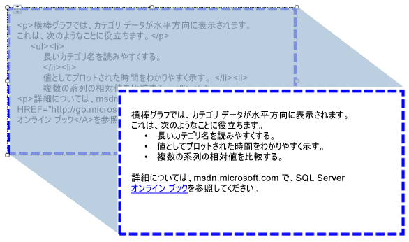

# レポートへの HTML のインポート (レポート ビルダーおよび SSRS)
  テキスト ボックスを使用すると、データセットのフィールドから取得した HTML 形式のテキストをレポートに挿入できます。 正しい形式の HTML に評価される単純型または複合型の式のテキストを使用できます。 書式付きのテキストは、PDF などのサポートされている出力形式すべてにレンダリングできます。  
  
   
  
 この図では、レポート デザイン ビュー内の HTML 形式のテキストが示されています。これは、レポートの実行時にレンダリングされるテキストと同じです。  
  
> [!NOTE]  
>  HTML マークアップが含まれたテキストをインポートする場合、データは必ず最初にテキスト ボックスによって解析される必要があります。 サポートされているのは HTML タグのサブセットのみなので、レンダリングされたレポートに表示される HTML が元の HTML と異なる場合もあります。  
  
 すぐに使用するには、「[チュートリアル: テキストの書式設定 &#40;レポート ビルダー&#41;](../../reporting-services/tutorial-format-text-report-builder.md)」をご覧ください。  
  
> [!NOTE]  
>  [!INCLUDE[ssRBRDDup](../../includes/ssrbrddup-md.md)]  
  
## サポートされる HTML タグ  
 以下は、プレースホルダー テキストとして定義された場合に HTML として表示されるタグの全リストです。  
  
-   ハイパーリンク: \<A HREF >  
  
-   フォント:\<フォント >  
  
-   ヘッダー、スタイル、およびブロック要素: \<H {n} >、 \
、 \、\
、 \
、 \<LI >、 \<HN >  
  
-   テキスト形式: \<B >、 \<I >、 \<U >、 \<S >  
  
-   リストの処理: \<OL >、 \<UL >、 \<LI >  
  
 レポートの処理中、その他の HTML マークアップ タグはすべて無視されます。 プレースホルダー テキスト内の式で表される HTML が整形式でない場合、プレースホルダーはプレーン テキストに変換されます。 HTML タグの大文字と小文字は区別されません。  
  
 テキスト ボックスに含まれているテキストが 1 ブロックだけの場合は、ブロック要素を定義するプレースホルダー内の HTML は正しくレンダリングされます。 しかし、テキスト ボックスに多数のテキスト ブロックがある場合は、HTML タグが無視され、テキストの構造はテキスト ブロックによって定義されます。  
  
 テキストに複数のタグが定義され、[!INCLUDE[ssRSnoversion](../../includes/ssrsnoversion-md.md)] で HTML と既存のレポート制約に競合が検出された場合は、一番内側の HTML タグのみが HTML として扱われます。  
  
 詳細については、「[レポートへの HTML の追加 &#40;レポート ビルダーおよび SSRS&#41;](../../reporting-services/report-design/add-html-into-a-report-report-builder-and-ssrs.md)」をご覧ください。  
  
## カスケード スタイル シート属性の制限  
 カスケード スタイル シート (CSS) 属性を使用する場合、基本的なタグ セットのみが定義されます。 サポートされている属性の一覧を次に示します。  
  
-   テキストの配置、テキストのインデント  
  
-   font-family  
  
-   font-size  
  
    -   CSS の絶対的な長さ単位で表された有効な RDL サイズ値のみサポートされます。 サポートされる単位は、in、cm、mm、pt、および pc です。  
  
    -   CSS の相対的な長さ単位はサポートされず、無視されます。 サポートされない単位は、em、ex、px、%、rem などです。  
  
     CSS の単位の詳細については、「 [CSS の値と単位のリファレンス](http://msdn.microsoft.com/library/ms531211\(VS.85\).aspx) 」(http://msdn.microsoft.com/library/ms531211(VS.85).aspx) をご覧ください。  
  
-   color  
  
-   埋め込み、埋め込みの下部、埋め込みの上部、埋め込みの右側、埋め込みの左  
  
-   フォントの太さ  
  
 以下は、CSS を使用するときの注意点です。  
  
-   不正な HTML と同様に不正な CSS 値は無視されます。  
  
-   同じタグに属性と CSS スタイル属性の両方がある場合は、CSS プロパティの方が優先順位が高くなります。 たとえば、テキストが **\
**、text-align 属性のみが適用され、テキストは右揃えになります。  
  
-   属性と CSS スタイルでは、プロパティが 2 回以上指定されている場合、最後のインスタンスのみが適用されます。 たとえば、テキストが **\
**テキストが右揃えになります。  
  
## 参照  
 [HTML での表示 &#40;レポート ビルダーおよび SSRS&#41;](../../reporting-services/report-builder/rendering-to-html-report-builder-and-ssrs.md)  
  
  
