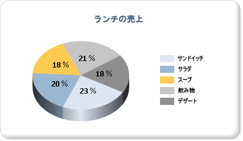

# 円グラフ (レポート ビルダーおよび SSRS)
  円グラフおよびドーナツ グラフは、データを全体に対する比率として表示します。 円グラフは、主に、グループ間の比較を示すために使用されます。 円グラフとドーナツ グラフは、ピラミッド グラフやじょうごグラフと同様、図形グラフの一種です。 図形グラフには軸がありません。 図形グラフに数値フィールドをドロップすると、それぞれの値の全体に占める比率が計算されます。 図形グラフの詳細については、「[図形グラフ &#40;レポート ビルダーおよび SSRS&#41;](../../reporting-services/report-design/shape-charts-report-builder-and-ssrs.md)」を参照してください。  
  
 次の図は、パーセンテージ形式のデータ ラベルを持つ 3-D 円グラフを示しています。  右側中央には凡例が配置されています。  
  
   
  
> [!NOTE]  
>  [!INCLUDE[ssRBRDDup](../../includes/ssrbrddup-md.md)]  
  
## バリエーション  
  
-   **分割円グラフ**。 すべてのスライスを中心から遠ざけるように配置した円グラフ。 すべてのスライスが分離されている分割円グラフとは別に、単一のスライスのみが切り離された分割スライス グラフを作成することもできます。  
  
-   **ドーナツ グラフ**。 中心に空白の領域を設けた円グラフ。  
  
-   **分割ドーナツ グラフ**。 すべてのスライスを中心から遠ざけるように配置したドーナツ グラフ。  
  
-   **3D 円グラフ**。 3-D スタイルが適用された円グラフ。  
  
-   **3D 分割円グラフ**。 3D スタイルが適用された分割円グラフ。  
  
## 円グラフに表示されるデータに関する注意点  
  
-   円グラフは、その視覚的な効果が理由で、レポートでよく使用されます。 ただし、円グラフは、非常に単純な種類のグラフであるため、データを最適に表すことができない場合があります。 円グラフは、7 個以下のデータ ポイントでデータを集計した場合にのみ、使用を検討してください。  
  
-   円グラフでは、各データ グループがグラフの個別のスライスとして表示されます。 円グラフには、少なくとも 1 つのデータ フィールドと 1 つのカテゴリ フィールドを追加する必要があります。 複数のデータ フィールドが円グラフに追加されると、円グラフでは、両方のデータ フィールドが同じグラフ内に表示されます。  
  
-   比率を計算する場合、NULL、空、負、および 0 の各値は無効です。 このため、これらの値は円グラフに表示されません。 このような値をグラフ上に表示する必要がある場合は、グラフの種類を円グラフ以外のグラフに変更してください。  
  
-   円グラフでカスタム パレットを使用して独自の色を定義している場合は、各データ ポイントを独自の色で表示するのに十分な色がパレットにあることを確認します。 詳細については、「 [グラフの系列の色の書式設定 (レポート ビルダーおよび SSRS)](../../reporting-services/report-design/formatting-series-colors-on-a-chart-report-builder-and-ssrs.md)」(グラフ (レポート ビルダーおよび SSRS)) を参照してください。  
  
-   円グラフでは、その他多くのグラフの種類と異なり、個々のデータ ポイントが凡例に表示されます。個々の系列は表示されません。  
  
-   円グラフで値の割合を効果的に比較するためには、少なくとも 2 つの値が必要です。 円グラフに 1 色しか存在しない場合は、グループ化のためのカテゴリ フィールドが追加されていることを確認します。 円グラフにカテゴリが存在しない場合、値がデータ フィールドから集計され、単一の値として表示されます。  
  
-   その他すべての種類のグラフと同様、円グラフでは、既定のパレットに存在する色値に基づいて、色が生成されます。 このアプローチでは、レポートに複数の円グラフが使用されているときに、データ ポイントに対する色付けが変わってくる場合があります。 レポートに複数の円グラフが存在する場合、グラフ間で色を一定に保つためには、各カテゴリ グループに対する色を手動で設定する必要があります。 グラフの色を定義する方法については、「 [グラフの系列の色の書式設定 (レポート ビルダーおよび SSRS)](../../reporting-services/report-design/formatting-series-colors-on-a-chart-report-builder-and-ssrs.md)」(グラフ (レポート ビルダーおよび SSRS)) を参照してください。  
  
## 円グラフに対する描画スタイルの適用  
 円グラフに特殊な描画スタイルを追加して、視覚的な効果を高めることができます。 描画スタイルには、面取り効果や凹型効果などがあります。 これらの効果は 2-D 円グラフでのみ利用できます。 次の図は、円グラフに面取りと凹型の描画スタイルを適用した例です。  
  
   
  
 詳細については、「[グラフへの傾斜、エンボス、およびテクスチャのスタイルの追加 (レポート ビルダーおよび SSRS)](../../reporting-services/report-design/chart-effects-add-bevel-emboss-or-texture-report-builder.md)」を参照してください。  
  
## 円グラフへのパーセンテージの表示  
 他の図形グラフと同様、円グラフは、全体に占める割合 (パーセント) を表します。 そのため、円グラフのラベルは、パーセンテージで表記するのが一般的です。 他の種類のグラフとの一貫性を保つ関係上、既定では、円グラフにパーセンテージ ラベルが表示されません。 グラフにパーセンテージ値を表示する方法については、「 [円グラフへのパーセンテージの表示 (レポート ビルダーおよび SSRS)](../../reporting-services/report-design/display-percentage-values-on-a-pie-chart-report-builder-and-ssrs.md)」(グラフ (レポート ビルダーおよび SSRS)) を参照してください。 レポートで数値の書式をパーセンテージとして設定する方法については、「[Formatting Numbers and Dates (Report Builder and SSRS)](../../reporting-services/report-design/formatting-numbers-and-dates-report-builder-and-ssrs.md)」(数値と日付の書式設定 (レポート ビルダーおよび SSRS)) を参照してください。  
  
   
  
## 円グラフでのラベルの重なりを防ぐ方法  
 円グラフに多数のデータ ポイントが存在すると、データ ラベルが重なってしまう場合があります。 ラベルの重なりを防止するためには、いくつかの方法があります。  
  
-   データ ポイント ラベルのフォント サイズを小さくする。  
  
-   グラフの幅と高さを増やし、ラベル用の領域を確保する。  
  
-   円グラフのラベルをグラフ領域の外側に表示する。 詳細については、「 [円グラフの外側へのデータ ポイント ラベルの表示 (レポート ビルダーおよび SSRS)](../../reporting-services/report-design/display-data-point-labels-outside-a-pie-chart-report-builder-and-ssrs.md)」(グラフ (レポート ビルダーおよび SSRS)) を参照してください。  
  
-   小さな複数のスライスを 1 つのスライスにまとめる。  
  
## 円グラフの小さいスライスの統合  
 円グラフに表示されるポイントが多すぎると、データがわかりにくく、読み取りにくくなります。 データに小さいデータ ポイントが多く含まれている場合、複数の円スライスをまとめるには 2 つの方法があります。  
  
-   円グラフの小さいデータ スライスを 1 つのスライスにまとめる。 この方法は、残りのデータをまとめて、円グラフに "その他" のデータ ポイントとして表示する場合などに便利です。 詳細については、「 [円グラフの小さいスライスをまとめる (レポート ビルダーおよび SSRS)](../../reporting-services/report-design/collect-small-slices-on-a-pie-chart-report-builder-and-ssrs.md)」(グラフ (レポート ビルダーおよび SSRS)) を参照してください。  
  
-   小さいスライスを補助円グラフにまとめる。 2 番目の円グラフはデザイナーに表示されません。 代わりに、データ ポイントの値に基づいて、2 番目の円グラフを表示する必要があるかどうかがレポートの処理中に計算されます。 必要な場合は、値が別の円グラフに追加されます。  
  
## 参照  
 [円グラフの外側へのデータ ポイント ラベルの表示 (レポート ビルダーおよび SSRS)](../../reporting-services/report-design/display-data-point-labels-outside-a-pie-chart-report-builder-and-ssrs.md)   
 [円グラフの小さいスライスをまとめる (レポート ビルダーおよび SSRS)](../../reporting-services/report-design/collect-small-slices-on-a-pie-chart-report-builder-and-ssrs.md)   
 [円グラフへのパーセンテージの表示 (レポート ビルダーおよび SSRS)](../../reporting-services/report-design/display-percentage-values-on-a-pie-chart-report-builder-and-ssrs.md)   
 [チュートリアル: レポートへの円グラフの追加 (レポート ビルダー)](../../reporting-services/tutorial-add-a-pie-chart-to-your-report-report-builder.md)   
 [グラフの凡例の書式設定 (レポート ビルダーおよび SSRS)](../../reporting-services/report-design/chart-legend-formatting-report-builder.md)   
 [グラフ内の空のデータ ポイントおよび NULL データ ポイント (レポート ビルダーおよび SSRS)](../../reporting-services/report-design/empty-and-null-data-points-in-charts-report-builder-and-ssrs.md)   
 [グラフの系列の色の書式設定 (レポート ビルダーおよび SSRS)](../../reporting-services/report-design/formatting-series-colors-on-a-chart-report-builder-and-ssrs.md)  
  
  
