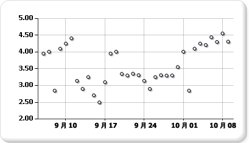

# 散布図 (レポート ビルダーおよび SSRS)
  散布図では、点のセットとして系列が表示されます。 値は、グラフ上の点の位置によって表されます。 カテゴリは、グラフ上のさまざまなマーカーによって表されます。 散布図は、通常、カテゴリ全体の集計データを比較するために使用されます。 散布図にデータを追加する方法の詳細については、「 [グラフ (レポート ビルダーおよび SSRS)](../../reporting-services/report-design/charts-report-builder-and-ssrs.md)  
  
 次の図は、散布図の例を示しています。  
  
   
  
> [!NOTE]  
>  [!INCLUDE[ssRBRDDup](../../includes/ssrbrddup-md.md)]  
  
## バリエーション  
  
-   **バブル。** : バブル チャートでは、1 つのデータ ポイントの 2 つの値の差を、バブルのサイズに基づいて表示します。 バブルが大きいほど、2 つの値の差が大きくなります。  
  
-   **3-D バブル**: バブル チャートが 3D で表示されます。  
  
## 散布図のデータに関する注意点  
  
-   散布図は、一般的に、科学、統計、工学のデータなど、数値を表示して比較する場合に使用されます。  
  
-   時間に関係なく多数のデータ ポイントを比較する場合は、散布図を使用します。 散布図に含まれるデータが多いほど、比較しやすくなります。  
  
-   バブル チャートでは、データ ポイントごとに 2 つの値 (最高値と最低値) が必要になります。  
  
-   散布図は、データ ポイントの値および集合の分布を処理する場合に理想的です。 数千個のポイントなど、データセットに含まれるポイントが多い場合、これは最適なグラフです。 複数の系列を散布図上に表示するとデータが複雑で見づらくなるため、このような表示は避けるようにします。 この場合は、折れ線グラフの使用を検討してください。  
  
-   散布図では、既定で、データ ポイントが円として表示されます。 散布図に複数の系列がある場合は、各ポイントのマーカーの形状を、四角形、三角形、ひし形など別の形に変更することを検討してください。  
  
## 参照  
 [グラフ (レポート ビルダーおよび SSRS)](../../reporting-services/report-design/charts-report-builder-and-ssrs.md)   
 [グラフの種類 &#40;レポート ビルダーおよび SSRS&#41;](../../reporting-services/report-design/chart-types-report-builder-and-ssrs.md)   
 [グラフの書式設定 (レポート ビルダーおよび SSRS)](../../reporting-services/report-design/formatting-a-chart-report-builder-and-ssrs.md)   
 [折れ線グラフ (レポート ビルダーおよび SSRS)](../../reporting-services/report-design/line-charts-report-builder-and-ssrs.md)  
  
  
