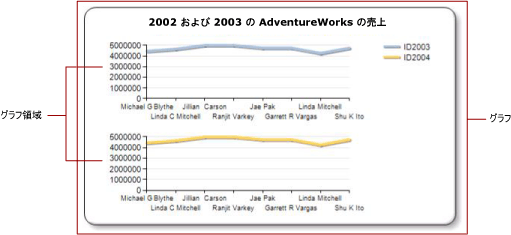

# 系列のグラフ領域の指定 (レポート ビルダーおよび SSRS)
  [!INCLUDE[ssRSnoversion_md](../../includes/ssrsnoversion-md.md)] のページ分割されたレポートでは、 *グラフ* は、外側の境界、グラフのタイトル、および凡例を含んでいる最上位レベルのコンテナーです。 既定では、グラフには既定の *グラフ領域*が 1 つ含まれています。 グラフ領域はグラフの表面上に見えませんが、グラフ領域を 1 つまたは複数の系列の軸ラベル、軸タイトル、およびプロット エリアのみを含んでいるコンテナーと考えることができます。 次の図は、1 つのグラフ内にある複数のグラフ領域の概念を示しています。  
  
   
  
 既定では、すべての系列が既定のグラフ領域に追加されます。 面グラフ、縦棒グラフ、折れ線グラフ、散布図を使用する場合は、これらの系列を組み合わて同じグラフ領域上に表示できます。 同じグラフ領域に複数の系列があると、グラフが読みにくくなります。 グラフの種類を複数のグラフ領域に分割することができます。 複数のグラフ領域を使用すると、読みやすさが向上して比較が簡単になります。 たとえば、価格と売上高の株価グラフは値の範囲が異なることがありますが、同じ期間の価格と売上高のデータを比較することができます。  
  
 棒、極座標、または図形の系列は、同じグラフ領域内の同じグラフの種類の系列とのみ組み合わせることができます。 極座標グラフまたは図形グラフを使用している場合は、表示するフィールドごとに異なるグラフ データ領域を使用することを検討してください。  
  
> [!NOTE]  
>  [!INCLUDE[ssRBRDDup](../../includes/ssrbrddup-md.md)]  
  
## 系列を新しいグラフ領域に関連付けるには  
  
1.  グラフ上の任意の場所を右クリックし、 **[新しいグラフ領域の追加]** を選択します。 新しい空のグラフ領域がグラフに表示されます。  
  
2.  グラフの系列を右クリックするか、グラフ データ ペイン内の適切な領域にある系列またはデータ フィールドを右クリックして、 **[系列のプロパティ]** をクリックします。  
  
3.  **[軸とグラフ領域]** で、系列を表示するグラフ領域を選択します。  
  
4.  (省略可) グラフ領域を垂直に揃えます。 これを行うには、グラフを右クリックし、表示されるオプションから **[グラフ領域のプロパティ]** を選択します。 **[配置]** で、選択したグラフ領域に揃える別のグラフ領域を選択します。  
  
## 参照  
 [グラフ上の複数の系列 &#40;レポート ビルダーおよび SSRS&#41;](../../reporting-services/report-design/multiple-series-on-a-chart-report-builder-and-ssrs.md)   
 [グラフでのデータ ポイントの書式設定 (レポート ビルダーおよび SSRS)](../../reporting-services/report-design/formatting-data-points-on-a-chart-report-builder-and-ssrs.md)   
 [パレットを使用したグラフの色の定義 &#40;レポート ビルダーおよび SSRS&#41;](../../reporting-services/report-design/define-colors-on-a-chart-using-a-palette-report-builder-and-ssrs.md)   
 [極座標グラフ &#40;レポート ビルダーおよび SSRS&#41;](../../reporting-services/report-design/polar-charts-report-builder-and-ssrs.md)   
 [図形グラフ &#40;レポート ビルダーおよび SSRS&#41;](../../reporting-services/report-design/shape-charts-report-builder-and-ssrs.md)   
 [円グラフ &#40;レポート ビルダーおよび SSRS&#41;](../../reporting-services/report-design/pie-charts-report-builder-and-ssrs.md)  
  
  
