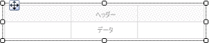
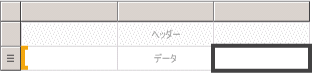
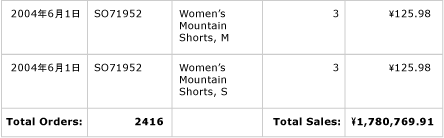
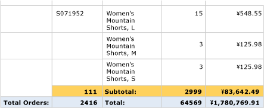
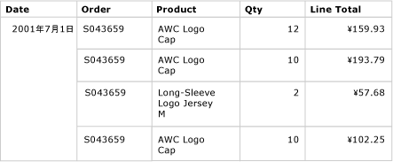
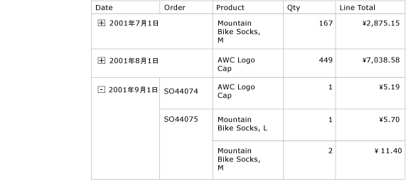

# テーブル (レポート ビルダーおよび SSRS)
 [!INCLUDE[ssRSnoversion_md](../../includes/ssrsnoversion-md.md)]で、テーブルを使用すると、ページ分割されたレポートに詳細データまたはグループ化されたデータ、あるいはその両方を組み合わせて表示できます。   
   
 データは、1 つのフィールドまたは複数のフィールドでグループ化することも、独自の式を記述してグループ化することもできます。 入れ子になったグループまたは独立した隣接するグループを作成できます。 グループ化されたデータの集計値を表示するには、合計をグループに追加します。 行と列を書式設定して、強調するデータを強調表示します。 最初は詳細データまたはグループ化されたデータを非表示にして、ユーザーが表示するデータを対話的に選択できるドリルダウンの切り替えを含めることもできます。  
  
 テーブルの使用をすぐに開始するには、「[チュートリアル: 基本的な表レポートの作成 (レポート ビルダー)](../../reporting-services/tutorial-creating-a-basic-table-report-report-builder.md)」または「[基本的なテーブル レポートの作成 (SSRS チュートリアル)](../../reporting-services/create-a-basic-table-report-ssrs-tutorial.md)」を参照してください。  
  
> [!NOTE]  
>  テーブルは、レポート パーツとしてレポートとは別にパブリッシュできます。 [レポート パーツ](../../reporting-services/report-design/report-parts-report-builder-and-ssrs.md)の詳細を参照してください。  
  
  
##   詳細データを表示するテーブルの追加  
 リボンの [挿入] タブからデザイン画面にテーブルを追加します。 テーブルを追加するには、テーブル ウィザードまたはマトリックス ウィザードを使用して、データ ソース接続とデータセットを作成し、そのテーブルを構成するか、テーブル テンプレートに基づいてテーブルを作成し、手動で構成します。  
  
> [!NOTE]  
>  ウィザードは、レポート ビルダーでのみ利用可能です。  
  
 このトピックでは、テーブルの構成方法について詳しく説明するために、テーブル テンプレートを使用します。  
  
 既定では、新しいテーブルには、ラベルのヘッダー行を含む一定数の列と、詳細データのデータ行があります。 次の図に、デザイン画面に追加された新しいテーブルを示します。  
  
   
  
 テーブルを選択すると、行および列のハンドルがテーブルの外側に表示され、セル内に角かっこが表示されます。 行ハンドルには、各行の目的を示すグラフィックが表示されます。 角かっこは、選択したセルのグループ メンバーシップを示しています。 次の図に、既定のテーブルで空のセルを選択している状態を示します。  
  
   
  
 データ行の行ハンドルは、詳細シンボル () を示します。 これらの行にデータを表示するには、レポート データ ペインからヘッダーまたは詳細行のテーブル セルにフィールドをドラッグします。 両方の行に同時にデータが表示されます。 列を追加するには、挿入ポイントが表示されるまでフィールドをテーブルにドラッグします。 テーブルにデータセット フィールドを追加した後、日付と通貨の既定の書式を変更して、これらの値がレポートに表示される方法を制御できます。 次の図に、Date、Order、Product、Qty、および Line Total フィールドを含むテーブル データ領域を示します。  
  
   
  
 レポートをプレビューに表示してデザインを確認します。 テーブルは、必要に応じてページの下方向に拡張されます。 ラベル行と詳細行は、データセット クエリの結果セットの行ごとに 1 行ずつ表示されます。 次の図に示すように、注文 (Order) で販売された各製品 (Product) は、アイテムの数量 (Qty) および合計 (Line Total) と共に個々の行に表示されます。  
  
   
  
 作業を開始したテーブルは、Tablix データ領域に基づいたテンプレートです。 基になる Tablix データ領域でサポートされている機能を追加することで、テーブルのデザインを整えることができます。 詳細については、「 [レポート ページでの Tablix データ領域の表示の制御 &#40;レポート ビルダーおよび SSRS&#41;](../../reporting-services/report-design/controlling-the-tablix-data-region-display-on-a-report-page.md)」を参照してください。 また、行グループや列グループの追加、詳細グループの追加や削除を行って、テーブルを改良することもできます。 詳細については、「[Tablix データ領域の柔軟性について &#40;レポート ビルダーおよび SSRS&#41;](../../reporting-services/report-design/exploring-the-flexibility-of-a-tablix-data-region-report-builder-and-ssrs.md)」を参照してください。  
  
### 詳細データの合計の追加  
 合計を追加するには、数値データを含むセルを選択し、数値フィールドの詳細データのラベルと合計を自動的に追加するショートカット メニューを使用します。 他のラベルおよび合計を手動で指定することもできます。 次の図に、合計を自動と手動の両方で指定した一般的な合計行を示します。  
  
   
  
 レポートのプレビューには、データセット クエリの結果セットの各行にヘッダー行および詳細行が 1 つずつ表示され、合計行が表示されます。 合計行を含むテーブルの最後の数行を次の図に示します。  
  
   
  
 詳細については、「[グループまたは Tablix データ領域への合計の追加 (レポート ビルダーおよび SSRS)](../../reporting-services/report-design/add-a-total-to-a-group-or-tablix-data-region-report-builder-and-ssrs.md)」を参照してください。  
  
##   テーブルへの行グループの追加  
 レポート データ ペインからセルにフィールドをドラッグして詳細データを表示できるのと同様に、フィールドをグループ化ペインにドラッグしてグループを追加できます。 テーブルの行グループ ペインにフィールドをドラッグします。 グループを追加すると、テーブルの行グループ領域の新しい列にセルが自動的に追加され、グループ値が表示されます。 領域の詳細については、「[Tablix データ領域部分 (レポート ビルダーおよび SSRS)](../../reporting-services/report-design/tablix-data-region-areas-report-builder-and-ssrs.md)」を参照してください。  
  
 次の図に、入れ子になっている 2 つの行グループを含むテーブルの [デザイン] ビューを示します。 行グループは、Order フィールドと Date フィールドを順に行グループ ペインにドラッグし、各グループを既存のグループの親として挿入して作成されています。 この図は、日付に基づいた親グループ、注文番号に基づいた子グループ、および既定で定義されている詳細グループを示します。  
  
   
  
 次の図に示すように、レポートのプレビューには最初に日付でグループ化し、次に注文でグループ化した注文データが表示されます。  
  
   
  
 グループ化されたデータの表示は、それぞれの値を個々の列に表示する代わりに、グループ階層をインデントして、入れ子になったグループのリレーションシップを表示することもできます。 このスタイルの書式設定は、階段状レポートと呼ばれます。 グループ情報を段階状レポートとして書式設定する方法の詳細については、「[階段状レポートの作成 (レポート ビルダーおよび SSRS)](../../reporting-services/report-design/create-a-stepped-report-report-builder-and-ssrs.md)」を参照してください。  
  
### 行グループへの合計の追加  
 グループの合計を表示するには、状況依存の **[合計の追加]** コマンドを使用できます。 行グループに対して [合計の追加] コマンドを使用すると、グループに対して 1 回だけ繰り返されるようにグループの外側に行が追加されます。 入れ子になっているグループの場合、子グループの合計行は子グループの外側で、親グループの内側に配置されます。 そのような場合は、子グループの合計行の背景色を設定して詳細行と区別すると便利です。 また、別の背景色を使用してテーブルのヘッダー行とフッター行を区別することもできます。 次の図に、注文番号に基づいたグループの合計行が追加されたテーブルを示します。  
  
   
  
 レポートを表示すると、注文の小計を表示する行が注文番号ごとに 1 回繰り返されます。 テーブル フッターには、すべての日付の合計が表示されます。 次の図では、最後の数行に、最後の 3 つの詳細行、最後の注文番号 SO71952 の小計、およびテーブルのすべての日付の合計が表示されています。  
  
   
  
 詳細については、「[グループまたは Tablix データ領域への合計の追加 (レポート ビルダーおよび SSRS)](../../reporting-services/report-design/add-a-total-to-a-group-or-tablix-data-region-report-builder-and-ssrs.md)」を参照してください。  
  
##   詳細行の削除または非表示  
 レポートでテーブルをプレビューした後、既存の詳細行を削除することに決めたとします。 また、詳細行を既定で非表示にして、ドリルダウン レポートのようにユーザーが詳細の表示と非表示を切り替えることができるようにする場合も考えられます。  
  
 テーブルから詳細行を削除するには、グループ化ペインを使用します。 詳細グループを選択し、ショートカット メニューを使用して、詳細データを表示するグループと行を削除します。 次の図に、日付と注文番号でグループ化されたテーブルの [デザイン] ビューを示します。詳細行は含まれていません。 このテーブルには合計行は追加されていません。  
  
   
  
 詳細行を削除すると、値のスコープは行グループに設定されます。 これで詳細データは表示されません。  
  
> [!NOTE]  
>  詳細行を削除したら、各セルの式には適切な集計式が指定されていることを確認します。 必要に応じて、式を編集して集計関数を指定します。  
  
 次の図にこのレポートのプレビューを示します。  
  
   
  
 テーブルに行を追加する/テーブルから行を削除する方法については、「[行の挿入または削除 (レポート ビルダーおよび SSRS)](../../reporting-services/report-design/insert-or-delete-a-row-report-builder-and-ssrs.md)」を参照してください。  
  
 レポートを最初に表示したときに詳細行を非表示にすることもできます。 その場合、親グループ データだけが表示されるドリルダウン レポートを作成できます。 それぞれの内部グループ (詳細グループを含む) に対して、含んでいるグループのグループ化セルに表示/非表示の切り替えを追加します。 たとえば、詳細グループの場合、注文番号グループ値を表示するテキスト ボックスに切り替えを追加します。 注文番号グループの場合は、日付グループ値を表示するテキスト ボックスに切り替えを追加します。 次の図に、最初のいくつかの注文を表示するために展開された 2001 年 9 月 1 日の行を示します。  
  
   
  
 詳細については、「 [アイテムへの展開または折りたたみアクションの追加 &#40;レポート ビルダーおよび SSRS&#41;](../../reporting-services/report-design/add-an-expand-or-collapse-action-to-an-item-report-builder-and-ssrs.md)」を参照してください。  
  
## 参照  
 [データのフィルター、グループ化、および並べ替え (レポート ビルダーおよび SSRS)](../../reporting-services/report-design/filter-group-and-sort-data-report-builder-and-ssrs.md)   
 [式 (レポート ビルダーおよび SSRS)](../../reporting-services/report-design/expressions-report-builder-and-ssrs.md)   
 [式の例 (レポート ビルダーおよび SSRS)](../../reporting-services/report-design/expression-examples-report-builder-and-ssrs.md)   
 [テーブル、マトリックス、および一覧 &#40;レポート ビルダーおよび SSRS&#41;](../../reporting-services/report-design/tables-matrices-and-lists-report-builder-and-ssrs.md)  
  
  
