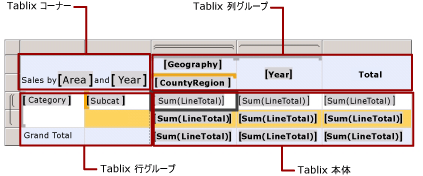
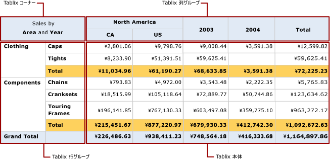

# Tablix データ領域部分 (レポート ビルダーおよび SSRS)
 [!INCLUDE[ssRSnoversion_md](../../includes/ssrsnoversion-md.md)] のページ分割されたレポートの Tablix データ領域には、Tablix セルを含む 4 つの領域があります。   
* コーナー  
* 行グループ領域  
* 列グループ領域  
* 本体   
  
それぞれの領域内のセルには個別の関数があります。 詳細データとグループ化されたデータを表示するには、Tablix 本体領域にセルを追加します。 グループ インスタンス値を表示するためにグループを作成すると、レポート ビルダーおよびレポート デザイナーによって行グループ領域または列グループ領域にセルが追加されます。 行グループと列グループの両方が存在する場合は、レポート ビルダーおよびレポート デザイナーによって Tablix コーナー セルが作成されます。  
  
デザイン画面では、選択した Tablix データ領域の 4 つの部分が点線で示されます。 次の図に Tablix 領域の部分を示します。入れ子になった行グループはカテゴリとサブカテゴリに基づいており、入れ子になった列グループは地理と国/地域に基づいており、隣接する列グループは年に基づいています。  
  
   
  
 次の一覧では、各領域について説明します。  
  
-   **Tablix コーナー領域**。 (省略可) Tablix コーナーは左上隅にあります。右から左 (RTL) のレイアウトでは右上隅にあります。 この領域は、行グループと列グループの両方を Tablix データ領域に追加すると、自動的に作成されます。 この領域では、セルを結合してラベルを追加したり、別のレポート アイテムを埋め込んだりできます。 この図では、コーナーの結合されたセルに「Sales by Area and Year」というラベルが表示されています。  
  
-   **Tablix 列グループ領域**。 (省略可) Tablix 列グループは右上隅 (RTL レイアウトでは左上隅) にあります。 この領域は、列グループを追加すると自動的に作成されます。 この領域のセルは列グループ階層のメンバーを表し、列グループ インスタンスの値を表示します。 この図では、[Geography] と [CountryRegion] を表示するセルは、入れ子になった列グループで、[Year] を表示するセルは、隣接する列グループです。 [Total] 列には各行の集計が表示されます。  
  
-   **Tablix 行グループ領域**。 (省略可) Tablix 行グループは左下隅 (RTL レイアウトでは右下) にあります。 この領域は、行グループを追加すると自動的に作成されます。 この領域のセルは行グループ階層のメンバーを表し、行グループ インスタンスの値を表示します。 この図では、[Category] と [Subcat] を表示するセルが、入れ子になった行グループです。 Subcat の下の Total 行には各カテゴリ グループが繰り返され、各列を集計した小計が表示されます。 総計行はすべてのカテゴリの合計を示します。  
  
-   **Tablix 本体領域**。 Tablix 本体は右下隅 (RTL レイアウトでは左下) にあります。 Tablix 本体には、詳細データとグループ化されたデータが表示されます。 この例では、集計データのみが使用されます。 式のスコープは、テキスト ボックスが属する最も内側のグループによって決まります。 Tablix 本体のセルには、それが詳細行のメンバーである場合は詳細データが表示され、それがグループに関連付けられている行や列のメンバーである場合は集計データが表示されます。 既定では、集計関数を含まない単純な式が含まれているグループ行またはグループ列のセルは、グループの最初の値に評価されます。 この図では、すべての販売注文の行合計の集計がセルに表示されています。  
  
 レポートの実行時に、列グループはグループ式の固有の値と同じ数の列だけ右方向 (Tablix データ領域の Direction プロパティが RTL に設定されている場合は左方向) に拡張されます。 行グループは、ページの下方向に拡張されます。 詳細については、「[Tablix データ領域のセル、行、および列 &#40;レポート ビルダーおよび SSRS&#41;](../../reporting-services/report-design/tablix-data-region-cells-rows-and-columns-report-builder-and-ssrs.md)」を参照してください。  
  
 次の図は、Tablix データ領域をプレビューで示します。  
  
   
  
 行グループ領域には、Clothing と Components の 2 つのカテゴリ グループ インスタンスが表示されます。 列グループ領域には、北米の地理グループ インスタンスと、カナダ (CA) および米国 (US) の入れ子になった 2 つの国/地域グループ インスタンスが表示されます。 さらに、隣接した列には 2003 年と 2004 年の 2 つの年度グループのインスタンスが表示されます。 合計列の行には行の合計が表示されます。カテゴリ グループで繰り返す合計行にはサブカテゴリの合計が表示され、総計行にはデータ領域のカテゴリ合計が 1 回表示されます。  
  
## 参照  
 [テーブル、マトリックス、および一覧 &#40;レポート ビルダーおよび SSRS&#41;](../../reporting-services/report-design/tables-matrices-and-lists-report-builder-and-ssrs.md)   
 [レポート ビルダー チュートリアル](../../reporting-services/report-builder-tutorials.md)   
 [テーブル &#40;レポート ビルダーおよび SSRS&#41;](../../reporting-services/report-design/tables-report-builder-and-ssrs.md)   
 [マトリックスを作成する](../../reporting-services/report-design/create-a-matrix-report-builder-and-ssrs.md)   
 [一覧がある請求書とフォームを作成する](../../reporting-services/report-design/create-invoices-and-forms-with-lists-report-builder-and-ssrs.md)   
 [Tablix データ領域 &#40;レポート ビルダーおよび SSRS&#41;](../../reporting-services/report-design/tablix-data-region-report-builder-and-ssrs.md)  
  
  
