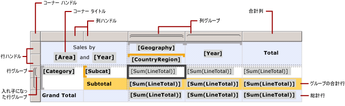
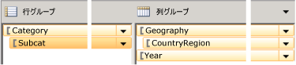

# Tablix データ領域のセル、行、および列 (レポート ビルダーおよび SSRS)
  [!INCLUDE[ssRSnoversion_md](../../includes/ssrsnoversion-md.md)] の改ページ調整されたレポートの Tablix データ領域の行および列にデータを表示する方法を制御するには、詳細データ、グループ データ、ラベル、および合計に対して行と列を指定する方法を理解する必要があります。 多くの場合、テーブル、マトリックス、または一覧の既定の構造を使用してデータを表示できます。 詳細については、「[テーブル (レポート ビルダーおよび SSRS)](../../reporting-services/report-design/tables-report-builder-and-ssrs.md)」、「[マトリックスの作成 (レポート ビルダーおよび SSRS)](../../reporting-services/report-design/create-a-matrix-report-builder-and-ssrs.md)」、または「[一覧がある請求書とフォームを作成する (レポート ビルダーおよび SSRS)](../../reporting-services/report-design/create-invoices-and-forms-with-lists-report-builder-and-ssrs.md)」を参照してください。  
  
 Tablix データ領域では、詳細行および詳細列に詳細データが表示され、グループ行およびグループ列にグループ化されたデータが表示されます。 Tablix データ領域に行グループおよび列グループを追加すると、データを表示するための行および列が自動的に追加されます。 行および列を手動で追加および削除して、Tablix データ領域をカスタマイズし、レポートでデータを表示する方法を制御することができます。  
  
 Tablix データ領域のカスタマイズ方法を理解するには、まず、デザイン画面で Tablix データ領域を選択したときに表示される視覚的な手掛かりの意味を理解する必要があります。  
  
> [!NOTE]  
>  [!INCLUDE[ssRBRDDup](../../includes/ssrbrddup-md.md)]  
  
## Tablix の視覚的な手掛かりについて  
 Tablix データ領域に表示される視覚的な手掛かりは、Tablix データ領域を操作して必要なデータを表示する際に役立ちます。  
  
### 行ハンドルと列ハンドル  
 Tablix データ領域を選択すると、行ハンドルと列ハンドルのグラフィックが各行および列の目的を示します。 ハンドルは、グループ内に含まれている行および列、またはグループの外にある行および列を示します。 次の表で、さまざまなハンドル表示について説明します。  
  
|アイコン|[説明]|  
|----------|-----------------|  
||行グループ階層に詳細グループのみ|  
||1 つの外部グループと子詳細グループ|  
||1 つの外部グループ、1 つの内部グループがあり、詳細グループはなし|  
||1 つの外部グループ、1 つの内部グループ、および子詳細グループ|  
||合計のフッター行のある 1 つの外部グループと、1 つの内部グループ|  
||合計のフッター行のある 1 つの外部グループ、合計のフッター行のある 1 つの内部グループ、および 1 つの詳細行|  
||ラベルのヘッダーと合計のフッターのある 1 つの外部グループと、内部グループがあり、詳細グループはなし|  
  
### グループ行  
 グループの内側の行は、一意のグループ値ごとに 1 回繰り返され、通常、集計サマリで使用されます。 グループの外側の行は、グループに関して 1 回繰り返され、ラベルや小計に使用されます。 Tablix セルを選択すると、Tablix データ領域内の行ハンドル、列ハンドル、および角かっこによって、セルが属するグループを確認できます。 この図は、次の視覚的手掛かりを示しています。  
  
-   グループの関連付けを示す行ハンドルと列ハンドル  
  
-   選択したセルの最も内側のグループ メンバーシップを示す、強調表示されたグループ インジケーター  
  
-   選択されたセルのすべてのグループ メンバーシップを示すグループ インジケーター  
  
   
  
### 合計行  
 行および列グループを追加した後、列の合計を表示する行や、行の合計を表示する列を追加できます。 次の図に、行グループ、列グループ、合計行、および合計列のあるマトリックスを示します。  
  
   
  
### グループ化ペイン  
 グループ化ペインには、デザイン画面で現在選択されている Tablix データ領域の行グループと列グループが表示されます。 次の図に、この Tablix データ領域のグループ化ペインを示します。  
  
   
  
 行グループ ペインに、親グループ Category と子グループ Subcat が表示されます。 列グループ ペインには、親グループ Geography と子グループ CountryRegion、および Geography グループに隣接する Year グループも表示されます。 行グループ ペインで Subcat グループを選択すると、グループ バーが濃いオレンジ色になり、対応する行グループのメンバー セルがデザイン画面で選択されます。  
  
## 行と列のデータの表示  
 行および行グループと、列および列グループには同じ関係があります。 次に、Tablix データ領域の行に詳細データとグループ データを表示する行を追加する方法について説明します。詳細データとグループ化されたデータを表示する列を追加する場合も基本的な方法は同じです。  
  
 Tablix データ領域の各行は、各行グループの内側または外側のいずれかにあります。 行が行グループの内側にある場合、グループの一意の値ごとに行が 1 回繰り返されます。これを、 *グループ インスタンス*といいます。 行が行グループの外側にある場合、そのグループに対して行が 1 回繰り返されます。 すべての行グループの外側にある行は静的で、データ領域について 1 回のみ繰り返されます。 たとえば、テーブルのヘッダー行またはフッター行は、静的な行です。 少なくとも 1 つのグループがあり、繰り返された行は動的です。  
  
 入れ子になっているグループの場合、行は、親グループの内側で、子グループの外側に配置できます。 行は、親グループ内のグループ値ごとに繰り返されますが、表示されるのは、子グループに対して 1 回だけです。 グループのラベルまたは合計を表示するには、グループの外側に行を追加します。 グループ インスタンスごとに変わるデータを表示するには、グループの内側に行を追加します。  
  
 詳細グループの場合、各詳細行は詳細グループの内側にあります。 行は、データセット クエリの結果セット内の値ごとに繰り返されます。  
  
 グループ階層の詳細については、「[グループについて (レポート ビルダーおよび SSRS)](../../reporting-services/report-design/understanding-groups-report-builder-and-ssrs.md)」を参照してください。  
  
 次の図に、入れ子になった行グループと詳細グループのある Tablix データ領域を示します。  
  
   
  
 Tablix データ領域に詳細データを表示する場合、詳細グループは最も内側の子グループです。 詳細グループに追加される行は、この Tablix データ領域にリンクされているデータセットのクエリの結果セットに含まれている行ごとに 1 回繰り返されます。 次の図に、表示されたレポートの最後のページを示します。 この図には、最新の詳細行と、最新の発注の小計行が示されています。  
  
   
  
 Tablix データ領域内の各列についても同様です。 たとえば、列は、各列グループの内側または外側のいずれかにあり、合計を表示するには、グループの外側に列を追加します。  
  
 グループに関連付けられている行および列を削除するため、そのグループを削除できます。 グループを削除する場合、グループ定義のみを削除する方法と、グループおよび関連付けられているすべての行および列を削除する方法があります。 グループのみを削除すると、データ領域で行および列レイアウトが維持されます。 グループとその関連行および列を削除すると、そのグループに関連付けられているすべての静的な行および列 (グループ ヘッダーおよびフッターを含む) と、動的な行および列 (グループ インスタンスを含む) が削除されます。  
  
 行および列の追加または削除の詳細な手順については、「[列の挿入または削除 (レポート ビルダーおよび SSRS)](../../reporting-services/report-design/insert-or-delete-a-row-report-builder-and-ssrs.md)」および「[列の挿入または削除 (レポート ビルダーおよび SSRS)](../../reporting-services/report-design/insert-or-delete-a-column-report-builder-and-ssrs.md)」を参照してください。  
  
## Tablix セルについて  
 Tablix セルは 4 つの Tablix 領域 (Tablix 本体、Tablix 行グループ領域、Tablix 列グループ領域、または Tablix コーナー) のいずれかに属します。 各セルにはデータセット内の任意の値を表示できますが、セルごとの既定の機能はその場所によって異なります。 Tablix 領域の詳細については、「[Tablix データ領域部分 (レポート ビルダーおよび SSRS)](../../reporting-services/report-design/tablix-data-region-areas-report-builder-and-ssrs.md)」を参照してください。  
  
 既定では、Tablix 行および列グループ領域内のセルはグループ メンバーを表します。 グループのメンバーは、レポート定義で複数のツリー構造に分類されます。 行グループ階層は水平方向に展開します。 列グループ階層は垂直方向に展開します。 グループを作成すると、これらのセルが自動的に追加され、実行時にグループの一意の値が表示されます。  
  
 行および列グループ領域の両方が存在する場合は、Tablix コーナーのセルが作成されます。 この領域にセルを結合してラベルを作成したり、別のレポート アイテムを埋め込んだりできます。  
  
 Tablix 本体領域のセルには、セルが詳細行または詳細列内にある場合は詳細データを、セルがグループ行またはグループ列内にある場合は集計グループ データを表示できます。 セルのデータのスコープは、そのセルが属する最も内側の行グループと最も内側の列グループの交点です。  
  
> [!NOTE]  
>  各セルについて表示される実際のデータは、セルに含まれているレポート アイテムの評価済みの式 (通常、テキスト ボックス) です。 詳細行または詳細列に属するセルの場合、式は既定で詳細データ (例: **[LineTotal]** ) になります。 詳細行または詳細列に属さないセルの場合、式は既定で集計関数 (例: **Sum[LineTotal]** ) になります。 セルがグループ行またはグループ列に属していても、式で集計関数が指定されていない場合、グループ内の最初の値が表示されます。 集計の詳細については、「[合計、集計、および組み込みコレクションの式のスコープ (レポート ビルダーおよび SSRS)](../../reporting-services/report-design/expression-scope-for-totals-aggregates-and-built-in-collections.md)」を参照してください。  
  
### セルの結合と分割  
 Tablix 領域内では、隣接する複数のセルを結合できます。 たとえば、複数の列または行にまたがるラベルのセルを作成できます。  
  
 Tablix コーナー領域では、一度に 1 方向にのみセルを結合できます。たとえば、列を水平方向に結合したり、行を垂直方向に結合したりできます。 セルのブロックを結合するには、まずセルを水平方向に結合します。 すべてのセルを各行内の 1 つのセルに結合した後、隣接するセルを選択し (列内のすべての隣接するセルを選択できます)、結合します。  
  
 Tablix 本体領域では、セルは水平方向にのみ結合できます。 垂直方向のセルの結合はサポートされていません。  
  
 詳細については、「[データ領域内のセルの結合 &#40;レポート ビルダーおよび SSRS&#41;](../../reporting-services/report-design/merge-cells-in-a-data-region-report-builder-and-ssrs.md)」を参照してください。  
  
 以前に結合したセルを分割できます。 セルを水平方向に列に分割するか、垂直方向に行に分割できます。 セルを、セルのブロックに分割するには、最初にセルを水平方向に分割し、次に、垂直方向に必要な数だけ分割します。  
  
## 参照  
 [Tablix データ領域 (レポート ビルダーおよび SSRS)](../../reporting-services/report-design/tablix-data-region-report-builder-and-ssrs.md)  
  
  
