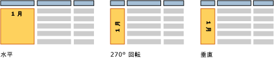

# テキスト ボックス (レポート ビルダーおよび SSRS)
  テキスト ボックスといえば、 [!INCLUDE[msCoName](../../includes/msconame-md.md)] Office PowerPoint のように領域にテキストを含むスタンド アロンのボックスを思い浮かべると思います。 [!INCLUDE[ssRSnoversion_md](../../includes/ssrsnoversion-md.md)] のページ分割されたレポートでは、同じように、タイトル、説明、ラベルの静的なテキストや、式に基づく動的なテキストを表示できます。 ただし、テーブルまたはマトリックス (Tablix データ領域) の各セルにはテキスト ボックスがあり、レポート内のスタンドアロン テキスト ボックスと同じ方法で書式設定することもできます。  
  
> [!NOTE]  
>  レポート デザイン画面またはレポート デザイン画面上のテキスト ボックスに、レポート データセットのフィールド値を直接ドラッグすると、レポートを実行する際に、結果セットの最初の値のみが表示されます。 フィールドのすべての値を表示するには、テーブル、マトリックス、または一覧データ領域を最初に作成し、データ領域のセルにフィールドをドラッグする必要があります。 この状態でレポートを実行すると、そのフィールドにすべての値が表示されます。  
  
 自由形式レイアウトでテキストを繰り返し表示するには、一覧データ領域を作成し、そこにテキスト ボックスを配置します。 複数値に対し形式を繰り返す場合は、一覧を使用します。たとえば、各顧客につき 1 回繰り返される請求書フォームなどです。 詳細については、「 [一覧がある請求書とフォームを作成する](../../reporting-services/report-design/create-invoices-and-forms-with-lists-report-builder-and-ssrs.md)」を参照してください。  
  
 テキスト ボックス レイアウト、および最後のテキスト ボックスの下の空白を制御するには、四角形のコンテナーを使用します。 詳細については、「[四角形と線 &#40;レポート ビルダーおよび SSRS&#41;](../../reporting-services/report-design/rectangles-and-lines-report-builder-and-ssrs.md)」を参照してください。  
  
 テキスト ボックス内で式を使用して、リテラル テキストを保持したり、データベースのフィールドを指定したり、データを計算したりできます。 すべての式はプレースホルダー テキストとして表示され、番号、色、および他の外観のプロパティを書式設定できます。 同じテキスト ボックス内でプレースホルダーをリテラル テキストと組み合わせることもできます。  
  
 複数のフォント、色、スタイル、およびアクションを使用して、1 つのテキスト ボックスでテキストを書式設定できます。 詳細については、「 [テキストとプレースホルダーの書式設定 &#40;レポート ビルダーおよび SSRS&#41;](../../reporting-services/report-design/formatting-text-and-placeholders-report-builder-and-ssrs.md)」を参照してください。  
  
> [!NOTE]  
>  [!INCLUDE[ssRBRDDup](../../includes/ssrbrddup-md.md)]  
  
##   テキスト ボックスの拡張と圧縮  
 既定では、テキスト ボックスのサイズは固定されています。 テキスト ボックスをその内容に応じて縦に縮小または拡張されるようにすることができます。 詳細については、「 [テキスト ボックスの拡大または縮小 &#40;レポート ビルダーおよび SSRS&#41;](../../reporting-services/report-design/allow-a-text-box-to-grow-or-shrink-report-builder-and-ssrs.md)」を参照してください。  
  
## テキスト ボックスの回転  
 テキスト ボックスを回転することによって、より読みやすいレポートを作成したり、ロケール特有のテキストの向きに対応したり、ページ サイズが固定された印刷レポートに合うようにより多くの列を調整したり、視覚的により優れたレポートを作成したりできます。 テキスト ボックスは、水平、垂直 (90 度回転)、または 270 度の各方向に回転できます。 垂直オプションは、上から下に字を書く東アジアの言語で最も一般的に使用されます。 大部分のレンダラーで、垂直オプションは、テキストが上から下に配置されるように (文字は横向きにならない) グリフの回転プロパティを処理します。 その他の言語の場合、垂直オプションおよび 270 度回転オプションではテキストは横向きに配置されます。  
  
 静的テキスト、レポート データセットのフィールド、または計算されたデータを含むテキスト ボックスを回転できます。 テキスト ボックスは、レポート本文、テーブルまたはマトリックス、レポート ヘッダーとフッターでスタンドアロンになることができます。  
  
 次の図は、月ごとにデータをグループ化するテーブル レポートの 3 つのバージョンを示しています。 月の値を含むテキスト ボックスでは、異なるテキスト ボックスの向きが使用されます。  
  
   
  
 方向はテキスト ボックスに対して設定されるため、そのテキスト ボックス内のすべてのテキストにその方向が適用されます。 テキスト ボックスの一部のみに異なる方向を指定することはできません。  
  
 最初に、「[チュートリアル: テキストの書式設定 &#40;レポート ビルダー&#41;](../../reporting-services/tutorial-format-text-report-builder.md)」のテキストの回転に関するセクション、および「[テキスト ボックスの方向の設定 &#40;レポート ビルダーおよび SSRS&#41;](../../reporting-services/report-design/set-text-box-orientation-report-builder-and-ssrs.md)」を参照してください。  
  
##   操作方法に関するトピック  
 [テキスト ボックスの追加、移動、または削除 &#40;レポート ビルダーおよび SSRS&#41;](../../reporting-services/report-design/add-move-or-delete-a-text-box-report-builder-and-ssrs.md)  
  
 [テキスト ボックス内のテキストの書式設定 &#40;レポート ビルダーおよび SSRS&#41;](../../reporting-services/report-design/format-text-in-a-text-box-report-builder-and-ssrs.md)  
  
 [テキスト ボックスの方向の設定 &#40;レポート ビルダーおよび SSRS&#41;](../../reporting-services/report-design/set-text-box-orientation-report-builder-and-ssrs.md)  
  
 [テキスト ボックスの拡大または縮小 &#40;レポート ビルダーおよび SSRS&#41;](../../reporting-services/report-design/allow-a-text-box-to-grow-or-shrink-report-builder-and-ssrs.md)  
  
## 参照  
 [テキストとプレースホルダーの書式設定 &#40;レポート ビルダーおよび SSRS&#41;](../../reporting-services/report-design/formatting-text-and-placeholders-report-builder-and-ssrs.md)   
 [数値と日付の書式設定 &#40;レポート ビルダーおよび SSRS&#41;](../../reporting-services/report-design/formatting-numbers-and-dates-report-builder-and-ssrs.md)  
  
  
