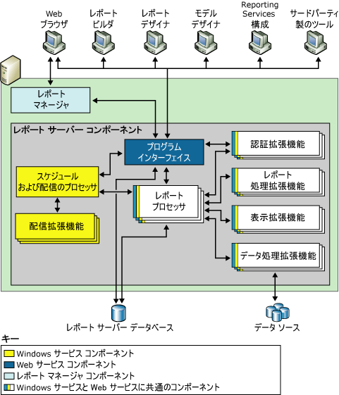
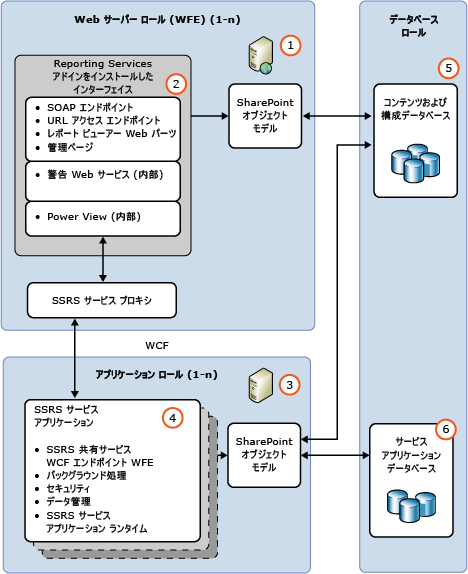

# ネイティブ モードと SharePoint の Reporting Services レポート サーバーを比較します。

[!INCLUDE[ssrs-appliesto](../../includes/ssrs-appliesto.md)] [!INCLUDE[ssrs-appliesto-2016-and-later](../../includes/ssrs-appliesto-2016-and-later.md)] [!INCLUDE[ssrs-appliesto-sharepoint-2013-2016i](../../includes/ssrs-appliesto-sharepoint-2013-2016.md)] [!INCLUDE[ssrs-appliesto-pbirsi](../../includes/ssrs-appliesto-pbirs.md)]

[!INCLUDE [ssrs-previous-versions](../../includes/ssrs-previous-versions.md)]

[!INCLUDE[ssNoVersion](../../includes/ssnoversion-md.md)] Reporting Services インストールの主要な部分について説明します。 機能を追加する拡張機能と処理エンジンで構成されます。

> [!NOTE]
> SharePoint と Reporting Services の統合は、SQL Server 2016 以降では使用できません。

Reporting Services レポート サーバーは、ネイティブ モードと SharePoint モードという 2 種類の配置モードのいずれかで動作します。 機能の比較については、「 [SharePoint モードとネイティブ モードの機能の比較](#feature-comparison-of-sharepoint-and-native-mode) 」セクションを参照してください。  
  
 **インストール:** Reporting Services のインストールについては、「[Reporting Services のインストール](../install-windows/install-reporting-services.md)」を参照してください。

## レポート サーバー モードの概要

 処理エンジン (プロセッサ) はレポート サーバーの中核となります。 プロセッサはレポート システムの整合性をサポートし、変更したり拡張したりすることはできません。 拡張機能もプロセッサですが、これらはきわめて限られた機能を実行します。 Reporting Services には、サポートされる拡張機能の種類ごとに、1 つ以上の既定の拡張機能が含まれます。 レポート サーバーにはカスタム拡張機能を追加できます。 これにより、レポート サーバーを拡張し、もともとサポートされていなかった機能を使用できるようにすることができます。たとえば、シングル サインオン テクノロジのサポート、既定の表示拡張機能では処理できないアプリケーション形式でのレポート出力、プリンターやアプリケーションへのレポート配信などのカスタム機能が考えられます。  
  
 レポート サーバーの個々のインスタンスは、プロセッサと拡張機能の完全な集合によって定義されます。この集合によって、最初の要求の処理から完成したレポートの表示まで、エンド ツー エンドの処理が行われます。 レポート サーバーは、サブコンポーネントを利用してレポート要求を処理し、要求時アクセスまたはスケジュールされた配布でレポートを利用できるようにします。  
  
 機能的には、レポート サーバーはさまざまなデータ ソースのレポート作成作業、レポート表示、およびレポート配信作業と、拡張可能な認証および承認スキームを可能にします。 また、レポート サーバーには、パブリッシュされたレポート、共有データ ソース、共有データセット、レポート パーツ、共有スケジュール、サブスクリプション、レポート定義ソース ファイル、モデル定義、コンパイル済みレポート、スナップショット、パラメーター、およびその他のリソースが格納される、レポート サーバー データベースが含まれています。 さらに、レポート サーバーでは、レポート要求を処理するようにレポート サーバーを構成する、スナップショット履歴を保持する、レポート、データ ソース、データセット、およびサブスクリプションに対する権限を管理する、などの管理作業を行うことができます。  
  
 Reporting Services レポート サーバーでは、レポート サーバー インスタンス用に次の 2 つの配置モードがサポートされています。  
  
-   **ネイティブ モード**(SharePoint Web パーツ対応ネイティブ モードを含む)。レポート サーバーはアプリケーション サーバーとして実行され、 Reporting Services コンポーネントのみを通じてすべての処理機能と管理機能が提供されます。 ネイティブ モードのレポート サーバーは、Reporting Services 構成マネージャーと SQL Server Management Studio を使って構成します。  
  
-   **SharePoint モード**。レポート サーバーは SharePoint サーバー ファームの一部としてインストールされます。  SharePoint モードの配置と構成には、PowerShell コマンドまたは SharePoint コンテンツ管理ページを使用します。  
  
 SQL Server Reporting Services では、レポート サーバーを別のモードに切り替えることはできません。 環境で使用しているレポート サーバーの種類を変更するには、目的のモードのレポート サーバーをインストールした後、古いバージョンのレポート サーバーから新しいレポート サーバーにレポート アイテムまたはレポート サーバー データベースをコピーまたは移動する必要があります。 このプロセスは、一般的には "移行" と呼ばれます。 移行に必要な手順は、移行先のモードと移行元のバージョンによって異なります。 詳細については、「 [Upgrade and Migrate Reporting Services](../../reporting-services/install-windows/upgrade-and-migrate-reporting-services.md)」をご覧ください。  
  
## SharePoint モードとネイティブ モードの機能の比較
  
|機能またはコンポーネント|ネイティブ モード|SharePoint モード|  
|--------------------------|-----------------|---------------------|  
|**URL アドレス指定**|はい|SharePoint 統合モードでは URL アドレスの利用が異なります。 レポート、レポート モデル、共有データ ソース、およびリソースの参照には SharePoint URL が使用されます。 レポート サーバーのフォルダー階層は使用されません。 ネイティブ モードのレポート サーバー上でサポートされる URL アクセスに依存するカスタム アプリケーションでは、レポート サーバーが SharePoint 統合用に構成されると、この機能が動作しなくなります。   URL アクセスの詳細については、「 [URL アクセス パラメーター リファレンス](../../reporting-services/url-access-parameter-reference.md)」を参照してください。|  
|**カスタム セキュリティ拡張機能**|はい|Reporting Services のカスタム セキュリティ拡張機能は、レポート サーバーに配置したり使用することはできません。 レポート サーバーには特別な用途のセキュリティ拡張機能が用意されており、SharePoint 統合モードで動作するようにレポート サーバーを構成するときは常に使用されます。 このセキュリティ拡張機能は内部コンポーネントで、統合操作に必要です。|  
|**構成マネージャー**|はい|**\*\* 重要 \*\*** 構成マネージャーは、SharePoint モードのレポート サーバーの管理には使用できません。 代わりに、SharePoint サーバーの全体管理を使用してください。|  
|**Web ポータル**|はい|Web ポータルでの SharePoint モードを管理することはできません。 SharePoint アプリケーション ページを使用してください。 詳細については、「 [Reporting Services の SharePoint サービスとサービス アプリケーション](../../reporting-services/report-server-sharepoint/reporting-services-sharepoint-service-and-service-applications.md)｣を参照してください。|  
|**リンク レポート**|はい|不可。|  
|**個人用レポート**|はい|いいえ|  
|**個人用サブスクリプション** とバッチ処理方式|はい|いいえ|  
|**データ警告**|いいえ|はい|  
|**Power View**|いいえ|はい   クライアント ブラウザーに Silverlight が必要です。 ブラウザーの要件の詳細については、「 [Reporting Services と Power View のブラウザー サポート](../../reporting-services/browser-support-for-reporting-services-and-power-view.md)」を参照してください。|  
|**.RDL レポート**|はい|はい   .RDL レポートは、ネイティブ モードまたは SharePoint モードの Reporting Services レポート サーバーで実行できます。|  
|**.RDLX レポート**|いいえ|はい   Power View .RDLX レポートは、SharePoint モードの Reporting Services レポート サーバーでのみ実行できます。|  
|**SharePoint リストの拡張機能用の SharePoint ユーザー トークン資格情報**|いいえ|はい|  
|**インターネットに直接つながっている配置の AAM 領域**|いいえ|はい|  
|**SharePoint のバックアップと回復**|いいえ|はい|  
|**ULS ログのサポート**|いいえ|はい|  
  
## ネイティブ モード

 ネイティブ モードでは、レポート サーバーはスタンドアロンのアプリケーション サーバーとして、レポートとレポート モデルの表示、管理、処理、配信の機能をすべて提供します。 これはレポート サーバー インスタンスの既定のモードです。 セットアップ時にネイティブ モードのレポート サーバーを構成してインストールすることも、セットアップの完了後にレポート サーバーを構成してネイティブ モードで操作できるようにすることもできます。  
  
 次の図は、Reporting Services ネイティブ モードの配置の 3 層アーキテクチャを示しています。 ここでは、データ層のレポート サーバー データベースとデータ ソース、中間層のレポート サーバー コンポーネント、およびプレゼンテーション層のクライアント アプリケーションと組み込みツールまたはカスタム ツールを示しています。 また、サーバー コンポーネント間での要求およびデータの流れと、データ ストアからコンテンツを送信および取得するコンポーネントも示しています。  
  
   
  
 Web サービス、バックグラウンド処理、およびその他の操作をホストする、"レポート サーバー サービス" と呼ばれる [!INCLUDE[msCoName](../../includes/msconame-md.md)] Windows サービスとして、レポート サーバーは実装されます。 Services コンソール アプリケーションでは、このサービスは SQL Server Reporting Services (MSSQLSERVER) として表示されます。  
  
 サード パーティの開発者は、追加の拡張機能を作成して、レポート サーバーの処理能力を置き換えたり、拡張したりできます。 アプリケーション開発者が利用できるプログラマティック インターフェイスの詳細については、「 [テクニカル リファレンス](../../reporting-services/technical-reference-ssrs.md)」を参照してください。  
  
### SharePoint Web パーツ対応ネイティブ モード

 Reporting Services には、[!INCLUDE[winSPServ](../../includes/winspserv-md.md)] 2.0 以降、または SharePoint Portal Server 2003 以降のインスタンスにインストールおよび登録できる Web パーツが 2 つ用意されています。 SharePoint サイトからは、Web パーツを使用して、ネイティブ モードで動作するレポート サーバーに格納され処理されているレポートを検索し表示できます。 これらの Web パーツは、Reporting Services の前のリリースで導入されたものです。  
  
## SharePoint モード

 SharePoint モードでは、レポート サーバーが SharePoint サーバー ファーム内で実行される必要があります。 レポート サーバーの処理、表示、および管理機能は、Reporting Services SharePoint 共有サービスを実行する SharePoint アプリケーション サーバーおよび 1 つ以上の Reporting Services サービス アプリケーションから提供されます。 レポート サーバーのコンテンツや操作へのフロントエンド アクセスを、SharePoint サイトが提供します。  
  
 SharePoint モードでは次のものが必要です。  
  
-   [!INCLUDE[SPF2010](../../includes/spf2010-md.md)] または [!INCLUDE[SPS2010](../../includes/sps2010-md.md)]。  
  
-   SharePoint 2010 製品用の適切なバージョンの Reporting Services アドイン。  
  
-   Reporting Services 共有サービスがインストールされている SharePoint アプリケーション サーバーと、少なくとも 1 つの Reporting Services サービス アプリケーション。  
  
 次の図は、SharePoint モードの Reporting Services 環境を示しています。  
  
   
  
||[説明]|  
|-|-----------------|  
|**(1)**|Web サーバーまたは Web フロントエンド (WFE)。 Reporting Services アドインは、レポートや Reporting Services 管理ページの表示などの Web アプリケーション機能を使用してデータ ソースやサブスクリプションの管理などのタスクを実行する場合に、それらの機能を使用する各 Web サーバーにインストールする必要があります。|  
|**(2)**|アドインによってインストールされる URL と SOAP エンドポイントによって、クライアントが Reporting Services サービス プロキシ経由でアプリケーション サーバーと通信できるようになります。|  
|**(3)**|Reporting Services 共有サービスを実行しているアプリケーション サーバー。 レポート処理のスケールアウトは SharePoint ファームの一部として管理され、Reporting Services サービスを追加のアプリケーション サーバーに追加することによって実行されます。|  
|**(4)**|アクセス許可、電子メール、プロキシ、サブスクリプションを含むさまざまな構成を持つ、1 つ以上の Reporting Services サービス アプリケーションを作成できます。|  
|**(5)**|レポート、データ ソース、および他のアイテムが SharePoint コンテンツ データベースに格納されます。|  
|**(6)**|Reporting Services サービス アプリケーションは、レポート サーバー、一時、およびデータ警告の各機能のために 3 つのデータベースを作成します。 すべての SSRS サービス アプリケーションに適用される構成設定は **RSReportserver.config** ファイルに格納されます。|  
  
## レポートのプロセス、およびスケジュールと配信のプロセス

 レポート サーバーには 2 つの処理エンジンがあります。これらは、事前および中間のレポート処理と、スケジュールおよび配信の処理を行います。 レポート プロセッサは、レポートの定義またはモデルを取得し、データ処理拡張機能からのデータにレイアウト情報を結合して、それを要求された形式で表示します。 スケジュールおよび配信プロセスでは、スケジュールによって起動されたレポートを処理し、目的の配信先にレポートを配信します。  
  
## レポート サーバー データベース

 レポート サーバーは、すべてのプロパティ、オブジェクト、およびメタデータを [!INCLUDE[ssNoVersion](../../includes/ssnoversion-md.md)] データベースに格納する、ステートレス サーバーです。 格納されるデータには、パブリッシュされたレポート、コンパイル済みレポート、レポート モデル、およびレポート サーバーが管理するすべてのアイテムへのアクセスを提供するフォルダー階層が含まれます。 レポート サーバー データベースは、Reporting Services の単一のインストール用、またはスケールアウト配置に含まれる複数のレポート サーバー用の内部記憶域を提供します。 SharePoint 製品またはテクノロジの大規模な配置内で実行されるようにレポート サーバーを構成すると、レポート サーバーでは、レポート サーバー データベースに加えて SharePoint データベースも使用されます。 Reporting Services インストールで使用されるデータ ストアの詳細については、「[レポート サーバー データベース &#40;SSRS ネイティブ モード&#41;](../../reporting-services/report-server/report-server-database-ssrs-native-mode.md)」を参照してください。  
  
## 認証、表示、データ、配信の各拡張機能

 レポート サーバーでサポートされる拡張機能の種類は、認証拡張機能、データ処理拡張機能、レポート処理拡張機能、表示拡張機能、および配信拡張機能です。 レポート サーバーには、少なくとも 1 つの認証拡張機能、データ処理拡張機能、および表示拡張機能が必要です。 配信拡張機能とカスタム レポート処理拡張機能は省略可能ですが、レポートの配信またはカスタム コントロールをサポートする場合は必須です。  
  
 Reporting Services が提供する既定の拡張機能を使用すると、カスタム コンポーネントを開発することなく、すべてのサーバー機能を使用できます。 次の表に示す既定の拡張機能は、完全なレポート サーバー インスタンスの一部であり、すぐに使用できる機能を提供します。  
  
|型|既定|  
|----------|-------------|  
|[認証]|既定のレポート サーバー インスタンスでは、Windows 認証がサポートされます。ドメインで有効になっていれば、権限の借用機能や委任機能もサポートされます。|  
|データ処理|既定のレポート サーバー インスタンスには、 [!INCLUDE[ssNoVersion](../../includes/ssnoversion-md.md)]、 [!INCLUDE[ssASnoversion](../../includes/ssasnoversion-md.md)]、Oracle、Hyperion Essbase、SAPBW、OLE DB、並列データ ウェアハウス、ODBC の各データ ソース用のデータ処理拡張機能があります。|  
|表示|既定のレポート サーバー インスタンスには、HTML、Excel、CSV、XML、Image、Word、SharePoint リスト、および PDF 用の表示拡張機能があります。|  
|Delivery|既定のレポート サーバー インスタンスには、電子メールの配信拡張機能とファイル共有の配信拡張機能があります。 レポート サーバーが SharePoint 統合用に構成されている場合は、レポートを SharePoint ライブラリに保存する配信拡張機能を使用できます。|  
  
> [!NOTE]  
>  Reporting Services に含まれているツールとアプリケーションの完全なセットを使用すると、サーバーを管理したり、コンテンツを作成したり、組織内のユーザーがそのコンテンツを使用できるようにしたりすることができます。  
  
## 関連タスク

 以下の記事には、レポート サーバーのインストール、使用、およびメンテナンスに関する追加情報が記載されています。  
  
|タスク|リンク|  
|----------|----------|  
|ハードウェアおよびソフトウェアの要件を確認します。|「[Hardware and Software Requirements for Reporting Services in SharePoint Mode](https://msdn.microsoft.com/library/ed91877d-4f74-4266-a932-b824b4810c99)」を参照してください。|  
|SharePoint モードで Reporting Services をインストールします。|[SharePoint 2010 用 Reporting Services の SharePoint モードのインストール](https://msdn.microsoft.com/47efa72e-1735-4387-8485-f8994fb08c8c)|  
|レポート サーバー Web サービスおよび Windows サービスに対するメモリ設定を調整する方法について説明します。|[レポート サーバー アプリケーションで利用可能なメモリの構成](../../reporting-services/report-server/configure-available-memory-for-report-server-applications.md)|  
|リモート管理用にレポート サーバーを構成するための推奨されている手順について説明します。|[リモート管理用のレポート サーバーの構成](../../reporting-services/report-server/configure-a-report-server-for-remote-administration.md)|  
|ネイティブのレポート サーバー インスタンスで **個人用レポート** を使用できるかどうかを構成する方法について説明します。|[個人用レポートの有効化と無効化](../../reporting-services/report-server/enable-and-disable-my-reports.md)|  
|サポートされているブラウザーから、印刷機能を実現する RSClientPrint コントロールを設定する方法について説明します。 ブラウザーの要件の詳細については、「 [Reporting Services と Power View のブラウザー サポート](../../reporting-services/browser-support-for-reporting-services-and-power-view.md)」を参照してください。|[Reporting Services のクライアント側印刷機能の有効化と無効化](../../reporting-services/report-server/enable-and-disable-client-side-printing-for-reporting-services.md)|  

## 次の手順

[Reporting Services の拡張機能](../../reporting-services/extensions/reporting-services-extensions.md)   
[Reporting Services ツール](../../reporting-services/tools/reporting-services-tools.md)   
[サブスクリプションと配信 &#40;Reporting Services&#41;](../../reporting-services/subscriptions/subscriptions-and-delivery-reporting-services.md)   
[レポート サーバー データベース &#40;SSRS ネイティブ モード&#41;](../../reporting-services/report-server/report-server-database-ssrs-native-mode.md)   
[セキュリティ拡張機能の実装](../../reporting-services/extensions/security-extension/implementing-a-security-extension.md)   
[データ処理拡張機能の実装](../../reporting-services/extensions/data-processing/implementing-a-data-processing-extension.md)   
[Reporting Services でサポートされるデータ ソース (SSRS)](../../reporting-services/report-data/data-sources-supported-by-reporting-services-ssrs.md)   

その他の質問 [Reporting Services のフォーラムに質問してみてください](https://go.microsoft.com/fwlink/?LinkId=620231)
