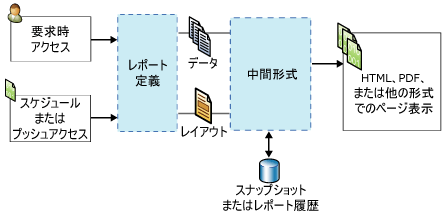

# Reporting Services の概念 (SSRS)
  このトピックでは、 [!INCLUDE[ssNoVersion](../includes/ssnoversion-md.md)] [!INCLUDE[ssRSnoversion](../includes/ssrsnoversion-md.md)] の概念を簡単に説明します。  
  
 **[!INCLUDE[applies](../includes/applies-md.md)]**  [!INCLUDE[ssRSnoversion](../includes/ssrsnoversion-md.md)] ネイティブ モード | [!INCLUDE[ssRSnoversion](../includes/ssrsnoversion-md.md)] SharePoint モード   
  
##   レポート サーバーの概念  
 レポート サーバーは、 [!INCLUDE[ssRSnoversion](../includes/ssrsnoversion-md.md)] のインスタンスがインストールされているコンピューターです。 レポート サーバーには、改ページ調整されたレポートおよびモバイル レポート、レポート関連のアイテムやリソース、スケジュール、サブスクリプションなどのアイテムが内部的に保存されます。 レポート サーバーは、スタンドアロンの単一サーバーまたはスケールアウト ファームとして構成したり、SharePoint Server と統合したりすることができます。 レポート サーバーのアイテムは、 [!INCLUDE[ssRSnoversion](../includes/ssrsnoversion-md.md)] Web サービス、WMI プロバイダー、URL アクセス、またはプログラムからスクリプトを使用して操作します。 レポート サーバーを操作する方法は、配置トポロジと構成によって異なります。  
  
### ネイティブ モードのレポート サーバー
 ネイティブ モードで構成されたレポート サーバーは、 [!INCLUDE[ssNoVersion](../includes/ssnoversion-md.md)] [!INCLUDE[ssRSnoversion](../includes/ssrsnoversion-md.md)] がインストールされ、スタンドアロン サーバーとして構成されているコンピューターです。 レポート サーバー、レポート、およびレポート関連アイテムは、ブラウザーで [!INCLUDE[ssRSWebPortal](../includes/ssrswebportal.md)] または URL アクセス コマンドを使用する、SQL Server Management Studio を使用する、またはプログラムからスクリプトを使用して操作します。 詳細については、「 [Reporting Services レポート サーバー (ネイティブ モード)](../reporting-services/report-server/reporting-services-report-server-native-mode.md)」を参照してください。  
  
### SharePoint モードのレポート サーバー  
 SharePoint と統合されたレポート サーバーは、2 種類の構成が可能です。 [!INCLUDE[ssRSCurrent](../includes/ssrscurrent-md.md)]の場合、 [!INCLUDE[ssRSnoversion](../includes/ssrsnoversion-md.md)] は SharePoint Server と共に SharePoint 共有サービスとしてインストールされます。 以前のリリースのレポート サーバーは、 [!INCLUDE[ssRSnoversion](../includes/ssrsnoversion-md.md)] SharePoint アドインをインストールすることで SharePoint Server と統合されます。 どちらの場合も、レポート サーバー、レポート、およびレポート関連アイテムは、SharePoint サイトでアプリケーション ページを使用して操作します。 レポートに関連するコンテンツの種類を保存するには、SharePoint ドキュメント ライブラリや独自に作成するその他のライブラリを使用します。 詳細については、「[Reporting Services レポート サーバー &#40;SharePoint モード&#41;](../reporting-services/report-server-sharepoint/reporting-services-report-server-sharepoint-mode.md)」を参照してください。  
  
### レポート サーバー アイテム 
 レポート サーバー アイテムには、改ページ調整されたレポートおよびモバイル レポート、KPI、共有データ ソース、共有データセット、レポート サーバーにパブリッシュ、アップロード、または保存できるレポートなどがあります。 アイテムは、ネイティブのレポート サーバーではレポート サーバーの階層フォルダー構造に、SharePoint サイトでは SharePoint コンテンツ ライブラリに整理します。 詳細については、「[レポート サーバー コンテンツの管理 &#40;SSRS ネイティブ モード&#41;](../reporting-services/report-server/report-server-content-management-ssrs-native-mode.md)」を参照してください。  
  
### フォルダー
 ネイティブのレポート サーバーでは、フォルダーによって、レポート サーバーに格納されたすべてのアクセス可能なアイテムの階層ナビゲーション構造とパスが提供されます。 レポート サーバー アイテムへのアクセスを制御するには、フォルダー階層、およびサイトとフォルダーの権限を使用します。これは、" *アイテムレベルのセキュリティ*" と呼ばれます。 既定では、特定のフォルダーに定義するロールの割り当ては、そのフォルダー階層内の子フォルダーに継承されます。 フォルダーに特定のロールを割り当てる場合は、この継承ルールは適用されません。 フォルダー構造は、 **"ホーム"** という名前のルート ノードと、省略可能な **個人用レポート** 機能をサポートする予約済みフォルダーで構成されます。 ブラウザーでは、ルート ノードはレポート サーバーの仮想ディレクトリの名前です (例: `https://myreportserver/reports`)。 詳細については、「 [Folders](../reporting-services/report-server/report-server-content-management-ssrs-native-mode.md#bkmk_Folders)」を参照してください。  
  
 SharePoint サイトでは、ドキュメント ライブラリとコンテンツ ライブラリ内の SharePoint フォルダーを使用してアイテムを整理します。  
  
### ロールと権限
 ネイティブのレポート サーバーでは、レポート サーバーのシステム管理者は、アクセス権の管理、レポート要求を処理するためのレポート サーバーの構成、スナップショット履歴の保持、レポート、データ ソース、データセット、およびサブスクリプションに対する権限の管理を行います。 たとえば、パブリッシュされたレポートは、 [!INCLUDE[ssRSnoversion](../includes/ssrsnoversion-md.md)] のロール ベースのセキュリティ モデルを使用したロールの割り当てによってセキュリティが確保されます。 詳細については、「[ロールと権限 (Reporting Services)](../reporting-services/security/roles-and-permissions-reporting-services.md)」を参照してください。  
  
 SharePoint サイトでは、SharePoint サイト管理者ページを使用して、レポートおよびレポート関連のサイト コンテンツに対する権限を管理します。  
  
### スケジュール
 ネイティブのレポート サーバーで、特定の時間またはピーク タイム以外の時間にデータを取得してレポートとデータセット クエリを配信するように、改ページ調整されたレポート、共有データセット、およびサブスクリプションのスケジュールを設定できます。 スケジュールは、一度だけ実行することも、時間、日、週、月間隔で継続して実行することもできます。 詳細については、「 [Schedules](../reporting-services/subscriptions/schedules.md)」を参照してください。  
  
### サブスクリプションと配信  
 サブスクリプションとは、特定の時刻やイベントの発生時に、指定したアプリケーション ファイル形式でレポートを受け取ることができるようにする予約された配信要求です。 サブスクリプションは、要求時にレポートを実行する以外のレポート実行方法を提供します。 要求時にレポートを実行するには、レポートを表示したいときに、毎回レポートを選択する必要があります。 一方、サブスクリプションを使用すると、レポートの配信をスケジュールして自動実行することができます。 電子メールの受信ボックスまたはファイル共有にレポートを配信できます。 詳細については「[サブスクリプションと配信 &#40;Reporting Services&#41](../reporting-services/subscriptions/subscriptions-and-delivery-reporting-services.md)」を参照してください。  
  
### 拡張機能
 [!INCLUDE[ssNoVersion](../includes/ssnoversion-md.md)] [!INCLUDE[ssRSnoversion](../includes/ssrsnoversion-md.md)] には、レポート ソリューションのカスタマイズに使用できる拡張可能なアーキテクチャが用意されています。 レポート サーバーは、カスタム認証拡張機能、データ処理拡張機能、レポート処理拡張機能、表示拡張機能、配信拡張機能、およびユーザーが RSReportServer.config 構成ファイルで構成できる拡張機能をサポートします。 たとえば、レポート ビューアーで使用できるエクスポート形式を制限できます。 配信拡張機能とレポート処理拡張機能は省略可能ですが、レポートの配信またはカスタム コントロールをサポートする場合は必須です。 詳細については、「[Reporting Services の拡張機能 &#40;SSRS&#41;](../reporting-services/extensions-ssrs.md)」を参照してください。  
  
### レポートへのアクセス 
 要求時アクセスでは、ユーザーがレポート表示ツールからレポートを選択できます。 レポート サーバーの構成によって異なりますが、 [!INCLUDE[ssRSWebPortal](../includes/ssrswebportal.md)]、 [!INCLUDE[msCoName](../includes/msconame-md.md)] SharePoint 2.0 Web パーツ、SharePoint ライブラリ ( [!INCLUDE[ssRSnoversion](../includes/ssrsnoversion-md.md)] が SharePoint 統合モードでインストールされている場合)、埋め込みの ReportViewer コントロール、URL アクセスを使用するブラウザーの使用が可能です。 レポートへのオンデマンド アクセスの詳細については、「[レポートの検索、表示、管理 &#40;レポート ビルダーおよび SSRS&#41;](../reporting-services/report-builder/finding-viewing-and-managing-reports-report-builder-and-ssrs.md)」を参照してください。  
  
 サブスクリプションは、要求時にレポートを実行する以外のレポート実行方法を提供します。 詳細については「[サブスクリプションと配信 &#40;Reporting Services&#41](../reporting-services/subscriptions/subscriptions-and-delivery-reporting-services.md)」を参照してください。  
  
 レポート サーバーの操作に使用するツールの一覧については、「 [Reporting Services ツール](../reporting-services/tools/reporting-services-tools.md)」を参照してください。  
  
  
##   レポートと関連アイテムの概念  
### レポートとレポート定義

 **RDL (RDL)** 
 
 レポート定義は、レポート定義言語 (RDL) と呼ばれる XML 文法に準拠した XML ファイルです。 [!INCLUDE[ssRSnoversion](../includes/ssrsnoversion-md.md)]では、レポート ビルダーやレポート デザイナーなどのツールでレポート定義を作成します。 レポート定義には、データ ソース接続、データ取得に使用するクエリ、式、パラメーター、画像、テキスト ボックス、表、デザイン時のその他のレイアウトなどを定義する要素が含まれています。 詳細については、「[レポート定義言語 (SSRS)](../reporting-services/reports/report-definition-language-ssrs.md)」を参照してください。  
  
 **RSMOBILE**

SQL Server Mobile Report Publisher では、Reporting Services モバイル レポート (.rsmobile ファイル) を作成します。 これらのレポートはモバイル デバイス用に最適化されており、オンプレミス データに接続し、多様な視覚エフェクトが含まれています。 詳しくは、 [Reporting Services モバイル レポート](../reporting-services/mobile-reports/create-mobile-reports-with-sql-server-mobile-report-publisher.md)に関するページをご覧ください。 
  
 **RDLC** 
 
 Visual Studio のレポート デザイナーでは、ReportViewer コントロールで使用する、XML 形式のクライアント レポート定義 (.rdlc) ファイルが生成されます。  
  
### レポートのデータ接続とデータ ソース 
 クエリが実行されるとき、またはレポートが処理されるとき、レポートはデータを取得するためにデータ接続を使用します。 レポート定義では、データ接続はデータ ソースと同じです。 ユーザーは、そのデータ接続を、リレーショナル データベース、多次元データベース、Web サービスなどのデータ ソースに接続する組み込みのデータ接続の種類の一覧から選択します。 データ接続の説明では、次の用語を使用します。  
  
-   **データ接続:** " *データ ソース*" とも呼ばれます。 データ接続には、名前と、接続の種類に依存する接続のプロパティが含まれます。 仕様上、データ接続に資格情報は含まれません。 データ接続では、どのデータを外部データ ソースから取得するかは指定されません。 これを行うには、データセットを作成するときにクエリを指定します。  
  
-   **データ ソースの定義:** レポート データ ソースの XML 表現を含むファイル。 レポートをパブリッシュすると、そのデータ ソースは、レポート定義とは別にデータ ソース定義として、レポート サーバーまたは SharePoint サイトに保存されます。 たとえば、レポート サーバー管理者は、接続文字列や資格情報を更新することができます。 ネイティブのレポート サーバーでのファイルの種類は .rds です。 SharePoint サイトでのファイルの種類は .rsds です。  
  
-   **接続文字列:** 接続文字列は、データ ソースに接続するために必要な接続プロパティの文字列バージョンです。 接続プロパティはデータ接続の種類に応じて異なります。  
  
-   **共有データ ソース。** レポート サーバーまたは SharePoint サイトにあり、複数のレポートで使用することができるデータ ソースです。  
  
     共有データ ソースは、よく使用するデータ ソースがある場合に役立ちます。 可能な限り共有データ ソースを使用することをお勧めします。 レポートやレポートへのアクセスが管理しやすくなり、レポートやレポートからアクセスするデータ ソースの安全性を高めることができます。 共有データ ソースが必要な場合は、システム管理者に依頼して作成してもらってください。  
  
     レポート ビルダーで共有データ ソースを作成することはできません。 共有データ ソースはレポート サーバーで参照し、選択できます。  
  
     レポート デザイナーでは、レポート サーバー上の共有データ ソースを参照できません。 共有データ ソースは、ソリューション エクスプローラーでプロジェクトの一部として作成し、レポート サーバーに配置するかどうかを選択できます。 使用しているコンピューターとレポート サーバーの資格情報の相違のため、これらをローカルでのみ使用するように選択する場合もあります。  
  
-   **埋め込みデータ ソース:** " *レポート固有のデータ ソース*" とも呼ばれます。埋め込みデータ ソースは、レポート内で定義され、そのレポートでのみ使用されます。  
  
     埋め込みデータ ソースは、レポート定義に保存されるデータ接続です。 埋め込まれたデータ ソースの接続情報は、その情報が埋め込まれたレポートでのみ使用できます。  
  
-   **資格情報。** 資格情報は、外部データにアクセスするために指定する必要がある認証情報です。  
  
     資格情報は、埋め込みデータ ソースの作成、クエリの実行、またはレポート処理時のデータ取得のために使用されます。 データ ソースの所有者が、データへのアクセスに使用する必要がある資格情報の種類を決定します。 資格情報は、データ接続とは別に、レポート作成環境内のレポート サーバー、SharePoint サイト、またはローカル コンピューターで管理されます。 データ ソースの種類に応じて、資格情報を保存して各ユーザーに入力を求めないようにすることも、入力を求めるように設定することもできます。 必要とされる資格情報は、データ ソースへの接続に、自分のコンピューターを使用しているかレポート サーバーを使用しているかに応じて異なる場合があります。 詳細については、「 [レポート ビルダーでの資格情報の指定](https://msdn.microsoft.com/library/7412ce68-aece-41c0-8c37-76a0e54b6b53)」を参照してください。  
  
### レポート データセット 
 レポートにおけるデータセットとは、外部データ ソースに対してクエリを実行することによって返されるレポート データをいいます。 外部データ ソースに関する情報はデータ接続に含まれており、データセットは、そのデータ接続によって異なります。 レポート定義にデータそのものは含まれていません。 データセットには、クエリ コマンド、フィールド コレクション、パラメーター、フィルター、および大文字と小文字の区別と照合順序を含むデータ オプションがあります。 データセットには次の 2 種類があります。  
  
-   **共有データセット:** 共有データセットはレポート サーバー上でパブリッシュされ、複数のレポートで使用できます。 共有データセットは共有データ ソースに基づく必要があります。 キャッシュ更新計画を作成することによって、共有データセットをキャッシュおよびスケジュールできます。  
  
-   **埋め込みデータセット:** 埋め込みデータセットは 1 つのレポートで定義および使用されます。  
  
 詳細については、「 [レポート埋め込みデータセットと共有データセット &#40;レポート ビルダーおよび SSRS&#41;](../reporting-services/report-data/report-embedded-datasets-and-shared-datasets-report-builder-and-ssrs.md)と呼ばれます。  
  
### レポート パラメーター 
 レポート パラメーターは、レポート定義の一部です。 関連するレポートをリンクさせたり、レポートの外観を制御したり、レポート データをフィルター選択したり、レポートの範囲を特定のユーザーまたは場所に絞り込んだりする目的で、Reporting Services の改ページ調整されたレポートおよびモバイル レポートにパラメーターを追加することができます。 改ページ調整されたレポートがネイティブのレポート サーバーまたは SharePoint サイトにパブリッシュされると、レポート パラメーターが個別のレポート サーバー アイテムとして保存されます。 パラメーターはレポート定義とは別に管理できます。 同じレポートに対して複数のパラメーターのセットを作成するには、 *リンク レポート*を作成します。  
  
### レポート アイテム 
 レポート アイテムは、Reporting Services の改ページ調整されたレポート定義の内部概念ですが基本的な概念です。 レポート アイテムのプロパティは、データ領域、マップ、テキスト ボックス、画像、およびレポートに追加するその他のデザイン要素に適用されます。 レポート アイテムのプロパティを理解しておくと、カスタマイズされたレポートのコンテンツや外観をデザインする際に役立ちます。 たとえば、すべてのレポート アイテムには表示を制御する [非表示] プロパティがあります。  
  
### データ領域とマップ 
 データ領域は、Reporting Services の改ページ調整されたレポートで 1 つのデータセットのデータを表示するレイアウト要素です。 データ領域の種類には、Tablix、グラフ、ゲージ、およびインジケーターがあります。 マップは 2 つのデータセット (空間データを含むデータセットと分析データを含むデータセット) のデータを表示できるため、特別な種類のデータ領域です。  
  
 データ領域を使用すると、一般的なデータ視覚化機能 (テーブル、マトリックス、または一覧内の数値やテキスト、グラフまたはゲージ内のグラフィック表示、マップに対する地理的表示) を有効にできます。 テーブル、マトリックス、および一覧は、Tablix データ領域に基づいており、データセットのデータをすべて表示するために必要に応じて拡張されます。 Tablix データ領域では、複数の行グループおよび列グループと、静的および動的な行と列がサポートされます。 グラフでは、複数の系列グループとカテゴリ グループをさまざまなグラフ形式で表示します。 ゲージでは、データセットの単一の値または集計値を表示します。 マップでは、データセットの集計データに基づいて表示を変更できるマップ要素として空間データを表示します。  
  
-   **テーブル。** テーブルは、データを行ごとに表示するデータ領域です。 テーブルの列は静的です。列数はレポートのデザイン時に指定します。 テーブルの行は動的であり、データに応じて下方向に拡張されます。 テーブルにグループを追加すると、選択したフィールドまたは式ごとにデータを整理できます。 詳細については、「 [テーブル、マトリックス、および一覧 &#40;レポート ビルダーおよび SSRS&#41;](https://msdn.microsoft.com/9dcf3fc8-bf9c-4a14-a03d-e78254aa4098)」を参照してください。  
  
-   **マトリックス。** マトリックスは、クロス集計ともいいます。 マトリックス データ領域では、動的な列と行の両方がデータに応じて拡張されます。 マトリックスには、動的な列と行、および静的な列と行を含めることができます。 列または行には、他の列または行を含めることができ、データのグループ化にも使用できます。 詳細については、「 [テーブル、マトリックス、および一覧 &#40;レポート ビルダーおよび SSRS&#41;](https://msdn.microsoft.com/9dcf3fc8-bf9c-4a14-a03d-e78254aa4098)」を参照してください。  
  
-   **一覧。** 一覧は、任意の形式で配置されたデータを表すデータ領域です。 レポート アイテムを配置して、テキスト ボックス、画像、およびその他のデータ領域が一覧内の任意の場所に配置されたフォームを作成できます。 詳細については、「 [テーブル、マトリックス、および一覧 &#40;レポート ビルダーおよび SSRS&#41;](https://msdn.microsoft.com/9dcf3fc8-bf9c-4a14-a03d-e78254aa4098)」を参照してください。  
  
-   **グラフ。** グラフを使用すると、データをグラフィカルに表示できます。 グラフの例としては、棒グラフ、円グラフ、折れ線グラフなどがありますが、その他にも多くの形式がサポートされています。 グラフ要素の詳細については、「 [グラフ &#40;レポート ビルダーおよび SSRS&#41;](../reporting-services/report-design/charts-report-builder-and-ssrs.md)」を参照してください。  
  
-   **ゲージ。** ゲージは、特定の値を指すインジケーターを内部に含む領域としてデータを表示します。 ゲージは、主要業績評価指標 (KPI) やその他の基準を表示するために使用されます。 ゲージの例として、線形ゲージや円形ゲージなどがあります。 詳しくは、「 [ゲージ &#40;レポート ビルダーおよび SSRS&#41;](../reporting-services/report-design/gauges-report-builder-and-ssrs.md)」をご覧ください。  
  
-   **マップ。** マップでは、地理的な背景にデータを表現することができます。 マップ データには、 [!INCLUDE[ssNoVersion](../includes/ssnoversion-md.md)] クエリ、ESRI シェープファイル、または [!INCLUDE[msCoName](../includes/msconame-md.md)] Bing マップのタイルの空間データを指定できます。 空間データは、形状または領域を表す多角形、ルートまたはパスを表す線、およびマーカーで表されるポイントを定義する座標のセットで構成されます。 集計データをマップ要素に関連付けて、マップ要素の色とサイズを自動的に変化させることができます。 たとえば、売上高に基づいて店舗のマーカーの種類を変えたり、制限速度に基づいて道路の色を変えたりできます。 詳細については、「[マップ &#40;レポート ビルダーおよび SSRS&#41;](../reporting-services/report-design/maps-report-builder-and-ssrs.md)」を参照してください。  
  
 また、以下のように、データ領域にリンクされていないデータセットの値を含めることもできます。  
  
-   別のデータセットをスコープ パラメーターとして指定する集計関数への呼び出しを含む式 (例: `=Max(Fields!Sales.Value, "AnnualSales")`)。  
  
-   **Lookup** 関数を使用して、別のデータセットの名前と値のペアの値を参照します。  
  
### レポート パーツ
 レポート パーツ定義 (.rsc) は、レポート定義ファイルの XML フラグメントであるレポート サーバー アイテムです。 レポート パーツを作成するには、レポート定義を作成し、そのレポート内のレポート アイテムを選択して、レポート パーツとして個別にパブリッシュします。 レポート パーツには、データ領域、四角形とそれに含まれているアイテム、画像などがあります。 レポート パーツと共に依存データセットおよび共有データ ソース参照を保存して、他のレポートで再利用できます。 詳細については、「[レポート デザイナーでのレポート パーツ &#40;SSRS&#41;](../reporting-services/report-design/report-parts-in-report-designer-ssrs.md)」を参照してください。  
  
### データ警告 
 データ警告は、警告データベースに内部的に格納されるアイテムです。 データ警告定義には、既存のレポート データ フィードから使用するデータ、満たす条件、スケジュール、警告の受信者が含まれています。 データ警告は、SharePoint Server と統合されたレポート サーバーにパブリッシュされたレポートでのみ使用できます。 データ警告は、ネイティブのレポート サーバー インストールでは使用できません。 詳細については、「 [Reporting Services のデータ警告](../reporting-services/reporting-services-data-alerts.md)」を参照してください。  
  
  
##   Reporting Services の改ページ調整されたレポートの型  
 [!INCLUDE[ssRSnoversion](../includes/ssrsnoversion-md.md)]では、 *レポート* は特殊なレポート サーバー アイテム、レイアウト デザイン、またはソリューション デザインに適用できます。 1 つの Reporting Services の改ページ調整されたレポートには、複数の種類のレポートの特性を持たせることができます。たとえば、あるレポートを同時にスタンドアロン レポートにしたり、メイン レポートによって参照されるサブレポートにしたり、別のメイン レポート内の詳細レポートの対象にしたりすることができます。  
  
### ドリルダウン レポート 
 ドリルダウン レポートは、最初は複雑さが隠されており、条件によって非表示になっているレポート アイテムをユーザーが切り替えることによって、表示する詳細データ量を制御できるレイアウト デザインです。 ドリルダウン レポートでは、レポートに表示される可能性があるすべてのデータを取得する必要があります。 大量のデータを使用するレポートの場合は、詳細レポートを使用することを検討してください。 詳細については、「[ドリルダウン アクション &#40;レポート ビルダーおよび SSRS&#41;](../reporting-services/report-design/drilldown-action-report-builder-and-ssrs.md)」を参照してください。  
  
### サブレポート
 サブレポートは、レポートをレイアウト要素として追加するレポート アイテムです。 サブレポートは別のレポートを指し、メイン レポートの本文内にサブレポート インスタンスとして表示されます。 サブレポートは、メイン レポートとは別のデータ ソースを使用できます。 パラメーターを使用してサブレポートの各インスタンスのデータをフィルター処理することにより、サブレポートをデータ領域内で繰り返し使用することができますが、サブレポートは通常、抄録ファイルまたは関連レポートのコレクションのコンテナーとしてメイン レポートと共に使用されます。 サブレポートの各インスタンスによって、メイン レポートとサブレポート間のレポート処理のコンテキストが切り替えられます。 多数のサブレポート インスタンスを使用するレポートの場合は、詳細レポートを使用することを検討してください。 詳細については、「[サブレポート &#40;レポート ビルダーおよび SSRS&#41;](../reporting-services/report-design/subreports-report-builder-and-ssrs.md)」を参照してください。  
  
 ### メイン/詳細レポートと詳細レポート
 メイン/詳細レポート ソリューションには、詳細情報を表示する 1 つ以上のレポートへのハイパーリンクが記載された概要情報を表示するメイン レポートが含まれます。  詳細レポートは、レポートを表示しているユーザーがその詳細レポートへのリンクをクリックした場合のみ実行されます。 詳細レポートはメイン レポートから個別に表示されます。 ハイパーリンクは、Action プロパティがあるレポート アイテム (テキスト ボックス、プレースホルダー テキスト、グラフの系列など) で定義できます。 詳細については、「[詳細レポート &#40;レポート ビルダーおよび SSRS&#41;](../reporting-services/report-design/drillthrough-reports-report-builder-and-ssrs.md)」を参照してください。  
  
### リンク レポート 
 リンク レポートは、レポート定義へのポインターが含まれているレポート サーバー アイテムですが、一連の独自のレポート プロパティとレポート設定が備わっています。 その中には、セキュリティ、パラメーター、場所、サブスクリプション、スケジュールなどがあります。 パラメーターはサーバーで個別に管理されるため、新しいパラメーター設定を使用するメイン レポートを再パブリッシュしても、メイン レポートとリンク レポートのどちらの既存のパラメーター設定も上書きされません。  
  
 詳細については、「 [リンク レポートを作成する](../reporting-services/reports/create-a-linked-report.md)」を参照してください。  
  
### 履歴レポート
 レポート履歴は、一連のレポート スナップショットです。 レポート履歴を使用すると、長期にわたりレポートの記録を管理できます。 秘密情報または個人データを含むレポートは、レポート履歴の対象ではありません。 このため、レポート履歴に含めることができるのは、1 組の資格情報を使用してデータ ソースへのクエリを行うレポートのみです。 また、スケジュールとサブスクリプションを定義することによってレポートの履歴を作成して、エクスポートされたファイル形式のレポートをファイル共有に配信することもできます。 詳細については、「[パフォーマンス、スナップショット、キャッシュ &#40;Reporting Services&#41;](../reporting-services/report-server/performance-snapshots-caching-reporting-services.md)」を参照してください。  
  
### キャッシュされたレポート 
 キャッシュされたレポートは、コンパイル済みレポートとレポート データの保存されたコピーです。 キャッシュされたレポートを使用すると、レポート プロセッサに対する処理要求の数が減少し、サイズの大きなレポート データセットの取得に要する時間が削減され、パフォーマンスが向上します。 キャッシュされたレポートには、必須の有効期限があります (通常は分単位)。 キャッシュされたレポートの使用方法の詳細については、「[複数のレポートのキャッシュ (SSRS)](../reporting-services/report-server/caching-reports-ssrs.md)」を参照してください。  
  
 共有データセットのクエリ結果をキャッシュすることもできます。 詳細については、「[複数の共有データセットのキャッシュ (SSRS)](../reporting-services/report-server/cache-shared-datasets-ssrs.md)」を参照してください。  
  
### スナップショット
 レポート スナップショットは、特定の時点で取得されたレイアウト情報およびクエリ結果を含むレポートです。 レポートを表示するときに最新のクエリ結果を取得する要求時レポートとは異なり、レポート サーバーは、スナップショット作成時点のレポートで最新だったコンパイル済みレポートとレポート データを取得します。 レポート スナップショットは、特定の表示形式では保存されません。 その代わりに、レポート スナップショットは、ユーザーまたはアプリケーションが要求したときのみ、最終的な表示形式 (HTML など) で表示されます。 詳細については、「[パフォーマンス、スナップショット、キャッシュ &#40;Reporting Services&#41;](../reporting-services/report-server/performance-snapshots-caching-reporting-services.md)」を参照してください。  
   
### 保存されたレポート  
 改ページ調整されて保存されたレポートはレポート定義 (.rdl) ファイルです。 レポート定義は、ローカルに保存するか、レポート サーバーにアップロードできます。 レポート定義をパブリッシュせずにアップロードすると、バージョンの検証も式の検証も行われません。 エラーは、レポートが実行されるまで表示されません。 詳細については、 [Reporting Services レポートの保存とデプロイ](../reporting-services/tools/design-reporting-services-paginated-reports-with-report-designer-ssrs.md#bkmk_SaveandDeploy)に関するページを参照してください。  
  
### パブリッシュされたレポート
 パブリッシュされたレポートとは、 [!INCLUDE[ssRSnoversion](../includes/ssrsnoversion-md.md)] ツールからレポート サーバーにパブリッシュするレポート サーバー アイテムです。 ネイティブのレポート サーバーでは、パブリッシュ権限のあるフォルダーにレポートをパブリッシュします。 SharePoint レポート サーバーでは、レポート コンテンツの種類で有効なドキュメント ライブラリにレポートをパブリッシュできます。 その他のレポート サーバーを使用するレポートを共有するには、レポートの表示権限が与えられている必要があります。 詳細については、 [Reporting Services レポートの保存とデプロイ](../reporting-services/tools/design-reporting-services-paginated-reports-with-report-designer-ssrs.md#bkmk_SaveandDeploy)に関するページを参照してください。  
  
### アップグレードされたレポート
 アップグレードされたレポートは、レポート サーバーを [!INCLUDE[ssRSnoversion](../includes/ssrsnoversion-md.md)] のあるバージョンからそれ以降のバージョンにアップグレードするときに、より新しいスキーマに変換されるパブリッシュされたレポート定義です。 元のレポート定義は保持されます。 レポートはメモリ内でアップグレードされ、コンパイルされてから、コンパイル済みのバージョンが内部に保存されます。 詳細については、 [Reporting Services レポートのアップグレード](../reporting-services/install-windows/upgrade-reports.md)に関するページを参照してください。  
  
  
##   Reporting Services の改ページ調整されたレポートの段階  
 レポート定義は、作成、パブリッシュまたは保存、コンパイル、処理、キャッシュ、レンダリング、表示、エクスポート、および履歴として保存できます。 レポートの実行時に、レポート サーバーはレポート処理、データ処理、およびレンダリングの 3 つの工程でレポートを処理します。 レポート定義に基づいてデータ処理およびレポート処理が実行され、結果は内部の中間形式になります。 中間形式のレポートは、後から特定の表示形式でレンダリングされます。 次の図は、レポート処理の各段階と要素を示しています。  
  
   
レポート処理図  
  
### レポート定義  
 レポート サーバーに格納されたレポート定義ファイル (.rdl) です。 詳細については、「[レポート定義言語 (SSRS)](../reporting-services/reports/report-definition-language-ssrs.md)」を参照してください。  
  
### コンパイル済みレポートとレポートの中間形式 
 評価された式、パラメーター、およびパラメーター プロパティを使用するレポートです。  

### スナップショットまたはレポート履歴
 スナップショットは、特定の時点におけるレポート データのセットに、レポート レイアウト情報を含む中間形式を追加したものです。 詳細については、「[パフォーマンス、スナップショット、キャッシュ &#40;Reporting Services&#41;](../reporting-services/report-server/performance-snapshots-caching-reporting-services.md)」を参照してください。  
  
### 処理済みレポート  
 データとレイアウト情報の両方を含む、完全に処理されたレポートです。  
  
### 表示レポート
 完全に処理されたレポートは、レポート レンダラーに送信され、対象の表示形式の各ページ上のデータとレイアウトを結合します。 表示拡張機能は、カスタマイズおよび拡張できます。 レポートの既定の表示形式は HTML 4.0 です。 詳細については、「[ページ レイアウトとレンダリング &#40;レポート ビルダーおよび SSRS&#41;](../reporting-services/report-design/page-layout-and-rendering-report-builder-and-ssrs.md)」と「[拡張機能 &#40;SSRS&#41;](../reporting-services/extensions-ssrs.md)」を参照してください。  
  
### エクスポートされたレポート
 エクスポートされたレポートは、特定のファイル形式で保存された、完全にページ分割されたレポートです。 エクスポート形式は、インストールされている表示拡張機能によって異なり、カスタマイズできます。 既定のエクスポート形式には、Excel、Word、XML、PDF、TIFF、CSV などがあります。 詳しくは、「 [レポートのエクスポート &#40;レポート ビルダーおよび SSRS&#41;](../reporting-services/report-builder/export-reports-report-builder-and-ssrs.md)におけるページ割り付けの制御規則を理解しておく必要があります。  
  
  
## 参照  
 [Reporting Services の機能とタスク &#40;SSRS&#41;](../reporting-services/reporting-services-features-and-tasks-ssrs.md)   
 [テクニカル リファレンス &#40;SSRS&#41;](../reporting-services/technical-reference-ssrs.md)   
 [Reporting Services &#40;SSRS&#41;](../reporting-services/create-deploy-and-manage-mobile-and-paginated-reports.md)  
  
  
