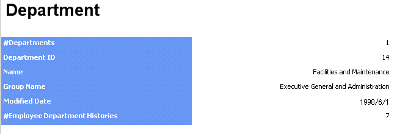
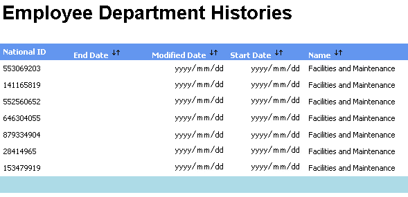

# クリックスルー レポート (SSRS)
  クリックスルー レポートとは、メイン レポートに含まれるデータの詳細情報を提供するレポートです。 クリックスルー レポートは、メイン レポートに表示される対話型データをユーザーがクリックすると表示されます。 これらのレポートは、レポート サーバーによって自動的に生成されます。 クリックスルー レポートに表示される内容は、モデルをデザインするときに、レポート モデルのエンティティに割り当てる **DefaultDetailAttribute** プロパティと **DefaultAggregateAttribute** プロパティを設定することによって指定できます。  
  
> [!NOTE]  
>  クリックスルー レポートは、[!INCLUDE[msCoName](../../includes/msconame-md.md)][!INCLUDE[ssNoVersion](../../includes/ssnoversion-md.md)] のすべてのエディションで使用できるわけではありません。 [!INCLUDE[ssNoVersion](../../includes/ssnoversion-md.md)] の各エディションでサポートされる機能の一覧については、「[SQL Server 2016 の各エディションがサポートする機能](../Topic/Features%20Supported%20by%20the%20Editions%20of%20SQL%20Server%202016.md)」を参照してください。 組織で実行している [!INCLUDE[ssNoVersion](../../includes/ssnoversion-md.md)] のエディションが不明な場合は、データベース管理者に問い合わせてください。  
  
## 既定のテンプレートの使用  
 既定では、単一インスタンス テンプレートと複数インスタンス テンプレートという 2 種類のクリックスルー テンプレートが、レポート サーバーによって各エンティティに対して生成されます。 どちらのテンプレートが使用されるかは、クリックするアイテムによって決まります。 レポートを表示しているユーザーがスカラー属性をクリックした場合は、単一インスタンス テンプレートが使用されます。 レポートを表示しているユーザーが集計属性をクリックした場合は、複数インスタンス テンプレートが使用されます。  
  
#### 単一インスタンス テンプレート  
 単一インスタンス テンプレートは、対象エンティティのすべての属性と、対象エンティティからの一対多のリレーションシップを持つ関連エンティティに対して指定されているすべての既定の集計属性を表示します。 単一インスタンス テンプレートは次の画像のようになります。  
  
   
  
#### 複数インスタンス テンプレート  
 複数インスタンス テンプレートは、対象エンティティの既定の詳細属性のみと、対象エンティティからの一対多のリレーションシップを持つ関連エンティティに対して指定されているすべての既定の集計属性を表示します。 複数インスタンス テンプレートは次の画像のようになります。  
  
   
  
## クリックスルー レポートのカスタマイズ  
 レポート サーバーによって生成される既定のテンプレートを使用する代わりに、レポート ビルダーでレポートを作成して、カスタマイズしたクリックスルー レポートとして使用することができます。 次に、レポートを、レポート マネージャーの詳細レポートとしてモデルにリンクできます。  
  
 レポート ビルダーのレポートをクリックスルー レポートにするには、レポート ビルダーの **[プロパティ]** ダイアログ ボックスの **[ドリルスルーを有効にする]** オプションをクリックする必要があります。 このオプションをクリックすると、レポートにドリルスルー パラメーターが追加されて、レポートを直接レポート ビルダーで実行できなくなります。 ドリルスルー パラメーターは、レポートを表示しているユーザーがレポート ビルダーのレポートの中のアイテムをクリックしたときに、レポート サーバーによって自動的に計算されます。  
  
> [!IMPORTANT]  
>  レポートで使用されるプライマリ (基本) エンティティは、レポートのリンク先と同じエンティティである必要があります。  
  
## 参照  
 [レポートをクリックスルー レポートとしてモデルにリンクする](../Topic/Link%20a%20Report%20to%20a%20Model%20as%20a%20Clickthrough%20Report.md)  
  
  