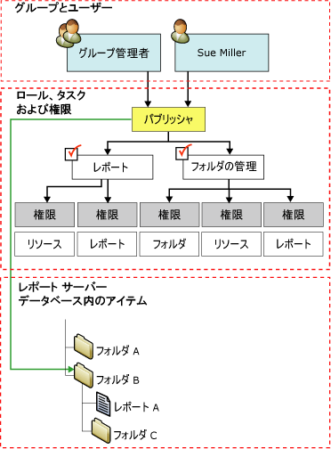

# ロールの割り当て

[!INCLUDE[ssRSnoversion](../../includes/ssrsnoversion-md.md)]では、 *”ロール”* の割り当てにより、格納されているアイテムおよびレポート サーバー自体にアクセスできるかどうかが決まります。 ロールの割り当ては以下の要素で構成されています。  
  
- アクセスを制御するセキュリティ保護可能なアイテム。 セキュリティ保護可能なアイテムの例として、フォルダー、レポート、リソースがあります。  
  
- Windows セキュリティまたはその他の認証メカニズムにより認証できるユーザー アカウントまたはグループ アカウント。  
  
- ロールの定義は、許容される一連のタスクを定義し、次のものが含まれます。
  - **ブラウザー**
  - **コンテンツ マネージャー**
  - **個人用レポート**
  - **パブリッシャー**
  - **レポート ビルダー**
  - **システム管理者**
  - **システム ユーザー**

 ロールの割り当ては、フォルダー階層内で継承され、次を含んで自動的に継承されます。

- **レポート**
- **共有データ ソース**
- **リソース**
- **サブフォルダー**

個別のアイテムにロールの割り当てを定義することで、継承されるセキュリティをオーバーライドすることができます。 フォルダー階層のすべての部分が、少なくとも 1 つのロールの割り当てによってセキュリティ保護されるようにしてください。 セキュリティで保護されていないアイテムを作成したり、セキュリティで保護されていないアイテムを生成するように設定を操作することはできません。  
  
 フォルダー B に対する **パブリッシャー** ロールにグループおよび特定のユーザーをマップするロールの割り当ての図を次に示します。  
  
   
ロールの割り当ての図  
  
## システムレベルおよびアイテムレベルのロールの割り当て

 [!INCLUDE[ssRSnoversion](../../includes/ssrsnoversion-md.md)] におけるロールベースのセキュリティは、次のレベルに分類されます。

- アイテムレベルのロールの割り当てでは、次のようなレポート サーバー フォルダー階層内のアイテムに対するアクセスを制御します。
  - レポート
  - フォルダー
  - レポート モデル
  - 共有データ ソース
  - その他のリソース

- アイテムレベルのロールの割り当ては、特定のアイテムまたは [ホーム] フォルダーに対するロールの割り当てを作成するときに定義されます。

- システム ロールの割り当てでは、サーバー全体を対象とする操作を承認します。 たとえば、ジョブを管理する機能はシステム レベルの操作です。 システム ロールの割り当ては、システム管理者と同じではありません。 レポート サーバーのフル コントロールを許可する高度な権限は付与されません。

システム ロールの割り当てでは、フォルダー階層内のアイテムに対するアクセスは承認されません。 システムレベルとアイテムレベルのセキュリティは、相互排他的です。 場合によって、ユーザーやグループに十分なアクセス権を提供するために、システムレベルとアイテムレベルの両方のロールの割り当てを作成することが必要になることもあります。

## ロールの割り当てにおけるユーザーとグループ

 ロールの割り当てには、ドメイン アカウントであるユーザー アカウントまたはグループ アカウントを指定します。 レポート サーバーからは、[!INCLUDE[msCoName](../../includes/msconame-md.md)] Windows ドメイン (またはカスタム セキュリティ拡張機能を使用している場合は別のセキュリティ モデル) のユーザーおよびグループの参照は行われますが、作成や管理は行われません。

ある特定のアイテムに適用されるすべてのロールの割り当ての中で、同じユーザーまたはグループを重複して指定することはできません。 あるユーザー アカウントがグループ アカウントのメンバーでもあり、両方のアカウントに対してロールの割り当てを行っている場合、そのユーザーは両方のロールの割り当てに対するタスクを合わせたものを利用できます。

既にロールの割り当てがあるグループにユーザーを追加するときは、新しいロールの割り当てを有効にするために、インターネット インフォメーション サービス (IIS) をリセットする必要があります。

## 定義済みロールの割り当て

 既定では、ローカル管理者によるレポート サーバーの管理を許可する定義済みのロールの割り当てが実装されます。 ロールの割り当てを追加して、他のユーザーにアクセス権を与えることができます。

 既定のセキュリティを提供する定義済みのロールの割り当ての詳細については、「 [定義済みロール](../../reporting-services/security/role-definitions-predefined-roles.md)」を参照してください。  

## 参照

 [ロールを作成、削除、または変更する (Management Studio)](../../reporting-services/security/role-definitions-create-delete-or-modify.md)

 [ロールの割り当てを変更または削除する &#40;SSRS Web ポータル&#41;](../../reporting-services/security/role-assignments-modify-or-delete.md)

 [SharePoint サイト上のレポート サーバー アイテムに対する権限の設定 &#40;Reporting Services の SharePoint 統合モード&#41;](../../reporting-services/security/set-permissions-for-report-server-items-on-a-sharepoint-site.md)

 [ネイティブ モードのレポート サーバーに対する権限の許可](../../reporting-services/security/granting-permissions-on-a-native-mode-report-server.md)  
