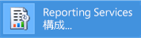
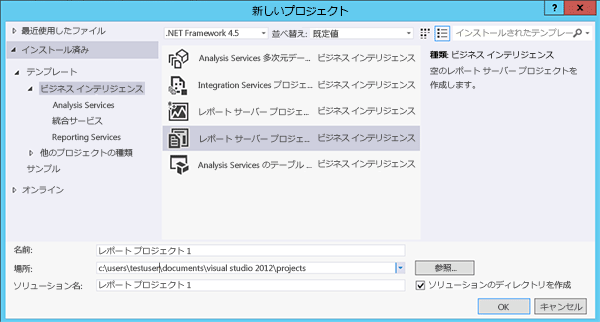

# チュートリアル : Reporting Services ツールを検索および開始する方法 (SSRS)

  このチュートリアルでは、レポート サーバーの設定、レポート サーバーのコンテンツと動作の管理、 [!INCLUDE[ssRSnoversion](../../includes/ssrsnoversion-md.md)] の改ページ調整されたレポートとモバイル レポートの作成とパブリッシュに使用できるツールを紹介します。 既にツールを使用している場合は、 [!INCLUDE[ssRSnoversion](../../includes/ssrsnoversion-md.md)]を使用するスキルを学ぶことができるその他のチュートリアルへお進みください。 その他のチュートリアルについては、「 [Reporting Services のチュートリアル (SSRS)](../../reporting-services/reporting-services-tutorials-ssrs.md)を使用するスキルを学ぶことができるその他のチュートリアルへお進みください。  
  
  
##   Reporting Services 構成マネージャー (ネイティブ モード)  
 ネイティブ モードの構成マネージャーを使用して、次の処理を行います。  
  
-   サービス アカウントを指定します。  
-   レポート サーバー データベースを作成またはアップグレードします。  
-   接続プロパティを変更します。  
-   URL を指定します。  
-   暗号化キーを管理します。  
-   自動レポート処理および電子メールによるレポート配信を構成します。  
  
**インストール:** [!INCLUDE[ssRSnoversion](../../includes/ssrsnoversion-md.md)] 構成マネージャーは、 [!INCLUDE[ssRSnoversion](../../includes/ssrsnoversion-md.md)] ネイティブ モードのインストール時にインストールされます。 詳細については、 [「Reporting Services ネイティブ モードのレポート サーバーのインストール」](assetid:///8f25e6dc-b753-400e-9e9a-50f4f35bf6c4)を参照してください。  
  
### Reporting Services 構成マネージャーを起動するには  
  
1.  Windows のスタート画面で、「 **reporting** 」と入力し、 **[アプリ]** の検索結果で **[Reporting Services 構成マネージャー]** をクリックします。  
  
       
  
     **Or**  
  
     **[スタート]** ボタンをクリックして、 **[プログラム]** をクリックし、[ [!INCLUDE[ssCurrentUI](../../includes/sscurrentui-md.md)]]、 **[構成ツール]** 、 **[Reporting Services 構成マネージャー]** の順にクリックします。  
  
     **[レポート サーバー インスタンスの選択]** ダイアログ ボックスが表示されます。このダイアログ ボックスでは構成するレポート サーバー インスタンスを選択します。  
  
2.  **[サーバー名]** ボックスに、レポート サーバー インスタンスがインストールされているコンピューターの名前を指定します。 既定ではローカル コンピューターの名前が設定されていますが、 [!INCLUDE[ssNoVersion](../../includes/ssnoversion-md.md)] のリモート インスタンスの名前を入力することもできます。  
  
     リモート コンピューターを指定する場合は、 **[検索]** をクリックして接続を確立します。 ここで指定するレポート サーバーは、リモートで管理するための構成が事前に行われている必要があります。 詳細については、「 [リモート管理用のレポート サーバーの構成](../../reporting-services/report-server/configure-a-report-server-for-remote-administration.md)」を参照してください。  
  
3.  **stance Name**で、構成する [!INCLUDE[ssNoVersion](../../includes/ssnoversion-md.md)] [!INCLUDE[ssRSnoversion](../../includes/ssrsnoversion-md.md)] インスタンスを選択します。 この一覧には、SQL Server 2008 以降を実行しているレポート サーバー インスタンスのみが表示されます。 以前のバージョンの [!INCLUDE[ssRSnoversion](../../includes/ssrsnoversion-md.md)]を構成することはできません。  
  
4.  **[接続]** をクリックします。  
  
5.  ツールが起動したかどうかを確認するには、次の図と比較します。  
  
       
  
 **次の手順:** 「[レポート サーバーを構成および管理する (SSRS ネイティブ モード)](../../reporting-services/report-server/configure-and-administer-a-report-server-ssrs-native-mode.md)」、「[Reporting Services 構成マネージャー (ネイティブ モード)](../../reporting-services/install-windows/reporting-services-configuration-manager-native-mode.md)  
  
##  Web ポータル (ネイティブ モード)  
 [Web portal (SSRS Native Mode)](../../reporting-services/web-portal-ssrs-native-mode.md) を使用して、権限の設定、サブスクリプションおよびスケジュールの管理、レポートを使用した作業を実行できます。 Web ポータルを使用してレポートを表示することもできます。  
  
 **:** [!INCLUDE[ssRSnoversion](../../includes/ssrsnoversion-md.md)] ネイティブ モードをインストールすると Web ポータルがインストールされます: [Reporting Services ネイティブ モードのレポート サーバーのインストール](assetid:///8f25e6dc-b753-400e-9e9a-50f4f35bf6c4)  
  
 Web ポータルを起動するには適切なアクセス許可が必要です。初期状態では、Web ポータルの機能へのアクセス許可は、ローカルの管理者グループのメンバーにのみ与えられています。 Web ポータルに表示されるページとオプションは、現在のユーザーに割り当てられているロールによって異なります。 アクセス許可のないユーザーには空白のページが表示され、 レポート閲覧用のアクセス許可が与えられているユーザーにはリンクが表示されます。このユーザーはリンクをクリックしてレポートを表示することができます。 アクセス許可の詳細については、「[ロールと権限 &#40;Reporting Services&#41;](../../reporting-services/security/roles-and-permissions-reporting-services.md)」を参照してください。  
  
### Web ポータルを開始するには  
  
1.  ブラウザーを開きます。 サポートされているブラウザーやバージョンの詳細については、「 [Browser Support for Reporting Services and Power View](../../reporting-services/browser-support-for-reporting-services-and-power-view.md)」(Reporting Services と Power View のブラウザー サポート) を参照してください。  
  
2.  Web ブラウザーのアドレス バーに、Web ポータルの URL を入力します。 既定の URL は `https://<serverName>/reports`を使用するスキルを学ぶことができるその他のチュートリアルへお進みください。 Reporting Services 構成ツールを使用して、サーバー名と URL を確認できます。 [!INCLUDE[ssRSnoversion](../../includes/ssrsnoversion-md.md)] で使用される URL の詳細については、「[レポート サーバー URL の構成 &#40;SSRS 構成マネージャー&#41;](../../reporting-services/install-windows/configure-report-server-urls-ssrs-configuration-manager.md)」を参照してください。  
  
3.  Web ポータルがブラウザー ウィンドウ内に表示されます。 最初のページは [ホーム] フォルダーです。 アクセス許可に応じて、最初のページにその他のフォルダー、レポートへのハイパーリンク、リソース ファイルなどが表示される場合もあります。 ツール バーに追加のボタンやコマンドが表示される場合もあります。  
  
4.  ローカル レポート サーバーで Web ポータルを実行する場合は、「[Configure a Native Mode Report Server for Local Administration (SSRS)](../../reporting-services/report-server/configure-a-native-mode-report-server-for-local-administration-ssrs.md)」(ローカル管理用のネイティブ モード レポート サーバーの構成 (SSRS)) を参照してください。  
   
##   Management Studio  
 レポート サーバー管理者は、 [!INCLUDE[ssManStudio](../../includes/ssmanstudio-md.md)] を使用して、レポート サーバーと共に他の [!INCLUDE[ssNoVersion](../../includes/ssnoversion-md.md)] コンポーネント サーバーを管理できます。 詳細については、[SQL Server Management Studio](https://docs.microsoft.com/sql/ssms/tutorials/tutorial-sql-server-management-studio) のチュートリアルを参照してください。  
  
### SQL Server Management Studio を起動するには  
  
1.  Windows のスタート画面から「 **sql server** 」と入力し、 **[アプリ]** の検索結果で **[SQL Server Management Studio]** をクリックします。  
  
       
  
     **Or**  
  
     **[スタート]** 、 **[すべてのプログラム]** とクリックし、[ [!INCLUDE[ssCurrentUI](../../includes/sscurrentui-md.md)]]、 **[SQL Server Management Studio]** の順にクリックします。 **[サーバーへの接続]** ダイアログ ボックスが表示されます。  
  
2.  **[サーバーへの接続]** ダイアログ ボックスが表示されない場合は、 **[オブジェクト エクスプローラー]** で **[接続]** をクリックし、 **[Reporting Services]** を選択します。  
  
3.  **[サーバーの種類]** ボックスの一覧で、 **[Reporting Services]** を選択します。 [!INCLUDE[ssRSnoversion](../../includes/ssrsnoversion-md.md)] が一覧に表示されない場合、Reporting Services はインストールされていません。  
  
4.  **[サーバー名]** ボックスの一覧で、レポート サーバーのインスタンスを選択します。 一覧にはローカル インスタンスが表示されますが、 リモートの [!INCLUDE[ssNoVersion](../../includes/ssnoversion-md.md)] インスタンスの名前を入力することもできます。  
  
5.  **[接続]** をクリックします。 ルート ノードを展開して、サーバーのプロパティを設定したり、ロールの定義を変更したり、レポート サーバー機能をオフにすることができます。  
  
##   レポート デザイナーとレポート ウィザードが統合された SQL Server データ ツール  
 [!INCLUDE[ssNoVersion](../../includes/ssnoversion-md.md)] の改ページ調整されたレポートを作成するためのツールには、レポート デザイナーと [レポート ビルダー](#bkmk_report_builder)の 2 つがあります。  
  
 レポート デザイナーは、 [!INCLUDE[ssBIDevStudioFull](../../includes/ssbidevstudiofull-md.md)] - Visual Studio で使用できます。 レポート デザイナーのデザイン画面にはタブ付きウィンドウ、ウィザード、メニューが用意されており、これらを使ってレポートの作成機能にアクセスできます。 レポート デザイナー ツールは、レポート サーバー プロジェクトまたは [!INCLUDE[ssBIDevStudioFull](../../includes/ssbidevstudiofull-md.md)]のレポート サーバー ウィザードのテンプレートを選択すると使用可能になります。 詳細については、「[SQL Server データ ツールの Reporting Services (SSDT)](../../reporting-services/tools/reporting-services-in-sql-server-data-tools-ssdt.md)」を参照してください。 
 
[SQL Server Data Tools](https://go.microsoft.com/fwlink/?LinkID=616714)をダウンロードします。  
  
### レポート デザイナーを起動するには  
  
1.  **SQL Server Data Tools**を開きます。  
  
2.  **[ファイル]** メニューの **[新規作成]** をポイントし、 **[プロジェクト]** をクリックします。  
  
3.  **[プロジェクトの種類]** ボックスの一覧で、 **[ビジネス インテリジェンス プロジェクト]** をクリックします。  
  
4.  **[テンプレート]** ボックスの一覧で、 **[レポート サーバー プロジェクト]** をクリックします。 次の図は、プロジェクトのテンプレートがダイアログ ボックスに表示された状態を示しています。  
  
       
  
5.  プロジェクトの名前と場所を入力するか、 **[参照]** ボタンをクリックして場所を選択します。  
  
6.  [!INCLUDE[clickOK](../../includes/clickok-md.md)] [!INCLUDE[ssBIDevStudioFull](../../includes/ssbidevstudiofull-md.md)] で [!INCLUDE[vsprvs](../../includes/vsprvs-md.md)] の開始ページが開きます。 ソリューション エクスプローラーには、レポートとデータ ソースがそれぞれカテゴリとして表示されます。 これらのカテゴリを使用して、新しいレポートとデータ ソースを作成できます。 タブ付きウィンドウは、レポート定義を作成すると表示されます。 このウィンドウは [データ]、[レイアウト]、[プレビュー] の 3 つのタブで構成されます。  
  
 初めてレポートを作成する場合は、「[基本的なテーブル レポートの作成 &#40;SSRS チュートリアル&#41;](../../reporting-services/create-a-basic-table-report-ssrs-tutorial.md)」を参照してください。 レポート デザイナーで使用できるクエリ デザイナーの詳細については、「 [SQL Server データ ツールのレポート デザイナーのクエリ デザイン ツール (SSRS)](../../reporting-services/report-data/query-design-tools-ssrs.md)を使用するスキルを学ぶことができるその他のチュートリアルへお進みください。  
  
##   [!INCLUDE[ssRBnoversion](../../includes/ssrbnoversion.md)]  
 [SQL Server のレポート ビルダー](../../reporting-services/report-builder/report-builder-in-sql-server-2016.md)はスタンドアロンのアプリケーションであり、[!INCLUDE[ssNoVersion](../../includes/ssnoversion-md.md)] の外部で改ページ調整されたレポートを作成するために使用できます。 レポート デザイナーで作成したレポートであっても、以前のバージョンの [!INCLUDE[ssRBnoversion](../../includes/ssrbnoversion.md)]でデザインしたレポートであっても、あらゆる既存レポートのカスタマイズおよび更新が可能です。 [!INCLUDE[ssNoVersion](../../includes/ssnoversion-md.md)] Web ポータルまたは Microsoft ダウンロード センターからインストールします。 

ページ調整されたレポートの準備ができたら、レポート サーバーに公開するか、[Power BI サービスに保存します](https://docs.microsoft.com/power-bi/paginated-reports-save-to-power-bi-service)。 
  
 Microsoft ダウンロード センターから[レポート ビルダーをダウンロード](https://go.microsoft.com/fwlink/?LinkID=219138) します。  
  
### を開始するには [!INCLUDE[ssRBnoversion](../../includes/ssrbnoversion.md)]  
  
1.  [!INCLUDE[ssNoVersion](../../includes/ssnoversion-md.md)] Web ポータルの  **[新規]** メニューで、 **[改ページ調整されたレポート]** を選択します。  
  
       
  
2.  [!INCLUDE[ssRBnoversion](../../includes/ssrbnoversion.md)] がコンピューターにまだインストールされていない場合は、 **[[!INCLUDE[ssRBnoversion](../../includes/ssrbnoversion.md)] の入手]** を選択します。  
  
     または  
  
     Microsoft ダウンロード センターから[レポート ビルダーをダウンロード](https://go.microsoft.com/fwlink/?LinkID=219138) します。  
  
3.  [!INCLUDE[ssRBnoversion](../../includes/ssrbnoversion.md)] が開き、改ページ調整されたレポートを作成したり開いたりできます。  
  
##   [!INCLUDE[SS_MobileReptPub_Long](../../includes/ss-mobilereptpub-long.md)]  
 [Web ポータルおよび iPad や iPhone などのモバイル デバイスで表示できるモバイル レポートを作成するには、](../mobile-reports/create-mobile-reports-with-sql-server-mobile-report-publisher.md) SQL Server Mobile Report Publisher [!INCLUDE[ssNoVersion](../../includes/ssnoversion-md.md)] を使用します。   [!INCLUDE[ssNoVersion](../../includes/ssnoversion-md.md)] Web ポータルまたは Microsoft ダウンロード センターからインストールできます。  
  
 Microsoft ダウンロード センターから[SQL Server Mobile Report Publisher をダウンロード](https://go.microsoft.com/fwlink/?LinkID=733527) します。  
  
### を開始するには [!INCLUDE[SS_MobileReptPub_Short](../../includes/ss-mobilereptpub-short.md)]  
  
1.  [!INCLUDE[ssNoVersion](../../includes/ssnoversion-md.md)] Web ポータルの  **[新規]** メニューで、 **[モバイル レポート]** を選択します。  
  
       
  
2.  [!INCLUDE[SS_MobileReptPub_Short](../../includes/ss-mobilereptpub-short.md)] がコンピューターにまだインストールされていない場合は、 **[[!INCLUDE[SS_MobileReptPub_Short](../../includes/ss-mobilereptpub-short.md)] の入手]** を選択します。  
  
     または  
  
     Microsoft ダウンロード センターから[SQL Server Mobile Report Publisher をダウンロード](https://go.microsoft.com/fwlink/?LinkID=733527) します。  
  
3.  [!INCLUDE[SS_MobileReptPub_Short](../../includes/ss-mobilereptpub-short.md)] が開き、モバイル レポートを作成したり開いたりできます。  

## 次の手順

[SQL Server Mobile Report Publisher をダウンロード](https://go.microsoft.com/fwlink/?LinkID=733527)   
[レポート ビルダーをダウンロード](https://go.microsoft.com/fwlink/?LinkID=219138)  
[SQL Server Data Tools のダウンロード](https://go.microsoft.com/fwlink/?LinkID=616714) 
[Reporting Services SharePoint モードのインストール](../../reporting-services/install-windows/install-reporting-services-sharepoint-mode.md)   
[Reporting Services Report Server](../../reporting-services/report-server-sharepoint/reporting-services-report-server.md)   
[クエリ デザイン ツール](../../reporting-services/report-data/query-design-tools-ssrs.md)   
[Reporting Services のチュートリアル](../../reporting-services/reporting-services-tutorials-ssrs.md)  

その他の質問 [Reporting Services のフォーラムに質問してみてください](https://go.microsoft.com/fwlink/?LinkId=620231)
