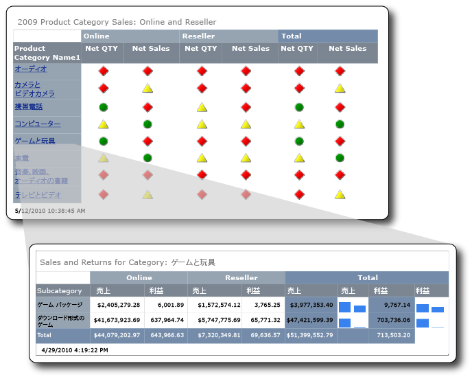

# <a name="tutorial-creating-drillthrough-and-main-reports-report-builder"></a>チュートリアル: 詳細レポートとメイン レポートの作成 (レポート ビルダー)
このチュートリアルでは、詳細レポートとメイン レポートという、 [!INCLUDE[ssRSnoversion_md](../includes/ssrsnoversion-md.md)] の 2 種類のページ分割されたレポートの作成方法を説明します。 これらのレポートで使用する売上データのサンプルは、Analysis Services キューブから取得します。 

次の図は、メイン レポートのフィールド値 "Games and Toys" を作成し、詳細レポートのタイトルに表示する方法を示します。 この詳細レポートには、Games and Toys 製品カテゴリに関連するデータが含まれています。  
  
  
   
このチュートリアルの推定所要時間: 30 分。  
  
## <a name="requirements"></a>必要条件  
このチュートリアルでは、詳細レポートとメイン レポートの両方で Contoso Sales キューブにアクセスする必要があります。 このデータセットは、ContosoDW データ ウェアハウスと Contoso_Retail オンライン分析処理 (OLAP) データベースで構成されています。 このチュートリアルで作成するレポートは、Contoso Sales キューブからレポート データを取得します。 Contoso_Retail OLAP データベースは、 [Microsoft ダウンロード センター](https://www.microsoft.com/download/details.aspx?id=18279)からダウンロードできます。 ダウンロードする必要があるファイルは、ContosoBIdemoABF.exe だけです。 このファイルに OLAP データベースが含まれています。  
  
もう一方のファイル (ContosoBIdemoBAK.exe) は、ContosoDW データ ウェアハウスのファイルです。ContosoDW データ ウェアハウスは、このチュートリアルでは使用しません。  
  
上述の Web サイトには、ContosoRetail.abf バックアップ ファイルを抽出して Contoso_Retail OLAP データベースを復元する手順の説明も含まれています。  

OLAP データベースをインストールする [!INCLUDE[ssASnoversion](../includes/ssasnoversion-md.md)] インスタンスへのアクセス権が必要です。  
    
全般的な要件については、「[チュートリアルの前提条件 (レポート ビルダー)](../reporting-services/prerequisites-for-tutorials-report-builder.md)」を参照してください。  
  
## <a name="DMatrixAndDataset"></a>1.テーブルまたはマトリックス ウィザードを使用して詳細レポートを作成する  
[作業の開始] ダイアログ ボックスから、 **テーブルまたはマトリックス ウィザード**を使用してマトリックス レポートを作成します。 このウィザードには、レポート デザイン モードと共有データセット デザイン モードの 2 つのモードがあります。 このチュートリアルでは、レポート デザイン モードを使用します。  
  
#### <a name="to-create-a-new-report"></a>新しいレポートを作成するには  
  
1.  コンピューター、[Web ポータル、SharePoint 統合モードのいずれかから](../reporting-services/report-builder/start-report-builder.md) レポート ビルダーを起動します [!INCLUDE[ssRSnoversion_md](../includes/ssrsnoversion-md.md)] 。  
  
    **[新しいレポートまたはデータセット]** ダイアログ ボックスが開きます。  
  
    **[新しいレポートまたはデータセット]** ダイアログ ボックスが表示されない場合、 **[ファイル]** メニューで **[新規作成]** を選択します。  
  
2.  左ペインで、 **[新しいレポート]** が選択されていることを確認します。  
  
3.  右ペインで、 **[テーブルまたはマトリックス ウィザード]** が選択されていることを確認します。  
  
## <a name="DConnection"></a>1a. データ接続を指定する  
データ接続には、Analysis Services キューブや [!INCLUDE[ssNoVersion](../includes/ssnoversion-md.md)] データベースなどの外部データ ソースに接続するときに必要な情報が含まれます。 データ接続を指定するには、レポート サーバーの共有データ ソースを使用するか、このレポートでのみ使用する埋め込みデータ ソースを作成します。 このチュートリアルでは、埋め込みデータ ソースを使用します。 共有データ ソースの使用方法の詳細については、「[別の方法でデータ接続を取得する (レポート ビルダー)](../reporting-services/alternative-ways-to-get-a-data-connection-report-builder.md)」を参照してください。  
  
#### <a name="to-create-an-embedded-data-source"></a>埋め込みデータ ソースを作成するには  
  
1.  **[データセットの選択]** ページで **[データセットを作成する]** を選択し、 **[次へ]** をクリックします。 **[データ ソースへの接続の選択]** ページが開きます。  
  
2.  **[新規作成]** をクリックします。 **[データ ソースのプロパティ]** ダイアログ ボックスが表示されます。  
  
3.  **[名前]** に、データ ソースの名前として「 **Online and Reseller Sales Detail** 」と入力します。  
  
4.  **[接続の種類の選択]** で、 **[Microsoft SQL Server Analysis Services]** を選択し、 **[構築]** をクリックします。  
  
5.  **[データ ソース]** で、データ ソースが **[Microsoft SQL Server Analysis Services (AdomdClient)]** になっていることを確認します。  
  
6.  **[サーバー名]** に、Analysis Services のインスタンスがインストールされているサーバーの名前を入力します。  
  
7.  **[データベース名の選択または入力]** で、Contoso キューブを選択します。  
  
8.  [!INCLUDE[clickOK](../includes/clickok-md.md)]  
  
9. **[接続文字列]** に次の構文が含まれていることを確認します。  
  
    ```  
    Data Source=<servername>; Initial Catalog = Contoso  
    ```  
  
    `<servername>` は、Analysis Services がインストールされている [!INCLUDE[ssNoVersion](../includes/ssnoversion-md.md)] インスタンスの名前です。  
  
10. **[資格情報の種類]** をクリックします。  
  
    > [!NOTE]  
    > データ ソースの権限の構成によっては、既定の認証オプションを変更する必要があります。 詳細については、「 [セキュリティ (レポート ビルダー)](../reporting-services/report-builder/security-report-builder.md)で作成するモバイル レポートで使用できます。  
  
11. [!INCLUDE[clickOK](../includes/clickok-md.md)]  
  
    **[データ ソースへの接続の選択]** ページが表示されます。  
  
12. データ ソースに接続できることを確認するために、 **[接続テスト]** をクリックします。  
  
    " **接続が正常に作成されました** " というメッセージが表示されます。  
  
13. [!INCLUDE[clickOK](../includes/clickok-md.md)]  
  
14. **[次へ]** をクリックします。  
  
## <a name="DMDXQuery"></a>1b. MDX クエリを作成する  
レポートでは、クエリが事前に定義された共有データセットを使用するか、そのレポートでのみ使用する埋め込みデータセットを作成できます。 このチュートリアルでは、埋め込みデータセットを作成します。  
  
#### <a name="to-create-query-filters"></a>クエリ フィルターを作成するには  
  
1.  **[クエリのデザイン]** ページのメタデータ ペインで、 **[ (...) ]** ボタンをクリックします。  
  
2.  **[キューブの選択]** ダイアログ ボックスで、Sales をクリックし、 **[OK]** をクリックします。  
  
    > [!TIP]  
    > MDX クエリを手動で作成しない場合は、 アイコンをクリックしてクエリ デザイナーをクエリ モードに切り替え、完成した MDX をクエリ デザイナーに貼り付けます。その後、「[データセットを作成するには](#DSkip)」の手順 6 に進みます。  
  
    ```  
    SELECT NON EMPTY { [Measures].[Sales Amount], [Measures].[Sales Return Amount] } ON COLUMNS, NON EMPTY { ([Channel].[Channel Name].[Channel Name].ALLMEMBERS * [Product].[Product Category Name].[Product Category Name].ALLMEMBERS * [Product].[Product Subcategory Name].[Product Subcategory Name].ALLMEMBERS ) } DIMENSION PROPERTIES MEMBER_CAPTION, MEMBER_UNIQUE_NAME ON ROWS FROM ( SELECT ( { [Date].[Calendar Year].&[2009] } ) ON COLUMNS FROM ( SELECT ( { [Sales Territory].[Sales Territory Group].&[North America] } ) ON COLUMNS FROM ( SELECT ( STRTOSET(\@ProductProductCategoryName, CONSTRAINED) ) ON COLUMNS FROM ( SELECT ( { [Channel].[Channel Name].&[2], [Channel].[Channel Name].&[4] } ) ON COLUMNS FROM [Sales])))) WHERE ( [Sales Territory].[Sales Territory Group].&[North America], [Date].[Calendar Year].&[2009] ) CELL PROPERTIES VALUE, BACK_COLOR, FORE_COLOR, FORMATTED_VALUE, FORMAT_STRING, FONT_NAME, FONT_SIZE, FONT_FLAGS  
    ```  
  
3.  メジャー グループ ペインで Channel を展開し、Channel Name をフィルター ペインの **[階層]** 列にドラッグします。  
  
    Channel というディメンション名が自動的に **[ディメンション]** 列に追加されます。 **[ディメンション]** 列と **[演算子]** 列は変更しないでください。  
  
4.  **[フィルター式]** 列の下矢印をクリックして、 **[フィルター式]** の一覧を開きます。  
  
5.  フィルター式の一覧で、 **[All Channel]** を展開し、 **[Online]** と **[Reseller]** をクリックして、 **[OK]** をクリックします。  
  
    Channel を Online と Reseller のみに制限するフィルターがクエリに追加されます。  
  
6.  Sales Territory ディメンションを展開し、Sales Territory Group を **[階層]** 列 ( **Channel Name**の下) にドラッグします。  
  
7.  **[フィルター式]** の一覧を開き、 **[All Sales Territory]** を展開して **[North America]** をクリックし、 **[OK]** をクリックします。  
  
    North America の売上のみを含めるフィルターがクエリに追加されます。  
  
8.  メジャー グループ ペインで Date を展開し、Calendar Year をフィルター ペインの **[階層]** 列にドラッグします。  
  
    Date というディメンション名が自動的に **[ディメンション]** 列に追加されます。 **[ディメンション]** 列と **[演算子]** 列は変更しないでください。  
  
9. **[フィルター式]** 列の下矢印をクリックして、 **[フィルター式]** の一覧を開きます。  
  
10. フィルター式の一覧で、 **[All Date]** を展開し、 **[Year 2009]** をクリックして、 **[OK]** をクリックします。  
  
    2009 年のデータのみを含めるフィルターがクエリに追加されます。  
  
#### <a name="to-create-the-parameter"></a>パラメーターを作成するには  
  
1.  Product ディメンションを展開し、Product Category Name メンバーを **[階層]** 列 ( **Calendar Year**の下) にドラッグします。  
  
2.  **[フィルター式]** の一覧を開き、 **[All Products]** をクリックして、 **[OK]** をクリックします。  
  
3.  **[パラメーター]** チェック ボックスをクリックします。 パラメーター ProductProductCategoryName がクエリに追加されます。  
  
    > [!NOTE]  
    > このパラメーターは、製品カテゴリの名前を格納します。 メイン レポートで製品カテゴリの名前をクリックすると、その名前が、このパラメーターを使用して詳細レポートに渡されます。  
  
### <a name="DSkip"></a>データセットを作成するには  
  
1.  Channel ディメンションから Channel Name をデータ ペインにドラッグします。  
  
2.  Product ディメンションから Product Category Name をデータ ペインにドラッグして、Channel Name の右側に配置します。  
  
3.  Product ディメンションから Product Subcategory Name をデータ ペインにドラッグして、Product Category Name の右側に配置します。  
  
4.  メタデータ ペインで、 **[メジャー]** 、Sales の順に展開します。  
  
5.  Sales Amount メジャーをデータ ペインにドラッグして、Product Subcategory Name の右側に配置します。  
  
6.  クエリ デザイナーのツール バーで、 **[実行 (!)]** をクリックします。  
  
7.  **[次へ]** をクリックします。  
  
## <a name="DLayout"></a>1c. データをグループにまとめる  
データをグループ化するフィールドを選択し、詳細データおよび集計データを表示する行と列を含むマトリックスをデザインします。  
  
#### <a name="to-organize-data-into-groups"></a>データをグループにまとめるには  
  
1.  デザイン ビューに切り替えるには、 **[デザイン]** をクリックします。  
  
2.  **[フィールドの配置]** ページで、Product_Subcategory_Name を **[行グループ]** にドラッグします。  
  
    > [!NOTE]  
    > 名前のスペースはアンダースコア (_) に置き換えられます。 たとえば、Product Category Name は Product_Category_Name になります。  
  
3.  Channel_Name を **[列グループ]** にドラッグします。  
  
4.  Sales_Amount を **[値]** にドラッグします。  
  
    Sales_Amount は Sum 関数 (数値フィールドの既定の集計関数) を使用して自動的に集計されます。 値は `[Sum(Sales_Amount)]`です。  
  
    使用可能なその他の集計関数を表示するには、ドロップダウン リストを開きます (集計関数は変更しないでください)。  
  
5.  Sales_Return_Amount を **[値]** にドラッグして、 `[Sum(Sales_Amount)]`の下に配置します。  
  
    手順 4. および 5. で、マトリックスに表示するデータを指定します。  
  
6.  **[次へ]** をクリックします。  
  
## <a name="DTotals"></a>1d. 小計と合計を追加する  
グループを作成したら、フィールドの集計値を表示する行を追加して書式を設定できます。 すべてのデータを表示するか、グループ化されたデータの展開と折りたたみをユーザーが対話的に行えるようにするかも選択できます。  
  
#### <a name="to-add-subtotals-and-totals"></a>小計と合計を追加するには  
  
1.  **[レイアウトの選択]** ページの **[オプション]** で、 **[小計と総計を表示]** が選択されていることを確認します。  
  
    ウィザードのプレビュー ペインに、4 行を含むマトリックスが表示されます。  
  
2.  **[次へ]** をクリックします。  
  
2.  **[完了]** をクリックします。  
  
    テーブルがデザイン画面に追加されます。  
  
3.  レポートをプレビューするには、 **[実行 (!)]** をクリックします。  
  
## <a name="DFormat"></a>2.データに通貨の書式を設定する  
詳細レポートの売上高のフィールドに通貨の書式設定を適用します。  
  
#### <a name="to-format-data-as-currency"></a>データに通貨の書式を設定するには  
  
1.  デザイン ビューに切り替えるには、 **[デザイン]** をクリックします。  
  
2.  複数のセルを選択して一度に書式を設定するには、Ctrl キーを押して、数値の売上データを含むセルを選択します。  
  
3.  **[ホーム]** タブの **[数値]** グループで、 **[通貨]** をクリックします。  
  
## <a name="DSparkline"></a>3.売上の値をスパークラインで表示する列を追加する  
このレポートでは、売上と売上返品を、通貨値ではなくスパークラインで表示します。  
  
#### <a name="to-add-sparklines-to-columns"></a>列にスパークラインを追加するには  
  
1.  デザイン ビューに切り替えるには、 **[デザイン]** をクリックします。  
  
2.  マトリックスの合計グループで、 **[Sales Amount]** 列を右クリックし、 **[列の挿入]** をクリックして、 **[右]** をクリックします。  
  
    **[Sales Amount]** の右側に空の列が追加されます。  
  
3.  リボンで **[四角形]** をクリックし、Product_Subcategory 行グループの `[Sum(Sales_Amount)]` セルの右側にある空のセルをクリックします。  
  
4.  リボンで **[スパークライン]** アイコンをクリックし、四角形を追加したセルをクリックします。  
  
5.  **[スパークラインの種類を選択]** ダイアログ ボックスで、 **[縦棒]** が選択されていることを確認します。  
  
6.  [!INCLUDE[clickOK](../includes/clickok-md.md)]  
  
7.  スパークラインを右クリックします。  
  
8.  グラフ データ ペインで、 **[フィールドの追加]** アイコンをクリックし、Sales_Amount をクリックします。  
  
9. `Sales_Return_Amount` 列を右クリックし、右側に列を追加します。  
  
10. 手順 2. ～ 6. を繰り返します。  
  
11. スパークラインを右クリックします。  
  
12. グラフ データ ペインで、 **[フィールドの追加]** アイコンをクリックし、Sales_Return_Amount をクリックします。  
  
13. レポートをプレビューするには、 **[実行]** をクリックします。  
  
## <a name="DReportTitle"></a>4.製品カテゴリ名を含むレポート タイトルを追加する  
レポート タイトルは、レポートの最上部に表示されます。 レポート ヘッダーがあれば、そこにレポート タイトルを配置します。レポート ヘッダーを使用しない場合は、レポート本文の一番上のテキスト ボックスに配置します。 このチュートリアルでは、自動的にレポート本文の一番上に配置されるテキスト ボックスを使用します。  
  
#### <a name="to-add-a-report-title"></a>レポート タイトルを追加するには  
  
1.  デザイン ビューに切り替えるには、 **[デザイン]** をクリックします。  
  
2.  デザイン画面で、 **[クリックしてタイトルを追加]** をクリックします。  
  
3.  「 **Sales and Returns for Category:** 」と入力します。  
  
4.  右クリックして **[プレースホルダーの作成]** をクリックします。  
  
5.  **[値]** ボックスの一覧の右側にある **[(fx)]** ボタンをクリックします。  
  
6.  **[式]** ダイアログ ボックスのカテゴリ ペインで **[データセット]** をクリックし、 **[値]** ボックスの一覧で `First(Product_Category_Name)`をダブルクリックします。  
  
    **[式]** ボックスに次の式が含まれます。  
  
    ```  
    =First(Fields!Product_Category_Name.Value, "DataSet1")  
    ```  
  
7.  レポートをプレビューするには、 **[実行]** をクリックします。  
  
レポート タイトルに含まれるのは、最初の製品カテゴリの名前です。 この後の手順でこのレポートを詳細レポートとして実行すると、メイン レポートでクリックした製品カテゴリの名前を反映して製品カテゴリの名前が動的に変化します。  
  
## <a name="DParameter"></a>5.パラメーターのプロパティを更新する  
既定ではパラメーターが表示されますが、この設定は、このレポートには適していません。 したがって、詳細レポートのパラメーターのプロパティを更新します。  
  
#### <a name="to-hide-a-parameter"></a>パラメーターを非表示にするには  
  
1.  レポート データ ペインで **[パラメーター]** を展開します。  
  
2.  \@ProductProductCategoryName を右クリックし、 **[パラメーターのプロパティ]** をクリックします。  
  
    > [!NOTE]  
    > 名前の横の \@ 文字は、これがパラメーターであることを示しています。  
  
3.  **[全般]** タブで **[非表示]** をクリックします。  
  
4.  **[プロンプト]** ボックスに「 **Product Category**」と入力します。  
  
    > [!NOTE]  
    > このパラメーターは非表示なので、このプロンプトは使用されません。  
  
5.  必要に応じて、 **[使用できる値]** と **[既定値]** をクリックしてそれぞれのオプションを確認します。 これらのタブのオプションは変更しないでください。  
  
6.  [!INCLUDE[clickOK](../includes/clickok-md.md)]  
  
## <a name="DSave"></a>6.レポートを SharePoint ライブラリに保存する  
レポートは、SharePoint ライブラリ、レポート サーバー、またはコンピューターに保存することができます。 コンピューターに保存する場合は、 [!INCLUDE[ssRSnoversion](../includes/ssrsnoversion-md.md)] のいくつかの機能 (レポート パーツ、サブレポートなど) が使用できなくなります。 このチュートリアルでは、SharePoint ライブラリにレポートを保存します。  
  
#### <a name="to-save-the-report"></a>レポートを保存するには  
  
1.  レポート ビルダーのボタンの **[保存]** をクリックします。 **[レポートとして保存]** ダイアログ ボックスが開きます。  
  
    > [!NOTE]  
    > レポートを再保存すると、自動的に以前の場所に再保存されます。 場所を変更するには、 **[名前を付けて保存]** オプションを使用します。  
  
2.  最近使用したレポート サーバーと SharePoint サイトの一覧を表示するには、 **[最近使ったサイトとサーバー]** をクリックします。  
  
3.  レポートを保存する権限がある SharePoint サイトの名前を入力するか選択します。  
  
    SharePoint ライブラリの URL の構文を以下に示します。  
  
    ```  
    Http://<ServerName>/<Sites>/  
    ```  
  
4.  **[保存]** をクリックします。  
  
    **[最近使ったサイトとサーバー]** に、SharePoint サイトのライブラリの一覧が表示されます。  
  
5.  レポートを保存するライブラリに移動します。  
  
6.  **[名前]** ボックスに表示されている既定の名前を「 **ResellerVSOnlineDrillthrough**」に変更します。  
  
    > [!NOTE]  
    > メイン レポートも同じ場所に保存します。 メイン レポートと詳細レポートをそれぞれ異なるサイトまたはライブラリに保存する場合は、メイン レポートの **[レポートに移動する]** アクションのパスを更新する必要があります。  
  
7.  **[保存]** をクリックします。  
  
## <a name="MMatrixAndDataset"></a>1.テーブルまたはマトリックス ウィザードを使用してメイン レポートを作成する  
**[作業の開始]** ダイアログ ボックスから、 **テーブルまたはマトリックス ウィザード**を使用してマトリックス レポートを作成します。  
  
#### <a name="to-create-the-main-report"></a>メイン レポートを作成するには  
  
1.  コンピューター、[Web ポータル、SharePoint 統合モードのいずれかから](../reporting-services/report-builder/start-report-builder.md) レポート ビルダーを起動します [!INCLUDE[ssRSnoversion_md](../includes/ssrsnoversion-md.md)] 。  
  
    **[新しいレポートまたはデータセット]** ダイアログ ボックスが開きます。  
  
    **[新しいレポートまたはデータセット]** ダイアログ ボックスが表示されない場合、 **[ファイル]** メニューで **[新規作成]** を選択します。  
 
2.  **[作業の開始]** ダイアログ ボックスで、 **[新しいレポート]** が選択されていることを確認し、 **[テーブルまたはマトリックス ウィザード]** をクリックします。  
  
## <a name="MConnection"></a>1a. データ接続を指定する  
メイン レポートに埋め込みデータ ソースを追加します。  
  
#### <a name="to-create-an-embedded-data-source"></a>埋め込みデータ ソースを作成するには  
  
1.  **[データセットの選択]** ページで **[データセットを作成する]** を選択し、 **[次へ]** をクリックします。  
  
2.  **[新規作成]** をクリックします。  
  
3.  **[名前]** に、データ ソースの名前として「 **Online and Reseller Sales Main** 」と入力します。  
  
4.  **[接続の種類の選択]** で、 **[Microsoft SQL Server Analysis Services]** を選択し、 **[構築]** をクリックします。  
  
5.  **[データ ソース]** で、データ ソースが **[Microsoft SQL Server Analysis Services (AdomdClient)]** になっていることを確認します。  
  
6.  **[サーバー名]** に、 [!INCLUDE[msCoName](../includes/msconame-md.md)][!INCLUDE[ssASnoversion](../includes/ssasnoversion-md.md)] のインスタンスがインストールされているサーバーの名前を入力します。  
  
7.  **[データベース名の選択または入力]** で、Contoso キューブを選択します。  
  
8.  [!INCLUDE[clickOK](../includes/clickok-md.md)]  
  
9. **[接続文字列]** に次の構文が含まれていることを確認します。  
  
    ```  
    Data Source=<servername>; Initial Catalog = Contoso  
    ```  
  
10. **[資格情報の種類]** をクリックします。  
  
    データ ソースの権限の構成によっては、既定の認証を変更する必要があります。  
  
11. [!INCLUDE[clickOK](../includes/clickok-md.md)]  
  
12. データ ソースに接続できることを確認するために、 **[接続テスト]** をクリックします。  
  
13. [!INCLUDE[clickOK](../includes/clickok-md.md)]  
  
14. **[次へ]** をクリックします。  
  
## <a name="MMDXQuery"></a>1b. MDX クエリを作成する  
次に、埋め込みデータセットを作成します。 これを行うには、クエリ デザイナーを使用して、フィルター、パラメーター、および計算されるメンバーと、データセット自体を作成します。  
  
#### <a name="to-create-query-filters"></a>クエリ フィルターを作成するには  
  
1.  **[クエリのデザイン]** ページのメタデータ ペインで、キューブ セクションの参照ボタン ( **[...]** ) をクリックします。  
  
2.  **[キューブの選択]** ダイアログ ボックスで、Sales をクリックし、 **[OK]** をクリックします。  
  
    > [!TIP]  
    > MDX クエリを手動で作成しない場合は、 アイコンをクリックしてクエリ デザイナーをクエリ モードに切り替え、完成した MDX をクエリ デザイナーに貼り付けます。その後、「[データセットを作成するには](#MSkip)」の手順 5 に進みます。  
  
    ```  
    WITH MEMBER [Measures].[Net QTY] AS [Measures].[Sales Quantity] -[Measures].[Sales Return Quantity] MEMBER [Measures].[Net Sales] AS [Measures].[Sales Amount] - [Measures].[Sales Return Amount] SELECT NON EMPTY { [Measures].[Net QTY], [Measures].[Net Sales] } ON COLUMNS, NON EMPTY { ([Channel].[Channel Name].[Channel Name].ALLMEMBERS * [Product].[Product Category Name].[Product Category Name].ALLMEMBERS ) } DIMENSION PROPERTIES MEMBER_CAPTION, MEMBER_UNIQUE_NAME ON ROWS FROM ( SELECT ( { [Date].[Calendar Year].&[2009] } ) ON COLUMNS FROM ( SELECT ( STRTOSET(\@ProductProductCategoryName, CONSTRAINED) ) ON COLUMNS FROM ( SELECT ( { [Sales Territory].[Sales Territory Group].&[North America] } ) ON COLUMNS FROM ( SELECT ( { [Channel].[Channel Name].&[2], [Channel].[Channel Name].&[4] } ) ON COLUMNS FROM [Sales])))) WHERE ( [Sales Territory].[Sales Territory Group].&[North America], [Date].[Calendar Year].&[2009] ) CELL PROPERTIES VALUE, BACK_COLOR, FORE_COLOR, FORMATTED_VALUE, FORMAT_STRING, FONT_NAME, FONT_SIZE, FONT_FLAGSQuery text: Code.  
    ```  
  
3.  メジャー グループ ペインで Channel を展開し、Channel Name をフィルター ペインの **[階層]** 列にドラッグします。  
  
    Channel というディメンション名が自動的に **[ディメンション]** 列に追加されます。 **[ディメンション]** 列と **[演算子]** 列は変更しないでください。  
  
4.  **[フィルター式]** 列の下矢印をクリックして、 **[フィルター式]** の一覧を開きます。  
  
5.  フィルター式の一覧で、 **[All Channel]** を展開し、 **[Online]** と **[Reseller]** をクリックして、 **[OK]** をクリックします。  
  
    Channel を Online と Reseller のみに制限するフィルターがクエリに追加されます。  
  
6.  Sales Territory ディメンションを展開し、Sales Territory Group を **[階層]** 列 ( **Channel Name**の下) にドラッグします。  
  
7.  **[フィルター式]** の一覧を開き、 **[All Sales Territory]** を展開して **[North America]** をクリックし、 **[OK]** をクリックします。  
  
    North America の売上のみを含めるフィルターがクエリに追加されます。  
  
8.  メジャー グループ ペインで Date を展開し、Calendar Year をフィルター ペインの **[階層]** 列にドラッグします。  
  
    Date というディメンション名が自動的に **[ディメンション]** 列に追加されます。 **[ディメンション]** 列と **[演算子]** 列は変更しないでください。  
  
9. **[フィルター式]** 列の下矢印をクリックして、 **[フィルター式]** の一覧を開きます。  
  
10. フィルター式の一覧で、 **[All Date]** を展開し、 **[Year 2009]** をクリックして、 **[OK]** をクリックします。  
  
    2009 年のデータのみを含めるフィルターがクエリに追加されます。  
  
#### <a name="to-create-the-parameter"></a>パラメーターを作成するには  
  
1.  Product ディメンションを展開し、Product Category Name メンバーを **[階層]** 列 ( **Sales Territory Group**の下) にドラッグします。  
  
2.  **[フィルター式]** の一覧を開き、 **[All Products]** をクリックして、 **[OK]** をクリックします。  
  
3.  **[パラメーター]** チェック ボックスをクリックします。 パラメーター ProductProductCategoryName がクエリに追加されます。  
  
#### <a name="to-create-calculated-members"></a>計算されるメンバーを作成するには  
  
1.  計算されるメンバー ペインの中にカーソルを置き、右クリックして **[新しい計算されるメンバー]** をクリックします。  
  
2.  メタデータ ペインで、 **[メジャー]** 、Sales の順に展開します。  
  
3.  Sales Quantity メジャーを **[式]** ボックスにドラッグし、マイナス記号 (-) を入力します。次に、Sales Return Quantity メジャーを **[式]** ボックスにドラッグして、マイナス記号の後に配置します。  
  
    式が次のようになります。  
  
    ```  
    [Measures].[Sales Quantity] - [Measures].[Sales Return Quantity]  
    ```  
  
4.  [名前] ボックスに「 **Net QTY**」と入力し、 **[OK]** をクリックします。  
  
    計算されるメンバー ペインに、計算されるメンバー **Net QTY** が表示されます。  
  
5.  **[計算されるメンバー]** を右クリックし、 **[新しい計算されるメンバー]** をクリックします。  
  
6.  メタデータ ペインで、 **[メジャー]** 、Sales の順に展開します。  
  
7.  Sales Amount メジャーを **[式]** ボックスにドラッグし、マイナス記号 (-) を入力します。次に、Sales Return Amount メジャーを **[式]** ボックスにドラッグして、マイナス記号の後に配置します。  
  
    式が次のようになります。  
  
    ```  
    [Measures].[Sales Amount] - [Measures].[Sales Return Amount]  
    ```  
  
8.  **[名前]** ボックスに「  **Net Sales**」と入力し、 **[OK]** をクリックします。計算されるメンバー ペインに、計算されるメンバー **Net Sales** が表示されます。  
  
### <a name="MSkip"></a>データセットを作成するには  
  
1.  Channel ディメンションから Channel Name をデータ ペインにドラッグします。  
  
2.  Product ディメンションから Product Category Name をデータ ペインにドラッグして、Channel Name の右側に配置します。  
  
3.  **[計算されるメンバー]** から `Net QTY` をデータ ペインにドラッグして、Product Category Name の右側に配置します。  
  
4.  [計算されるメンバー] から Net Sales をデータ ペインにドラッグして、 `Net QTY`の右側に配置します。  
  
5.  クエリ デザイナーのツール バーで、 **[実行 (!)]** をクリックします。  
  
    クエリの結果セットを確認します。  
  
6.  **[次へ]** をクリックします。  
  
## <a name="MLayout"></a>1c. データをグループにまとめる  
データをグループ化するフィールドを選択し、詳細データおよび集計データを表示する行と列を含むマトリックスをデザインします。  
  
#### <a name="to-organize-data-into-groups"></a>データをグループにまとめるには  
  
1.  **[フィールドの配置]** ページで、Product_Category_Name を **[行グループ]** にドラッグします。  
  
2.  Channel_Name を **[列グループ]** にドラッグします。  
  
3.  `Net_QTY` を **[値]** にドラッグします。  
  
    `Net_QTY` は Sum 関数 (数値フィールドの既定の集計関数) を使用して自動的に集計されます。 値は `[Sum(Net_QTY)]`です。  
  
    使用可能なその他の集計関数を表示するには、ドロップダウン リストを開きます。 集計関数は変更しないでください。  
  
4.  `Net_Sales_Return` を **[値]** にドラッグして、 `[Sum(Net_QTY)]`の下に配置します。  
  
    手順 3. および 4. で、マトリックスに表示するデータが指定されます。  
  
## <a name="MTotals"></a>1d. 小計と合計を追加する  
レポートには小計と総計を表示できます。 メイン レポートのデータはインジケーターとして表示されるため、ウィザードの完了後に総計を削除します。  
  
#### <a name="to-add-subtotals-and-grand-totals"></a>小計と総計を追加するには  
  
1.  **[レイアウトの選択]** ページの **[オプション]** で、 **[小計と総計を表示]** が選択されていることを確認します。  
  
    ウィザードのプレビュー ペインに、4 行を含むマトリックスが表示されます。  レポートを実行すると、最初の行が列グループになり、2 行目に列見出し、3 行目に製品カテゴリのデータ (`[Sum(Net_ QTY)]` と `[Sum(Net_Sales)]`)、4 行目に合計が含まれます。  
  
2.  **[次へ]** をクリックします。  
  
3.  **[完了]** をクリックします。  
  
3.  レポートをプレビューするには、 **[実行]** をクリックします。  
  
## <a name="MGrandTotal"></a>2.総計行を削除する  
データ値は、列グループの合計も含め、インジケーターの状態として表示されます。 したがって、総計を表示する行を削除します。  
  
#### <a name="to-remove-the-grand-total-row"></a>総計行を削除するには  
  
1.  デザイン ビューに切り替えるには、 **[デザイン]** をクリックします。  
  
2.  合計行 (マトリックスの最後の行) をクリックし、右クリックして **[行の削除]** をクリックします。  
  
3.  レポートをプレビューするには、 **[実行]** をクリックします。  
  
## <a name="MDrillthrough"></a>3.ドリルスルーのためのテキスト ボックス アクションを構成する  
ドリルスルーを有効にするために、メイン レポートのテキスト ボックスでアクションを指定します。  
  
#### <a name="to-enable-an-action"></a>アクションを有効にするには  
  
1.  デザイン ビューに切り替えるには、 **[デザイン]** をクリックします。  
  
2.  Product_Category_Name が含まれるセルを右クリックし、 **[テキスト ボックスのプロパティ]** をクリックします。  
  
3.  **[アクション]** タブをクリックします。  
  
4.  **[レポートに移動する]** を選択します。  
  
5.  **[レポートの指定]** で、 **[参照]** をクリックして、ResellerVSOnlineDrillthrough という名前の詳細レポートを指定します。  
  
6.  詳細レポートを実行するためのパラメーターを追加するには、 **[追加]** をクリックします。  
  
7.  **[名前]** ボックスの一覧から ProductProductCategoryName を選択します。  
  
8.  **[値]** に「 `[Product_Category_Name.UniqueName]`」と入力します。  
  
    Product_Category_Name はデータセットのフィールドです。  
  
    > [!IMPORTANT]  
    > ドリルスルー アクションには一意の値が必要なため、 **UniqueName** プロパティを含める必要があります。  
  
9. [!INCLUDE[clickOK](../includes/clickok-md.md)]  
  
#### <a name="to-format-the-drillthrough-field"></a>ドリルスルー フィールドの書式を設定するには  
  
1.  `Product_Category_Name`が含まれるセルを右クリックし、 **[テキスト ボックスのプロパティ]** をクリックします。  
  
2.  **[フォント]** タブをクリックします。  
  
3.  **[文字飾り]** ボックスの一覧の **[下線]** を選択します。  
  
4.  **[色]** ボックスの一覧の **[青]** を選択します。  
  
5.  [!INCLUDE[clickOK](../includes/clickok-md.md)]  
  
6.  レポートをプレビューするには、 **[実行]** をクリックします。  
  
製品カテゴリ名が、一般的なリンクの書式 (下線付きの青い文字) になります。  
  
## <a name="MIndicators"></a>4.数値をインジケーターに置き換える  
販売ルート Online および Reseller の数量と売上の状態をインジケーターで表示します。  
  
#### <a name="to-add-an-indicator-for-net-qty-values"></a>Net QTY 値のインジケーターを追加するには  
  
1.  デザイン ビューに切り替えるには、 **[デザイン]** をクリックします。  
  
2.  リボンで **[四角形]** アイコンをクリックし、 `[Sum(Net QTY)]` 列グループの `[Product_Category_Name]` 行グループにある `Channel_Name` セルの中をクリックします。  
  
3.  リボンで **[インジケーター]** アイコンをクリックし、四角形の中をクリックします。 **[インジケーターの種類の選択]** ダイアログ ボックスが表示されます。 **[指向性]** インジケーターが選択されています。  
  
4.  **[3 つの図形]** をクリックし、 **[OK]** をクリックします。  
  
5.  インジケーターを右クリックし、ゲージ データ ペインで、 **[(未指定)]** の横にある下矢印をクリックします。 [ `Net_QTY`] を選択します。  
  
6.  `[Sum(Net QTY)]` [合計] `[Product_Category_Name]` の **行グループにある**セルに対して、手順 2. ～ 5. を繰り返します。  
  
#### <a name="to-add-an-indicator-for-net-sales-values"></a>Net Sales 値のインジケーターを追加するには  
  
1.  リボンで **[四角形]** アイコンをクリックし、 `[Sum(Net_Sales)]` 列グループの `[Product_Category_Name]` 行グループにある `Channel_Name` セルの中をクリックします。  
  
2.  リボンで **[インジケーター]** アイコンをクリックし、四角形の中をクリックします。  
  
3.  **[3 つの図形]** をクリックし、 **[OK]** をクリックします。  
  
4.  インジケーターを右クリックし、ゲージ データ ペインで、 **[(未指定)]** の横にある下矢印をクリックします。 [ `Net_Sales`] を選択します。  
  
5.  `[Sum(Net_Sales)]` [合計] `[Product_Category_Name]` の **行グループにある**セルに対して、手順 1. ～ 4. を繰り返します。  
  
6.  レポートをプレビューするには、 **[実行]** をクリックします。  
  
## <a name="MParameter"></a>5.パラメーターのプロパティを更新する  
既定ではパラメーターが表示されますが、この設定は、このレポートには適していません。 パラメーターのプロパティを更新して、パラメーターを内部パラメーターにします。  
  
#### <a name="to-make-the-parameter-internal"></a>パラメーターを内部パラメーターにするには  
  
1.  レポート データ ペインで **[パラメーター]** を展開します。  
  
2.  レポート データ ペインで `@ProductProductCategoryName,` を右クリックし、 **[パラメーターのプロパティ]** をクリックします。  
  
3.  **[全般]** タブで **[内部]** をクリックします。  
  
4.  必要に応じて、 **[使用できる値]** タブと **[既定値]** タブをクリックしてそれぞれのオプションを確認します。 これらのタブのオプションは変更しないでください。  
  
5.  [!INCLUDE[clickOK](../includes/clickok-md.md)]  
  
## <a name="MTitle"></a>6.レポート タイトルを追加する  
メイン レポートにタイトルを追加します。  
  
#### <a name="to-add-a-report-title"></a>レポート タイトルを追加するには  
  
1.  デザイン画面で、 **[クリックしてタイトルを追加]** をクリックします。  
  
2.  「 **2009 Product Category Sales: Online and Reseller Category:** 」と入力します。  
  
3.  入力したテキストを選択します。  
  
4.  リボンの **[ホーム]** タブの [フォント] グループで、フォントとして **[Times New Roman]** 、サイズとして **[16pt]** 、スタイルとして **[太字]** と **[斜体]** を選択します。  
  
5.  レポートをプレビューするには、 **[実行]** をクリックします。  
  
## <a name="MSave"></a>7.メイン レポートを SharePoint ライブラリに保存する  
メイン レポートを SharePoint ライブラリに保存します。  
  
#### <a name="to-save-the-report"></a>レポートを保存するには  
  
1.  デザイン ビューに切り替えるには、 **[デザイン]** をクリックします。  
  
2.  レポート ビルダーのボタンの **[保存]** をクリックします。  
  
3.  オプションで、最近使用したレポート サーバーと SharePoint サイトの一覧を表示するには、 **[最近使ったサイトとサーバー]** をクリックします。  
  
4.  レポートを保存する権限がある SharePoint サイトの名前を入力するか選択します。 SharePoint ライブラリの URL の構文を以下に示します。  
  
    ```  
    Http://<ServerName>/<Sites>/  
    ```  
  
5.  レポートを保存するライブラリに移動します。  
  
6.  **[名前]** に表示されている既定の名前を「 **ResellerVSOnlineMain**」に変更します。  
  
    > [!IMPORTANT]  
    > メイン レポートは、詳細レポートを保存した場所と同じ場所に保存します。 メイン レポートと詳細レポートをそれぞれ異なるサイトまたはライブラリに保存する場合は、メイン レポートの **[レポートに移動する]** アクションで指定されている詳細レポートの場所が正しいことを確認してください。  
  
7.  **[保存]** をクリックします。  
  
## <a name="MRunReports"></a>8.メイン レポートと詳細レポートを実行する  
メイン レポートを実行し、製品カテゴリの列の値をクリックして詳細レポートを実行します。  
  
#### <a name="to-run-the-reports"></a>レポートを実行するには  
  
1.  レポートを保存した SharePoint ライブラリを開きます。  
  
2.  ResellerVSOnlineMain をダブルクリックします。  
  
    レポートが実行されて、製品カテゴリの売上情報が表示されます。  
  
3.  製品カテゴリ名が含まれている列の **[Games and Toys]** リンクをクリックします。  
  
    詳細レポートが実行されて、Games and Toys 製品カテゴリの値のみが表示されます。  
  
4.  メイン レポートに戻るには、Internet Explorer の [戻る] ボタンをクリックします。  
  
5.  必要に応じて、他の製品カテゴリの名前をクリックして動作を確認します。  
  
## <a name="see-also"></a>参照  
[レポート ビルダー チュートリアル](../reporting-services/report-builder-tutorials.md)  
  
