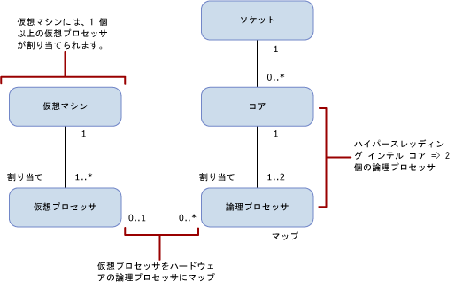

# SQL Server のエディション別の計算容量制限
[!INCLUDE[appliesto-ss-xxxx-xxxx-xxx-md](../includes/appliesto-ss-xxxx-xxxx-xxx-md.md)]
  このトピックでは、[!INCLUDE[ssCurrent](../includes/sscurrent-md.md)] の各エディションの計算容量の制限と、ハイパースレッド プロセッサを持つ物理環境と仮想化環境での違いについて説明します。  
  
   
  
 このテーブルでは、前の図の表記について説明します。  
  
|[値]|[説明]|  
|-----------|-----------------|  
|0..1|0 個または 1 個|  
|1|1 個|  
|1..\*|1 個以上|  
|0..\*|0 個以上|  
|1..2|1 個または 2 個|  
  
> [!IMPORTANT]  
> さらに詳しく説明します。  
>   
> - 仮想マシン (VM) には、1 個以上の仮想プロセッサが含まれます。  
> - 1 個の仮想マシンには、1 個以上の仮想プロセッサが割り当てられます。  
> - 0 個または 1 個の仮想プロセッサは、0 個以上の論理プロセッサにマップされます。 次に、仮想プロセッサの論理プロセッサに対するマッピングを示します。 
>     -   1 対 0 の場合は、ゲスト オペレーティング システムで使用されないアンバウンド論理プロセッサを表します。  
>     -   1 対多の場合は、オーバーコミットを表します。  
>     -   0 対多の場合は、ホスト システム上に仮想マシンがないことを表します。 そのため、VM は論理プロセッサを使用しません。  
> - ソケットは、0 個以上のコアにマップされます。 次に、ソケットとコアのマッピングを示します。  
>     -   1 対 0 の場合は、空のソケットを表します。 チップはインストールされていません。  
>     -   1 対 1 の場合は、ソケットに取り付けられているシングルコア チップを表します。 このマッピングは最近ではまれです。  
>     -   1 対多の場合は、ソケットに取り付けられているマルチコア チップを表します。 通常、この値は 2、4、8 です。  
> - コアは、1 個または 2 個の論理プロセッサにマップされます。 次に、コアの論理プロセッサに対するマッピングを示します。  
>     -   1 対 1 の場合は、ハイパースレッディングが無効です。  
>     -   1 対 2 の場合は、ハイパースレッディングが有効です。  
  
 次の定義は、このトピック全体で使用される用語に適用されます。  
  
-   スレッドまたは論理プロセッサは、 [!INCLUDE[ssNoVersion](../includes/ssnoversion-md.md)]、オペレーティング システム、アプリケーション、ドライバーでは 1 個の論理コンピューティング エンジンとして見なされます。  
  
-   コアは、プロセッサ単位です。 1 個以上の論理プロセッサで構成されます。  
  
-   物理プロセッサは、1 個以上のコアで構成されます。 物理プロセッサは、プロセッサ パッケージまたはソケットと同じです。  
  
1 個以上の物理プロセッサを搭載したシステムや、複数のコアまたはハイパースレッドを持つ物理プロセッサを搭載したシステムでは、オペレーティング システムで複数のタスクを同時に実行できます。 各実行スレッドは論理プロセッサとして表示されます。 たとえば、ハイパースレッディングが有効になっているクアッド コア プロセッサがお使いのコンピューターに 2 個搭載されていて、それぞれのコアにスレッドが 2 個ある場合、論理プロセッサの数は次のように 16 個になります: プロセッサ数が 2、プロセッサごとのコア数が 4、コアごとのスレッド数が 2 (2 x 4 x 2 = 16) 次の点にご注意ください。  
  
-   ハイパースレッド コアの単一スレッドの論理プロセッサの計算容量は、ハイパースレッディングが無効になっている同じコアの論理プロセッサの計算容量よりも小さくなります。  
  
-   ハイパースレッド コアの 2 個の論理プロセッサの計算容量は、ハイパースレッディングが無効になっている同じコアの計算容量よりも大きくなります。  
  
[!INCLUDE[ssNoVersion](../includes/ssnoversion-md.md)] の各エディションには、次の 2 つの計算容量制限があります。  
  
- ソケット (物理プロセッサまたはプロセッサ パッケージ) の最大数  
  
- オペレーティング システムによって報告されたコアの最大数  
  
これらの制限は、 [!INCLUDE[ssNoVersion](../includes/ssnoversion-md.md)]の 1 つのインスタンスに適用され、 1 つのインスタンスが使用する最大計算容量を表します。 これらの制限には、インスタンスが配置される可能性があるサーバーは含まれません。 実際、[!INCLUDE[ssNoVersion](../includes/ssnoversion-md.md)] の複数のインスタンスを同じ物理サーバーに配置することは、以下に示す容量制限よりも多くのソケットまたはコアを搭載した物理サーバーの計算容量を使用するための効果的な方法です。  
  
次の表に、 [!INCLUDE[ssCurrent](../includes/sscurrent-md.md)]の各エディションの 1 つのインスタンスに適用される計算容量制限を示します。  
  
|[!INCLUDE[ssNoVersion](../includes/ssnoversion-md.md)] エディション|1 つのインスタンスの最大計算容量 ([!INCLUDE[ssNoVersion](../includes/ssnoversion-md.md)][!INCLUDE[ssDE](../includes/ssde-md.md)])|1 つのインスタンスの最大計算容量 (AS、RS)|  
|---------------------------------------|--------------------------------------------------------------------------------------------------------|-------------------------------------------------------------------|  
|Enterprise Edition: Core-based Licensing\*|オペレーティング システムの最大容量|オペレーティング システムの最大容量|  
|Developer|オペレーティング システムの最大容量|オペレーティング システムの最大容量|  
|Standard|4 ソケットまたは 24 コアのいずれか小さいほうに制限|4 ソケットまたは 24 コアのいずれか小さいほうに制限|  
|Express|1 ソケットまたは 4 コアのいずれか小さいほうに制限|1 ソケットまたは 4 コアのいずれか小さいほうに制限|  

\*Enterprise Edition with Server および Client Access License (CAL) のライセンスは、[!INCLUDE[ssNoVersion](../includes/ssnoversion-md.md)] インスタンスあたり 20 コアに制限されています。 (このライセンスは新しい使用許諾契約では使用できません。)コアベースのサーバー ライセンス モデルでは、制限はありません。  
  
仮想環境では、計算容量制限はコアではなく論理プロセッサの数に基づいています。 プロセッサのアーキテクチャが、ゲスト アプリケーションに表示されないためです。 

たとえば、クアッド コア プロセッサが搭載された 4 個のソケットと、コアごとに 2 個のハイパースレッドを有効にする機能を備えたサーバーには、ハイパースレッディングが有効になっている論理プロセッサが 32 個あります。 しかし、ハイパースレッディングが無効になっている論理プロセッサは 16 個しかありません。 これらの論理プロセッサは、サーバー上の仮想マシンにマップすることができます。 マップした論理プロセッサに対する仮想マシンの計算負荷がホスト サーバーの物理プロセッサの実行スレッドにマップされます。  
  
仮想プロセッサあたりのパフォーマンスが重要な場合は、ハイパースレッディングを無効にすることができます。 BIOS のセットアップ中にプロセッサの BIOS 設定からハイパースレッディングの有効と無効を切り替えることができます。 ただし、これは通常、サーバーを対象とした操作であり、そのサーバーで実行されているすべてのワークロードに影響します。 したがって、仮想化された環境で実行されるワークロードを、物理オペレーティング システム環境でハイパースレッディングによるパフォーマンス向上の恩恵を受けるワークロードから切り離すと良い結果が得られる場合があります。  
  
## 参照  
 [SQL Server 2016 のエディションとコンポーネント](../sql-server/editions-and-components-of-sql-server-2016.md)   
 [SQL Server 2016 の各エディションでサポートされる機能](~/sql-server/editions-and-supported-features-for-sql-server-2016.md)   
 [SQL Server の最大容量仕様](../sql-server/maximum-capacity-specifications-for-sql-server.md)   
 [SQL Server 2016 のクイックスタート インストール](https://msdn.microsoft.com/library/672afac9-364d-4946-ad5d-8a2d89cf8d81)  

[!INCLUDE[get-help-options](../includes/paragraph-content/get-help-options.md)]

[!INCLUDE[contribute-to-content](../includes/paragraph-content/contribute-to-content.md)]
