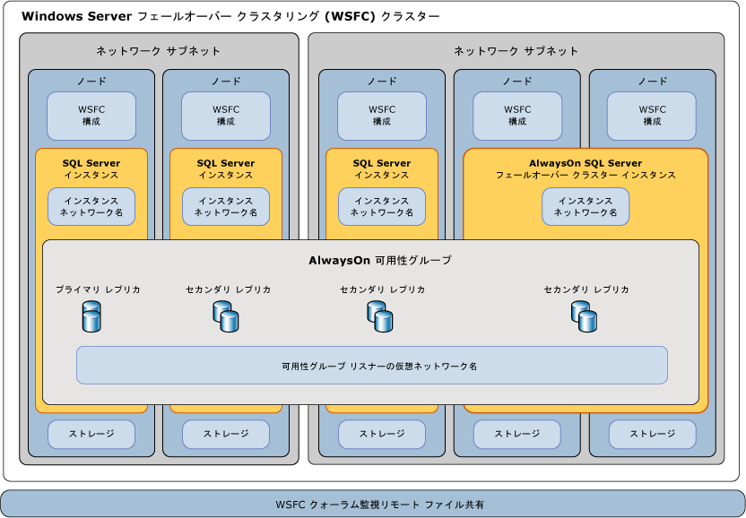

# Windows Server フェールオーバー クラスタリングと SQL Server
[!INCLUDE[appliesto-ss-xxxx-xxxx-xxx-md](../../../includes/appliesto-ss-xxxx-xxxx-xxx-md.md)]
  *Windows Server フェールオーバー クラスター* (WSFC) は、アプリケーションとサービスの可用性を高めるために連携する独立したサーバーのグループです。 [!INCLUDE[ssCurrent](../../../includes/sscurrent-md.md)] は、WSFC サービスと機能を活用して [!INCLUDE[ssHADR](../../../includes/sshadr-md.md)] と [!INCLUDE[ssNoVersion](../../../includes/ssnoversion-md.md)] フェールオーバー クラスター インスタンスをサポートします。  
  
   
##   用語と定義  
 Windows Server フェールオーバー クラスター  (WSFC) WSFC は、アプリケーションとサービスの可用性を高めるために連携する独立したサーバーのグループです。  
  
 ノード  
 WSFC に参加しているサーバー。
  
 クラスター リソース  
 物理的または論理的エンティティです。ノードによる所有、オンライン化またはオフライン化、ノード間での移動、クラスター オブジェクトとしての管理が可能です。 特定の時点でクラスター リソースを所有できるのは 1 つのノードのみです。  
  
 ロール  
 特定の機能を提供するために単一クラスター オブジェクトとして管理されるクラスター リソースのコレクション。 SQL Server の場合、ロールは AlwaysOn 可用性グループ (AG) または Always On フェールオーバー クラスター インスタンス (FCI) となります。 ロールには、AG または FCI に必要なクラスター リソースがすべて含まれます。 フェールオーバーとフェールバックは常にロールのコンテキストで機能します。 FCI の場合、ロールには IP アドレス リソース、ネットワーク名リソース、SQL Server リソースが含まれます。 AG ロールには AG リソースが含まれ、リスナーが構成されている場合は、ネットワーク名と IP リソースが含まれます。 

 ネットワーク名リソース  
 クラスター リソースとして管理されている論理サーバーの名前です。 ネットワーク名リソースは、IP アドレス リソースと共に使用する必要があります。 これらのエントリでは、Active Directory ドメイン サービスおよび/または DNS 内のオブジェクトが必要な場合があります。 
  
 リソースの依存関係  
 他のリソースが依存するリソースです。 リソース A がリソース B に依存している場合、B は A の依存関係です。リソース A はリソース B なしでは開始できません。  
  
  
 優先所有者  
 リソース グループの実行が優先されるノードです。 各リソース グループには、優先順に並べられた優先所有者のリストが関連付けられています。 自動フェールオーバー中に、リソース グループは、優先所有者リスト内の次の優先ノードに移動します。  
  
 実行可能な所有者  
 リソースを実行できるセカンダリ ノードです。 各リソース グループには、実行可能な所有者のリストが関連付けられています。 ロールは、実行可能な所有者としてリストされているノードにのみフェールオーバーできます。   
  
 クォーラム モード  
 クラスターが維持できるノード障害の数を決定するフェールオーバー クラスター内のクォーラム構成です。  
  
 クォーラムの強制  
 クォーラムに必要な少数の要素のみが通信しているときでもクラスターを開始するためのプロセスです。  
  

##   Windows Server フェールオーバー クラスタリングの概要  
 Windows Server フェールオーバー クラスタリングは、Microsoft [!INCLUDE[ssNoVersion](../../../includes/ssnoversion-md.md)] や Microsoft Exchange などのホストされるサーバー アプリケーションの高可用性とディザスター リカバリー シナリオをサポートするインフラストラクチャ機能を提供します。 クラスター ノードまたはサービスに障害が発生すると、そのノードでホストされていたサービスは自動的に、または手動で、他の可用性ノードに転送されます。このプロセスを *フェールオーバー*と呼びます。  
  
 WSFC 内のノードは連携して、次のような機能を提供します。  
  
-   **分散メタデータと通知。** WSFC サービスとホストされるアプリケーション メタデータは、クラスター内の各ノードで維持されます。 このメタデータには、ホストされるアプリケーションの設定に加え、WSFC 構成と状態が含まれます。 ノードのメタデータまたは状態の変更は、WSFC 内の他のノードに自動的に反映されます。  
  
-   **リソース管理。** WSFC 内の各ノードは、直接アタッチされたストレージ、ネットワーク インターフェイス、共有ディスク ストレージへのアクセスなどの物理的リソースを提供する場合があります。 ホストされるアプリケーション自体もクラスター リソースとして登録されます。また、他のリソース上でスタートアップと正常性依存関係を構成する場合があります。  
  
-   **正常性状態の監視。** ノード間およびプライマリ ノードの正常性状態の検出は、ハートビート ネットワーク通信およびリソース監視の組み合わせによって行われます。 WSFC の全体的な正常性状態は、WSFC 内のノードのクォーラムの投票によって決定されます。  
  
-   **フェールオーバーの調整。** 各リソースはプライマリ ノードでホストされるように構成され、それぞれ自動的に、または手動で 1 つ以上のセカンダリ ノードに転送されます。 正常性ベースのフェールオーバー ポリシーによって、ノード間でのリソース所有権の自動転送が制御されます。 フェールオーバーが発生すると、適切に対応できるように、ノードおよびホストされているアプリケーションに通知されます。  
  
 詳細については、以下をご覧ください。[フェールオーバー クラスタリングの概要 - Windows Server](https://technet.microsoft.com/library/hh831579(v=ws.11).aspx)  
  
##   SQL Server Always On テクノロジと WSFC  
 [!INCLUDE[ssCurrent](../../../includes/sscurrent-md.md)]*Always On* は、WSFC を利用する、高可用性およびディザスター リカバリー ソリューションです。 Always On 機能は、アプリケーションの可用性を高め、ハードウェア投資の回収率を上げ、高可用性配置と管理を簡素化する、統合された柔軟なソリューションを提供します。  
  
 [!INCLUDE[ssHADR](../../../includes/sshadr-md.md)] と Always On フェールオーバー クラスター インスタンスのどちらも WSFC をプラットフォーム テクノロジとして使用して、コンポーネントを WSFC クラスター リソースとして登録します。  関連するリソースは*ロール*としてまとめられ、他の WSFC クラスター リソースに依存するように設定できます。 これによって、WSFC は、[!INCLUDE[ssNoVersion](../../../includes/ssnoversion-md.md)] インスタンスを再起動する必要がある場合はこれを検出して通知したり、WSFC 内の他のサーバー ノードに自動的にフェールオーバーしたりできます。  
  
> **重要!!** [!INCLUDE[ssNoVersion](../../../includes/ssnoversion-md.md)] Always On テクノロジの利点を完全に活かすには、WSFC 関連のいくつかの前提条件を適用する必要があります。  
>   
>  詳細については、以下をご覧ください。[AlwaysOn 可用性グループの前提条件、制限事項、および推奨事項 &#40;SQL Server&#41;](../../../database-engine/availability-groups/windows/prereqs-restrictions-recommendations-always-on-availability.md)  
  
### Always On フェールオーバー クラスター インスタンスとインスタンス レベルの高可用性  
 Always On *フェールオーバー クラスター インスタンス* (FCI) は、WSFC 内のノードにまたがってインストールされた [!INCLUDE[ssNoVersion](../../../includes/ssnoversion-md.md)] インスタンスです。 このタイプのインスタンスは、ストレージと仮想ネットワーク名のリソースに依存します。 ストレージは共有ディスク ストレージにファイバー チャネル、iSCSI、FCoE、または SAS を使用したり、[記憶域スペース ダイレクト (S2D)](https://technet.microsoft.com/windows-server-docs/storage/storage-spaces/storage-spaces-direct-overview) でローカルにアタッチされたストレージを使用したりできます。 仮想ネットワーク名のリソースは、それぞれが異なるサブネットに存在する 1 つまたは複数の仮想 IP アドレスに依存します。 SQL Server サービスと SQL Server エージェント サービスもリソースであり、どちらもストレージと仮想ネットワーク名リソースに依存します。  
  
 フェールオーバーが発生した場合、WSFC サービスはインスタンスのリソース所有権を指定されたフェールオーバー ノードに転送します。 その後、 [!INCLUDE[ssNoVersion](../../../includes/ssnoversion-md.md)] インスタンスは、フェールオーバー ノードで再起動され、データベースが通常どおり復元されます。 特定の時点で、FCI と基になるリソースをホストできるのは、クラスター内の 1 つのノードのみです。  
  
> **注:** Always On フェールオーバー クラスター インスタンスには、記憶域ネットワーク (SAN) や SMB ファイル共有などの対称的な共有ディスク ストレージが必要です。  共有ディスク ストレージ ボリュームは、WSFC クラスター内のすべてのフェールオーバー ノードで使用できる必要があります。  
  
 詳細については、以下をご覧ください。[Always On フェールオーバー クラスター インスタンス &#40;SQL Server&#41;](../../../sql-server/failover-clusters/windows/always-on-failover-cluster-instances-sql-server.md)  
  
### データベース レベルの高可用性 [!INCLUDE[ssHADR](../../../includes/sshadr-md.md)]  
 Always On *可用性グループ* (AG) は、共にフェールオーバーする 1 つ以上のユーザー データベースです。 可用性グループは、1 つのプライマリ *可用性レプリカ* と、共有ストレージを必要としないデータ保護のために SQL Server ログに基づくデータ移動を介して維持される 1 ～ 4 個のセカンダリ レプリカから構成されます。 各レプリカは、WSFC の別々のノードにある [!INCLUDE[ssNoVersion](../../../includes/ssnoversion-md.md)] のインスタンスによってホストされます。 可用性グループとこれに対応する仮想ネットワーク名は、WSFC クラスターのリソースとして登録されます。  
  
 プライマリ レプリカのノード上の *可用性グループ リスナー* は、受信クライアント要求に応答し、仮想ネットワーク名に接続します。そして、接続文字列の属性に基づいて各要求を適切な [!INCLUDE[ssNoVersion](../../../includes/ssnoversion-md.md)] インスタンスにリダイレクトします。  
  
 フェールオーバーが発生した場合は、共有物理リソースの所有権を他のノードに転送する代わりに、WSFC を利用して他の [!INCLUDE[ssNoVersion](../../../includes/ssnoversion-md.md)] インスタンス上でセカンダリ レプリカを再構成し、可用性グループのプライマリ レプリカにします。 その後、可用性グループの仮想ネットワーク名リソースが、そのインスタンスに転送されます。  
  
 特定の時点で、可用性グループ データベースのプライマリ レプリカをホストできるのは、1 つの [!INCLUDE[ssNoVersion](../../../includes/ssnoversion-md.md)] インスタンスのみです。また、関連付けられたすべてのセカンダリ レプリカは別々のインスタンスに存在する必要があり、各インスタンスは別々の物理ノードに存在する必要があります。  
  
> **注:** [!INCLUDE[ssHADR](../../../includes/sshadr-md.md)] ではフェールオーバー クラスター インスタンスを配置する必要はありません。また、対称共有ストレージ (SAN または SMB) を使用する必要もありません。  
>   
>  フェールオーバー クラスター インスタンス (FCI) を可用性グループと共に使用することによって、可用性レプリカの可用性を高めることができます。 ただし、WSFC クラスター内での競合状態の発生を回避するため、FCI 上でホストされる可用性レプリカとの間の可用性グループの自動フェールオーバーはサポートされていません。  
  
 詳細については、以下をご覧ください。[Always On 可用性グループの概要 (SQL Server)](../../../database-engine/availability-groups/windows/overview-of-always-on-availability-groups-sql-server.md)  
  
##   WSFC の正常性監視とフェールオーバー  
 Always On ソリューションの高可用性は、物理的および論理的 WSFC クラスター リソースのプロアクティブな正常性状態の監視と、冗長ハードウェアでの自動フェールオーバーおよび再構成によって実現します。  また、システム管理者は、可用性グループまたはノード間での *インスタンスの* 手動フェールオーバー [!INCLUDE[ssNoVersion](../../../includes/ssnoversion-md.md)] を開始できます。  
  
### ノード、フェールオーバー クラスター インスタンス、可用性グループのフェールオーバー ポリシー  
 *フェールオーバー ポリシー* は、WSFC ノード、[!INCLUDE[ssNoVersion](../../../includes/ssnoversion-md.md)] フェールオーバー クラスター インスタンス (FCI)、可用性グループのレベルで構成されます。  これらのポリシーは、クラスター リソースの異常な状態の重大度、期間、頻度とノードの応答時間に基づいたもので、サービスの再起動のトリガー、ノード間でのクラスター リソースの *自動フェールオーバー* のトリガー、 [!INCLUDE[ssNoVersion](../../../includes/ssnoversion-md.md)] インスタンス間での可用性グループ プライマリ レプリカの移動のトリガーを行うことができます。  
  
 可用性グループ レプリカのフェールオーバーは、基になる [!INCLUDE[ssNoVersion](../../../includes/ssnoversion-md.md)] インスタンスに影響しません。  FCI のフェールオーバーでは、ホストされている可用性グループ レプリカとインスタンスが移動します。  
  
 詳細については、以下をご覧ください。[Failover Policy for Failover Cluster Instances](../../../sql-server/failover-clusters/windows/failover-policy-for-failover-cluster-instances.md)  
  
### WSFC リソースの正常性の検出  
 WSFC 内の各リソースの状態と正常性は、定期的または要求時に報告できます。 リソースの障害を示す状況としては、電源障害、ディスクまたはメモリのエラー、ネットワーク通信エラー、応答しないサービスなどがあります。  
  
 ネットワーク、ストレージ、サービスなどの WSFC リソースは、互いに依存するように構成できます。 リソースの累積正常性は、リソース依存関係の正常性で正常性を連続的にロール アップすることで決定されます。  
  
### WSFC ノード間の正常性の検出とクォーラム投票  
 WSFC 内の各ノードは、定期的なハートビート通信に参加し、ノードの正常性状態を他のノードと共有します。 応答しないノードは、エラー状態であると見なされます。  
  
 *クォーラム*は、十分なリソースが WSFC でオンラインになっていることを確認することで、WSFC が確実に稼働するようにするメカニズムです。 WSFC に十分な投票がある場合は、正常であり、ノード レベルのフォールト トレランスを提供できます。  
  
 *クォーラム モード*は、WSFC で構成され、クォーラム投票の方法、および自動フェールオーバーを実行するタイミングまたはクラスターをオフラインにするタイミングを指定します。 
  
> **ヒント:** WSFC のクォーラム投票の数は、常に奇数にすることをお勧めします。  クォーラム投票のために、 [!INCLUDE[ssNoVersion](../../../includes/ssnoversion-md.md)] をクラスター内のすべてのノードにインストールする必要はありません。 追加サーバーはクォーラム メンバーとして機能できます。また、リモート ファイル共有を決定機構として使用するように WSFC クォーラム モデルを構成することもできます。  
>   
>  詳細については、以下をご覧ください。[WSFC クォーラム モードと投票の構成 (SQL Server)](../../../sql-server/failover-clusters/windows/wsfc-quorum-modes-and-voting-configuration-sql-server.md)  
  
### 強制クォーラムによるディザスター リカバリー  
 実際の運用状況と WSFC 構成に応じて、自動フェールオーバーと手動フェールオーバーの両方を使用できます。これによって、堅牢でフォールト トレランスな [!INCLUDE[ssNoVersion](../../../includes/ssnoversion-md.md)] Always On ソリューションを維持できます。 ただし、WSFC 内の投票ノードのクォーラムが相互に通信できない場合、または WSFC クラスターがこれ以外の理由で正常性の検証に失敗する場合は、WSFC がオフラインになる場合があります。  
  
 災害や、永続的なハードウェア障害または通信障害が原因で WSFC がオフラインになった場合は、手動で管理操作を実行して、*クォーラムを強制*し、稼働しているクラスター ノードを非フォールト トレラント構成でオンラインに戻す必要があります。  
  
 その後、WSFC を再構成し、影響を受けたデータベース レプリカを復元し、新しいクォーラムを再構築するという一連の手順を実行する必要があります。  
  
 詳細については、以下をご覧ください。[WSFC の強制クォーラムによる災害復旧 (SQL Server)](../../../sql-server/failover-clusters/windows/wsfc-disaster-recovery-through-forced-quorum-sql-server.md)  
  
##   SQL Server AlwaysOn コンポーネントと WSFC との関係  
 [!INCLUDE[ssNoVersion](../../../includes/ssnoversion-md.md)] Always On と WSFC の機能およびコンポーネント間には、いくつかのリレーションシップの層が存在します。  
  
 Always On 可用性グループは、 [!INCLUDE[ssNoVersion](../../../includes/ssnoversion-md.md)] インスタンスでホストされています。  
 クライアントは、可用性グループ リスナーの論理ネットワーク名を指定してプライマリまたはセカンダリ データベースに接続することを要求します。この要求は、基になる [!INCLUDE[ssNoVersion](../../../includes/ssnoversion-md.md)] インスタンスまたは [!INCLUDE[ssNoVersion](../../../includes/ssnoversion-md.md)] FCI の適切なインスタンス ネットワーク名にリダイレクトされます。  
  
 SQL サーバー インスタンスは、1 つのノード上でアクティブにホストされています。  
 スタンドアロンの [!INCLUDE[ssNoVersion](../../../includes/ssnoversion-md.md)] インスタンスが存在する場合は、静的なインスタンス ネットワーク名で、常に 1 つのノードにあります。  [!INCLUDE[ssNoVersion](../../../includes/ssnoversion-md.md)] FCI が存在する場合は、1 つの仮想インスタンス ネットワーク名で、2 つ以上のフェールオーバー ノードの中の 1 つのノードでアクティブになります。  
  
 ノードは、WSFC クラスターのメンバーです。  
 すべてのノードの WSFC 構成メタデータと状態は、各ノードに保存されます。 各サーバーは、ユーザーまたはシステム データベースに対して非対称ストレージまたは共有ストレージ (SAN) ボリュームを提供できます。 各サーバーには、1 つまたは複数のサブネット上に少なくとも 1 つの物理ネットワーク インターフェイスがあります。  
  
 WSFC は、サーバー グループの正常性を監視し、構成を管理します。  
 WSFC メカニズムでは、WSFC 構成メタデータと状態の変更が、WSFC 内のすべてのノードに反映されます。 ディスク監視が使用されている場合は、メタデータもそこに格納されます。 既定では、WSFC の各ノードがクォーラムに対する投票を取得し、必要に応じて監視が使用され、構成されます。
 
 [!INCLUDE[ssHADR](../../../includes/sshadr-md.md)] レジストリ キーは WSFC クラスターのサブキーです。  
 WSFC を削除してから再作成した場合は、[!INCLUDE[ssHADR](../../../includes/sshadr-md.md)] を有効にしていた、元の WSFC の各サーバー インスタンスについて、[!INCLUDE[ssHADR](../../../includes/sshadr-md.md)] 機能を無効にしてから再度有効にする必要があります。 詳細については、「[Always On 可用性グループの有効化と無効化 &#40;SQL Server&#41;](../../../database-engine/availability-groups/windows/enable-and-disable-always-on-availability-groups-sql-server.md)」を参照してください。  
  
   
  
##   関連タスク  
  
-   [クラスター クォーラムの NodeWeight 設定を表示](../../../sql-server/failover-clusters/windows/view-cluster-quorum-nodeweight-settings.md)  
  
-   [クラスター クォーラムの NodeWeight の設定の構成](../../../sql-server/failover-clusters/windows/configure-cluster-quorum-nodeweight-settings.md)  
  
-   [クォーラムを使用せずに WSFC クラスターを強制的に起動する](../../../sql-server/failover-clusters/windows/force-a-wsfc-cluster-to-start-without-a-quorum.md)  
  
##   関連コンテンツ  
  
-   [Windows Server テクノロジ:フェールオーバー クラスター](https://technet.microsoft.com/library/cc732488\(v=WS.10\).aspx)  

-   [記憶域スペース ダイレクト \(S2D\) の概要](https://technet.microsoft.com/windows-server-docs/storage/storage-spaces/storage-spaces-direct-overview)

-   [Windows Server 2008 R2 のフェールオーバー クラスター](https://technet.microsoft.com/library/ff182338\(WS.10\).aspx)  
  
-   [フェールオーバー クラスターのイベントおよびログを表示する](https://technet.microsoft.com/library/cc772342\(WS.10\).aspx)  
  
-   [Get-ClusterLog フェールオーバー クラスター コマンドレット](https://technet.microsoft.com/library/ee461045.aspx)  
  
## 参照  
 [Always On フェールオーバー クラスター インスタンス (SQL Server)](../../../sql-server/failover-clusters/windows/always-on-failover-cluster-instances-sql-server.md)   
 [Always On 可用性グループの概要 (SQL Server)](../../../database-engine/availability-groups/windows/overview-of-always-on-availability-groups-sql-server.md)   
 [WSFC クォーラム モードと投票の構成 (SQL Server)](../../../sql-server/failover-clusters/windows/wsfc-quorum-modes-and-voting-configuration-sql-server.md)   
 [フェールオーバー クラスター インスタンスのフェールオーバー ポリシー](../../../sql-server/failover-clusters/windows/failover-policy-for-failover-cluster-instances.md)   
 [WSFC の強制クォーラムによる災害復旧 (SQL Server)](../../../sql-server/failover-clusters/windows/wsfc-disaster-recovery-through-forced-quorum-sql-server.md)  
 [SQL Server 2016 は Windows Server 2016 の記憶域スペース ダイレクトをサポートします](https://blogs.technet.microsoft.com/dataplatforminsider/2016/09/27/sql-server-2016-now-supports-windows-server-2016-storage-spaces-direct/)
  
