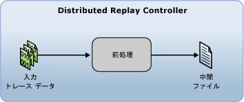

# 入力トレース データの準備
[!INCLUDE[appliesto-ss-xxxx-xxxx-xxx-md](../../includes/appliesto-ss-xxxx-xxxx-xxx-md.md)]
  [!INCLUDE[msCoName](../../includes/msconame-md.md)] [!INCLUDE[ssNoVersion](../../includes/ssnoversion-md.md)] Distributed Replay 機能を使用して分散再生を開始する前に、分散再生管理ツールから前処理段階を開始することで、入力トレース データを準備する必要があります。 前処理段階で、Distributed Replay Controller がトレース データを処理し、中間ファイルを生成します。  
  
   
  
 前処理段階の詳細については、「 [SQL Server Distributed Replay](../../tools/distributed-replay/sql-server-distributed-replay.md)」を参照してください。  
  
> [!NOTE]  
>  入力トレース データは、Distributed Replay と互換性があるバージョンの [!INCLUDE[ssNoVersion](../../includes/ssnoversion-md.md)] でキャプチャする必要があります。 また、入力トレース データは、トレース データを再生するターゲット サーバーと互換性がある必要があります。 バージョンの要件の詳細については、「 [Distributed Replay Requirements](../../tools/distributed-replay/distributed-replay-requirements.md)」を参照してください。  
  
### 入力トレース データを準備するには  
  
1.  **(省略可能) 前処理構成設定の変更**: 前処理構成設定 (システム セッションをフィルター処理するかどうか、最大アイドル時間を構成するかどうかなど) を変更する場合は、XML ベースの前処理構成ファイル `<PreprocessModifiers>` の `DReplay.exe.preprocess.config`要素を変更する必要があります。 前処理構成ファイルを変更する場合は、元のファイルではなく、コピーを変更することをお勧めします。 設定を変更するには、次の手順に従います。  
  
    1.  既定の前処理構成ファイル `DReplay.exe.preprocess.config`のコピーを作成し、新しいファイルの名前を変更します。 既定の前処理構成ファイルは管理ツールのインストール フォルダーにあります。  
  
    2.  新しい構成ファイル内の前処理構成設定を変更します。  
  
    3.  前処理段階 (次の手順) を開始するときに、 *前処理* オプションの **config_file** パラメーターを使用して、変更した構成ファイルの場所を指定します。  
  
     前処理構成ファイルの詳細については、「 [Distributed Replay の構成](../../tools/distributed-replay/configure-distributed-replay.md)」を参照してください。  
  
2.  **前処理段階を開始する**: 入力トレース データを準備するには、 **前処理** オプションを使用して、管理ツールを実行する必要があります。 詳細については、「[前処理オプション &#40;Distributed Replay 管理ツール&#41;](../../tools/distributed-replay/preprocess-option-distributed-replay-administration-tool.md)」を参照してください。  
  
    1.  Windows のコマンド プロンプト ユーティリティ (**CMD.exe**) を開き、Distributed Replay 管理ツール (**DReplay.exe**) のインストール場所に移動します。  
  
    2.  (省略可能) 管理ツールを実行するコンピューターとは別のコンピューター上でコントローラー サービスが実行されている場合、 *controller* パラメーター **-m**を使用して、コントローラーを指定します。  
  
    3.  *input_trace_file* パラメーター **-i**を使用して、入力トレース ファイルの場所と名前を指定します。  
  
    4.  *controller_working_directory* パラメーター **-d**を使用して、コントローラーで中間ファイルを保存する場所を指定します。  
  
    5.  (省略可能) *config_file* パラメーター **-c**を使用して、前処理構成ファイルの場所を指定します。 既定の前処理構成ファイルのコピーを変更した場合は、このパラメーターを使用して、新しい構成ファイルを指定します。  
  
    6.  (省略可能) *status_interval* パラメーター **-f**を使用して、30 秒以外の周期で状態メッセージを管理ツールで表示させるかどうかを指定します。  
  
     たとえば、 `c:\trace1.trc`にあるトレース ファイルに対して、コントローラー サービスと同じコンピューターで前処理段階を開始し、コントローラー作業ディレクトリが `c:\WorkingDir` にあり、既定の 30 秒で状態メッセージが表示される場合、 `dreplay preprocess -i c:\trace1.trc -d c:\WorkingDir`  
  
3.  前処理段階が完了したら、コントローラー作業ディレクトリに中間ファイルが格納されます。 イベント再生段階を開始するには、 **再生** オプションを使用して、管理ツールを実行する必要があります。 詳細については、「 [トレース データの再生](../../tools/distributed-replay/replay-trace-data.md)」を参照してください。  
  
## 参照  
 [SQL Server Distributed Replay](../../tools/distributed-replay/sql-server-distributed-replay.md)   
 [分散再生の要件](../../tools/distributed-replay/distributed-replay-requirements.md)   
 [管理ツール コマンド ライン オプション &#40;Distributed Replay Utility&#41;](../../tools/distributed-replay/administration-tool-command-line-options-distributed-replay-utility.md)   
 [Distributed Replay の構成](../../tools/distributed-replay/configure-distributed-replay.md)  
  
  
