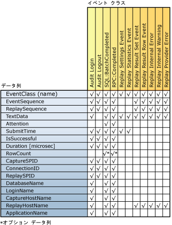

# 再生結果の確認
[!INCLUDE[appliesto-ss-xxxx-xxxx-xxx-md](../../includes/appliesto-ss-xxxx-xxxx-xxx-md.md)]
  [!INCLUDE[msCoName](../../includes/msconame-md.md)] [!INCLUDE[ssNoVersion](../../includes/ssnoversion-md.md)] Distributed Replay 機能が分散再生を完了した後は、各クライアントの再生アクティビティをキャプチャし、クライアントごとに結果トレース ファイルに保存できます。 このアクティビティをキャプチャするには、**replay** オプションを使って管理ツールを実行するときに **-o** パラメーターを使用する必要があります。 replay オプションの詳細については、「[replay オプション &#40;Distributed Replay 管理ツール&#41;](../../tools/distributed-replay/replay-option-distributed-replay-administration-tool.md)」を参照してください。  
  
 結果トレース ファイルの保存場所は、各クライアントにあるクライアント構成ファイル `<ResultDirectory>` 内の `DReplayClient.xml` XML 要素で指定されます。 クライアント結果ディレクトリ内のトレース ファイルは、再生を実行するたびに上書きされます。  
  
 結果トレース ファイルにキャプチャする必要がある出力の種類を指定するには、再生構成ファイル `DReplay.exe.replay.config`を変更します。 `<OutputOptions>` XML 要素を使用して、行数または結果セットの内容を記録するかどうかを指定できます。  
  
 これらの構成設定の詳細については、「 [Distributed Replay の構成](../../tools/distributed-replay/configure-distributed-replay.md)」を参照してください。  
  
## 結果トレース ファイルでキャプチャされるイベント クラス  
 次の表は、結果トレース データでキャプチャされるすべてのイベント クラスを示したものです。  
  
|カテゴリ|イベント クラス名|キャプチャ頻度|キャプチャするタイミング|  
|--------------|---------------------|-----------------------|----------------------|  
|再生可能なイベント|Audit Login|元のトレース データの各 Audit Login イベントにつき 1 回|イベントの正常完了時または失敗時|  
||Audit Logout|元のトレース データの各 Audit Logout イベントにつき 1 回|イベントの正常完了時または失敗時|  
||SQL:BatchCompleted|元のトレース データの各 SQL:BatchStarting イベントにつき 1 回|イベントの正常完了時または失敗時|  
||RPC:Completed|元のトレース データの各 RPC:Starting イベントにつき 1 回|イベントの正常完了時または失敗時|  
|統計情報と結果|Replay Settings Event|指定日時|結果トレースの最初のイベント|  
||Replay Statistics Event|指定日時|結果トレースの最後のイベント|  
||Replay Result Set Event|各 SQL:BatchStarting および RPC:Starting イベントにつき 1 回。   再生構成ファイルの `<RecordResultSet>` オプションの値が `Yes`に設定されている場合のみキャプチャされます。||  
||Replay Result Row Event|SQL:BatchStarting および RPC:Starting イベントの結果セットの各行につき 1 回。   再生構成ファイルの `<RecordResultSet>` オプションの値が `Yes`に設定されている場合のみキャプチャされます。||  
|エラーおよび警告|Replay Internal Error|各内部エラーにつき 1 回|内部エラー条件による|  
||Replay Provider Error|各プロバイダー エラーにつき 1 回|プロバイダー エラー条件による|  
  
 次のことを考慮してください。  
  
-   ターゲット サーバーで正常に再生される各イベントに対して、対応する出力イベント クラスは 1 つです。  
  
-   それぞれのイベントの失敗またはキャンセルに対して、複数のエラーが生成される可能性があります。  
  
## イベント クラス列マッピング  
 次の図は、再生中にキャプチャされるイベント クラスのそれぞれの種類に対して使用できる結果トレースの列を示しています。  
  
   
  
## 結果トレースの列の説明  
 次の表では、結果トレース データの列について説明します。  
  
|データ列名|データ型|[説明]|列 ID|  
|----------------------|---------------|-----------------|---------------|  
|EventClass|**nvarchar**|イベント クラスの名前。|1|  
|EventSequence|**bigint**|プロバイダー エラー、内部エラー、および警告に対しては、これはエラーまたは警告に対応するキャプチャ イベント シーケンスです。   その他のすべてのイベント クラスに対しては、これは元のトレース データ内のイベント シーケンスです。|2|  
|ReplaySequence|**bigint**|プロバイダー エラー、内部エラー、および警告に対しては、これはエラーまたは警告に対応する再生イベント シーケンスです。   その他のすべてのイベント クラスに対しては、これは再生中に割り当てられるイベント シーケンスです。|3|  
|TextData|**ntext**|TextData の内容は、EventClass に依存します。   Audit Login および ExistingConnection では、これは接続の設定オプションです。   SQL:BatchStarting では、これはバッチ要求の本文です。   RPC:Starting では、これは呼び出されたストアド プロシージャです。   Replay Settings Event では、この列には再生構成ファイルで定義された設定が含まれます。   Replay Statistics Event では、これは次の情報を含みます。   \- 再生対象 SQL サーバー   \- 再生可能なイベントの総数   \- プロバイダー エラーの数   \- 内部エラーの数   \- 内部の警告   \- エラーの総数   \- 全体のパス レート   \- 再生時間 (HH:MM:SS: MMM)   Replay Result Set Event では、これは返される結果の列ヘッダーのリストを示します。   Replay Result Row Event では、その行のすべての列の戻り値を示します。   Replay Internal Warning および Replay Provider Error では、この列はプロバイダー警告またはエラーを含みます。|4|  
|Attention|**bigint**|イベントのアテンション期間 (マイクロ秒)。 これは、キャプチャ トレースのアテンション イベントから計算されます。 イベントにクエリ タイムアウトが指定されていない場合は、この列は設定されません (null)。|5|  
|SubmitTime|**datetime**|イベントが [!INCLUDE[ssNoVersion](../../includes/ssnoversion-md.md)]に送信された時刻。|6|  
|IsSuccessful|**int**|特定のイベントが正常に実行されたかどうか、および結果セットがクライアント側に返されたかどうかを示すブール型のフラグ。   警告を生成するイベント (アテンションまたはユーザー定義のタイムアウトにより、イベントが取り消された場合など) は成功と見なされます。   IsSuccessful の値は、次のいずれかです。   1 = 成功   0 = 失敗|7|  
|Duration [microsec]|**bigint**|イベントの応答時間の期間 (マイクロ秒)。 [!INCLUDE[ssNoVersion](../../includes/ssnoversion-md.md)]にログオン/ログオフ/RPC/言語イベントが送信されたときに測定が開始されます。   イベントが成功した場合は、完全な結果セットが使用されたときに測定が終了します。   イベントが成功しなかった場合は、イベントの失敗時またはキャンセル時に測定が終了します。|8|  
|RowCount|**bigint**|再生構成ファイルの `<RecordRowCount>` の値によって設定されます。   `<RecordRowCount>` が Yes と等しい場合、このセルには [!INCLUDE[ssNoVersion](../../includes/ssnoversion-md.md)]で返される結果セット内の行数が含まれます。   `<RecordRowCount>` が No と等しい場合、このセルは設定されません (null)。|9|  
|CaptureSPID|**int**|イベントのキャプチャ セッションの ID。|10|  
|ConnectionID|**int**|イベントのキャプチャ接続の ID。|11|  
|ReplaySPID|**int**|イベントの再生セッションの ID。|12|  
|DatabaseName|**nvarchar**|ユーザーのステートメントが実行されているデータベースの名前。|13|  
|LoginName|**nvarchar**|ユーザーのログイン名。 [!INCLUDE[ssNoVersion](../../includes/ssnoversion-md.md)] セキュリティ ログイン、または *domain_name*\\*user_name*の形式で表された Microsoft Windows ログイン資格情報です。|14|  
|CaptureHostName|**nvarchar**|キャプチャ中にクライアント サービスが実行されているコンピューターの名前。|15|  
|ReplayHostName|**nvarchar**|再生中にクライアントが実行されているコンピューターの名前。|16|  
|ApplicationName|**nvarchar**|キャプチャ中に [!INCLUDE[ssNoVersion](../../includes/ssnoversion-md.md)] 接続を作成したクライアント アプリケーションの名前。|17|  
  
## 参照  
 [SQL Server Distributed Replay](../../tools/distributed-replay/sql-server-distributed-replay.md)   
 [分散再生の要件](../../tools/distributed-replay/distributed-replay-requirements.md)   
 [管理ツール コマンド ライン オプション &#40;Distributed Replay Utility&#41;](../../tools/distributed-replay/administration-tool-command-line-options-distributed-replay-utility.md)   
 [Distributed Replay の構成](../../tools/distributed-replay/configure-distributed-replay.md)  
  
  
