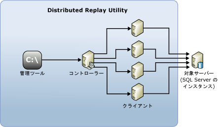

# SQL Server Distributed Replay

[!INCLUDE[appliesto-ss-xxxx-xxxx-xxx-md](../../includes/appliesto-ss-xxxx-xxxx-xxx-md.md)]

[!INCLUDE[msCoName](../../includes/msconame-md.md)] [!INCLUDE[ssNoVersion](../../includes/ssnoversion-md.md)] 分散再生機能を使用すると、将来の [!INCLUDE[ssNoVersion](../../includes/ssnoversion-md.md)] のアップグレードによる影響を評価できます。 また、ハードウェアとオペレーティング システムのアップグレード、および [!INCLUDE[ssNoVersion](../../includes/ssnoversion-md.md)] のチューニングの影響を評価する場合にも使用できます。

## Distributed Replay の利点

SQL Server プロファイラーと同様に、分散再生を使用して、アップグレードされたテスト環境に対してキャプチャしたトレースを再生できます。 SQL Server プロファイラーと異なるのは、分散再生は 1 台のコンピューターからのワークロードの再生に限定されないことです。

分散再生では、SQL Server プロファイラーよりもスケーラブルなソリューションが提供されます。 Distributed Replay を使用すると、複数のコンピューターからのワークロードを再生し、ミッションクリティカルなワークロードをより正確にシミュレートできます。

[!INCLUDE[msCoName](../../includes/msconame-md.md)] [!INCLUDE[ssNoVersion](../../includes/ssnoversion-md.md)] 分散再生機能では、複数のコンピューターを使用してトレース データを再生し、ミッション クリティカルなワークロードをシミュレートできます。 Distributed Replay は、アプリケーション互換性テスト、パフォーマンス テスト、またはキャパシティ プランニングに使用できます。

## Distributed Replay を使用する状況

SQL Server プロファイラーと分散再生は、提供する機能が一部重複しています。

SQL Server プロファイラーを使用して、アップグレードされたテスト環境に対してキャプチャしたトレースを再生できます。 また、再生結果を分析して、潜在的な機能とパフォーマンスの非互換性を調べることができます。 しかし、SQL Server プロファイラーで再生できるのは、1 台のコンピューターからのワークロードのみです。 アクティブなコンカレント接続が多数あるか、またはスループットが高い集中型の OLTP アプリケーションを再生すると、SQL Server プロファイラーではリソースのボトルネックが発生する可能性があります。

分散再生では、SQL Server プロファイラーよりもスケーラブルなソリューションが提供されます。 Distributed Replay を使用すると、複数のコンピューターからのワークロードを再生し、ミッションクリティカルなワークロードをより正確にシミュレートできます。

次の表では、各ツールを使用する状況について説明します。

|ツール|使用する状況|
|----------|---------------|
| SQL Server プロファイラー | 1 台のコンピューター上で、従来の再生のメカニズムを使用する場合。 特に、 **[ステップ]** 、 **[カーソルまで実行]** 、 **[ブレークポイントの設定/解除]** など、1 行ずつのデバッグ機能が必要な場合。   [!INCLUDE[ssASnoversion](../../includes/ssasnoversion-md.md)] トレースを再生する場合。 |
| Distributed Replay |アプリケーションの互換性を評価する場合。 たとえば、 [!INCLUDE[ssNoVersion](../../includes/ssnoversion-md.md)] とオペレーティング システムのアップグレード シナリオ、ハードウェアのアップグレード、インデックス チューニングをテストする場合などがあります。   キャプチャしたトレースのコンカレンシーが非常に高いため、1 つの再生クライアントで十分にシミュレートできない場合。|  

## Distributed Replay の概念

Distributed Replay 環境は次のコンポーネントで構成されます。  

- **分散再生管理ツール**: 分散再生コントローラーと通信する際に使用するコンソール アプリケーション (**DReplay.exe**)。 Distributed Replay を制御するには管理ツールを使用します。  

- **分散再生コントローラー**: [!INCLUDE[ssNoVersion](../../includes/ssnoversion-md.md)] 分散再生コントローラーという名前の Windows サービスを実行するコンピューター。 分散再生コントローラーは、分散再生クライアントのアクションを統制します。 各分散再生環境には、コントローラーのインスタンスを 1 つだけ置くことができます。  

- **分散再生クライアント**: [!INCLUDE[ssNoVersion](../../includes/ssnoversion-md.md)] 分散再生クライアントという名前の Windows サービスを実行する 1 つまたは複数の (物理または仮想) コンピューター。 分散再生クライアントは連携して、 [!INCLUDE[ssNoVersion](../../includes/ssnoversion-md.md)]のインスタンスに対するワークロードをシミュレートします。 各分散再生環境には、1 つまたは複数のクライアントを置くことができます。  

- **対象サーバー**:トレース データを再生する際に分散再生クライアントが使用できる [!INCLUDE[ssNoVersion](../../includes/ssnoversion-md.md)] のインスタンス。 ターゲット サーバーはテスト環境に配置することをお勧めします。

Distributed Replay の管理ツール、コントローラー、およびクライアントは、異なるコンピューターにインストールすることも、同じコンピューターにインストールすることもできます。 同じコンピューターで実行できる Distributed Replay Controller サービスまたは Distributed Replay Client サービスのインスタンスは 1 つだけです。

次の図は、 [!INCLUDE[ssNoVersion](../../includes/ssnoversion-md.md)] Distributed Replay の物理アーキテクチャを示したものです。  

  

## Distributed Replay のタスク

|タスクの説明|トピック|  
|----------------------|-----------|  
| Distributed Replay を構成する方法について説明します。 | [分散再生の構成](../../tools/distributed-replay/configure-distributed-replay.md) |
| 入力トレース データを準備する方法について説明します。 | [入力トレース データの準備](../../tools/distributed-replay/prepare-the-input-trace-data.md) |
| トレース データを再生する方法について説明します。 |[トレース データの再生](../../tools/distributed-replay/replay-trace-data.md) | | Distributed Replay トレース データの結果を確認する方法について説明します。 |[再生結果の確認](../../tools/distributed-replay/review-the-replay-results.md)|
| 管理ツールを使用して、コントローラー上の操作を開始、監視、取り消す方法について説明します。 | [管理ツール コマンド ライン オプション &#40;Distributed Replay Utility&#41;](../../tools/distributed-replay/administration-tool-command-line-options-distributed-replay-utility.md) |

## 参照

[SQL Server 分散再生フォーラム](https://social.technet.microsoft.com/Forums/sl/sqldru/)